# Data model — the migration authority for the Warehouse programme

> **Current adopted amendment (2026-09-11):** [Global settings and resolved behaviour](GLOBAL-SETTINGS-DECISIONS.md) supplies defaults, scoped choices, resolved OD answers and acceptance cases. Earlier open/escalated or contradictory wording is historical where explicitly superseded there. Implement these answers; do not re-ask the same design questions.


<!-- check-design-set: issue-citations file #2 #9 — `#2` and `#9` are ordinals in prose, not issue references — *Refusal #2*, *Adapter #2 (services)*, *ship-blocker #2*, *logistics needs #1, #2, #3, #5, #6, #10* — and at COMPETITOR-BENCHMARK.md:70/:146 `#9` is the markdown in-page anchor `[§9](#9--where-the-audits-disagree)`. In this repository `#2` and `#9` are in fact the two **pull requests** opened while the backlog was being filed, so no issue row can ever exist for either: see issues/CREATED.md -->

> **This document is subordinate to [`DECISIONS.md`](DECISIONS.md) and to
> [`IRREVERSIBLE.md`](IRREVERSIBLE.md), in that order.** Where a source review proposed a shape that
> either of those overrules, §9.1 says so by name; nothing here diverges silently.
>
> **What this document is the authority for**, and nothing else is:
> 1. **Every table** in the five modules — its columns, keys, indexes, the `FR-nnn` it serves and the
>    version its feature arrives in (§2). A v1 table carrying v2 columns is the normal case, not an
>    anomaly — that is `IRREVERSIBLE.md` working.
> 2. **The split proof** (§3) — every foreign key that crosses a module boundary, and the proof that
>    each points downward. **Eight** pointed the wrong way, either in the prior art's own DDL or in
>    the natural reading of the reviews; §3.4 names and fixes each, and names a ninth that only looks
>    like one.
> 3. **The `I-n` enforceable constraints** (§6) — the SQL that makes `L-1`…`L-14` testable, and the
>    migration file each lands in.
> 4. **The migration allocation** (§7) — exactly one owner per number, every number inside its
>    module's band, which is what `tools/check-design-set.py` verifies.
>
> **Id namespaces — the collision that used to be here is resolved.** `DECISIONS.md` §6 allocates
> **`I-1` … `I-20`** to *this* document ("enforceable constraints"). `IRREVERSIBLE.md` used to number
> its rows `I-01`…`I-63` in the *same* prefix and assert that it was "not used anywhere else in the
> set", which was not true: zero-padding did not separate them either — both namespaces reached two
> digits and `I-14` was a real id in both (`L-14`'s constraint here; the `serial_id` row there), across
> roughly 250 mentions no reader or grep could tell apart.
>
> **On 2026-09-02 the newer register moved.** `IRREVERSIBLE.md`'s rows are **`IRR-01`…`IRR-63`**, a
> namespace of their own, and every citation across the set was rewritten. The irreversible register
> was the one to move because it is the newer of the two and `DECISIONS.md` §6 never granted it `I-`.
>
> | Written | Means | Authority |
> |---|---|---|
> | **`I-1`, `I-7`, `I-14`** — a bare `I-n`, 1 … 24 | an enforceable constraint | this document, §6 |
> | **`IRR-06`, `IRR-14`** — the `IRR-` prefix, 01 … 63 | a row of the irreversible list | `IRREVERSIBLE.md` §2 |
>
> `DECISIONS.md` §6 now carries both rows, so the separation is declared where the next author looks
> for it rather than only here, and `tools/check-design-set.py` check 11 fails the build if either
> register is ever redefined under the other's prefix.

---

## 1. Overview and conventions

### 1.1 The five modules, their bands and their prefixes

Fixed by `DECISIONS.md` `D-1`, `D-2`, `D-3`. Restated once, because every table row below depends on
it and a reader should not have to hold two documents open.

| Module | Java package | Prefix | Flyway band | Depends on | Ships |
|---|---|---|---|---|---|
| `warehouse-base` | `ai.warehousebase` | **`whb_`** | **V500000–V509999** | platform only | v1 |
| `warehouse` | `ai.warehouse` | **`wh_`** | **V510000–V519999** | platform + `warehouse-base` | v1 |
| `warehouse-adapter-<vertical>` | `ai.warehouseadapter<vertical>` — a **sibling** package | `whad_` `whas_` `whaf_` `whaa_` | **V520000–V529999**, sub-allocated in §7.4 | platform + base + that vertical | v1 → v1.1 |
| `warehouse-3pl` | `ai.warehouse3pl` | **`wh3_`** | **V530000–V539999** | platform + base + app | v2 |
| `warehouse-india` | `ai.warehouseindia` | **`whin_`** | **V540000–V549999** | platform + base + app | v1 wave + v2 wave (`A-4`) |

`V130000`–`V599999` is empty. Re-verified for this document, 2026-09-01:

```bash
find . -path '*/db/*' -name 'V*__*.sql' | sed -E 's|.*/V([0-9]+)__.*|\1|' \
  | awk '$1>=130000 && $1<=599999' | wc -l      # -> 0
```

**Do not name anything `wms_*` or `scc_*`** (`D-3`). Both carry hardcoded permission exclusions from
a deleted earlier module (`platform/…/V528:37,57,59`, `V663:17-19`).

### 1.2 Naming

Inherited from CLAUDE.md and from the live repo, without change:

`snake_case` plural table names · `UUID` primary key with `DEFAULT gen_random_uuid()` ·
`is_` boolean prefix · `_at` for `TIMESTAMP WITH TIME ZONE` · `_date` for `DATE` ·
`_id` for a foreign key · `idx_<table>_<column>` for an index ·
`uk_<table>_<column>` for a unique constraint · `chk_<table>_<subject>` for a check constraint ·
`fk_<table>_<column>` for a foreign key · standard SQL types only.

Two prefix-length notes, because the prefixes are long and PostgreSQL truncates identifiers at 63
bytes: `idx_whb_stock_movement_lines_owner_item_location` is 48 characters and safe, but
`uk_whb_category_stocking_ownership_company_scope_ref_from` is 57 and near the edge. **Where a
generated constraint name would exceed 63 characters, shorten the *subject*, never the table
segment** — a truncated table segment produces two constraints with the same name on two tables and
PostgreSQL accepts it, so the collision is silent.

### 1.3 Keys

| Rule | Statement |
|---|---|
| **Surrogate** | Every table has `id UUID PRIMARY KEY DEFAULT gen_random_uuid()`. Exception: the partitioned tables — the two ledger tables, whose PK is `(id, occurred_at)`, and the six non-ledger tables `RL-011` partitions at `CREATE`, whose PKs carry their partition key (§1.9) |
| **Natural** | Every base-resolved master an external module can hold a reference to also carries a **stable string `code`** with a unique key: `whb_items.code`, `whb_locations.code`, `whb_warehouses.code`, `whb_counterparties.code`, `whb_owners.code`, `whb_uoms.code`, every catalogue's `code`. This is `IRR-26`, and it is what makes the five movable module boundaries (R7 §2.6) a refactor rather than a data migration. **Each key has the scope of the thing it names, decided once (`RL-004`):** `whb_locations` is `uk(warehouse_id, code)` only, so a bin-grid mask runs unchanged at the second site and a scan resolves within the session's or device's site (`AMBIGUOUS_LOCATION` on a cross-site match); `whb_owners` and `whb_warehouses` are `uk(code)` install-wide, as platform `branches.branch_code` is (`D-14` item 8d, which supersedes `RL-004` for these two tables only); `whb_items.code` is a **system-generated, immutable surrogate** and stays install-wide, never a user-typed SKU; `whb_number_series_issued` is `uk(series_id, formatted_number)`. **`whb_lpns.code` stays install-wide** — a pallet crosses sites on a transfer and its code is an SSCC-shaped plate (`GAP-REGISTER-R4.md` §3.7 g) |
| **Catalogue FK target** | The seventeen registries (§2.1.1) are referenced **by `code`**, not by `id`: `whb_stock_movements.movement_type_code VARCHAR(40) REFERENCES whb_movement_types(code)`. The code is the value; an adapter's seed migration inserts a row and the ledger references it without a UUID lookup. A **code-list** column (§2.1.1's classification table) is referenced by the composite `(<col>_list, <col>) REFERENCES whb_code_list_values (list_code, code)` |
| **Dated junction** | Every association between two independent masters is an effective-dated many-to-many junction (`D-14` item 1). The convention is stated once, below |

**The junction convention** (`D-14`, R22 §1.3). Composition (a line belongs to its document) and
ledger fact rows (what happened, never re-pointed) stay scalar; everything else that associates two
masters follows these six rules.

1. **`effective_from TIMESTAMPTZ NOT NULL`, `effective_to TIMESTAMPTZ NULL`, half-open `[from, to)`.**
   Not `DATE`: movements carry `occurred_at` (`L-13`), and a resolver asking *"the link at this
   instant"* needs an instant. The UI captures a date; the service converts it to site-local midnight
   using `whb_warehouses.timezone` (`FR-439`).
2. **"One current X"** is a partial unique index on `effective_to IS NULL` (§1.7's flag-swap shape).
   **"One X at every instant"** is an `EXCLUDE USING gist` over a `tstzrange`, which needs `btree_gist`
   — **declared by every migration that uses it** (`CREATE EXTENSION IF NOT EXISTS btree_gist`, then a
   `DO` block that raises if it is absent), because `D-7`'s standalone install has neither
   accounting-base nor assets to have created it. PostgreSQL's `EXCLUDE` has no `NULLS NOT DISTINCT`;
   where a scope member is nullable, the exclusion compares it through `COALESCE` to the nil UUID
   **inside the constraint expression only** — §1.10's refusal of a sentinel is about stored keys and
   exports, which this expression never reaches.
3. **No `is_active` on a dated junction.** `effective_to` is the only end. Two end markers disagree,
   and §1.4 already refuses a second deletion mechanism for that reason.
4. **Rows that classify posted history are append-only once a movement stands on them** (`I-23` is the
   case that has a ledger to read). Rows that only grant visibility or defaults are freely editable.
5. **Resolvers read the link at `occurred_at`; access reads the link at now.**
6. **Identity-bearing associations are the one exception to dating** (`RG-009`). A variant whose size
   changes is a different item, for the same reason `I-9` refuses a base-UoM change.
| **Composite uniqueness with nullable members** | Declared as `CREATE UNIQUE INDEX … NULLS NOT DISTINCT`, **never** as a table-level `UNIQUE` over `COALESCE(...)`. §1.10 |

### 1.4 Audit columns and soft delete

Every table carries `created_at`, `created_by`, `updated_at`, `updated_by`, and `version BIGINT` for
optimistic locking, except where noted. `created_by`/`updated_by` are `UUID REFERENCES users(id)`
with **`ON DELETE NO ACTION`** — platform deactivates users, it does not delete them, and these
columns exist to answer *"who did this"*, which `SET NULL` destroys.

Three deliberate exceptions, each with its reason:

| Exception | Tables | Why |
|---|---|---|
| **No `updated_at` / `updated_by`** | `whb_stock_movement_lines`, `whb_number_series_issued`, `whb_audit_events` and `whb_outbox`. **Not** the `wh3_billable_events` meter: its rating columns are an allowlisted `UPDATE`, so it carries them (`RF-008`) | Append-only by invariant (`L-2`). A column that can never change should not exist to be changed. The header `whb_stock_movements` **keeps** them (`IRREVERSIBLE.md` §4.1) because `posting_status`, `is_reversed` and `reversed_by_movement_id` are written after post by the handover and reversal paths, which the `L-2` trigger's mutable-column allowlist permits |
| **No `is_active`** | every transactional table — movements, lines, positions, receipts, orders, shipments, counts, adjustments, tasks, reservations, billable events | A posted document is never soft-deleted; it is reversed, cancelled or released. `is_active` would be a second, contradictory way to make a posting vanish. `is_active` is on **masters and catalogues only** |
| **No `version`** | `whb_stock_movement_lines`, `whb_movement_line_attributes`, `whb_movement_idempotency_keys`, `whb_outbox` | Nothing updates them, so there is nothing to lock optimistically |

**Soft delete.** `is_active BOOLEAN NOT NULL DEFAULT true` plus `status VARCHAR(20)` on masters and
catalogues, matching the platform idiom. There is **no `deleted_at`/`deleted_by` pair anywhere** —
the prior art carried both on all 72 tables and used neither, and a second deletion mechanism next to
`is_active` is how a grid shows a row one query says is gone.

**Master deletion is `ON DELETE RESTRICT` plus a named service check.** The constraint is the
backstop; the service check is what produces a usable message. A bare FK rejects with
`violates foreign key constraint fk_whb_stock_movement_lines_item`; the service must answer *"item
`BRK-PAD-042` is referenced by 18,204 movement lines and cannot be deleted — deactivate it
instead"*, which is also the `is_active = false` prompt. `RESTRICT` rather than the repo's more
common bare `NO ACTION` because `RESTRICT` cannot be deferred past the statement, and a deferred
rejection surfaces at `COMMIT` where no field-level error can be attached to it — the same reason
§6.0 exists.

**`ON DELETE` by class of parent**, stated once instead of on 300 rows:

| Parent class | Clause |
|---|---|
| A document header for its own lines (`wh_goods_receipts → wh_goods_receipt_lines`, every `_lines` table) | `ON DELETE CASCADE` — reachable only on a `DRAFT`, because the status guard rejects deletion of a posted header |
| `whb_stock_movements → whb_stock_movement_lines` | **No cascade. `ON DELETE RESTRICT`.** `L-2` forbids deleting either, and a cascade would be a delete path that exists in the schema and must not |
| User-deletable master data and every catalogue | `ON DELETE RESTRICT` + service check |
| `users(id)` for every actor column | bare `ON DELETE NO ACTION` |
| Natural-key parents referenced by `code` (every catalogue, every code list, `whb_uoms`, `currencies`) | **`ON UPDATE RESTRICT`** (`RL-013`). A cascade would run into the append-only, partitioned ledger, whose `I-2` trigger refuses it, and `PORT-AND-ADAPTER-CONTRACT.md` §10.2 forbids renaming a catalogue code anyway. A wrong code is corrected by `Z-005`'s retire-and-reseed, never by an `UPDATE` of the key. **Not** `ON DELETE SET DEFAULT`: there is no correct default for a movement type |

### 1.5 Precision — cited, not invented

`OD-7`'s recommendation is *"adopt accounting's resolved set verbatim, including the corrected
`DECIMAL(9,6)` for percentages, and cite it rather than restating it"*. Done. The authority is
`accounting/docs/DATA-MODEL.md:2443-2453` (§5.1) plus its two normative tie-breaks at `:2455-2470`.
The full table, the two tie-breaks, the one **addition** warehouse needs and the reason are in **§5**
of this document. In one line for a reader who only wants the types:

> quantities `DECIMAL(18,4)` · money and extended value `DECIMAL(19,4)` · **per-unit** cost
> `DECIMAL(19,6)` · percentages and ratios `DECIMAL(9,6)` · currency exchange rates `DECIMAL(19,8)` ·
> **UoM conversion factors `DECIMAL(18,8)`** — the one kind accounting does not have, added by §5.2.

### 1.6 No JSONB, and the one real exception

`FR-383`, CLAUDE.md DATABASE CONVENTIONS, and `IRREVERSIBLE.md` §4.2: **no JSONB on any new
warehouse business table.** The prior WMS art made JSONB a convention and used it on at least eleven
business tables (`wms_items.metadata`, `wms_warehouses.operating_hours` and `.metadata`,
`wms_asn_lines.serial_numbers`, `wms_quality_inspections.inspection_criteria`,
`wms_cycle_count_programs.scope_*`, `wms_alert_rules.trigger_conditions`, `wms_carriers.service_levels`,
`wms_suppliers.certifications`, `wms_dock_doors.compatible_vehicles`, `wms_waves.grouping_criteria`).
Every one of those is normalised into a child table or into `whb_movement_line_attributes` /
`whb_item_attribute_values` here, and §9.2 lists the eleven with their replacements.

**The one real exception, and it is not optional.** R1 `CM-3` corrects CLAUDE.md: the repo's own
ratchet (`platform/backend/src/test/java/ai/platform/architecture/ArchitectureInvariantsTest.java:225-239`)
freezes a *baseline* of existing jsonb migrations rather than banning jsonb, because two **platform**
columns are jsonb and always were:

```
grid_preferences.default_columns  JSONB NOT NULL DEFAULT '[]'   -- platform V18:12
grid_preferences.default_filters  JSONB                          -- platform V229:50-51
```

Those are platform-owned. **Every warehouse grid migration must therefore emit `'[…]'::jsonb`** for
both, and populating only one of them is the documented recurring defect: `useGridPreferences` reads
the default filter strip from `grid_preferences.default_filters`, not from
`filter_definitions.default_visible`. The rule that holds is *"no jsonb on a new `whb_`/`wh_`/`wh3_`/
`whin_`/`wha*_` business table"* — not *"no jsonb anywhere"*.

Two adjacent facts, so they are not rediscovered:

- **The filter table is `filter_definitions`** (platform `V229`). `grid_filter_definitions` does not
  exist — 0 hits across every migration in the repo — and inserting into that name fails at Flyway
  and crash-loops the backend (R1 `CM-4`).
- **`to_jsonb(OLD)` / `to_jsonb(NEW)` inside the `L-2` immutability trigger is a transient
  expression, not a column.** Nothing is stored. It is chosen over an enumerated column list
  precisely so that a column added by a later `ALTER TABLE` is protected the day it appears rather
  than the day someone remembers to update the trigger — and §6.2 states the price of that choice.

### 1.7 Entity and query conventions every `whb_`/`wh_` table inherits

These are not style. Each one has cost this monorepo a rebuild cycle, and the ledger's shape makes
two of them sharper than they are elsewhere.

**`FetchType.LAZY` on every relation, `@BatchSize(size = 20)` on every collection.** No exceptions.
A movement header eagerly fetching its lines turns a 40-row grid into 40 × N queries, and the lines
of an opening-stock import number in the tens of thousands.

**Never `cascade = ALL` on a collection — and here the reason is not the usual one.** The usual
reason is that `cascade = ALL` plus `orphanRemoval` resurrects rows a repository just deleted
(`reference_cascade_all_collection_resurrects_repository_delete`). The warehouse-specific reason is
worse and it is why this rule is in §1 rather than in a style guide:

> `cascade = ALL` on `Movement.lines` makes Hibernate issue `UPDATE`/`DELETE` on
> `whb_stock_movement_lines` during ordinary flushes — a dirty-checked reorder, an `orphanRemoval`
> after a collection is re-set, a merge of a detached entity. **On a `DRAFT` movement that succeeds,
> because the `L-2` trigger only guards posted rows.** On a `POSTED` movement it raises
> `I-2 violated: …` from a trigger, at flush time, inside a transaction the service cannot translate.
> So the defect passes every test written against drafts and fails in production on the first
> correction of a posted movement. Use `cascade = {PERSIST, MERGE}` and delete through the
> repository, or better: **the ledger has one writer service and it never deletes a line at all.**

**Field initialiser versus column `DEFAULT`.** A Java field initialiser **beats** the database
default, always, because Hibernate sends the field's value in the `INSERT` rather than omitting the
column (`reference_jpa_field_default_beats_db_column_default`). Two consequences, both real here:

- `whb_stock_movements.posting_status` defaults to `'NOT_APPLICABLE'` in the DDL **and** must be
  initialised to the same literal on the entity, or a movement inserted through JPA carries whatever
  the field's Java default is (`null`) and the `NOT NULL` fails at flush with an opaque message.
- Where the intended default is *computed* — `occurred_at`, `sequence_no`, `recorded_at` — there is
  **no** column `DEFAULT` and **no** field initialiser. The writer service sets them, because a
  `DEFAULT CURRENT_TIMESTAMP` on `occurred_at` would silently overwrite a producer-supplied business
  time with the server clock, which is exactly the collapse `L-13` exists to prevent.

**Flag-swap unique indexes.** "At most one X per scope" — one primary identifier per item, one
default packaging level per item, one house owner per company, one active rate-card version per
client, one primary counterparty role — is a **partial unique index**, never a service check:

```sql
CREATE UNIQUE INDEX uk_whb_item_identifiers_one_primary
    ON whb_item_identifiers (item_id) WHERE is_primary AND is_active;
```

The swap (`old → false`, `new → true`) must then run as two statements in one transaction, and the
index must be **deferrable-free** — a partial unique index cannot be deferred, so the service orders
the two `UPDATE`s, clearing before setting. The live precedent that does this correctly is
`pdi_storage_slot_assignments` (`dealer/…/V20735:8`, `:57-59`, `:62-64`), which also keeps released
rows rather than deleting them and derives occupancy at read time — the shape `whb_reservations`
copies (`FR-093`, `C-033`).

**Native-query timestamp conversion.** Every repository that maps `Object[]` rows must convert
`timestamp with time zone` through a helper that handles **all four** types a driver may return —
`OffsetDateTime`, `Instant`, `java.sql.Timestamp`, `LocalDateTime` — and **logs a warning** on an
unrecognised type rather than returning `null`. Returning `null` is silent data loss: the cell renders
blank while the database holds the value, and nothing in the logs says which type arrived (`FR-438`).
This matters more here than anywhere else in the suite because `whb_stock_movements` carries **three**
timestamp columns and a `DATE`, and every register, ageing bucket and as-at query maps them by hand
in native SQL (`SqlSortBuilder` + `EntityManager`, per the repository rules).

**Two more, inherited and restated because the ledger amplifies them:**

- **`SqlSortBuilder` for every `ORDER BY`, `PaginationService.createPageable()` for every page.** The
  ledger register is the largest grid in the product; a manually built `ORDER BY` on it is both an
  injection surface and an unindexed sort over a partitioned table.
- **Never `findById` in a loop.** Batch-load through `findAllByIdsWithRelations` +
  `EntityCountService`. A 200-line pick wave resolving items one at a time is 200 round trips inside
  one allocation transaction, holding locks.

### 1.8 The registry shape, and `owning_module`

Thirteen vocabularies are catalogue tables (`FR-375`, `IRREVERSIBLE.md` §5, `D-10`). Every one has
the same shape, and the shape is copied verbatim from a live, self-commenting precedent
(`accounting-base/…/V600002__Create_acc_reason_codes.sql:22-26`):

```sql
CREATE TABLE whb_<name> (
    id             UUID PRIMARY KEY DEFAULT gen_random_uuid(),
    code           VARCHAR(40)  NOT NULL,               -- NO CHECK CONSTRAINT, EVER
    name           VARCHAR(255) NOT NULL,
    description    TEXT,
    owning_module  VARCHAR(30)  NOT NULL,               -- OPAQUE STRING, NOT A FOREIGN KEY
    is_system      BOOLEAN      NOT NULL DEFAULT false, -- system rows are undeletable
    sort_order     INTEGER      NOT NULL DEFAULT 0,
    -- behaviour columns: typed booleans / small closed sets describing HOW the row behaves
    is_active      BOOLEAN      NOT NULL DEFAULT true,
    status         VARCHAR(20)  NOT NULL DEFAULT 'ACTIVE',
    version        BIGINT       NOT NULL DEFAULT 0,
    created_at TIMESTAMPTZ NOT NULL DEFAULT CURRENT_TIMESTAMP,
    updated_at TIMESTAMPTZ NOT NULL DEFAULT CURRENT_TIMESTAMP,
    created_by UUID REFERENCES users(id),
    updated_by UUID REFERENCES users(id),
    CONSTRAINT uk_whb_<name>_code UNIQUE (code)
);
```

**`owning_module` is an opaque string and not a foreign key.** That is what lets
`warehouse-adapter-dealer` insert a `PDI_CONSUME` movement type from its own migration without
`warehouse-base` learning the adapter exists (`D-11`). The same rule governs
`source_module` on the three external-ref tables and `source_system` on the ledger.

**`sort_order` is `NOT NULL DEFAULT 0` and is not unique.** Do not add a unique index on it: the
live counter-example is `filter_definitions`' position collision, where two rows sharing a position
render in an order that changes between deploys.

### 1.9 The partitioning consequence, stated once

`FR-022` and `IRR-62`: both ledger tables are `PARTITION BY RANGE (occurred_at)` **from the first
migration**, with monthly partitions and an automatic partition-creation job. Migrations in this repo
are baked into the backend image at build time (`Dockerfile.backend:140-181`, R1 `C-011`), so a
partition conversion later has no comfortable window.

PostgreSQL requires the partition key to be a member of **every** unique or primary key on a
partitioned table. Five consequences follow, and they are the reason this is in §1 rather than in the
table row:

1. **`occurred_at` is denormalised onto the line.** `whb_stock_movement_lines.occurred_at` is
   `NOT NULL` and is held identical to its header's by the writer service and by the `I-13` trigger.
2. **The primary keys are composite:** `whb_stock_movements (id, occurred_at)` and
   `whb_stock_movement_lines (id, occurred_at)`.
3. **The header→line foreign key is composite:**
   `(movement_id, occurred_at) REFERENCES whb_stock_movements (id, occurred_at)`. This is a feature,
   not a tax: it makes "a line in a different partition from its header" unrepresentable.
4. **No foreign key from outside the ledger targets either table.** Every other reference is a
   **bare `UUID` with no `REFERENCES` clause**, paired with the `occurred_at` copy where the reader
   needs to find the partition. Naming them here rather than letting them be discovered:
   `whb_cost_layers.receipt_movement_line_id` + `receipt_occurred_at`,
   `whb_cost_layer_consumptions.issue_movement_line_id` + `issue_occurred_at`,
   `whb_tasks.completion_movement_id`, `whb_accounting_handovers.movement_id`,
   `whb_outbox.movement_id`, `whb_reservations.consumed_by_movement_line_id`,
   `whb_serials.last_movement_id`, `whb_lots.first_receipt_movement_id`,
   `wh_goods_receipt_lines.receipt_movement_id`, `wh_count_lines.adjustment_movement_id`,
   `wh_stock_adjustment_lines.movement_id`, `wh_return_receipt_lines.receipt_movement_id`.
   `reversal_of_movement_id` and `reversed_by_movement_id` are bare UUIDs for the same reason, and
   `L-3`'s link is enforced by the reversal service plus the `I-3` trigger, not by an FK.
5. **A key that must be unique across months cannot live on the ledger** (`MPR-OPEN-07`, decided
   2026-09-14). A unique index on `whb_stock_movements` holds **per partition only**, so every one the
   ledger carries includes `occurred_at` and is a backstop, not the guard. The three global guarantees
   rest elsewhere: **idempotency** on `whb_movement_idempotency_keys`, a **non-partitioned** registry
   with `PRIMARY KEY (source_system, idempotency_key)` that the writer inserts in the posting
   transaction (§2.1.8, `I-11`); the **gapless per-warehouse sequence** on `I-4`'s locked counter row;
   the **single reversal** on `I-3`'s conditional `UPDATE … WHERE is_reversed = false`.

**The residual risk, named:** `id` alone is not unique across partitions at the database level. With
`gen_random_uuid()` the collision probability is negligible, and every reference above is written by
one service. It is stated so it is a known accepted risk rather than an assumption.

**Six non-ledger tables are partitioned at `CREATE` as well** (`RL-011`; `FR-022` extended; `IRR-67`).
`IRR-62`'s argument applies to each — it only grows, and a later conversion has no window. Each reuses
`P0-02`'s partition-creation job, monthly, and gets a retention-class row in `whb_retention_policies`
(`P4-09`), so disposal is dropping a partition rather than a `DELETE` over hundreds of millions of rows.
The same PostgreSQL rule applies: the partition key is in every primary and unique key.

| Table | Partition key | Primary key | Migration |
|---|---|---|---|
| `whb_outbox` | `recorded_at` | `(cursor, recorded_at)` — the cursor stays gapless, from its sequence | `V500040` |
| `whb_outbox_deliveries` | `attempted_at` | `(id, attempted_at)` | `V500040` |
| `whb_inbound_messages` | `received_at` | `(id, received_at)` | `V500041` |
| `whb_movement_batch_results` | `received_at` — its batch's, carried for the purpose | `(id, received_at)` | `V500041` |
| `whb_audit_events` | `occurred_at` | `(sequence_no, occurred_at)` | `V500043` |
| `whb_stock_position_snapshots` | `snapshot_date` — **non-zero positions only** | `(id, snapshot_date)` | `V500045` |

`wh_shipment_tracking_events` (v2) is partitioned the same way at build (`P5-11`).

### 1.10 The prior art's unique-key defect, and the correction

`wms_inventory` declares, at `WMS_DATABASE_DESIGN.md:1898`:

```sql
UNIQUE (item_id, location_id, COALESCE(lot_id, '00000000-0000-0000-0000-000000000000'::uuid))
```

**This is not valid PostgreSQL.** A table-level `UNIQUE` constraint takes a bare column list; it
admits no expression, no `COALESCE`, no `WHERE`. The DDL does not compile. Two separate corrections
are needed and this document makes both:

1. **It must be `CREATE UNIQUE INDEX`, not a table constraint** — an expression or partial index is
   an index, never a constraint. (Consequence: it cannot be the target of a foreign key. Nothing
   references a position row, so that costs nothing here.)
2. **The `COALESCE` sentinel is replaced by `NULLS NOT DISTINCT`.** A sentinel UUID is a magic value
   that leaks into every query, every export and every report as a lot id that does not exist. The
   same defect is live at `accessories/…/V30130__…:40-46`, and the accounting set records the
   alternative at `accounting/docs/DATA-MODEL.md:507`. Without one of the two, the position cache
   inserts a fresh row per movement for every null-lot tuple and `L-4`'s drift alert fires forever.

The corrected key is `I-5` in §6, and it carries **nine** members rather than the prior art's three,
because `IRR-09` / `L-5` require the full grain:

```sql
CREATE UNIQUE INDEX uk_whb_stock_positions_grain
    ON whb_stock_positions (company_id, owner_id, item_id, location_id,
                            lot_id, serial_id, lpn_id, stock_status_code, duty_status)
    NULLS NOT DISTINCT;
```

`NULLS NOT DISTINCT` requires PostgreSQL 15+. The live stack is PostgreSQL 17 (verified against the
`platform-postgres` container by the accounting set at `accounting/docs/DATA-MODEL.md:2744`), so this
is available. **It is the single hardest dependency in the schema on a minimum server version** and
is stated here rather than discovered at deploy.

### 1.11 The prior art's other known gap

**Zero `owner_id` anywhere in 80 tables of prior-art DDL.** Not on `wms_inventory`, not on
`wms_stock_transactions`, not on `wms_lots`, `wms_serial_numbers`, `wms_stock_allocations` or
`wms_items`. `D-5` and `IRR-06` make it `NOT NULL` on every one of their successors and a member of
the position key. **Every re-homed table below gains it**, and §2 marks it on each. This is the single
largest structural difference between the prior art and this model, and it is the one that cannot be
added later.

### 1.12 How to read a table row in §2

| Column | Meaning |
|---|---|
| **Table** | The table name, prefixed per `D-3` |
| **Purpose** | One line. What question the table answers |
| **Key columns** | The columns that carry meaning. The audit quartet, `version`, `is_active` and `status` are **never** repeated — §1.4 states them once |
| **Keys / indexes** | `uk` = unique constraint or unique index · `idx` = index. Indexes that merely repeat a unique key are omitted deliberately (§9.3) |
| **FKs** | `→ table` inside the module; `↓base` / `↓platform` marks a crossing FK, every one of which is enumerated in §3 |
| **FR** | The `FR-nnn` the table serves. Ids are stable; versions are not, so ids are cited and versions are not |
| **Ver** | **The version the table's *feature* arrives in.** A `v1` table may carry `v2` columns and a `v1.1` column list may sit on a `v1` table — that is `IRREVERSIBLE.md` working, not an inconsistency. Where the split matters, the column row says so |

---

## 2. The tables

Grouped by module, then by capability area. Counts are in **§8**, computed by a command that is in
the document.

### 2.1 `warehouse-base` — `whb_`, V500000–V509999

`warehouse-base` depends on **platform only**. It is the ledger, the masters the ledger cannot
resolve without, the seventeen registries, the port and the outbox. It knows about no vertical, no
adapter, no jurisdiction and no 3PL, and §3 proves it.

#### 2.1.1 The thirteen open registries

The thirteen of `FR-375` and `IRREVERSIBLE.md` §5. Every one has the §1.8 shape; only the **behaviour
columns** are listed below, because the common columns are stated once in §1.8 and repeating them
thirteen times is how a divergence hides.

> **A note on `D-10`'s list, because it disagrees with this one and a reader will notice.** `D-10`
> enumerates *"movement types, document types, source systems, reference types, stock statuses,
> location types, item types, reason codes, UoM classes, task types, owner types, hold types, charge
> codes"*. `FR-375` and `IRREVERSIBLE.md` §5 both enumerate a different thirteen: they merge
> *document type* and *reference type* into one (they are the same vocabulary — `source_document_type`
> **is** the reference type), and they carry **counterparty role**, **disposition** and **attribute
> key**, which `D-10` omits. `FR-375` and `IRREVERSIBLE.md` §5 agree with each other exactly and are
> the authority for the *base* registries. `D-10`'s two extra entries are registries too and they are
> built — they simply are not base tables: **hold type** is `wh_hold_types` (§2.2.3, because holds are
> an application concern, `FR-151`) and **charge code** is `wh3_charge_codes` (§2.3, `FR-286`). No
> vocabulary named by either document is lost. This is a reconciliation, not a divergence.

| # | Registry | Table | Behaviour columns | Ver | Gate |
|---|---|---|---|---|---|
| 1 | Movement type | `whb_movement_types` | `direction` (`IN`/`OUT`/`INTERNAL`/`VALUE_ONLY`), `is_financial`, `cost_basis_default`, `reversal_type_code` (self-FK by code), `requires_approval`, `requires_reason`, `affects_availability`, `is_stock_bearing`, `is_billable_event`, `balance_rule` (`MUST_BALANCE_PER_OWNER_ITEM` / `MUST_BALANCE_PER_ITEM` / `MUST_BALANCE_PER_MOVEMENT`) | v1 | **PNR-1** |
| 2 | Document / reference type | `whb_document_types` | `owning_module`, `display_resolver_bean`, `is_stock_bearing`, `is_external` | v1 | **PNR-1** |
| 3 | Source system | `whb_source_systems` | `module`, `is_reserved`, `is_claimable`, `post_permission` | v1 | **PNR-1** |
| 4 | Stock status | `whb_stock_statuses` | `is_on_hand`, `is_available_to_promise`, `is_allocatable`, `is_pickable`, `is_shippable`, `is_countable`, `is_owned_asset`, `requires_reason_to_enter`, `requires_reason_to_leave`, `badge_variant` | v1 | **PNR-1** |
| 5 | Location type | `whb_location_types` | `is_physical`, `is_stock_holding`, `is_virtual_counterparty`, `is_mobile`, `is_transit`, `allows_mixed_owner`, `requires_assigned_user` (*requires a current `CUSTODIAN`* in `whb_location_user_assignments`, `RG-004`), `default_location_level` | v1 | **PNR-1** |
| 6 | Reason code | `whb_reason_codes` | `context` (**no `CHECK`**), `requires_note`, `owning_module`, `blocks_posting`, `affects_demand_history`, **`tax_treatment_code`** (was `itc_treatment`; values seeded by `warehouse-india`, `RL-008`), `statutory_category`. **Keyed `uk(context, code)`, not §1.8's `uk(code)`** — `DAMAGE` is a reason in two contexts (`RL-003`) | v1 | **PNR-1** |
| 7 | UoM class | `whb_uom_classes` | `base_uom_code` | v1 | **PNR-1** |
| 8 | Task type | `whb_task_types` | `owning_module`, `is_directed`, `default_priority`, `interleavable`, `labour_standard_minutes`, `required_resource_type` | v1 | PNR-3 |
| 9 | Owner type | `whb_owner_types` | `is_house`, `posts_to_our_gl`, `default_cost_basis` | v1 | **PNR-1** |
| 10 | Item type | `whb_item_types` | `is_stocked`, `is_serial_default`, `is_lot_default`, `is_returnable_equipment`, `is_asset_shaped`, `is_value_only` | v1 | **PNR-1** |
| 11 | Counterparty role | `whb_counterparty_roles` | `owning_module`, `is_supply_side`, `is_demand_side` | v1 | **PNR-1** |
| 12 | Disposition | `whb_dispositions` | `movement_type_code`, `target_stock_status_code`, `requires_inspection`, `emits_credit_signal` | v1 | PNR-3 |
| 13 | Attribute key | `whb_attribute_keys` | `value_type` (`STRING`/`NUMBER`/`DATE`/`BOOLEAN`), `owning_module`, `is_filterable`, `is_exportable`, `applies_to` — a value of the **`ATTRIBUTE_SUBJECT`** code list (`ITEM`, `MOVEMENT_LINE`, `LOT`, `SERIAL`, `LPN`, `LOCATION`, `COUNTERPARTY`, `DOCUMENT`; no `EVENT` subject, `GAP-REGISTER-R4.md` §3.7 e), `RL-007` | v1 | PNR-3 |

**And a fourteenth, declared rather than smuggled in.** `IRR-11` requires *condition/disposition as
an axis separate from workflow step*, and `IRREVERSIBLE.md` §4.2 gives the ledger line a
`condition_code VARCHAR(40) FK`. That FK needs a target and none of the thirteen is it.

| # | Registry | Table | Behaviour columns | Ver | Gate |
|---|---|---|---|---|---|
| **14** | **Condition code** | **`whb_condition_codes`** | `is_sellable`, `is_repairable`, `grade_rank` (ordered, for FEFO-style grade preference), `default_disposition_code` | v1 | **PNR-1** |

`IRREVERSIBLE.md` §5.1 anticipates exactly this: *"The test enumerates the thirteen explicitly, so
adding a fourteenth registry means adding a row to the test — which is the point."*
**`WarehouseBaseCouplingTest` therefore enumerates every registry `table.column` pair — seventeen
since round 4, below — not thirteen**, and asserts that none carries a `CHECK (… IN (…))`.
`whb_condition_codes` is `PNR-1` because the ledger line FKs to it.

**And three more, allocated 2026-09-10 by round 4** (`GAP-REGISTER-R4.md` §4.0, `D-14`, `RL-001`,
`RL-002`). Each has the §1.8 shape.

| # | Registry | Table | Behaviour columns | Ver | Gate |
|---|---|---|---|---|---|
| **15** | **Duty status** | **`whb_duty_statuses`** | `is_duty_paid`, `is_allocatable_to_domestic_demand`, `requires_licence`, `commingle_group` · **base seeds `DOMESTIC` only**; `warehouse-india` seeds `BONDED`, `MOOWR`, `SEZ`, `FTWZ`, `EXPORT_UNDER_BOND` in `V540140` (`P4-07`). Created in `V500005`, before `V500021` and `V500030`, which FK `duty_status` to it (`RL-001`) | v1 | **PNR-1** |
| **16** | **Warehouse–branch relationship role** | **`whb_warehouse_branch_roles`** | `is_registration` (true on exactly one system row), `grants_branch_visibility`, `allows_issue_to_branch`, `allows_returns_from_branch`, `is_fulfilment_source`, `max_current_per_warehouse` (1 for `REGISTERED`, null = many) · seed `REGISTERED` (`is_system`, `is_registration` — **its `code` never changes**, because `whb_warehouse_branches`' partial index and exclusion carry the literal, §2.1.2), `SERVING`, `FULFILMENT`, `RETURNS`. Created in `V500012` (`RG-001`) | v1 | **PNR-1** |
| **17** | **Event type** | **`whb_event_types`** | `grain`, `current_version`, `is_billable` · seeded with `PC-42`'s codes plus `document.status_changed` (`RL-014`); `whb_outbox.event_type` is an FK by code into it (`PC-43`). Created in `V500040` (`RL-002`) | v1 | PNR-3 — one-way from the first emitted event (`IRR-66`) |

**Registry seed contents** are `IRREVERSIBLE.md` §5's, verbatim, plus `FR-046`'s four value-only
movement types (`COST_ADJUSTMENT`, `REVALUATION`, `LANDED_COST_APPLY`, `WRITE_DOWN`) and
`FR-084`'s virtual location types. The `ACCESSORIES` row in `whb_source_systems` is
`is_reserved = true, is_claimable = false` with a comment naming `D-9` (`FR-367`). Round 4 changes
four seeds: `TRANSFER_RETURN` joins the v1 movement types (`RJ-006`, `P0-04`, `V500003`) so a transfer
cancelled in transit can post its way home; **`BONDED` is not a stock status** — a duty regime is
registry 15 and a customs hold is a `wh_hold_types` row (`RL-001`); `IN_TRANSIT` is seeded as a
location **type** only, and each transfer's transit location is created at dispatch under the
**source** site (`RJ-002`); and the counterparty roles gain `MANUFACTURER`, `PACKER` and `IMPORTER`
beside `SUPPLIER` for `whb_lot_counterparties` (`RG-006`). **A module inserts only codes it owns**
(`RL-003`): the seed idiom is `ON CONFLICT (code) DO NOTHING` followed by a `DO` block that raises if
the code exists under another `owning_module`, and install-created configuration rows carry
`owning_module = 'INSTALL'` (`RL-012`). **No drop-ship movement type is seeded in v1** (`OD-18`).

**The vocabulary classification** (`RL-006`, `FR-380`). Every enumerated column in this model is one of
three classes, and the class decides what the database may say about it:

- **`REGISTRY`** — a §1.8 table with behaviour flags. FK by code (`ON UPDATE RESTRICT`), never a
  `CHECK`, enumerated by `I-18`.
- **`CODE-LIST`** — a low-behaviour open vocabulary in the one generic list below. The referencing
  table carries a constant companion `<col>_list VARCHAR(40) NOT NULL DEFAULT '<LIST>'` and the
  composite FK `(<col>_list, <col>) REFERENCES whb_code_list_values (list_code, code) ON UPDATE
  RESTRICT`. Any module may seed values under `RL-003`'s guard. Never a `CHECK`; enumerated by `I-18`.
- **`CLOSED-SYSTEM`** — a vocabulary the product itself defines and no install may extend (`OD-5`). A
  TypeScript union and a `CHECK` are allowed — **except on the two partitioned ledger tables, which
  carry no `CHECK (… IN …)` at all**: their closed columns are enforced by the writer service and the
  `I-2` trigger, because a `CHECK` rebuilt on a partitioned table validates every partition.

| Class | Column(s) | Target, or values |
|---|---|---|
| `REGISTRY` | `movement_type_code` (ledger header, `whb_dispositions`, `whb_gl_posting_rules`), `whb_movement_types.reversal_type_code` | 1 `whb_movement_types` |
| `REGISTRY` | `source_document_type`, `holder_document_type`, `whb_tasks.source_document_type`, every registry-typed `*_ref_type` / `subject_type` discriminator (§3.3) | 2 `whb_document_types` |
| `REGISTRY` | `source_system`, `holder_system` | 3 `whb_source_systems` |
| `REGISTRY` | `stock_status_code`, `received_status_code`, `target_status_code`, `default_receipt_status_code`, `whb_serials.current_status_code`, `whb_lots.status_code` | 4 `whb_stock_statuses` |
| `REGISTRY` | `location_type_code` | 5 `whb_location_types` |
| `REGISTRY` | every `*reason_code_id` (by id; the registry is keyed `uk(context, code)`) | 6 `whb_reason_codes` |
| `REGISTRY` | `uom_class_code` · `task_type_code` · `owner_type_code` · `item_type_code` | 7 · 8 · 9 · 10 |
| `REGISTRY` | `whb_counterparty_role_links.role_code`, `whb_lot_counterparties.role_code` | 11 `whb_counterparty_roles` |
| `REGISTRY` | every `disposition_code` · every `attribute_key_id` (by id) · every `condition_code` | 12 · 13 · 14 |
| `REGISTRY` | `duty_status` — ledger line, positions, snapshots, cost layers and the five `wh_` lines that carry it | 15 `whb_duty_statuses` |
| `REGISTRY` | `whb_warehouse_branches.relationship_role_code` | 16 `whb_warehouse_branch_roles` |
| `REGISTRY` | `whb_outbox.event_type` | 17 `whb_event_types` |
| `REGISTRY`, outside base | `wh_holds.hold_type_code` · `charge_code` (3PL) · `whin_entity_licences`/`whin_counterparty_licences` licence type | `wh_hold_types` · `wh3_charge_codes` · `whin_licence_types` — each module's own coupling test |
| `CODE-LIST` | `wh_demand_orders.demand_type`, `whb_allocation_rules.demand_type_code` | **`DEMAND_TYPE`** — `FR-177`'s demand types (codes include `SALES` and `TRANSFER`) plus `VENDOR_RETURN` (`RJ-003`) |
| `CODE-LIST` | `wh_return_receipts.return_type` | **`RETURN_TYPE`** — `FR-270`'s ten (`RJ-014`) |
| `CODE-LIST` | `whb_channels.channel_kind` | **`CHANNEL_KIND`** — `MARKETPLACE`/`OWN_STORE`/`POS`/`B2B` |
| `CODE-LIST` | `whb_stock_movements.actor_type`, `whb_movement_batches.actor_type`, `whb_outbox.actor_type` | **`ACTOR_TYPE`** — the six of `PORT-AND-ADAPTER-CONTRACT.md` §2 |
| `CODE-LIST` | `wh_print_templates.template_kind`, `wh_print_routing_rules.template_kind` | **`PRINT_TEMPLATE_KIND`** — `FR-225`'s eleven, and the dealer cash ticket and India's prints are seed rows |
| `CODE-LIST` | `wh_print_templates.format`, `wh_printers.default_format`, `wh_shipping_labels.format` | **`PRINT_FORMAT`** — `ZPL`/`EPL`/`TSPL`/`PDF`/`HTML` |
| `CODE-LIST` | `whb_item_identifiers.identifier_type` | **`IDENTIFIER_TYPE`** (`RL-005`) |
| `CODE-LIST` | `whb_attribute_keys.applies_to`, `whb_entity_attribute_values.entity_kind` | **`ATTRIBUTE_SUBJECT`** (`RL-007`) |
| `CODE-LIST` | `whb_counterparty_addresses.address_role` | **`ADDRESS_ROLE`** — `REGISTERED`/`BILL_TO`/`SHIP_TO`/`PICKUP`/`RETURN` (`RG-003`) |
| `CODE-LIST` | `whb_location_user_assignments.assignment_role` | **`CUSTODY_ROLE`** — `CUSTODIAN`/`DRIVER`/`HELPER` (`RG-004`) |
| `CODE-LIST` | `whb_item_identifiers.barcode_format`, `wh_print_templates.default_barcode_format` | **`BARCODE_FORMAT`** — replaces the never-defined `whb_barcode_formats`; `P3-24` seeds `GS1_DIGITAL_LINK` as a row of it |
| `CLOSED-SYSTEM`, **no `CHECK`** — ledger | `whb_stock_movements.posting_status`, `.approval_status`; `whb_stock_movement_lines.cost_basis` | the values on each column's row in §2.1.8 |
| `CLOSED-SYSTEM` | registry behaviour columns: `whb_movement_types.direction`, `.balance_rule`, `whb_attribute_keys.value_type` | as in the registry table above |
| `CLOSED-SYSTEM` | master modes: `whb_items.lot_control_mode`, `.serial_control_mode`, `.expiry_policy`, `.lifecycle_status`; `whb_item_site_settings.negative_stock_mode`, `whb_negative_stock_policies.mode`; `whb_locations.location_level`, `.commingle_policy`, `.status`; `whb_valuation_policies.method`, `.valuation_grain`; `whb_reservations.reservation_type`; `whb_item_supersessions.supersession_type`, `.stock_treatment`; `whb_kit_definitions.kit_type`; `whb_transformations.transformation_type`; `wh_work_orders.work_order_type`; `whb_owner_grants.grantee_type`, `.access_level`; `whb_number_series.reset_policy`; `whb_gs1_serial_counters.key_type`; `whin_gstin_profile_branches.place_role` (statutory, `RG-002`) | the values on each table's row |
| `CLOSED-SYSTEM` | the role column of each later junction: `whb_warehouse_companies.company_role`, `whb_owner_companies.company_role`, `whb_item_uom_defaults.uom_role`, `whb_location_zone_memberships.zone_role`, `wh_channel_account_warehouses.role`, `wh3_client_counterparties.role` | the values on each table's row; the owning task may reclassify one as `CODE-LIST` **in this table** before it seeds |
| `CLOSED-SYSTEM` | whitelisted engine columns: `whb_allocation_strategy_rules.ordering_key`, `.direction`, `.filter_column`, `.filter_operator`; `wh_putaway_rules.strategy`; every `*_criteria` / `*_conditions` `operator` and `*_column` | checked against a Java `Set`, never an expression language |
| `CLOSED-SYSTEM` | every document `status` and `line_status` ladder, `whb_tasks.status`, `whb_accounting_handovers.status`, `whb_stock_periods.status`, `whb_lpns.status` | `BUILD-SPEC-SCREENS.md` §0.11; a customer's extra gate is `RL-014`'s `WhTransitionGuard` SPI (v1.1), never a new value |
| `CLOSED-SYSTEM`, **no `CHECK` by choice** | `whb_reason_codes.context`, `whb_item_external_refs.map_status`, `whb_category_stocking_ownership.stocking_system`, `whb_outbox_subscriptions.transport` | stated on each row |
| **unclassified — values never stated** | `whb_warehouses.warehouse_type`, `whb_lpns.lpn_type` | carry no `CHECK` until the owning task (`P1-05`, `P1-07`) classifies them **in this table** |

**The generic open list, the typed attribute table, and — at v2 — registry translations.**

| Table | Purpose | Key columns | Keys / indexes | FKs | FR | Ver |
|---|---|---|---|---|---|---|
| `whb_code_lists` | **One generic open list for low-behaviour vocabularies** — ten registries for eleven vocabularies is the heavier shape R26 refused (`GAP-REGISTER-R4.md` §3.7 h) | `list_code`, `name`, `description`, `owning_module`, `is_system` | uk(`list_code`) | — | `FR-380` | v1 |
| `whb_code_list_values` | The values of each list. **The composite FK target of every `CODE-LIST` column** | `list_code`, `code`, `name`, `owning_module`, `is_system`, `sort_order`, `is_active` | uk(`list_code`,`code`) | `list_code → whb_code_lists(list_code)` `ON UPDATE RESTRICT` | `FR-380` | v1 |
| `whb_entity_attribute_values` | Typed, registered-key attributes for **every non-partitioned subject** — lot, serial, LPN, location, counterparty, document. Items and movement lines keep their specialised tables. **Install-created keys (`owning_module = 'INSTALL'`, `WS-013`) are the product's custom-field answer** (`RL-007`) | `entity_kind` (`ATTRIBUTE_SUBJECT`) + `entity_kind_list`, `entity_id`, `attribute_key_id`, `value_string`, `value_number`, `value_date`, `value_boolean` | uk(`entity_kind`,`entity_id`,`attribute_key_id`); idx(`attribute_key_id`,`value_string`) `WHERE value_string IS NOT NULL` | `attribute_key_id → whb_attribute_keys`; `(entity_kind_list, entity_kind) → whb_code_list_values`; `entity_id` is a **generic reference** (§3.3 **G16**) | `FR-076` `FR-078` `FR-383` | v1 |
| `whb_registry_translations` | Per-locale names for **any** registry or code-list row, read before the row's own `name` by `PC-69`'s fallback — the shape of platform `menu_translations` | `registry_table`, `code`, `locale`, `name` | uk(`registry_table`,`code`,`locale`) | `(registry_table, code)` is a **generic reference** (§3.3 **G16**) | `FR-469` | v2 |
| `whb_reason_code_tax_treatments` | A reason's tax treatment **per scheme**, for a second jurisdiction — at v1 the scalar `whb_reason_codes.tax_treatment_code` is the India value (`RL-008`) | `reason_code_id`, `scheme_code` (`TAX_SCHEME`), `treatment_code`, `statutory_category`, `effective_from`, `effective_to` | `EXCLUDE (reason_code_id =, scheme_code =, range &&)` | `reason_code_id → whb_reason_codes` | `FR-468` | v2 |

#### 2.1.2 Company, facility and identity

| Table | Purpose | Key columns | Keys / indexes | FKs | FR | Ver |
|---|---|---|---|---|---|---|
| `whb_companies` | The legal entity stock is held by. ≥1 seeded on install | `code`, `name`, `legal_name`, `base_currency_code`, `country_code`, `is_default` | uk(`code`); one default per install by partial unique index | `base_currency_code ↓platform currencies(currency_code)` | `FR-025` | v1 |
| `whb_company_external_refs` | Maps another module's company to `whb_companies` — `acc_companies`, automotive `companies`, a vertical's own | `company_id`, `source_module` (**opaque string, not an FK**), `external_id`, `external_label` | uk(`source_module`,`external_id`). **No index on `company_id`** — see §9.3 | `company_id → whb_companies` | `IRR-25` | v1 |
| `whb_company_branches` | **Which platform branches belong to a company, and since when.** Platform `branches` carry no company and the only branch→company link is automotive's `company_branches`, which base may not read — so the company axis is warehouse-owned (`RH-004`). `warehouse-adapter-dealer` may seed it from automotive through `whb_company_external_refs` | `company_id`, `branch_id`, `effective_from`, `effective_to` — **dated per `D-14`**, not R23's `is_active` shape (`GAP-REGISTER-R4.md` §3.7 d) | `EXCLUDE USING gist (company_id =, branch_id =, range &&)`; **`EXCLUDE USING gist (branch_id =, range &&)`** — one company per branch at a time (`D-14` item 8e, `V500079`, `P1-22`); idx(`branch_id`) `WHERE effective_to IS NULL` | `company_id → whb_companies`; `branch_id ↓platform branches(id)` `NO ACTION` (**`B9`**) | `FR-020` `FR-460` | v1 |
| `whb_warehouses` | The site. One building, one yard, or a non-building stock pool. **It is linked to platform branches and never mirrored as one** (`RH-003`): which branches it serves, and the one branch it is registered under, are `whb_warehouse_branches` rows. It carries **no `branch_id`, `tax_registration_id` or `legal_entity_id`** (`D-14` item 2) — the GSTIN, the branch-scoped statutory series and the tax attribution are read through the `REGISTERED` link. **Nor a `company_id`** (`D-14` item 8c): its companies are `whb_warehouse_companies` rows, and the current `OPERATOR` is the site's company | `code`, `name`, `warehouse_type`, **`is_physical`**, `timezone` (**validated against platform `timezones`**, `RH-011`), `gln`, **`state_code`** (the site's own address fact, not derived from a GSTIN), address block (line1/line2/city/state/postal/country/`latitude`/`longitude`), `order_cutoff_time`, `default_putaway_strategy_code`, `has_picking`, **`abc_a_cutoff_pct`**, **`abc_b_cutoff_pct`** (`DECIMAL(9,6)`, the two Pareto cut-offs, **v1.1**, `V500069`, `P1-03`'s v1.1 increment) | uk(`code`) — install-wide, the only key (`D-14` item 8d, superseding `RL-004` here; `V500078`, `P1-22`) | — (companies through `whb_warehouse_companies`) | `FR-079` `FR-080` `FR-081` `FR-460` `FR-463` `IRR-17` `IRR-57` `IRR-44` | v1 |
| `whb_warehouse_branches` | **Which platform branches a site stands in which relationship to, and since when.** **At most one `REGISTERED` branch at every instant**, and a site with none is refused when used (`D-14` item 8g) — the branch whose registration the site is declared under, and the only source of the site's tax identity, statutory numbering and supply attribution. Every other role is an ordinary row. **Never deleted once a movement exists in its range; a change closes one row and opens the next** (`D-14`, `RG-001`) | `warehouse_id`, `branch_id`, `relationship_role_code`, `effective_from` `TIMESTAMPTZ`, `effective_to` `TIMESTAMPTZ` (null = open, half-open `[from, to)`), `is_primary` (the branch-side default for `FULFILMENT`/`RETURNS`), `priority`, `change_reason_code_id`, `decision_note` | uk one current `REGISTERED` per warehouse (partial); **exclusion** — no two `REGISTERED` ranges overlap for one warehouse; **exclusion** — no two ranges overlap for one `(warehouse, branch, role)`; uk one current primary per `(branch, role)` (partial); idx(`branch_id`,`warehouse_id`) `WHERE effective_to IS NULL`; idx(`warehouse_id`,`effective_from`) | `warehouse_id → whb_warehouses` `ON DELETE RESTRICT`; `branch_id ↓platform branches(id)` `NO ACTION` (**`B1`**); `relationship_role_code → whb_warehouse_branch_roles(code)` `ON UPDATE RESTRICT` (guard 4 below); `change_reason_code_id → whb_reason_codes` | `FR-460` `FR-079` `FR-305` `FR-307` `FR-314` `FR-404` `FR-405` | **v1** |
| `whb_warehouse_companies` | **A site's companies, and since when** — its one current `OPERATOR`, and each legal entity holding its own stock there as `STOCK_HOLDER`. **v1** (`D-14` item 8c, `V500078`, `P1-22`): it replaces the dropped `whb_warehouses.company_id`, backfilled with one open `OPERATOR` + `STOCK_HOLDER` pair per site from that scalar; create writes no link, every later one comes from WS-016's **Companies** row action, and adding an `OPERATOR` ends the current one (`D-14` item 8g). A movement's `company_id` must hold a `STOCK_HOLDER` link at `occurred_at` (§2.1.8, `RG-012`) | `warehouse_id`, `company_id`, `company_role` (`OPERATOR`/`STOCK_HOLDER`), `effective_from`, `effective_to` | one current `OPERATOR` per warehouse (partial uk); `EXCLUDE (warehouse_id =, company_id =, company_role =, range &&)` | `warehouse_id → whb_warehouses`; `company_id → whb_companies` | `FR-468` | **v1** |
| `whb_locations` | The **self-referencing** facility hierarchy and every virtual counterparty | `code`, `warehouse_id`, `parent_location_id`, `location_type_code`, **`location_level`** (`SITE`/`BUILDING`/`ZONE`/`AISLE`/`RACK`/`LEVEL`/`POSITION`), `name`, `barcode`, `pick_sequence`, `putaway_priority`, `status` (`AVAILABLE`/`BLOCKED`/`COUNTING`/`DAMAGED`/`FROZEN` — the ladder is note 5 below), `block_reason_code_id`, capacity block (`max_weight_kg`, `max_volume_cc`, `max_units`, `max_lpns`, `height_cm`/`width_cm`/`depth_cm`), constraint block (`allows_mixed_item`, `allows_mixed_lot`, **`allows_mixed_owner`**, `temperature_zone_code`), **`commingle_policy`** (`FREE`/`SINGLE_OWNER`/`SINGLE_ITEM`/`SINGLE_LOT`/`SINGLE_LPN`; `OWNER_SET` at v2), **`dedicated_owner_id`**, **`gln`**, `is_fixed_location`, `transit_reference_type`, `transit_reference_id`. **No `assigned_user_id`** (custody is `whb_location_user_assignments`, `RG-004`) and **no `fixed_item_id`** (a fixed pick face is `whb_item_location_settings.is_fixed`, `RG-008`) | **uk(`warehouse_id`,`code`) only** — a scan resolves within the session's or device's site, and a cross-site match is `AMBIGUOUS_LOCATION` (`RL-004`); idx(`parent_location_id`); idx(`warehouse_id`,`location_type_code`); idx(`transit_reference_type`,`transit_reference_id`) | `warehouse_id → whb_warehouses`; `parent_location_id → whb_locations` (self); `location_type_code → whb_location_types(code)`; `dedicated_owner_id → whb_owners`; `block_reason_code_id → whb_reason_codes` | `FR-082`–`FR-089` `FR-091` `IRR-05` `IRR-16` `IRR-29` `IRR-30` `IRR-44` `IRR-58` | v1 (columns for v1.1/v2 features marked) |
| `whb_location_user_assignments` | **Who held a location's stock, and when** — the van's driver and helper, a technician's boot stock. The custody a reassigned scalar overwrote: a shortage belongs to whoever held the location when the stock left (`RG-004`) | `location_id`, `user_id`, `assignment_role` (`CUSTODY_ROLE`) + `assignment_role_list`, `effective_from`, `effective_to` | one current `CUSTODIAN` per location (partial uk); `EXCLUDE (location_id =, range &&) WHERE assignment_role = 'CUSTODIAN'`; idx(`user_id`) `WHERE effective_to IS NULL` | `location_id → whb_locations`; `user_id ↓platform users(id)` `NO ACTION` (**`B2`**); `(assignment_role_list, assignment_role) → whb_code_list_values` | `FR-088` `IRR-30` | v1 |
| `whb_location_zone_memberships` | **Functional zones that cut across the physical tree** — a pick, labour or count zone spanning two aisles' storage zones. `parent_location_id` stays containment (`RG-015`, `RG-025`) | `location_id`, `zone_location_id`, `zone_role`, `effective_from`, `effective_to` | `EXCLUDE (location_id =, zone_location_id =, zone_role =, range &&)`; idx(`zone_location_id`) `WHERE effective_to IS NULL` | `location_id`, `zone_location_id → whb_locations` | `FR-187` | v1.1 |
| `whb_location_owner_dedications` | **A location dedicated to a set of owners** — a client group's shared cage — read by the commingle policy `OWNER_SET`, which the port evaluates (`FR-087`, `RG-014`). `dedicated_owner_id` stays the single-owner case | `location_id`, `owner_id`, `effective_from`, `effective_to` | `EXCLUDE (location_id =, owner_id =, range &&)`; idx(`owner_id`) | `location_id → whb_locations`; `owner_id → whb_owners` | `FR-087` `FR-468` | v2 |
| `whb_location_external_refs` | The **dual identity**: a vehicle is a location here and an asset in logistics, joined by xref and never by an FK | `location_id`, `source_module` (opaque), `external_id`, `external_label` | uk(`source_module`,`external_id`) | `location_id → whb_locations` | `FR-090` `IRR-25` | v1 |

**Why `whb_companies` exists at all.** `IRR-17` makes `company_id NOT NULL` on the movement header,
so the foreign key needs a target, and there is no existing one. `acc_companies` cannot be it: `D-7`
makes `platform + warehouse-base + warehouse` **with no accounting module** the reference
configuration, and an FK from base into accounting is a cross-product dependency that fails at Flyway
in a standalone install. Automotive's `companies` models OEMs and is automotive-owned; platform has
none at all. So base owns one, thin — `code`, `name`, `legal_name`, base currency, country — and
links out through `whb_company_external_refs`. This is R7 §3.3's argument for `whb_counterparties`
applied to companies rather than to parties, and it is why §2.1.2 carries a **fourth** external-ref
table beyond `IRR-25`'s three. `IRR-25` names three because it was reasoning about the *adapter
join*; the company axis needs the same mechanism for the same reason, and stating the addition here is
cheaper than discovering it at the first `REFERENCES` clause.

**The warehouse–branch junction — constraints, guards and readers** (`D-14`, `RG-001`, R22 §1.2).
**This reverses `FR-079`'s *"belongs to exactly one branch"* and §9.2's dropped-junction row.** It
separates **registered under** (one branch, at a time) from **associated with** (many branches).
Accessories' junction failed for having **no role and no dating**, and for `ON DELETE CASCADE` on both
FKs, which deletes the history (`accessories/…/V30018__*.sql:10-13,21`). It did not fail for being
M:N. This one has a role, it is dated, and it is `RESTRICT`.

```sql
-- V500012 (P1-05), in the same file as whb_warehouses, before any movement can exist
CREATE EXTENSION IF NOT EXISTS btree_gist;       -- precedent: accounting-base V600030:72, assets V60634:29
DO $$ BEGIN                                       -- and fail loudly, as assets V60634:427-429 does
  IF NOT EXISTS (SELECT 1 FROM pg_extension WHERE extname = 'btree_gist') THEN
    RAISE EXCEPTION 'V500012: btree_gist is absent; the REGISTERED-history exclusion cannot be created';
  END IF; END $$;

CREATE UNIQUE INDEX uk_whb_warehouse_branches_one_registered
    ON whb_warehouse_branches (warehouse_id)
 WHERE relationship_role_code = 'REGISTERED' AND effective_to IS NULL;

ALTER TABLE whb_warehouse_branches
  ADD CONSTRAINT chk_whb_warehouse_branches_range
      CHECK (effective_to IS NULL OR effective_to > effective_from),
  ADD CONSTRAINT uk_whb_warehouse_branches_registered_history                   -- one at EVERY instant,
      EXCLUDE USING gist (warehouse_id WITH =,                                  -- not only now
                          tstzrange(effective_from, effective_to, '[)') WITH &&)
      WHERE (relationship_role_code = 'REGISTERED'),
  ADD CONSTRAINT uk_whb_warehouse_branches_pair_history
      EXCLUDE USING gist (warehouse_id WITH =, branch_id WITH =, relationship_role_code WITH =,
                          tstzrange(effective_from, effective_to, '[)') WITH &&);

CREATE UNIQUE INDEX uk_whb_warehouse_branches_primary_per_branch
    ON whb_warehouse_branches (branch_id, relationship_role_code)
 WHERE is_primary AND effective_to IS NULL;
```

Four further guards. Each has the service pre-check first (§6.0).

1. **"At most one", and none is refused at use, not at create (`D-14` item 8g).** The partial index
   gives *at most one*. There is **no** *at least one* trigger: a site saves with no link, any current
   link can be ended, and adding a `REGISTERED` link ends the current one in the same save. A site with
   no current `REGISTERED` link is refused with a field-level `422` when it is used — number series,
   documents, periods, import, stocking — and a movement at an unregistered instant by guard 2.
2. **The ledger refuses a movement at an unregistered instant — `I-22` (`V500030`).** A plain
   `BEFORE INSERT` trigger on `whb_stock_movements` requires a `REGISTERED` row whose range contains
   `NEW.occurred_at` at `NEW.warehouse_id`. It is not deferred, so the service can translate the failure
   into `UNREGISTERED_INSTANT` (the `I-6` pattern).
3. **Registration history is append-only once a movement stands on it — part of `I-23` (`V500037`).**
   A `BEFORE UPDATE OR DELETE` trigger on `REGISTERED` rows refuses a `DELETE` while any posted movement
   at the warehouse falls inside the row's range. On such a row it freezes `warehouse_id`, `branch_id`,
   `relationship_role_code` and `effective_from`. `effective_to` may be set only at or after the latest
   posted `occurred_at` in the range, and never inside a `CLOSED` period (`I-10`). The check is one seek
   on `idx_whb_stock_movements_wh_occurred`. **The trigger reads the ledger, so it cannot live in
   `V500012`**; it is `P0-02`'s `V500037`. Non-`REGISTERED` rows classify nothing and are freely
   editable, subject to the pair exclusion.
4. **The role code is immutable.** The partial index and the exclusion predicate carry the literal
   `'REGISTERED'`, so that registry row is `is_system` and its `code` never changes. The FK is
   `ON UPDATE RESTRICT`, like every code-keyed FK (§1.4). A cascade would silently empty the predicate.
   The other three roles are open catalogue rows under `D-10`.

**The company anchor** (`RH-004`). A `REGISTERED` link to a branch that has no current
`whb_company_branches` row for any current company of the site (its `whb_warehouse_companies` rows, `P1-22`) is refused with `422 WAREHOUSE_BRANCH_COMPANY_MISMATCH`.

**Jurisdiction rules stay out of base** (`D-8`). Base exposes a `List<WarehouseBranchLinkValidator>`
bean collection. `warehouse-india` contributes three validators:
- (a) the `REGISTERED` branch's GSTIN state equals `whb_warehouses.state_code`, because an additional
  place of business is always in its registration's own state;
- (b) its GSTIN profile belongs to the warehouse's company (`whin_gstin_profile_branches`, `RG-002`);
- (c) the change rule below.

`SERVING`, `FULFILMENT` and `RETURNS` links may be in any state. Across a state line they are an
inter-state supply, and recording that is their purpose.

| Role | Meaning | Classifies movements? | Grants visibility? | Tax consequence |
|---|---|---|---|---|
| **`REGISTERED`** | The site is declared under this branch's registration. Exactly one at any instant | **Yes** — the only role that does | yes | the site's GSTIN, series, Rule 56 account and envelope branch |
| **`SERVING`** | This branch's operations draw stock from the site — a central godown serving showrooms and workshops | no | yes | under a **different** GSTIN, the draw is a **cross-GSTIN supply**: a transfer with `is_taxable_supply = true`, a challan or tax invoice, and an e-way bill above the threshold, never a plain issue. Under the same GSTIN: a non-supply challan (`FR-461`) |
| **`FULFILMENT`** | A fulfilment source for orders taken at this branch; `is_primary` + `priority` give sourcing order | no | yes | billed from the shipping site's `REGISTERED` GSTIN at despatch; the ordering branch is a label |
| **`RETURNS`** | The site accepts returns on this branch's behalf | no | yes | a return of goods despatched under another GSTIN is a cross-GSTIN inbound, flagged on the return receipt |

**A non-physical site still carries a `REGISTERED` row** (`FR-081`), because guard 1 refuses a site used
without one and admits no exception. There is no transit pool to register. A transfer's transit location is an `IN_TRANSIT` child
of the **source** site (`RJ-002`, `GAP-REGISTER-R4.md` §3.4), so a line there resolves to the source
site's `REGISTERED` link. That link is the transfer's frozen source branch.

**Changing a registration** (R22 §1.2.6). The verb `warehouse:warehouses:change_registration` is seeded
by `P0-15`'s `V501000` and is maker–checker (`FR-408`). The service:
- refuses an `effective_from` in a `CLOSED` period, or earlier than the site's latest posted
  `occurred_at`;
- **refuses while the site holds non-zero on-hand under a GSTIN different from the new one**. This is
  the safe default `OD-19` keeps until an adviser rules. The operator first empties the site by
  transfers, which are taxable supplies under the existing rules;
- closes the current row and opens the next at the same instant. Contiguity is asserted nightly;
- writes a `whb_audit_events` row, and prompts for the new branch-scoped series.

**Access is present-tense; classification is as-at.** Scope and classification read the junction
differently, and mixing them is how a user who lost a branch keeps seeing it, or how last year's return
is re-filed under this year's registration.
- **Scope.** `WarehouseScopeService`, in base, wraps platform's `BranchScopeService`
  (`:view:all`/`:view:branch`, `RH-002`). It resolves a user's branches to `allowedWarehouseIds`
  through **today's** links whose role `grants_branch_visibility`. `null` means view-all.
- **Empty in, empty out — twice.** An empty branch set, **and a non-empty one that resolves to no
  site**, both short-circuit to zero rows. **An unlinked site is visible to no branch-scoped user**
  (`RH-001`), and accessories' *"unassigned warehouses stay shared"* arm is refused by name.
- **Branch-carrying tables** (`whad_counter_sales`, `whin_gstin_profiles` through its branch junction,
  `whin_delivery_challans`, `whb_number_series`) keep platform's branch fragment.
- **Classification** — GSTIN, branch-scoped series, Rule 56 account, accounting envelope,
  branch-grouped stock and value — reads the `REGISTERED` link at the movement's `occurred_at`, or at
  the document date. That link is **the only branch any tax, statutory-numbering or supply rule reads**
  (`RH-005`). R22 §1.2.4 lists all sixteen readers. **Branch or registration never joins the ledger
  line or the `L-5` key** (`RG-027`): it is derivable exactly from the dated link.

**Four notes on `whb_locations`, because it carries the weight of six irreversible rows.**

1. **There is no `whb_sites`, no `whb_zones` and no `whb_aisles` table.** The brief describes the
   hierarchy as *"`whb_sites` → zones → aisles → `whb_locations`"*, and `IRREVERSIBLE.md` §3.4 and
   §4.5 name the site table **`whb_warehouses`**, not `whb_sites`. `FR-082` then makes zone, aisle,
   rack, level and position **levels of one self-referencing table** with a `location_level`
   discriminator, which is what `IRR-16` requires (`parent_location_id`). The prior art's separate
   `wms_zones` + `wms_warehouse_locations` + flat `aisle`/`rack`/`level`/`bin` VARCHARs on
   `wms_locations` is the shape `IRR-16` exists to prevent — and the prior art's own review already
   dropped `wms_warehouse_locations` (`WAREHOUSE_CORE_ISSUES.md` DB-2). **Naming resolution:
   `whb_warehouses` is the site; zones and aisles are `whb_locations` rows.** Stated because the
   brief's wording and `IRREVERSIBLE.md`'s wording differ and `IRREVERSIBLE.md` wins.
2. **Virtual locations are seeded per install and per site**, by the same migration that creates the
   table (`V500013`), because `IRR-05` requires them to exist *before the first movement can
   balance*: `SUPPLIER`, `CUSTOMER`, `ADJUSTMENT_OFFSET`, `SCRAP`, `PRODUCTION`, `JOB_WORKER`,
   `OPENING_BALANCE`, `COUNT_VARIANCE`, `IN_TRANSIT`. A receipt's counter-side is one of these; it is
   never an absent row.
3. **The transit location is per reference, not one global bucket** (`FR-085`).
   `transit_reference_type` + `transit_reference_id` are a **generic reference with no FK** — the
   reference is a `wh_transfer_orders.id` today and a `log_trips.id` in v3, and an FK to either would
   point the wrong way. Two consignments on the road are therefore separately visible, ageable and
   countable, and `FR-149`'s in-transit ageing report has something to read. **Each transfer's transit
   location is an `IN_TRANSIT` child of the source site, created at dispatch** (`FR-147`, `FR-148`,
   `RJ-002`). In-transit value stays in the sender's grain (`FR-236`), and there is no separate transit
   site. The receiving verb authorises posting against **that** transfer's transit location, and
   nothing else at the source site (`P1-18`).
4. **Capacity is enforced, not merely stored.** Accessories stores `max_weight`/`max_volume` on
   `accessory_storage_bins` and no validation service reads either (`C-029`,
   `accessories/…/V30033:23-24`). Here the putaway service and the port both evaluate them, and
   `FR-086` is the requirement that says so.
5. **The `status` ladder, and who sets it** (`RJ-006`, R24 Appendix A). `AVAILABLE` ⇄ `BLOCKED`/`DAMAGED`
   by the block action with a `block_reason_code_id`. A count freeze sets `COUNTING`, and posting or
   cancelling the count restores the prior status. `FROZEN` is set only by the stocktake window
   (`FR-157`) and restored when it ends. No state is terminal, and no state lacks a way out.

#### 2.1.3 Owners

| Table | Purpose | Key columns | Keys / indexes | FKs | FR | Ver |
|---|---|---|---|---|---|---|
| `whb_owners` | **Whose the goods are.** House, 3PL client, consignor, customer-owned, job worker. **No `company_id`** (`D-14` item 8c): its companies are `whb_owner_companies` rows | `code`, `name`, `owner_type_code`, `counterparty_id` (nullable — an owner is usually also a counterparty, but the house owner is not), `default_cost_basis`, `is_house` | uk(`code`) — install-wide, the only key (`D-14` item 8d, superseding `RL-004` here; `V500073`, `P1-22`); **one `HOUSE` owner per company** is a partial unique index on `whb_owner_companies`, not here | `owner_type_code → whb_owner_types(code)`; `counterparty_id → whb_counterparties` | `FR-108` `IRR-07` | v1 |
| `whb_owner_grants` | Owner-scoped access. **One server-side resolver reads this and every query passes through it** | `owner_id`, `grantee_type` (`USER`/`ROLE`/`GROUP`), `grantee_id`, `access_level` (`VIEW`/`OPERATE`/`ADMIN`), `effective_from`, `effective_to` — dated per §1.3's convention | `EXCLUDE (owner_id =, grantee_type =, grantee_id =, range &&)` — no two overlapping grants for one grantee (`RG-021`); idx(`grantee_type`,`grantee_id`) | `owner_id → whb_owners`; `grantee_id` is a **generic reference** — it targets `users`, `roles` or `groups` depending on `grantee_type`, so no FK | `FR-114` `FR-406` `IRR-60` | v1 |
| `whb_warehouse_grants` | Warehouse-scoped access — the third axis of `FR-405`'s scope predicate (`RA-001`). **Read by the same single resolver as `whb_owner_grants`**; a user with no row is unscoped on this axis, not blind, and a row narrows the branch-derived site set, never widens it | `warehouse_id`, `grantee_type` (`USER`/`ROLE`/`GROUP`), `grantee_id`, `access_level` (`VIEW`/`OPERATE`/`ADMIN`), `effective_from`, `effective_to` — dated per §1.3's convention | `EXCLUDE (warehouse_id =, grantee_type =, grantee_id =, range &&)`, as `whb_owner_grants` (`RG-021`); idx(`grantee_type`,`grantee_id`) | `warehouse_id → whb_warehouses`; `grantee_id` is a **generic reference**, so no FK | `FR-405` | v1 |
| `whb_owner_companies` | **An owner's companies, and since when** — `HOUSE` for a house owner's company, `SERVICED_BY` for each company serving it, so a 3PL group whose two companies serve one client is two rows. **v1** (`D-14` item 8c, `V500073`, `P1-22`): it replaces the dropped `whb_owners.company_id`, backfilled with one open row per owner from that scalar; create writes no row, and an owner with no current company is refused when used (`D-14` item 8g). The one-house-per-company partial index moves here (`RG-013`) | `owner_id`, `company_id`, `company_role` (`HOUSE`/`SERVICED_BY`), `effective_from`, `effective_to` | one current `HOUSE` owner per company (partial uk); `EXCLUDE (owner_id =, company_id =, company_role =, range &&)` | `owner_id → whb_owners`; `company_id → whb_companies` | `FR-468` | **v1** |

> `whb_owner_grants` is v1 even though the 3PL portal is v2. `IRR-60`: owner segregation enforced
> only in the UI leaks, and it leaks through **an export, a statistics tile or a dropdown** — three
> surfaces that routinely bypass the list query. One resolver from v1, or the leak is found by a
> client. The platform's role model is global (`grep -ril "tenant" platform/backend/src/main/java`
> → **0 files**), so this is genuinely net-new.

#### 2.1.4 Counterparties

| Table | Purpose | Key columns | Keys / indexes | FKs | FR | Ver |
|---|---|---|---|---|---|---|
| `whb_counterparties` | A **thin** party identity — because nothing else in the repo owns one | `code`, `name`, `legal_name`, `national_tax_id` (the **legal-entity** id — a PAN, not a GSTIN), `country_code`, `min_shelf_life_ship_pct` (nullable `DECIMAL(9,6)` — the customer's shelf-life-at-ship guard, resolved counterparty → channel → item, `RJ-009`). **Addresses, GLNs and per-state tax registrations are rows** of the two tables below (`RG-003`, `RG-020`) | uk(`code`); idx(`national_tax_id`) | — | `FR-116` `FR-161` `IRR-33` `IRR-44` | v1 |
| `whb_counterparty_role_links` | **Roles are a link table, never a `partner_type` enum.** One party is routinely two roles | `counterparty_id`, `role_code`, `is_primary`, `effective_from`, `effective_to` (was `valid_from`/`valid_to`; §1.3's convention, `RG-021`) | `EXCLUDE (counterparty_id =, role_code =, range &&)`; one current primary role per counterparty, partial unique index `WHERE is_primary AND effective_to IS NULL` | `counterparty_id → whb_counterparties`; `role_code → whb_counterparty_roles(code)` | `FR-117` | v1 |
| `whb_counterparty_addresses` | **A party's addresses by role.** A customer's Pune depot and Chennai depot are two ship-to rows, and a GLN belongs to a location, not to a party (`RG-003`, `RG-020`) | `counterparty_id`, `address_role` (`ADDRESS_ROLE`) + `address_role_list`, structured address block with `state_code` and `postal_code`, `gln`, `is_primary`, `effective_from`, `effective_to` | one current primary per `(counterparty, address_role)` (partial uk); idx(`counterparty_id`,`address_role`) `WHERE effective_to IS NULL` | `counterparty_id → whb_counterparties`; `(address_role_list, address_role) → whb_code_list_values` | `FR-119` `FR-308` | v1 |
| `whb_counterparty_tax_registrations` | **One registration per jurisdiction and state** — an Indian customer has one PAN and one GSTIN per state, and the challan and e-way bill must record which one was used (`RG-003`) | `counterparty_id`, `country_code`, `registration_scheme` (an **opaque string**, `D-8`), `registration_number`, `state_code`, `address_id`, `is_primary` (per country), `effective_from`, `effective_to` | uk(`registration_scheme`,`registration_number`,`effective_from`); one current primary per `(counterparty, country)` (partial uk) | `counterparty_id → whb_counterparties`; `address_id → whb_counterparty_addresses` | `FR-119` `FR-308` | v1 |
| `whb_counterparty_external_refs` | The adapter join for parties | `counterparty_id`, `source_module` (opaque), `external_id`, `external_label` | uk(`source_module`,`external_id`) | `counterparty_id → whb_counterparties` | `FR-118` `IRR-25` `OD-4` | v1 |
| `whb_packaging_balances` | **Returnable packaging is an open-item balance against a counterparty, not a stock position.** A pallet lent to a customer is not on hand and is not written off; the deposit is carried separately and a pallet exchange moves the balance without touching the deposit | `counterparty_id`, `packaging_item_id`, `owner_id`, `balance_quantity`, `deposit_amount`, `currency_code`, `last_movement_at` | uk(`counterparty_id`,`packaging_item_id`,`owner_id`) | `counterparty_id → whb_counterparties`; `packaging_item_id → whb_items`; `owner_id → whb_owners` | `FR-343` | v2 |

**What the counterparty deliberately does not carry** (`FR-119`), stated so it is not "discovered" as
a gap: payment terms, credit limit, bank details, contacts and a scorecard. **Round 4 reversed the
exclusion for addresses and tax registrations only** (`RG-003`) — the v1 challan and e-way bill need
the recipient's registration and address, and freeze the ids they used. Those belong to whichever module owns the commercial relationship. `OD-4` names the trigger
for extracting a shared `party-base`: **the third module that needs the same GSTIN to be authoritative
for tax filing.** Until then extraction is speculative; after then it is overdue. The cost is stated
rather than hidden — in the worst case the monorepo carries **seven** party-shaped masters (R7 §3.3).

#### 2.1.5 Items and the catalogue

| Table | Purpose | Key columns | Keys / indexes | FKs | FR | Ver |
|---|---|---|---|---|---|---|
| `whb_item_categories` | Category master with inspection and putaway defaults; the scope of the `D-9` ownership rule. **The root of each tree is a classification scheme**; the seeded system root `STOCKING` is the only scheme any resolver reads (`RG-005`) | `code`, `name`, `parent_category_id`, `default_inspection_plan_id`, `default_putaway_strategy_code`, `is_dual_eligible` | uk(`code`); idx(`parent_category_id`) | self; `default_inspection_plan_id` is a **generic reference** — the inspection plan is `wh_inspection_plans`, an application table, and base must not FK upward (§3.4 defect **X-2**) | `FR-386` `D-9` | v1 |
| `whb_items` | **The** item master. One, and no module but `accessories` may own a second. **No `category_id` and no variant slots**: category is `whb_item_category_assignments` (`RG-005`), variant values are `whb_item_variant_values` (`RG-009`) | **`owner_id`**, **`sku`**, `code` (a **system-generated, immutable surrogate**, never a user-typed SKU, `RL-004`), `name`, `description`, `item_type_code`, `base_uom_code`, `purchase_uom_code`, `sale_uom_code` (v1 defaults, superseded at v2 by `whb_item_uom_defaults`, `RG-010`), `lot_control_mode` (`NONE`/`OPTIONAL`/`REQUIRED`), `serial_control_mode` (`NONE`/`RECEIPT`/`SHIP`/`FULL`), `expiry_policy` (`NONE`/`OPTIONAL`/`REQUIRED`), **four independent status facts** `is_receivable` / `is_issuable` / `is_orderable` / `is_countable` plus `lifecycle_status` (`NEW`/`ACTIVE`/`PHASE_OUT`/`OBSOLETE`/`BLOCKED`, `RB-004`), **`tax_classification_code`** (HSN/SAC — a string, never an FK into a tax master), `is_catch_weight`, `shelf_life_days`, `min_shelf_life_receipt_pct`, `min_shelf_life_ship_pct`, physical block (`weight_gross_kg`, `weight_net_kg`, `length_cm`/`width_cm`/`height_cm`, `volume_cc`, `is_oversized`, `is_stackable`, `is_fragile`), storage block (`storage_type`, `temperature_zone_code`, `temp_min_c`, `temp_max_c`), hazmat block (`is_hazmat`, `hazmat_un_number`, `hazmat_class`, `hazmat_packing_group`, `hazmat_proper_shipping_name`, `hazmat_subsidiary_classes`), `epr_category`, `regulatory_class`, **`style_item_id`**, `standard_cost` | **`uk(owner_id, sku)`** — never a global unique SKU; **uk(`code`)** globally, the stable surrogate every FK and every bin label uses; idx(`item_type_code`); idx(`style_item_id`); idx(`tax_classification_code`) | `owner_id → whb_owners`; `item_type_code → whb_item_types(code)`; `*_uom_code → whb_uoms(code)`; `style_item_id → whb_items` (self) | `FR-048`–`FR-053` `FR-060` `FR-066`–`FR-070` `FR-443` `IRR-19` `IRR-31` `IRR-42` `IRR-55` `IRR-56` | v1 |
| `whb_item_category_assignments` | **An item's category per classification scheme, and since when.** A re-categorisation closes a row, so *"which method costed this layer"* stays answerable from the policy **and** the category history (`RG-005`) | `item_id`, `category_id`, `scheme_root_category_id` (the root of the category's tree, **denormalised by trigger**), `effective_from`, `effective_to` | one current row per `(item, scheme)` (partial uk); `EXCLUDE (item_id =, scheme_root_category_id =, range &&)`; idx(`category_id`) `WHERE effective_to IS NULL` | `item_id → whb_items`; `category_id`, `scheme_root_category_id → whb_item_categories` | `FR-443` `D-9` | v1 |
| `whb_item_variant_axes` | An axis a style varies along — SIZE, COLOUR, FIT. **A size scale is an axis whose values are ordered** | `code`, `name`, `is_ordered`, `owning_module` | uk(`code`) | — | `FR-055`-adjacent, `IRR-55`, `A-3` | **v1 schema**, v2 screens |
| `whb_item_variant_axis_values` | The values on an axis, ordered where the axis is a scale | `axis_id`, `code`, `name`, `sort_order` | uk(`axis_id`,`code`) | `axis_id → whb_item_variant_axes` | `IRR-55` `A-3` | **v1 schema**, v2 screens |
| `whb_style_variant_axes` | **The axes a style varies along, in order** — any number, not three slots, and a style's axis order is its own (`RG-009`). **Deliberately undated** (§1.3 rule 6) | `style_item_id`, `axis_id`, `sequence` | uk(`style_item_id`,`axis_id`); uk(`style_item_id`,`sequence`) | `style_item_id → whb_items`; `axis_id → whb_item_variant_axes` | `FR-443` `IRR-55` `A-3` | **v1 schema**, v2 screens |
| `whb_item_variant_values` | **A variant's value on each axis.** The service asserts that a variant's axis set equals its style's. **Deliberately undated** — a variant whose size changes is a different item | `item_id`, `axis_id`, `axis_value_id` | uk(`item_id`,`axis_id`); idx(`axis_value_id`) | `item_id → whb_items`; `axis_id → whb_item_variant_axes`; `axis_value_id → whb_item_variant_axis_values` | `FR-443` `IRR-55` `A-3` | **v1 schema**, v2 screens |
| `whb_item_identifiers` | **One alias table**: barcodes, GTIN-13/14, UPC/EAN, marketplace listing codes, OEM part number, supplier part number, customer part number, legacy code | `item_id`, **`owner_id`** (denormalised from the item, `RL-005`), `identifier_type` (`IDENTIFIER_TYPE`) + `identifier_type_list`, `identifier_value`, `normalised_value` (GTIN-14 normalised), **`uom_code`**, **`pack_quantity`**, `packaging_level_id`, `is_primary`, `counterparty_id` (nullable — set for a supplier or customer part number), `channel_id` (nullable — set for a marketplace listing), `barcode_format` (`BARCODE_FORMAT`) + `barcode_format_list` | **uk(`identifier_type`,`normalised_value`,`owner_id`,`counterparty_id`,`channel_id`) `NULLS NOT DISTINCT`** — its comment is `FR-059`'s sentence: *"deliberately not globally unique — two owners legitimately carry the same EAN"*. The resolver disambiguates session owner → counterparty context → `AMBIGUOUS_IDENTIFIER` listing the candidates; **one primary per item**, partial unique index; idx(`item_id`); idx(`normalised_value`) | `item_id → whb_items`; `owner_id → whb_owners`; `uom_code → whb_uoms(code)`; `packaging_level_id → whb_item_packaging_levels`; `counterparty_id → whb_counterparties`; `channel_id → whb_channels`; the two code-list pairs → `whb_code_list_values` | `FR-057` `FR-059` `FR-062` `IRR-19` `IRR-43` | v1 |
| `whb_item_packaging_levels` | **A barcode resolves to a packaging level, not to an item.** Each/inner/case/pallet, supplier-specific | `item_id`, `level_code`, `parent_level_id`, `quantity_in_parent`, `base_quantity`, `uom_code`, `counterparty_id` (nullable = supplier-agnostic default), `priority`, `is_default`, dims + `tare_weight_kg`, `volumetric_divisor` | uk(`item_id`,`level_code`,`counterparty_id`) `NULLS NOT DISTINCT`; one default per item, partial unique index | `item_id → whb_items`; self; `counterparty_id → whb_counterparties`; `uom_code → whb_uoms(code)` | `FR-057` `FR-058` | v1 |
| `whb_item_uom_conversions` | **Conversion lives on the item, not on the UoM master.** A case of oil filters is 12; a case of wiper blades is 6 | `item_id`, `from_uom_code`, `to_uom_code`, `conversion_factor` `DECIMAL(18,8)`, `is_active` | uk(`item_id`,`from_uom_code`,`to_uom_code`) | `item_id → whb_items`; `*_uom_code → whb_uoms(code)` | `FR-055` `IRR-34` | v1 |
| `whb_item_attribute_values` | Typed, registered-key item attributes. **Never JSONB, never a user-defined custom field** | `item_id`, `attribute_key_id`, `value_string`, `value_number`, `value_date`, `value_boolean` | uk(`item_id`,`attribute_key_id`); idx(`attribute_key_id`,`value_string`) `WHERE value_string IS NOT NULL` | `item_id → whb_items`; `attribute_key_id → whb_attribute_keys` | `FR-076` `FR-078` `FR-383` | v1 |
| `whb_item_external_refs` | The adapter join for items, **and** `D-9`'s cross-map registry | `item_id` (**nullable** — an `UNMAPPED` row is the point), `source_module` (opaque), `external_entity`, `external_id`, `external_code`, **`map_status`** (`MAPPED`/`UNMAPPED`/`AMBIGUOUS`/`DELIBERATELY_SEPARATE`, **no `CHECK`**), `mapped_by`, `mapped_at`, `map_note` | uk(`source_module`,`external_id`) — **map, not mirror**; **no index on `item_id`** (§9.3) | `item_id → whb_items` `ON DELETE RESTRICT`; `mapped_by ↓platform users(id)` | `FR-061` `FR-368` `IRR-25` `D-9` `M1` | v1 |
| `whb_item_site_settings` | Reorder policy, classification and the negative-stock policy at **item × site** | `item_id`, `warehouse_id`, `reorder_point`, `safety_stock`, `min_stock`, `max_stock`, `reorder_quantity`, `lead_time_days`, `abc_class`, `xyz_class`, `ved_class`, `fsn_class`, `hml_class`, `velocity_class`, `count_frequency_class`, **`negative_stock_mode`** (`BLOCK`/`WARN`/`ALLOW`), `default_receipt_status_code`, `previous_abc_class`, `abc_computed_at` (both **v1.1**, `V500069`, `P1-03`'s v1.1 increment — the previous class is kept for one cycle) | uk(`item_id`,`warehouse_id`) | `item_id → whb_items`; `warehouse_id → whb_warehouses`; `default_receipt_status_code → whb_stock_statuses(code)` | `FR-053` `FR-070` `FR-129` `FR-252` `FR-463` `L-6` | v1 |
| `whb_item_location_settings` | Min/max at **item × location**, for pick-face replenishment — and **the one home of a fixed pick face** (`is_fixed`), which `FIXED_LOCATION` putaway reads. A two-SKU shared face, or one item with faces in two zones, is two rows (`RG-008`) | `item_id`, `location_id`, `min_quantity`, `max_quantity`, `replen_trigger_quantity`, `is_pick_face`, **`is_fixed`**, `effective_from`, `effective_to` | `EXCLUDE (item_id =, location_id =, range &&)`; idx(`location_id`) `WHERE is_fixed AND effective_to IS NULL` | `item_id → whb_items`; `location_id → whb_locations` | `FR-053` `FR-252` `FR-255` | v1 (moved from `V500061` to `V500016`) |
| `whb_item_supplier_sources` | Supply attributes per supplier. **No price**. Dated in v1, so re-sourcing closes a row rather than overwriting lead time and MOQ history (`RG-011`, `RG-021`) | `item_id`, `counterparty_id`, `supplier_part_number`, `lead_time_days`, `min_order_quantity`, `order_multiple`, `is_preferred`, `priority_rank`, `is_asn_capable`, `inspection_strategy`, `effective_from`, `effective_to`; **v2**: nullable `warehouse_id`, so "preferred" can differ by site | `EXCLUDE (item_id =, counterparty_id =, range &&)` (with `warehouse_id` added at v2); one current preferred per item — per `(item, warehouse)` at v2 — partial unique index | `item_id → whb_items`; `counterparty_id → whb_counterparties`; `warehouse_id → whb_warehouses` (v2) | `FR-119`-bounded, re-homes prior art #70 · `FR-468` | v1 (site scope v2) |
| `whb_item_uom_defaults` | **The default purchase, sale, issue and count unit per scope** — supplier-, channel- and site-specific. Supersedes `whb_items.purchase_uom_code`/`sale_uom_code` at v2; every line still freezes `uom_code` and `conversion_factor_used` (`L-7`), so no history is lost (`RG-010`) | `item_id`, `uom_role` (`PURCHASE`/`SALE`/`ISSUE`/`COUNT`), `uom_code`, `counterparty_id`, `channel_id`, `warehouse_id` (all nullable), `effective_from`, `effective_to` | one current row per `(item, uom_role, counterparty, channel, warehouse)` `NULLS NOT DISTINCT` (partial uk) | `item_id → whb_items`; `uom_code → whb_uoms(code)`; `counterparty_id → whb_counterparties`; `channel_id → whb_channels`; `warehouse_id → whb_warehouses` | `FR-468` | v2 |
| `whb_item_tax_classifications` | **An item's tax classification per jurisdiction and scheme** — an item traded in two jurisdictions has two codes. `whb_items.tax_classification_code` stays the v1 default; the ledger line snapshots code and scheme (`RG-020`, `RL-008`) | `item_id`, `country_code`, `scheme`, `code`, `effective_from`, `effective_to` | `EXCLUDE (item_id =, country_code =, scheme =, range &&)` | `item_id → whb_items` | `FR-468` | v2 |
| `whb_item_supersessions` | Predecessor → successor chains, interchange and alternates | `predecessor_item_id`, `successor_item_id`, `supersession_type` (`REPLACES`/`INTERCHANGE`/`PARTIAL`), `chain_sequence`, `quantity_ratio`, `effective_date`, `end_date`, **`stock_treatment`** (`KEEP_SEPARATE`/`MERGE_DEMAND`/`MERGE_STOCK`), `is_bidirectional` | uk(`predecessor_item_id`,`successor_item_id`,`effective_date`); idx(`successor_item_id`) | both → `whb_items` | `FR-071` `FR-072` `FR-073` | v1 |
| `whb_item_documents` | Item images and documents, through the **platform** `documents` table | `item_id`, `document_id`, `document_role`, `sort_order`, `is_primary` | uk(`item_id`,`document_id`); one primary per item, partial unique index | `item_id → whb_items`; `document_id ↓platform documents(id)` **`ON DELETE NO ACTION`** — a cascading link deletes the platform row | `FR-077` | v1 |
| `whb_kit_definitions` | Versioned, effective-dated kit. **Virtual and physical kits are different objects with the same BOM** | `kit_item_id`, `kit_type` (`PHANTOM`/`STOCKED`), `version`, `effective_from`, `effective_to`, `assembly_instructions`, `estimated_assembly_minutes` | uk(`kit_item_id`,`version`) | `kit_item_id → whb_items` | `FR-075` | v1.1 |
| `whb_kit_components` | BOM line | `kit_definition_id`, `component_item_id`, `quantity`, `uom_code`, `sort_order`, `is_optional`, `scrap_factor_percent` | uk(`kit_definition_id`,`component_item_id`) | `kit_definition_id → whb_kit_definitions`; `component_item_id → whb_items` | `FR-075` | v1.1 |
| `whb_ratio_pack_templates` | A **ratio / assortment pack** — one purchasable pack spanning N variants of a style. It is not an item attribute (a template spans several variants) and it is not `whb_item_packaging_levels` (that is the pack hierarchy of **one** item) | `code`, `name`, `style_item_id`, `owning_module`, `is_active` | uk(`code`) | `style_item_id → whb_items` | `FR-445` | v2 |
| `whb_ratio_pack_template_lines` | One variant and its count inside the pack — the `2S/4M/4L` breakdown that one scan explodes into movement lines | `template_id`, `variant_item_id`, `quantity`, `sort_order` | uk(`template_id`,`variant_item_id`) | `template_id → whb_ratio_pack_templates`; `variant_item_id → whb_items` | `FR-445` | v2 |
| `whb_gs1_settings` | **The GS1 company prefix as configured data, per company.** An SSCC is allocated from it, never typed in (`FR-452`) | `company_id`, `gs1_company_prefix`, `sscc_extension_digit`, `gtin_prefix_default`, `is_active` | uk(`company_id`) | `company_id → whb_companies` | `FR-452` | v1.1 |
| `whb_gs1_serial_counters` | The **per-key gapless counter** an SSCC, a GIAI or a serialised GTIN draws from. Same locked-row idiom as `whb_number_series`, and deliberately **not** that table — a GS1 key is not a document number and its check digit is computed, not formatted | `company_id`, `key_type` (`SSCC`/`SGTIN`/`GIAI`/`GRAI`), `key_scope` (nullable — the GTIN for an `SGTIN`), `next_value` BIGINT, `max_value` | uk(`company_id`,`key_type`,`key_scope`) — `key_scope` `COALESCE`d for the null case | `company_id → whb_companies` | `FR-452` `FR-453` | v1.1 |

**Two things `whb_items` deliberately does not have**, because their absence is a decision:

- **No cost column** other than `standard_cost`, and that one is a *policy input*, not a valuation
  (`FR-052`). Cost is a property of a receipt layer. `wms_item_procurement.last_purchase_price` and
  `retail_price` are **not** re-homed; a price is the commercial module's, and the PO line carries
  the one the warehouse needs.
- **No `metadata JSONB`.** `wms_items.metadata` is replaced by `whb_item_attribute_values` +
  `whb_attribute_keys` (`FR-076`, `FR-383`).

**And one it has that the prior art did not:** `owner_id`, in the unique key (`IRR-06`, `IRR-19`).

#### 2.1.6 Units of measure

| Table | Purpose | Key columns | Keys / indexes | FKs | FR | Ver |
|---|---|---|---|---|---|---|
| `whb_uoms` | The UoM master | `code`, `name`, `uom_class_code`, `is_base_for_class`, `decimal_places`, **`unece_rec20_code`**, **`gst_uqc_code`** | uk(`code`); one base per class, partial unique index | `uom_class_code → whb_uom_classes(code)` | `FR-056` `IRR-44` | v1 |

`unece_rec20_code` and `gst_uqc_code` are **v1 columns for a v2 feature** (`IRR-44`). Four nullable
columns now; four migrations across live master data **plus a re-mapping of every integration already
in production** later, because every partner's existing payload was built against the un-coded master.
**`gst_uqc_code` stays in v1, and a second national scheme never gets a column** (`RL-008`): it goes
to the v2 side table below, where `GST_UQC` and `UNECE_REC20` become rows.

| Table | Purpose | Key columns | Keys / indexes | FKs | FR | Ver |
|---|---|---|---|---|---|---|
| `whb_uom_scheme_codes` | **A UoM's code in each national or international scheme**, one row per scheme rather than one column per scheme (`RG-020`) | `uom_code`, `scheme`, `code` | uk(`uom_code`,`scheme`) | `uom_code → whb_uoms(code)` `ON UPDATE RESTRICT` | `FR-468` | v2 |

#### 2.1.7 Lots, serials, LPNs and genealogy

| Table | Purpose | Key columns | Keys / indexes | FKs | FR | Ver |
|---|---|---|---|---|---|---|
| `whb_lots` | The lot as an **entity**, not a `VARCHAR` on a line. **A lot hold is a `wh_holds` row and nothing else** (`RJ-008`): `status_code` carries lifecycle states set by jobs (e.g. `EXPIRED`) and is never a hold, and a status-change movement is for physical segregation only. The lot's parties are `whb_lot_counterparties` (`RG-006`) | **`owner_id`**, `item_id`, `lot_code`, `normalised_lot_code`, `supplier_lot`, **`manufacture_date`**, **`expiry_date`**, **`best_before_date`**, **`use_by_date`**, **`retest_date`**, `receipt_date`, **`country_of_origin`**, **`mrp`**, **`net_content`**, `net_content_uom_code`, `pack_month_year`, **`parent_lot_id`**, `status_code`, `first_receipt_movement_id`. **No `counterparty_id`, `hold_reason_code_id`, `held_by` or `held_at`** | **uk(`owner_id`,`item_id`,`lot_code`)**; idx(`item_id`,`expiry_date`); idx(`normalised_lot_code`); idx(`parent_lot_id`) | `owner_id → whb_owners`; `item_id → whb_items`; self; `status_code → whb_stock_statuses(code)`; `first_receipt_movement_id` **bare UUID** (§1.9) | `FR-094`–`FR-096` `FR-320` `IRR-13` `IRR-53` | v1 |
| `whb_lot_counterparties` | **The parties a lot's declaration and a recall name** — supplier, manufacturer, packer, importer. The distributor we bought from is not the manufacturer who recalls (`RG-006`) | `lot_id`, `counterparty_id`, `role_code`, `effective_from` (defaults to the receipt date), `effective_to` | one current row per `(lot, role_code)` (partial uk); idx(`counterparty_id`) | `lot_id → whb_lots`; `counterparty_id → whb_counterparties`; `role_code → whb_counterparty_roles(code)` | `FR-094` `FR-320` | v1 |
| `whb_serials` | The serial as an entity with a current state. Secondary identifiers — both IMEIs of a dual-SIM handset, an EID, a MAC — are `whb_serial_identifiers` rows (`RG-007`) | **`owner_id`**, `item_id`, `serial_number`, `lot_id`, `current_location_id`, `current_status_code`, `current_lpn_id`, `sold_to_counterparty_id`, `warranty_start_date`, `warranty_end_date`, `last_movement_id`, `linked_core_serial_id` | **uk(`owner_id`,`item_id`,`serial_number`)** — **never a global unique**; idx(`serial_number`); idx(`current_location_id`) | `owner_id → whb_owners`; `item_id → whb_items`; `lot_id → whb_lots`; `current_location_id → whb_locations`; `current_lpn_id → whb_lpns`; `current_status_code → whb_stock_statuses(code)`; `last_movement_id` **bare UUID** | `FR-097`–`FR-099` `IRR-14` | v1 |
| `whb_serial_identifiers` | **Every identifier a unit may be scanned by** — the returning handset is scanned by whichever IMEI the customer quotes, and one not captured at receipt cannot be backfilled (`RG-007`) | `serial_id`, `identifier_type` (open string), `identifier_value`, `owner_id` (denormalised) | **uk(`owner_id`,`identifier_type`,`identifier_value`)** — never global, by `IRR-14`'s argument; idx(`serial_id`) | `serial_id → whb_serials`; `owner_id → whb_owners` | `FR-097` `FR-320` `IRR-14` | v1 |
| `whb_lpns` | The licence-plate / handling unit as a **ledger object**. **`owner_id` is the custodian/label owner** — the house owner on an `is_mixed_owner` pallet; owner reporting reads positions, never this column (`RG-022`). `code` stays install-wide (§1.3) | **`owner_id`**, `code`, `sscc`, `lpn_type`, **`parent_lpn_id`**, `current_location_id`, `status` (`OPEN`/`CLOSED`/`SHIPPED`/`CONSUMED`), **`received_at`**, `is_mixed_item`, `is_mixed_lot`, `is_mixed_owner`, `gross_weight_kg`, dims | uk(`code`); uk(`sscc`) `WHERE sscc IS NOT NULL`; idx(`parent_lpn_id`); idx(`current_location_id`) | `owner_id → whb_owners`; self; `current_location_id → whb_locations` | `FR-100` `FR-101` `IRR-15` | v1 (schema) · v1.1–v2 (handling) |
| `whb_transformations` | **Genealogy recorded at the moment of transformation** — kit, repack, decant, split, merge | `transformation_type`, `movement_id`, `warehouse_id`, `occurred_at`, `performed_by`, `work_order_ref_type`, `work_order_ref_id` | idx(`movement_id`); idx(`occurred_at`) | `warehouse_id → whb_warehouses`; `movement_id` **bare UUID**; work-order ref is a **generic reference** — the work order is `wh_work_orders`, an application table (§3.4 defect **X-3**) | `FR-105` `FR-266` `IRR-54` | v1 (tables) · v1.1–v2 (kitting workflow) |
| `whb_transformation_inputs` | What went in — item, lot, serial, quantity | `transformation_id`, `item_id`, `lot_id`, `serial_id`, `owner_id`, `base_quantity`, `movement_line_id` | idx(`transformation_id`); idx(`lot_id`); idx(`serial_id`) | `transformation_id → whb_transformations`; masters as named; `movement_line_id` **bare UUID** | `FR-105` `IRR-54` | v1 |
| `whb_transformation_outputs` | What came out — same shape | as above | as above | as above | `FR-105` `IRR-54` | v1 |

**There is no `whb_lpn_contents` table**, and that is deliberate. An LPN's contents are exactly the
`whb_stock_positions` rows carrying that `lpn_id` — the position cache is already keyed by LPN
(`L-5`), so a second contents table would be a second truth about the same fact, maintained by the
same writer, and drifting. `FR-101`'s requirement — *"an LPN move is one movement whose lines the
service expands from the LPN's current contents and **stores**"* — is met by the expansion being
written as ordinary movement lines, which is the point: the ledger records what actually moved rather
than an implicit "the pallet went there".

#### 2.1.8 The ledger

This is `P0-02` and it is the whole product. `PNR-1` and `PNR-2` are **collapsed into one migration**
(`V500030`) per `IRREVERSIBLE.md` §3.5 — closing the window in which a column could be added and
backfilled converts a discipline into a mechanism.

##### `whb_stock_movements` — the header

`PARTITION BY RANGE (occurred_at)`, monthly. PK `(id, occurred_at)`.

| Column | Type | Null | Feature | `IRR` |
|---|---|---|---|---|
| `id` | UUID DEFAULT gen_random_uuid() | no | — | — |
| `company_id` | UUID → `whb_companies` | **no** | v1; multi-entity v2 | `IRR-17` |
| `warehouse_id` | UUID → `whb_warehouses` | **no** | — | `IRR-17` |
| `movement_type_code` | VARCHAR(40) → `whb_movement_types(code)` | **no** | — | `IRR-27` |
| `source_system` | VARCHAR(40) → `whb_source_systems(code)` | **no** | — | `IRR-04` `IRR-24` `IRR-28` |
| `source_document_type` | VARCHAR(40) → `whb_document_types(code)` | **no** | — | `IRR-24` `IRR-28` |
| `source_document_id` | VARCHAR(100) | **no** | — | `IRR-24` — **deliberately `VARCHAR`, not UUID, and never an FK**: an external system's id is not ours (§3.3) |
| `source_document_no` | VARCHAR(100) | yes | — | the human-readable number, for the register |
| `source_document_line_no` | INTEGER | yes | — | `IRR-24` |
| `channel_id` | UUID → `whb_channels` | yes | v1; stamped by the writer (`P0-03`/`P0-08`) | the channel in the source lineage (`FR-207`, `issues/p1-11.md`). **Added after `PNR-2`** by `V500059` (`P1-11`, user decision 2026-09-15): no default, no backfill — `NULL` on every movement posted before it, and sealed by `I-2` on every movement posted after |
| `idempotency_key` | VARCHAR(200) | **no** | v1.1 offline | `IRR-04` — **never server-generated** |
| `payload_hash` | CHAR(64) | **no** | — | `IRR-04` |
| `sequence_no` | BIGINT | **no** | v1.1 outbox, v2 billing | `IRR-03` — gapless **per warehouse** |
| `prev_payload_hash` | CHAR(64) | yes | v2 tamper evidence | `IRR-03` |
| `occurred_at` | TIMESTAMPTZ | **no** | — | `IRR-21` — **producer-supplied**. The partition key |
| `occurred_at_tz_offset` | SMALLINT (minutes) | yes | v1.1 multi-site | `IRR-21` |
| `recorded_at` | TIMESTAMPTZ | **no** | — | `IRR-21` — server clock |
| `posting_date` | DATE | **no** | — | `IRR-21` — the accounting/billing date |
| `period_id` | UUID → `whb_stock_periods` | **no** | v1 close, v2 3PL billing | `IRR-22` |
| `reversal_of_movement_id` | UUID, **bare** (§1.9) | yes | — | `IRR-02` |
| `reversed_by_movement_id` | UUID, **bare** | yes | — | `IRR-02` |
| `is_reversed` | BOOLEAN NOT NULL DEFAULT false | no | — | `IRR-02` |
| `actor_type`, `actor_type_list` | VARCHAR(30) + VARCHAR(40) constant `'ACTOR_TYPE'` → composite FK to `whb_code_list_values` | **no** | v1 `USER`, v1.1 `DEVICE`, v2 `INTEGRATION` | `IRR-48` · `RL-006` — a code-list value, so a v3 AMR or vision tunnel is a seed row, not a rebuilt `CHECK` |
| `actor_user_id` | UUID ↓platform `users(id)` | yes | — | `IRR-48` |
| `device_id` | VARCHAR(100) | yes | v1.1 RF, v2 RFID | `IRR-48` |
| `reason_code_id` | UUID → `whb_reason_codes` | yes | — | `IRR-32` |
| `handover_id` | UUID, **bare** | yes | v1.1 GL seam | `IRR-41` |
| `posting_status` | VARCHAR(20) NOT NULL DEFAULT `'NOT_APPLICABLE'` | no | v1.1 | `IRR-41` — `NOT_APPLICABLE`/`PENDING`/`POSTED`/`REJECTED`. §1.7's field-initialiser rule applies |
| `approval_status`, `approved_by`, `approved_at` | VARCHAR(20), UUID, TIMESTAMPTZ | yes | v1 scrap, v1.1 write-down | `IRR-27` — **carries the movement's whole lifecycle; there is no header `status` column** (`MPR-OPEN-05`, decided 2026-09-14). `NULL` (type needs no approval) or `APPROVED` = the row has ledger effect. `PENDING` = a ledger row with **no** ledger effect, and the only header row `I-2` still lets change. `REJECTED` and `WITHDRAWN` (`RA-004`) are terminal and have no ledger effect. `CLOSED-SYSTEM`, no `CHECK` (`RL-006`) |
| `posted_at` | TIMESTAMPTZ | **no** | — | set at acceptance; a `PENDING` row's is restamped when it is approved |
| `notes` | TEXT | yes | — | — |
| audit quartet + `version` | — | — | — | `updated_*` exist and are written **only** by the allowlisted paths (§1.4) |

**Keys and indexes.**

```
PRIMARY KEY (id, occurred_at)
-- Every unique index carries occurred_at (§1.9 consequence 5): each holds per partition only and is a
-- backstop. The global guards are whb_movement_idempotency_keys (I-11), I-4's counter row, I-3's update.
CREATE UNIQUE INDEX uk_whb_stock_movements_idempotency
    ON whb_stock_movements (source_system, idempotency_key, occurred_at);       -- I-11 backstop
CREATE UNIQUE INDEX uk_whb_stock_movements_sequence
    ON whb_stock_movements (warehouse_id, sequence_no, occurred_at);            -- I-4 backstop
CREATE UNIQUE INDEX uk_whb_stock_movements_one_reversal
    ON whb_stock_movements (reversal_of_movement_id, occurred_at)
    WHERE reversal_of_movement_id IS NOT NULL;                                  -- I-3 backstop
CREATE INDEX idx_whb_stock_movements_idem_lookup
    ON whb_stock_movements (source_system, idempotency_key);
CREATE INDEX idx_whb_stock_movements_lineage
    ON whb_stock_movements (source_system, source_document_type, source_document_id);
CREATE INDEX idx_whb_stock_movements_wh_occurred  ON whb_stock_movements (warehouse_id, occurred_at DESC);
CREATE INDEX idx_whb_stock_movements_period       ON whb_stock_movements (period_id);
CREATE INDEX idx_whb_stock_movements_posting      ON whb_stock_movements (posting_status)
    WHERE posting_status IN ('PENDING','REJECTED');
CREATE INDEX idx_whb_stock_movements_type_date    ON whb_stock_movements (movement_type_code, posting_date);
CREATE INDEX idx_whb_stock_movements_channel      ON whb_stock_movements (channel_id)
    WHERE channel_id IS NOT NULL;                                               -- V500059 (P1-11)
```

`idx_whb_stock_movements_lineage` is the index that makes `FR-036` a single seek —
*"`GET /movements?source_system=&source_document_type=&source_document_id=` is how a logistics module
finds its own postings"*. Without it every consumer builds a private mapping table.

**Deliberately not on the header** (`IRREVERSIBLE.md` §4.1, `FR-041`), stated so it is not discovered
as a gap: `owner_id` (per line), `item_id`, `quantity`, `location_id`, any JSONB payload, any carrier
/ AWB / trip / vehicle, any price / customer / tax, any billing charge code, any free-text
`reference`. **Nor a `branch_id` or GSTIN** (`RG-027`): the registration is derivable exactly from the
site's dated `REGISTERED` link at `occurred_at`.

**Two round-4 guards on the header, both in `V500030`.** `I-22`: a `BEFORE INSERT` trigger refuses a
movement whose `occurred_at` falls where its site has no `REGISTERED` link (§2.1.2). **The company
assertion** (`RG-012`): in v1 the movement's `company_id` must hold a `STOCK_HOLDER` link to its site in
`whb_warehouse_companies` at `occurred_at` (`D-14` item 8c, `P1-22`), as a service pre-check and in the same trigger.

**No `CHECK (… IN …)` on either ledger table** (`RL-006`). `posting_status`, `approval_status` and the
line's `cost_basis` are `CLOSED-SYSTEM` columns enforced by the writer service and the `I-2` trigger,
and every registry or code-list column is an FK by code, `ON UPDATE RESTRICT` (§2.1.1). A `CHECK`
rebuilt on a partitioned table validates every partition. Round 3 has already had to widen two of these
vocabularies before the first line of code.

##### `whb_stock_movement_lines` — the line

`PARTITION BY RANGE (occurred_at)`, monthly, aligned with the header. PK `(id, occurred_at)`.

> **Read this before the columns.** `D-4` and `L-1` make a movement **two or more signed lines that
> conserve quantity**. A line therefore carries **one** `location_id`, **one** `stock_status_code`,
> **one** `owner_id`, **one** `lpn_id`, **one** `duty_status`, and a **signed** `base_quantity`.
> R4 §3.3 and R5 row 20 both propose `from_location_id` / `to_location_id` (R4 additionally
> `from_stock_status_code`, `from_lpn_id`/`to_lpn_id`) **on one line**; `IRREVERSIBLE.md` §7.1 already
> corrected that into conserving lines and **this document keeps the correction**. A `STATUS_CHANGE`,
> an `OWNER_CHANGE`, a putaway and a bin-to-bin move are each **two lines**, not one row with two
> ends. The prior art's `wms_stock_transactions` is the from/to shape and is not re-homed as such —
> §9.2 records what happened to it.

| Column | Type | Null | Feature | `IRR` |
|---|---|---|---|---|
| `id` | UUID | no | — | — |
| `movement_id` | UUID | **no** | — | composite FK with `occurred_at` (§1.9) |
| `occurred_at` | TIMESTAMPTZ | **no** | — | denormalised partition key, held identical to the header by `IRR-13` |
| `line_no` | INTEGER | **no** | — | uk(`movement_id`,`occurred_at`,`line_no`) |
| **`owner_id`** | UUID → `whb_owners` | **no** | v1 house, v1.1 consignment, v2 3PL | **`IRR-06`** — the single most expensive column to add late |
| `item_id` | UUID → `whb_items` | **no** | — | — |
| `location_id` | UUID → `whb_locations` | **no** | — | `IRR-01` `IRR-05` — includes virtual locations. `NOT NULL` **is** `L-1` |
| `quantity` | DECIMAL(18,4) | **no** | — | `IRR-01` `IRR-37` — **signed**. **No `CHECK (quantity <> 0)`** |
| `uom_code` | VARCHAR(20) → `whb_uoms(code)` | **no** | — | `IRR-34` — as entered by the producer |
| `base_uom_code` | VARCHAR(20) → `whb_uoms(code)` | **no** | — | `IRR-34` |
| `base_quantity` | DECIMAL(18,4) | **no** | — | `IRR-34` — signed, computed at post. `L-1` sums this |
| `conversion_factor_used` | DECIMAL(18,8) | **no** | — | `IRR-34` `L-7` — **frozen at post** |
| `secondary_quantity`, `secondary_uom_code` | DECIMAL(18,4), VARCHAR(20) | yes | v1.1–v2 catch weight | `IRR-35` |
| `lpn_id` | UUID → `whb_lpns` | yes | v1.1–v2 LPN handling | `IRR-15` |
| `lot_id` | UUID → `whb_lots` | yes | v1 batch, v1.1 FEFO | `IRR-13` |
| `serial_id` | UUID → `whb_serials` | yes | v1 | `IRR-14` |
| `stock_status_code` | VARCHAR(40) → `whb_stock_statuses(code)` | **no** | v1 QC hold, v1.1 grading, v2 bonded | `IRR-10` |
| `condition_code` | VARCHAR(40) → `whb_condition_codes(code)` | yes | **v1.1** | `IRR-11` — the axis separate from workflow step |
| `duty_status` | VARCHAR(40) NOT NULL DEFAULT `'DOMESTIC'` → `whb_duty_statuses(code)` | **no** | v1 registry · **v2** regimes (`warehouse-india`) | `IRR-12` — bonded and duty-paid stock of one SKU must never merge. `RL-001`: an FK, so a misspelt regime is refused rather than becoming a new balance grain (`WH-SC-327`) |
| `read_point_location_id`, `biz_location_id` | UUID → `whb_locations` | yes | **v2** EPCIS | `IRR-20` |
| `unit_cost` | DECIMAL(19,6) | yes | v1 receipt cost, v1.1 valuation | `IRR-36` |
| `cost_currency_code` | VARCHAR(3) ↓platform `currencies` | yes | **v2** multi-currency | `IRR-36` |
| `extended_cost` | DECIMAL(19,4) | yes | v1.1 | `IRR-36` |
| `cost_basis` | VARCHAR(30) | **no** | v1.1 GL seam, v2 3PL | `IRR-36` `L-14` — `ACTUAL`/`STANDARD`/`AVERAGE`/`INFORMATIONAL`/`ZERO_BAILMENT`/**`RETURN_UNMATCHED`** (a blind return costed at the site's current method cost, `RJ-010`). `CLOSED-SYSTEM`, **no `CHECK`** |
| `moving_average_after` | DECIMAL(19,6) | yes | v1.1 AVCO | `IRR-39` |
| `cost_layer_id` | UUID → `whb_cost_layers` | yes | **v1.1** FIFO | `IRR-38` — an ordinary FK: `whb_cost_layers` is not partitioned and is created first (`V500021`) |
| `tax_classification_code`, `tax_classification_scheme` | VARCHAR(20), VARCHAR(20) | yes | **v2** India (`HSN`) | `IRR-42` — snapshotted, because reading the item master later gives the *new* code for *old* documents. **Named for no country** (`RL-008`): there is no `hsn_code` column, so a second jurisdiction's CN8/TARIC or HTS code is a scheme value, not a base column |
| `reason_code_id` | UUID → `whb_reason_codes` | yes | — | `IRR-32` — line-level override of the header reason |
| `source_line_ref` | VARCHAR(100) | yes | — | `IRR-24` |
| `expiry_date_override` | DATE | yes | v1 | where the producer knows an expiry the lot does not carry |
| `qc_result_code` | VARCHAR(30) | yes | v1 | receipts arriving already inspected |
| `is_counter_side` | BOOLEAN NOT NULL DEFAULT false | no | — | marks the generated balancing line, so §5.4's rounding rule is auditable |
| `created_at`, `created_by` | — | no | — | **no `updated_*`, no `version`** (§1.4) |

**Keys and indexes.**

```
PRIMARY KEY (id, occurred_at)
FOREIGN KEY (movement_id, occurred_at)
    REFERENCES whb_stock_movements (id, occurred_at) ON DELETE RESTRICT
CREATE UNIQUE INDEX uk_whb_stock_movement_lines_no
    ON whb_stock_movement_lines (movement_id, occurred_at, line_no);
CREATE INDEX idx_whb_sml_position_grain ON whb_stock_movement_lines
    (owner_id, item_id, location_id, stock_status_code, occurred_at);   -- the L-4 rebuild's grouping
CREATE INDEX idx_whb_sml_item_occurred  ON whb_stock_movement_lines (item_id, occurred_at DESC);
CREATE INDEX idx_whb_sml_location       ON whb_stock_movement_lines (location_id, occurred_at DESC);
CREATE INDEX idx_whb_sml_lot            ON whb_stock_movement_lines (lot_id)    WHERE lot_id    IS NOT NULL;
CREATE INDEX idx_whb_sml_serial         ON whb_stock_movement_lines (serial_id) WHERE serial_id IS NOT NULL;
CREATE INDEX idx_whb_sml_lpn            ON whb_stock_movement_lines (lpn_id)    WHERE lpn_id    IS NOT NULL;
CREATE INDEX idx_whb_sml_cost_layer     ON whb_stock_movement_lines (cost_layer_id) WHERE cost_layer_id IS NOT NULL;
CREATE INDEX idx_whb_sml_owner_item     ON whb_stock_movement_lines (owner_id, item_id, occurred_at DESC);
```

> **`company_id` is on the header and not on the line, and that costs a join on the rebuild query.**
> The alternative — denormalising `company_id` onto the line — was considered and rejected: it is a
> third copy of a fact (the site's `whb_warehouse_companies` link, the header, the line) that nothing keeps in
> agreement, and `L-4`'s rebuild is a batch job that can afford the join. The rebuild query groups by
> `(m.company_id, l.owner_id, l.item_id, l.location_id, l.lot_id, l.serial_id, l.lpn_id,
> l.stock_status_code, l.duty_status)` and joins header to line on `(movement_id, occurred_at)`,
> which is the composite FK and therefore already indexed.

##### `whb_movement_line_attributes` — the typed side table

| Table | Purpose | Key columns | Keys / indexes | FKs | FR | Ver |
|---|---|---|---|---|---|---|
| `whb_movement_line_attributes` | Producer-specific data. **Registered keys only. No JSONB** | `movement_line_id`, `occurred_at`, `attribute_key_id`, `value_string`, `value_number`, `value_date`, `value_boolean` | uk(`movement_line_id`,`occurred_at`,`attribute_key_id`); idx(`attribute_key_id`,`value_string`) | `attribute_key_id → whb_attribute_keys`; the line reference is a **bare pair** (§1.9) | `FR-026` `FR-383` | v1 |

An unregistered key is a column nobody can filter, export or index. The prior WMS set violated this
with `metadata JSONB DEFAULT '{}'::jsonb` on `wms_items`, which is why it is stated rather than
assumed. **The four typed value columns are the table's one shape** (`RL-007`). The `(attribute_value,
value_type)` pair — one text value with a type tag — is `FR-434`'s *"JSON smuggled in a text column"*
at a smaller scale and is not built; `IRREVERSIBLE.md` §4.2 and `PORT-AND-ADAPTER-CONTRACT.md` §2.5
follow this row. The table is created in `V500030` and is append-only, so the shape is `PNR-1`.

##### `whb_movement_idempotency_keys` — the key registry

| Table | Purpose | Key columns | Keys / indexes | FKs | FR | Ver |
|---|---|---|---|---|---|---|
| `whb_movement_idempotency_keys` | **`I-11`'s database guard.** One row per accepted idempotency key: a movement's, a reversal's own key (`FR-035`) and a withdraw's own key (`RA-004`). **Not partitioned**, so the key stays unique across months, which a unique index on the partitioned ledger cannot do (§1.9 consequence 5, `RL-011`). The writer inserts it in the posting transaction. A concurrent duplicate waits on the primary key and then fails; the writer re-reads the row and answers `200` (same `payload_hash`) or `409 IDEMPOTENCY_KEY_REUSED` (different). Append-only | `source_system`, `idempotency_key`, `movement_id` (the movement the key created, or the one it withdrew), `occurred_at` (that movement's, to find its partition), `payload_hash`, `created_at` | `PRIMARY KEY (source_system, idempotency_key)`; idx(`movement_id`) | `source_system → whb_source_systems(code)` `ON UPDATE RESTRICT`; `movement_id` **bare UUID, no `REFERENCES`** (§1.9) | `FR-017` `FR-033` `IRR-04` `L-9` | v1 · `V500030` (`MPR-OPEN-07`, decided 2026-09-14) |

##### `whb_stock_positions` — the cache

`L-4`: a full rebuild from the ledger reproduces every row **exactly**, proved nightly with a drift
alert (`FR-012`). Therefore this table has **no independent deadline** — its gate is the line's
(`IRREVERSIBLE.md` §3.3). Not partitioned: it is bounded by grain, not by time.

| Column | Type | Note |
|---|---|---|
| `company_id`, `owner_id`, `item_id`, `location_id`, `lot_id`, `serial_id`, `lpn_id`, `stock_status_code`, `duty_status` | the **`L-5` nine-member key** | `CREATE UNIQUE INDEX … NULLS NOT DISTINCT` (§1.10) |
| `warehouse_id` | UUID → `whb_warehouses` | denormalised from the location, so every site-scoped query and every warehouse-set guard is one predicate rather than a join to a recursive hierarchy |
| `quantity_on_hand` | DECIMAL(18,4) NOT NULL DEFAULT 0 | signed sum of `base_quantity` |
| `quantity_reserved` | DECIMAL(18,4) NOT NULL DEFAULT 0 | **derived from `whb_reservations`, never incremented in place** |
| `quantity_available` | DECIMAL(18,4) NOT NULL DEFAULT 0 | `L-6`: may never go below zero. **Not a `GENERATED` column** — see the note below |
| `secondary_quantity` | DECIMAL(18,4) | v1.1 catch weight |
| `base_uom_code` | VARCHAR(20) | the item's base UoM at the time the row was last touched, for display without a join |
| `last_movement_at` | TIMESTAMPTZ | |
| `last_outward_movement_at` | TIMESTAMPTZ | **ageing is measured from the last *outward* movement, not from receipt** (`FR-162`, `FR-388`) — a separate column because the two differ and the difference is the whole point of the ageing report |
| `last_count_date` | DATE | |
| `version` | BIGINT | optimistic lock. Accessories has **no** `@Version`, **no** `@Lock` and **no** `CHECK (quantity_on_hand >= 0)` anywhere (`C-024`), and its own code comment names the race that produces (`InventoryStockAdjustmentService.java:63-65`) |

> **`quantity_available` is a stored column that the writer maintains, not a `GENERATED … STORED`
> column, and not a computed read.** Three things are in tension and this is the resolution:
> `FR-168` says *"availability is computed, never stored"*; `L-6` says available may never go below
> zero and wants a `CHECK`; and `wms_inventory.quantity_available` is `GENERATED ALWAYS … STORED`,
> which is where the prior art put it (`V30130:14` does the same in accessories).
> The current ruling: **the ATP authority is `max(0, allocatable on_hand − Σ open reservations)`, with signed balance separately exposed, computed from
> `whb_reservations`; the column is a maintained projection of that authority, written in the same
> transaction as the reservation, and covered by the same nightly rebuild and drift alert as
> `quantity_on_hand`.** A `GENERATED` column cannot express it (the inputs are in another table), and
> a purely computed read makes `L-6`'s `CHECK` impossible and every availability grid a correlated
> subquery over the reservation table. `FR-168`'s real requirement — *"a stored column drifts and
> nothing notices"* — is met by the drift alert, which is the same mechanism that makes
> `quantity_on_hand` safe. This is stated here rather than resolved in a service.

**Keys and indexes.**

```
CREATE UNIQUE INDEX uk_whb_stock_positions_grain ON whb_stock_positions
    (company_id, owner_id, item_id, location_id, lot_id, serial_id, lpn_id,
     stock_status_code, duty_status) NULLS NOT DISTINCT;        -- I-5
CREATE INDEX idx_whb_positions_item_wh   ON whb_stock_positions (item_id, warehouse_id)
    WHERE quantity_on_hand <> 0;
CREATE INDEX idx_whb_positions_location  ON whb_stock_positions (location_id)
    WHERE quantity_on_hand <> 0;
CREATE INDEX idx_whb_positions_owner     ON whb_stock_positions (owner_id, item_id);
CREATE INDEX idx_whb_positions_lot_expiry ON whb_stock_positions (lot_id) WHERE lot_id IS NOT NULL;
CREATE INDEX idx_whb_positions_ageing    ON whb_stock_positions (warehouse_id, last_outward_movement_at);
ALTER TABLE whb_stock_positions
    ADD CONSTRAINT chk_whb_stock_positions_available_nonneg CHECK (quantity_available >= 0);  -- I-6
```

The three partial indexes carry `WHERE quantity_on_hand <> 0` because a position table over a live
catalogue is mostly zeros — a bin emptied last year keeps its row so the rebuild is deterministic,
and every operational query wants only the non-zero rows.

##### `whb_stock_position_snapshots`

| Table | Purpose | Key columns | Keys / indexes | FKs | FR | Ver |
|---|---|---|---|---|---|---|
| `whb_stock_position_snapshots` | The **daily** snapshot. Ageing, days-on-hand, obsolescence and 3PL storage billing all read it, and all of them **begin on the day the job was switched on**. **Partitioned by `snapshot_date` at `CREATE`, and non-zero positions only** (§1.9, `RL-011`) | `snapshot_date`, the nine key members, `warehouse_id`, `quantity_on_hand`, `quantity_reserved`, `unit_cost`, `value`, `oldest_receipt_date` (the **anniversary anchor**), `age_days`, `outbox_cursor_at_computation`, `superseded_by_snapshot_id`, `is_superseded` | uk(`snapshot_date`, nine key members) `NULLS NOT DISTINCT` `WHERE NOT is_superseded`; idx(`snapshot_date`,`warehouse_id`) | masters as named | `FR-289` `IRR-51` | **v1 (the job)** · v2 (billing consumes it) |

**A re-run for a date supersedes rather than updates**, keeping the superseded row, *"because a billed
snapshot that silently changes is the same defect class as a mutable ledger"* (`FR-289`). The job is
trivial; **the start date is the irreversible part**, which is why it is v1 and not v2.

##### `whb_position_drift_findings`

| Table | Purpose | Key columns | FR | Ver |
|---|---|---|---|---|
| `whb_position_drift_findings` | What the nightly `L-4` rebuild found. Without it the drift alert is an email nobody can act on | `run_id`, `finding_type` (`POSITION_DRIFT`/`RESERVATION_DRIFT`/`ORPHANED_RESERVATION`/`NEGATIVE_AVAILABLE`), the nine key members, `cached_quantity`, `rebuilt_quantity`, `difference`, `owner_user_id`, `resolved_at`, `resolution_note` | `FR-012` `FR-163` `L-4` | v1 |

#### 2.1.9 Periods

| Table | Purpose | Key columns | Keys / indexes | FKs | FR | Ver |
|---|---|---|---|---|---|---|
| `whb_stock_periods` | The stock period. **Separate from the accounting period and closes earlier** | `company_id`, `warehouse_id` (nullable = all sites), `period_code`, `start_date`, `end_date`, `status` (`OPEN`/`SOFT_CLOSED`/`CLOSED`), `closed_by`, `closed_at`, `reopened_by`, `reopened_at` | uk(`company_id`,`warehouse_id`,`period_code`) `NULLS NOT DISTINCT`; idx(`company_id`,`start_date`,`end_date`) | `company_id → whb_companies`; `warehouse_id → whb_warehouses` | `FR-020` `FR-021` `FR-251` `IRR-22` | v1 |
| `whb_stock_period_overrides` | The soft-close override audit. A `SOFT_CLOSED` period admits a movement **only** with an approved override, and the approval is a row | `period_id`, `movement_id`, `requested_by`, `approved_by`, `approved_at`, `reason_code_id`, `justification` | idx(`period_id`); idx(`movement_id`) | `period_id → whb_stock_periods`; `reason_code_id → whb_reason_codes`; `movement_id` **bare UUID** | `FR-020` `IRR-22` `L-8` | v1 |

#### 2.1.10 Reservations and allocation

| Table | Purpose | Key columns | Keys / indexes | FKs | FR | Ver |
|---|---|---|---|---|---|---|
| `whb_reservations` | **An open-item ledger, never a counter.** Every reservation is a row | `company_id`, **`owner_id`**, `item_id`, `location_id`, `lot_id`, `serial_id`, `lpn_id`, `stock_status_code`, `quantity`, `base_quantity`, `uom_code`, **`holder_system`**, **`holder_document_type`**, **`holder_document_id`**, **`holder_line_no`**, `reservation_type` (`SOFT`/`HARD`), `priority`, **`expires_at`** (**`SOFT` rows only** — a `HARD` row ends only by consume, cancel or explicit release, so the expiry job never releases a hold mid-pick, `RJ-007`), `allocation_strategy_id`, `allocation_rule_id`, `chosen_reason` (why *this* stock — `FR-173`), `released_at`, `release_reason_code_id`, `consumed_by_movement_line_id` | idx(`holder_system`,`holder_document_type`,`holder_document_id`) — the index that makes *"release everything trip X held"* answerable; idx(`item_id`,`location_id`) `WHERE released_at IS NULL`; idx(`expires_at`) `WHERE released_at IS NULL`; idx(`owner_id`,`item_id`) | masters as named; `holder_document_id` is a **generic reference with no FK** (§3.3); `allocation_strategy_id → whb_allocation_strategies`; `consumed_by_movement_line_id` **bare UUID** | `FR-166` `FR-167` `FR-169`–`FR-173` `IRR-45` `L-10` | v1 |
| `whb_allocation_strategies` | Allocation strategy as **data**, not an `if`-ladder and not an expression language. **Copy-on-write once referenced** (`I-24`) | `code`, `name`, `owning_module`, `scope_type` (`GLOBAL`/`WAREHOUSE`/`ITEM_CATEGORY`/`OWNER`/`CHANNEL`), `scope_ref`, `priority`, `is_active`, **`version_no`**, **`supersedes_id`** | uk(`code`,`version_no`); idx(`scope_type`,`scope_ref`,`priority`) | self (`supersedes_id`) | `FR-172` `FR-173` `IRR-47` | v1 |
| `whb_negative_stock_policies` | **Negative-stock mode resolved most-specific-first**, not read from one settings row — the shape `whb_gl_posting_rules` already establishes. `I-6`'s trigger calls the resolver function, never a single `SELECT` (`Z-001`). **Copy-on-write once referenced** (`I-24`) | `warehouse_id`, `owner_id`, `item_category_id`, `item_id` (all nullable = any), `mode`, `specificity` (computed), `is_active`, **`version_no`**, **`supersedes_id`**. The all-null row is seeded from `admin_settings.warehouse.negative_stock.default_mode` | idx(`specificity` DESC, `warehouse_id`, `item_id`) | self (`supersedes_id`) | `FR-013` `I-6` | v1 |
| `whb_allocation_rules` | **Which strategy applies**, resolved most-specific-first over the full wildcard tuple — mirrors `whb_gl_posting_rules` rather than inventing a second resolution shape. Withdraws `whb_allocation_strategies.scope_type`/`scope_ref` (`Z-001`). **Copy-on-write once referenced** (`I-24`) | `warehouse_id`, `item_id`, `item_category_id`, `owner_id`, `counterparty_id`, `demand_type_code` (`DEMAND_TYPE`) + `demand_type_code_list` (all nullable = any), `strategy_id`, `specificity` (computed), `is_active`, **`version_no`**, **`supersedes_id`** | idx(`specificity` DESC, `warehouse_id`, `item_id`) | `(demand_type_code_list, demand_type_code) → whb_code_list_values`; self (`supersedes_id`) | `FR-172` `FR-173` `IRR-47` | v1 |
| `whb_allocation_strategy_rules` | The bounded rows a strategy is made of — immutable with their strategy version (`I-24`) | `strategy_id`, `sequence`, **`ordering_key`** (whitelisted: `FIFO`/`FEFO`/`LIFO`/`LOT_SPECIFIED`/`NEAREST_LOCATION`/`FEWEST_PICKS`/`ZONE_PRIORITY`/`HIGHEST_QUANTITY`), `direction` (`ASC`/`DESC`), `filter_column` (whitelisted), `filter_operator` (whitelisted), `filter_value` | uk(`strategy_id`,`sequence`) | `strategy_id → whb_allocation_strategies` | `FR-172` `IRR-47` | v1 |

> **`ordering_key`, `filter_column` and `filter_operator` are whitelisted values checked against a
> Java `Set`, and the SQL is built by `SqlSortBuilder`.** There is no expression language here and
> there is not one in rating, rate shopping or negative-stock policy either. R4 §5.5 #10 states the
> reason as a set rather than per-engine, *"so the fifth does not introduce an interpreter because
> the other four are limiting"*.

**`released_at` rather than a delete**, following the best occupancy model in the repo:
`pdi_storage_slot_assignments` keeps released rows, enforces exclusivity with **partial unique
indexes** (`dealer/…/V20735:8`, `:57-59`, `:62-64`) and derives occupancy at read time
(`PdiYardStorageLocationService.java:67`). `C-033`.

**Re-attaching a reservation at pick** (`RJ-015`). The pick's writer transaction releases the row
(reason `PICKED`) and creates a new one at the staging location with the same holder quad. It never
re-points a row.

**A rule row that a reservation or task references is immutable — `I-24`** (`RL-010`, `V500031`,
`V500033`, `V510017`). An edit is copy-on-write: a new row with `version_no + 1` and `supersedes_id`,
and the old row is deactivated. So `whb_reservations.allocation_strategy_id`/`allocation_rule_id` and
`wh_putaway_tasks.rule_id` always resolve to the rules that actually ran, which is what `FR-173`'s
*"why did it pick lot B"* reads. `WS-048` shows the version history. This is the configuration half of
history. A dated junction (§1.3) covers the association half, and the two do not overlap
(`GAP-REGISTER-R4.md` §3.6).

#### 2.1.11 Cost and the accounting seam

`D-6`, as rewritten: **whichever system is authoritative for quantity is authoritative for cost.**
Warehouse installed → warehouse runs the costing engine and **owns `whb_cost_layers`**. Accounting is
always the system of record for the **ledger**, and warehouse never writes an `acc_*` table.
`IRREVERSIBLE.md` §7.3 left the layer tables' module placement open; **`D-6`'s rewrite closes it, and
this document records it as closed.**

| Table | Purpose | Key columns | Keys / indexes | FKs | FR | Ver |
|---|---|---|---|---|---|---|
| `whb_valuation_policies` | Method per **item category × site**, effective-dated. `OD-6`: weighted average + FIFO in v1, standard cost v1.1, **LIFO never** (prohibited under Ind AS 2 / IAS 2) | `company_id`, `category_id` (nullable = all), `warehouse_id` (nullable = all), `method` (`AVCO`/`FIFO`/`STANDARD`), `valuation_grain` (`COMPANY_OWNER_ITEM_SITE`), `effective_from`, `effective_to` | `EXCLUDE (company_id =, category_id =, warehouse_id =, range &&)`, the nullable members compared per §1.3 rule 2 — no two methods for one category and site at one instant (`RG-021`). `category_id` is a `STOCKING`-scheme category, resolved through the item's assignment at `occurred_at` | masters as named | `FR-235` `FR-236` `OD-6` `IRR-40` | v1 |
| `whb_retention_policies` | **Retention as a country-neutral mechanism**; `warehouse-india` seeds the Indian clocks into it rather than owning the table (`Z-006`). Default is the longest applicable statutory period | `scope_type`, `scope_ref`, `clock_kind`, `duration_months`, `is_legal_hold`, `is_active` | uk(`scope_type`,`scope_ref`,`clock_kind`) | — | `FR-370` | v1 |
| `whb_cost_layers` | A receipt layer with a **remaining quantity**. The thing FIFO consumes and specific identification identifies | `company_id`, **`owner_id`**, `item_id`, `warehouse_id`, `lot_id`, `serial_id`, `duty_status` (`VARCHAR(40)` → `whb_duty_statuses(code)`, `RL-001`), `receipt_movement_line_id` (**bare**), `receipt_occurred_at`, `layer_date`, `quantity_in`, `quantity_remaining`, `unit_cost`, `layer_value`, **`currency_code`**, **`exchange_rate`**, `cost_basis` (incl. **`RETURN_UNMATCHED`**: an unmatched return takes the site's current method cost and is reported; a matched return reverses the consumption; a return to vendor with `origin_grn_id` relieves that receipt's layer, `RJ-010`; and **`ESTIMATED`**: the negative layer an issue writes when it finds nothing open under a negative-stock `ALLOW` policy, consumed first by the covering receipt with the estimate-versus-actual difference posted as a cost variance, `RF-002`), **`unit_cost_source`** (`VARCHAR(40)`, open vocabulary, `NULL` unless a fallback was used — **where an `ESTIMATED` layer's `unit_cost` came from**: `LAST_RECEIPT`, then `STANDARD_COST`, then `ZERO`, in that order, recorded **on the row** per `RF-002`), `is_open` | idx(`company_id`,`owner_id`,`item_id`,`warehouse_id`,`layer_date`) `WHERE is_open`; idx(`receipt_movement_line_id`) | masters as named; `duty_status → whb_duty_statuses(code)`; the movement-line reference is a **bare pair** (§1.9) | `FR-234` `FR-245` `IRR-38` `OD-6` | v1 |
| `whb_cost_layer_consumptions` | **Which layer fed which issue** — what a credit note needs in order to restore the original layer | `cost_layer_id`, `issue_movement_line_id` (**bare**), `issue_occurred_at`, `quantity_consumed`, `unit_cost`, `value_consumed`, `reversal_of_consumption_id` | idx(`cost_layer_id`); idx(`issue_movement_line_id`) | `cost_layer_id → whb_cost_layers`; self | `FR-234` `IRR-38` | v1 |
| `whb_gl_posting_rules` | GL posting rules as **data**, resolved most-specific-first | `company_id`, `movement_type_code`, `reason_code_id`, `item_category_id`, `warehouse_id`, `owner_type_code`, `specificity` (computed, for ordering), `debit_account_ref`, `credit_account_ref`, `effective_from`, `effective_to` | uk on the full wildcard tuple + `effective_from`, `NULLS NOT DISTINCT`; idx(`company_id`,`specificity` DESC) | catalogues as named; `*_account_ref` are **VARCHAR account codes, not FKs** — the account lives in `acc_accounts`, which base must never reference (§3.4 defect **X-1**) | `FR-246` | v1 (table) · v2 (full rule set) |
| `whb_accounting_handovers` | One envelope per posting-relevant event, plus the **rejected-handover queue**. **`REJECTED → VOIDED`** via `whb_accounting_handovers:void`, approver ≠ requester, only when the movement is reversed or reclassified `NOT_APPLICABLE`; reversing a never-posted movement voids both envelopes, and `VOIDED` is outside the period-close guard (`RJ-011`) | `movement_id` (**bare**), `occurred_at`, `company_id`, `envelope_kind`, **`envelope_version`** (`SMALLINT NOT NULL`, so a stored v1 envelope replays as v1, `RL-002`), `idempotency_key`, `payload` **`TEXT`**, `payload_hash`, `status` (`PENDING`/`SENT`/`POSTED`/`REJECTED`/**`VOIDED`**), `attempt_count`, `last_attempt_at`, `rejection_code`, `rejection_message`, `external_document_ref` | uk(`idempotency_key`); idx(`status`,`last_attempt_at`) `WHERE status IN ('PENDING','REJECTED')`; idx(`movement_id`) | `company_id → whb_companies` | `FR-232` `FR-233` `FR-248` `IRR-41` | v1 |

**`whb_accounting_handovers.payload` is `TEXT`, not JSONB**, for the same reason
`acc_source_documents.payload` is: the envelope must be stored **verbatim** for replay and hash
verification, and it is never queried by SQL. Everything the system needs to *query* is already
normalised on the movement.

**`L-14` is a schema fact here, not only a service rule.** `owner_type.posts_to_our_gl = false` ⇒ the
handover carries quantity and custody only and no value, and `movement_type.is_financial = false` ⇒
no envelope is emitted at all. A 3PL that posts its clients' stock to its own balance sheet has a
catastrophe in both directions (`S-078`).

#### 2.1.12 The movement port, the outbox and ingestion

| Table | Purpose | Key columns | Keys / indexes | FKs | FR | Ver |
|---|---|---|---|---|---|---|
| `whb_inbound_messages` | **The request is persisted before it is processed.** Without this a failed post is a log line. **Partitioned by `received_at`** (§1.9) | `source_system`, `idempotency_key`, `endpoint`, `payload` **TEXT**, `payload_hash`, `status` (`RECEIVED`/`PROCESSED`/`FAILED`/`DISCARDED`), `error_code`, `error_detail`, `attempt_count`, `movement_id` (bare, set on success), `received_at`, `processed_at`, `batch_id` | uk(`source_system`,`idempotency_key`); idx(`status`,`received_at`) `WHERE status IN ('FAILED','RECEIVED')` | `batch_id → whb_movement_batches` | `FR-044` `FR-045` | v1 |
| `whb_movement_batches` | `POST /movements/batch`. **N movements, each with its own idempotency key, each in its own transaction** | `source_system`, `batch_reference`, `submitted_by`, `actor_type`, `device_id`, `total_count`, `succeeded_count`, `failed_count`, `received_at`, `completed_at` | uk(`source_system`,`batch_reference`); idx(`received_at`) | — | `FR-034` `IRR-49` | v1 |
| `whb_movement_batch_results` | The **per-movement** result array a device syncing forty scans needs. **Partitioned by its batch's `received_at`**, carried on the row (§1.9) | `batch_id`, `received_at`, `sequence_in_batch`, `idempotency_key`, `outcome` (`CREATED`/`DUPLICATE`/`CONFLICT`/`REJECTED`), `movement_id` (bare), `error_code`, `error_detail` | uk(`batch_id`,`sequence_in_batch`); idx(`idempotency_key`) | `batch_id → whb_movement_batches` | `FR-034` `IRR-49` | v1 |
| `whb_outbox` | Emits at **billable granularity** — receipt line, putaway, pick line, carton, task — with a gapless monotonic cursor. **Base does not know its consumers.** **`PORT-AND-ADAPTER-CONTRACT.md` `PC-36`'s column set, verbatim, with no payload** (`RL-002`): the event *is* its typed columns, and a consumer wanting more calls the lineage `GET`. There is no `payload` and no `payload_ref` in v1 — lighter than R26's proposal (`GAP-REGISTER-R4.md` §3.7 e), and `PC-37`'s ban on an opaque blob is met by having no blob. **Partitioned by `recorded_at`** (§1.9) | **`cursor` BIGINT** (gapless, from a sequence), `event_type` → `whb_event_types(code)`, **`event_version`** `SMALLINT NOT NULL DEFAULT 1`, `occurred_at`, `recorded_at`, `posting_date`, `company_id`, `warehouse_id`, `owner_id`, `item_id`, `lot_id`, `serial_id`, `lpn_id`, `location_id`, `stock_status_code`, `quantity`, `uom_code`, `movement_id` (bare), `movement_line_id` (bare), `movement_sequence_no`, the lineage quad (`source_system`, `source_document_type`, `source_document_id`, `source_line_ref`), `reason_code_id`, the actor triple (`actor_type` + `actor_type_list`, `actor_user_id`, `device_id`), `subject_type`, `subject_id` — `PC-38`'s dimensions on **every** event from the first (`IRR-66`) | PK(`cursor`,`recorded_at`); idx(`event_type`,`occurred_at`); idx(`owner_id`,`occurred_at`) | `event_type → whb_event_types(code)`; `warehouse_id → whb_warehouses`; `owner_id → whb_owners` | `FR-330` `FR-331` `IRR-50` | v1 |
| `whb_outbox_subscriptions` | Out-of-process consumers. **One table today; a redesign of three subscribers later** | `subscriber_code` (opaque), `transport` (`IN_PROCESS`/`HTTP`), `endpoint_url`, `secret_ref`, `event_type_filter`, `owner_filter_id` (the v1 single-owner filter; a set of owners is `whb_outbox_subscription_owners` at v2), `last_delivered_cursor`, **`accepted_event_version`** (`SMALLINT NOT NULL DEFAULT 1` — base emits each event at the version the subscription accepts until the subscriber moves, `PC-75`), `is_active`, `max_attempts`, `backoff_seconds` | uk(`subscriber_code`) | `owner_filter_id → whb_owners` | `FR-333` `IRR-50` | v1 |
| `whb_outbox_subscription_owners` | **A subscriber filtered to a set of owners** — a client group, a 3PL consolidator (`RG-018`) | `subscription_id`, `owner_id` | uk(`subscription_id`,`owner_id`) | `subscription_id → whb_outbox_subscriptions`; `owner_id → whb_owners` | `FR-333` `FR-468` | v2 |
| `whb_outbox_deliveries` | Delivery attempts, the **dead-letter grid** and replay-from-cursor. **Partitioned by `attempted_at`** (§1.9) | `subscription_id`, `cursor`, `attempt_no`, `status` (`OK`/`RETRY`/`DEAD`), `http_status`, `error_detail`, `attempted_at` | idx(`subscription_id`,`cursor`); idx(`status`) `WHERE status = 'DEAD'` | `subscription_id → whb_outbox_subscriptions` | `FR-332` | v1 |
| `whb_api_clients` | **A named external caller**, so a rate limit, a revocation and a lag signal have a subject. `OD-8` argues this belongs to `platform`; until platform ships it, warehouse's port is unusable by a third party without it (`FR-458`) | `client_code`, `name`, `company_id` (the client's home company), `contact_email`, `rate_limit_per_minute`, `max_clock_skew_seconds`, `is_active`, `revoked_at`/`_by`, `revoke_reason`. **No `allowed_endpoints` list column** — it is `whb_api_client_endpoints` (`RG-018`) | uk(`client_code`) | `company_id → whb_companies` — not automotive's `companies`, which base may not reference (`RH-004`) | `FR-458` | v2 |
| `whb_api_client_endpoints` | The endpoints a client may call, as rows — a list in one column is the shape the no-JSONB rule forbids (`RG-018`) | `client_id`, `endpoint_code` | uk(`client_id`,`endpoint_code`) | `client_id → whb_api_clients` | `FR-458` | v2 |
| `whb_api_client_companies` | The companies a client may post for, when that is more than its home company (`RG-018`) | `client_id`, `company_id` | uk(`client_id`,`company_id`) | `client_id → whb_api_clients`; `company_id → whb_companies` | `FR-458` | v2 |
| `whb_api_client_keys` | The key as a **rotatable object with an overlap window**, so rotation is not an outage. The secret is stored hashed; the plaintext is shown once at issue and never again | `client_id`, `key_prefix`, `key_hash`, `issued_at`/`_by`, `expires_at`, `last_used_at`, `revoked_at`/`_by`, `status` (`ACTIVE`/`SUPERSEDED`/`REVOKED`/`EXPIRED`) | uk(`key_prefix`); idx(`client_id`,`status`) | `client_id → whb_api_clients` | `FR-458` | v2 |

**`grep -ril outbox` across `platform`, `accounting-base`, `accounting`, `dealer`, `automotive`,
`services` and `assets` returns 0 files** (`IRR-50`). This is net-new infrastructure either way; the
irreversible half is the **granularity**, because per-line handling billing is permanently unavailable
for the past if the outbox emitted at document granularity.

#### 2.1.13 Tasks, devices and numbering

`IRREVERSIBLE.md` §7.3 item 2 records the task table's module as an **open placement**, noting that
R7 §5.2 puts `whb_task_types` in base and that `D-3`'s worked example `wh_pick_tasks` suggests the app.
**`FR-212`, `FR-213` and `FR-215` close it: the task table is base.** The resolution that satisfies
both readings, and the one built here:

> **`whb_tasks` (base) is the generic execution instruction** — type, priority, zone, assignment,
> lifecycle timestamps, device, and a *generic* reference to the document that generated it.
> **`wh_pick_tasks` / `wh_putaway_tasks` / `wh_count_tasks` / `wh_replenishment_tasks` (app) are 1:1
> extensions** carrying the columns only that flow has, and the FK to the application document.
> That is why `D-3`'s example is a `wh_` table and `FR-212` is a `base` row: they are describing two
> different tables, and both are right.

It is also the fix for a real wrong-way FK — §3.4 defect **X-4**.

| Table | Purpose | Key columns | Keys / indexes | FKs | FR | Ver |
|---|---|---|---|---|---|---|
| `whb_tasks` | The execution instruction, one per receipt line and per pick line **in v1**, completed in the same request — for a putaway line that is the operator's Complete request: the task is created at GRN post or QC release and stays `CREATED`/`ASSIGNED` until then (`receipt-qc-putaway.contract.md` `RQP-OPEN-08`) | `task_type_code`, `warehouse_id`, `zone_location_id`, `owner_id`, `priority`, `status` (`CREATED`/`ASSIGNED`/`STARTED`/`PAUSED`/`COMPLETED`/`CANCELLED`/`EXCEPTION`), `assigned_to`, **`assigned_at`**, **`started_at`**, **`completed_at`**, **`paused_seconds`**, `device_id`, `travel_distance_m`, `units_processed`, `exception_code`, `required_resource_type`, `source_document_type`, `source_document_id`, `completion_movement_id` (bare), `task_number` | uk(`task_number`); idx(`status`,`warehouse_id`,`priority` DESC) `WHERE status IN ('CREATED','ASSIGNED')`; idx(`assigned_to`,`status`); idx(`source_document_type`,`source_document_id`) | `task_type_code → whb_task_types(code)`; `warehouse_id → whb_warehouses`; `zone_location_id → whb_locations`; `owner_id → whb_owners`; `assigned_to ↓platform users(id)`; **`source_document_id` is a generic reference with no FK** | `FR-212` `FR-213` `FR-215` `IRR-23` `IRR-46` | v1 |
| `whb_devices` | Device inventory and device-bound sessions. **Which site and user a device is with is `whb_device_assignments`**, so floater devices and shift hand-over keep their history (`RG-018`) | `device_code`, `device_type`, `last_seen_at`, `app_version`, `is_active` | uk(`device_code`) | — | `FR-222` | v1.1 |
| `whb_device_assignments` | A device's site and user over time | `device_id`, `warehouse_id`, `user_id` (nullable — a site pool device), `effective_from`, `effective_to` | `EXCLUDE (device_id =, range &&)` — one assignment per device at a time; idx(`warehouse_id`) `WHERE effective_to IS NULL`; idx(`user_id`) `WHERE effective_to IS NULL` | `device_id → whb_devices`; `warehouse_id → whb_warehouses`; `user_id ↓platform users(id)` | `FR-222` | v1.1 |
| `whb_number_series` | **Gapless** document numbering from a locked counter row, module-scoped. **A branch-scoped series** (challan, transfer invoice) **resolves `branch_id` = the issuing site's `REGISTERED` branch at the document date**; warehouse-scoped series (GRN, pick, ship) are unaffected. A re-registration switches series from that instant and renumbers nothing (`RG-001`, `FR-307`) | `owning_module`, `series_code`, `company_id`, `warehouse_id`, `branch_id`, `prefix`, `suffix`, `pad_length`, `current_value`, `reset_policy` (`NEVER`/`YEARLY`/`MONTHLY`), `last_reset_at`, `is_gapless` | uk(`owning_module`,`series_code`,`company_id`,`warehouse_id`,`branch_id`) `NULLS NOT DISTINCT` | masters as named; `branch_id ↓platform branches(id)` | `FR-426` | v1 |
| `whb_number_series_issued` | The issue log. Append-only; **no `updated_*`** | `series_id`, `issued_value`, `formatted_number`, `issued_to_type`, `issued_to_id`, `issued_at`, `issued_by` | uk(`series_id`,`issued_value`); **uk(`series_id`,`formatted_number`)** — a number is unique in its series, not across every series, module and company (`RL-004`) | `series_id → whb_number_series` | `FR-426` | v1 |

The platform's existing code generator is **scan-based, explicitly not gapless and racy** (`C-019`),
so this is net-new and must not be built on it. A missing GRN number is an audit question.

#### 2.1.14 Audit, jobs, import and the coexistence mitigations

| Table | Purpose | Key columns | Keys / indexes | FKs | FR | Ver |
|---|---|---|---|---|---|---|
| `whb_audit_events` | Warehouse's **own** audit trail for master-data and configuration change. Append-only, hash-chained | `entity_type`, `entity_id`, `action`, `actor_user_id`, `on_behalf_of_actor_id`, `occurred_at`, `sequence_no`, `prev_hash`, `payload_hash`, `summary` | PK(`sequence_no`,`occurred_at`) — **partitioned by `occurred_at`** (§1.9); the chain verifier checks `sequence_no` across partitions; idx(`entity_type`,`entity_id`,`occurred_at` DESC) | `actor_user_id ↓platform users(id)` | `FR-427` `FR-428` `IRR-61` | v1 |
| `whb_audit_event_changes` | Field-level before/after for an audit event | `audit_event_id`, `field_name`, `old_value`, `new_value` | idx(`audit_event_id`) | `audit_event_id → whb_audit_events` | `FR-427` | v1 |
| `whb_job_runs` | **Every dated obligation ships with its job**, and a job with no run record cannot be proved to have run | `job_code`, `started_at`, `finished_at`, `status`, `records_read`, `records_written`, `error_detail`, `parameters_text` | idx(`job_code`,`started_at` DESC) | — | `FR-165` | v1 |
| `whb_import_batches` | The **handler-registry** import framework, with a reversal path | `import_kind`, `file_name`, `document_id`, `status`, `total_rows`, `valid_rows`, `error_rows`, `is_dry_run`, `applied_at`, `reversed_at`, `reversal_of_batch_id` | idx(`import_kind`,`created_at` DESC) | `document_id ↓platform documents(id)`; self | `FR-416` `FR-417` | v1 |
| `whb_import_batch_rows` | One row per input row, with its outcome | `batch_id`, `row_no`, `raw_text`, `status`, `error_code`, `error_detail`, `created_entity_type`, `created_entity_id` | uk(`batch_id`,`row_no`) | `batch_id → whb_import_batches` | `FR-416` | v1 |
| `whb_master_merges` | **The merge path a 40,000-SKU import needs on day two.** Two duplicate items, or two duplicate counterparties, are reconciled by *transferring* the loser's stock to the survivor **through the movement port** and deactivating the loser with a scan redirect — never by an `UPDATE` against an append-only ledger. Refused where `base_uom_code`, `lot_control_mode` or `serial_control_mode` differ. **Not `whb_item_supersessions`**: a supersession is a real commercial fact about two real parts, a merge says one of them never existed (`FR-451`, `Z-007`) | `entity_type` (`ITEM`/`COUNTERPARTY`), `losing_id`, `surviving_id`, `merged_by`, `merged_at`, `reason`, `moved_stock_movement_id` (nullable — null where the loser held no stock) | uk(`entity_type`,`losing_id`) — a row can only lose once; idx(`entity_type`,`surviving_id`) | `merged_by → users` (platform); `moved_stock_movement_id → whb_stock_movements` | `FR-451` | v1 |
| `whb_category_stocking_ownership` | **`D-9` obligation 2, mandatory in v1.** Exactly one stocking system per category per company per effective period, **recorded as data** | `company_id`, `category_scope` (`WAREHOUSE_CATEGORY`/`EXTERNAL_CATEGORY`), `category_ref`, **`stocking_system`** (`WAREHOUSE`/`ACCESSORIES` — **no `CHECK`**), `effective_from`, `effective_to`, `decided_by`, **`decision_note` `NOT NULL`** | `EXCLUDE (company_id =, category_scope =, category_ref =, range &&)` — `D-9`'s *"exactly one"* at every instant, not merely one per start date (`RG-021`) | `company_id → whb_companies`; `decided_by ↓platform users(id)` | `D-9` `M2` `FR-369` | v1 |
| `whb_external_stock_snapshots` | The accessories quantity, loaded by **snapshot** — because `warehouse` may not read `accessory_stock_levels` (`M8`, `D-11` B9) | `source_module`, `external_id`, `as_at_date`, `quantity_on_hand`, `loaded_at`, `loaded_by`, `import_batch_id` | uk(`source_module`,`external_id`,`as_at_date`); idx(`as_at_date`) | `import_batch_id → whb_import_batches` | `M2` `FR-369` | v1 |
| `whb_channels` | The channel master. **In base**, because the ledger's source lineage and the item alias both reference it | `code`, `name`, `channel_kind` (`CHANNEL_KIND` code list: `MARKETPLACE`/`OWN_STORE`/`POS`/`B2B`) + `channel_kind_list`, `owning_module`, `min_shelf_life_ship_pct` (nullable `DECIMAL(9,6)`; the second step of counterparty → channel → item, `RJ-009`) | uk(`code`) | `(channel_kind_list, channel_kind) → whb_code_list_values` | `FR-207` `FR-161` | v1 |
| `whb_transport_details` | Vehicle, transporter, distance, dispatch-from and ship-to — **every field an e-way bill needs**, and none of them India-specific | `document_type`, `document_id`, `transport_mode`, `vehicle_number`, `vehicle_type`, `transporter_counterparty_id`, `transporter_doc_no`, `transporter_doc_date`, `distance_km`, `dispatch_from_*` address block, `ship_to_*` address block, `driver_name`, `driver_phone`, `driver_licence_no` | uk(`document_type`,`document_id`); idx(`vehicle_number`) | `transporter_counterparty_id → whb_counterparties`; **`document_id` is a generic reference with no FK** — the document is a `wh_transfer_orders` row or a `whin_delivery_challans` row, both **above** base (§3.4 defect **X-5**) | `FR-308` | v1 |
| `whb_metric_definitions` | **The KPI catalogue** (`RC-007`) — a `D-10` registry with **no `CHECK`**, so `warehouse-3pl` or an adapter registers its own metric by `INSERT`. Seeded under `RL-003`'s guarded idiom; `definition_text_key` binds to the platform metric explainer | `code`, `name`, `unit`, `definition_text_key`, `owning_module`, `is_system`, `higher_is_better`, `is_active` | uk(`code`) | — | `FR-470` `FR-394` | v1 |
| `whb_alert_rules` | Operational alert rules — the **trigger conditions normalised**, never JSONB | `alert_type`, `scope_type`, `scope_ref`, `urgency`, `notify_in_app`/`_email`/`_sms`/`_push`, `escalation_minutes`, `is_active` | uk(`alert_type`,`scope_type`,`scope_ref`) `NULLS NOT DISTINCT` | — | `FR-165`-adjacent; re-homes prior art #59 | v1.1 |
| `whb_alert_rule_conditions` | The bounded condition rows that replace `wms_alert_rules.trigger_conditions JSONB` | `rule_id`, `sequence`, `subject_column` (whitelisted), `operator` (whitelisted), `value_text`, `value_number` | uk(`rule_id`,`sequence`) | `rule_id → whb_alert_rules` | `FR-383` | v1.1 |
| `whb_alert_rule_recipients` | Replaces `recipient_roles` / `recipient_user_ids` arrays | `rule_id`, `recipient_type` (`ROLE`/`USER`/`GROUP`), `recipient_id`, `is_escalation` | uk(`rule_id`,`recipient_type`,`recipient_id`,`is_escalation`) | `rule_id → whb_alert_rules`; `recipient_id` generic | `FR-383` | v1.1 |
| `whb_alert_events` | Fired alerts with an acknowledge/resolve trail | `alert_rule_id`, `subject_type`, `subject_id`, `title`, `message`, `triggered_at`, `acknowledged_at`/`_by`, `resolved_at`/`_by`, `is_escalated`, `escalated_at` | idx(`alert_rule_id`,`triggered_at` DESC); idx(`acknowledged_at`) `WHERE acknowledged_at IS NULL` | `alert_rule_id → whb_alert_rules` | re-homes prior art #60 | v1.1 |
| `whb_stock_movements_archive` | The cold half of the ledger. **`FR-023` archiving is a transaction:** an `OPENING_BALANCE` movement dated at the cut-off is written **first**, and only then are rows moved here — otherwise `L-4` (a full rebuild from `whb_stock_movements` reproduces every position row) becomes false for every install that has ever archived | the columns of `whb_stock_movements`, plus `archived_at` and `archive_run_ref` | idx(`movement_date`), idx(`archive_run_ref`) | none into the hot tables | `FR-023` | v3 |
| `whb_stock_movement_lines_archive` | The archived movement lines | the columns of `whb_stock_movement_lines`, plus `archived_at` | idx(`movement_id`) | `movement_id → whb_stock_movements_archive` | `FR-023` | v3 |
| `whb_movement_line_attributes_archive` | The archived line attributes | the columns of `whb_movement_line_attributes`, plus `archived_at` | idx(`movement_line_id`) | `movement_line_id → whb_stock_movement_lines_archive` | `FR-023` | v3 |

**The archive-run record `P6-01` names — cut-off date, actor, counts, completion state — has no row of
its own here.** `P6-01` requires it (*"record the run, its counts and its cut-off"*) and this document
allocates no table for it, because the choice between **extending `whb_job_runs`** (which already
carries `job_code`, `started_at`, `finished_at`, `status` and `records_*` counters) and **a new
`whb_archive_runs`** is `P6-01`'s to make, not this document's to pre-empt. Whichever it picks, the row
is claimed here and the number in §7.2 in the same PR. Recorded as an open allocation rather than
invented, per `DECISIONS.md` §7 rule 1.

**`whb_activity_history` is a database view, not a table** (`FR-428`). Warehouse owns its own and does
**not** join or redefine the dealer-owned cross-module `all_activity_history` view — doing so would
make warehouse depend on dealer, and another vertical already declined it for the same reason
(`C-048`). It is listed here so it is not counted as a table in §8 and not forgotten as an artefact.

---

### 2.2 `warehouse` — `wh_`, V510000–V519999

`warehouse` is the **application**: the documents, the workflows and the screens that write to the
ledger through the port. `D-3` is explicit that `wh_` is the application and not the base — *"R3's
usage is the one that changes"*.

Every `wh_` document that moves stock does so by **posting a movement through the port**, never by
writing `whb_stock_movements` directly (`FR-436`, `D-11` B5). A `wh_` table therefore holds the
*document*, and the movement id is a bare UUID on the line that caused it.

#### 2.2.1 Inbound — purchasing, receiving, QC and putaway

| Table | Purpose | Key columns | Keys / indexes | FKs | FR | Ver |
|---|---|---|---|---|---|---|
| `wh_purchase_orders` | PO header. The **lifecycle command centre** — a detail page with sub-tabs where every GRN, invoice, return, QC result and putaway is visible | `po_number`, `company_id`, `warehouse_id`, `supplier_counterparty_id`, `owner_id`, `order_date`, `expected_delivery_date`, `currency_code`, `status` (`DRAFT`/`SUBMITTED`/`APPROVED`/`PARTIALLY_RECEIVED`/`RECEIVED`/`CLOSED`/`CANCELLED`), `order_source` (`STOCK`/`DAILY`/`VOR`/`EMERGENCY`/`SPECIAL_ORDER`/`BACK_ORDER`/`INITIAL_STOCK`), `customer_reference`, `priority`, `subtotal`, `tax_amount`, `total_amount`, `approved_by`, `approved_at`, `over_receipt_tolerance_pct`, `replenishment_suggestion_id`, **lifecycle timestamps** `submitted_at`, `acknowledged_at`, `first_receipt_at`, `closed_at` | uk(`po_number`); idx(`supplier_counterparty_id`,`order_date`); idx(`warehouse_id`,`status`) | ↓base `company_id`, `warehouse_id`, `supplier_counterparty_id`, `owner_id`; `replenishment_suggestion_id → wh_replenishment_suggestions` | `FR-122` `FR-125` `FR-260` `IRR-23` | v1 |
| `wh_purchase_order_lines` | PO line with the received/cancelled counters | `po_id`, `line_no`, `item_id`, `ordered_quantity`, `uom_code`, `unit_price`, `line_total`, `expected_delivery_date`, `received_quantity`, `accepted_quantity`, `rejected_quantity`, `cancelled_quantity`, `remaining_quantity`, `line_status`, `tax_classification_code`, `over_receipt_tolerance_pct` (nullable — null inherits the PO header's, then item → warehouse → global `warehouse.receiving.over_receipt_percent`; `receipt-qc-putaway.contract.md` `RQP-OPEN-14`) | uk(`po_id`,`line_no`); idx(`item_id`) | `po_id → wh_purchase_orders`; ↓base `item_id`, `uom_code` | `FR-122` | v1 |
| `wh_asns` | The supplier's shipment declaration | `asn_number`, `supplier_counterparty_id`, `warehouse_id`, `carrier_counterparty_id`, `tracking_number`, `vehicle_number`, `expected_arrival_at`, `total_pallets`, `total_cases`, `total_weight_kg`, `status` | uk(`asn_number`); idx(`expected_arrival_at`) | ↓base | `FR-136` | v1.1 |
| `wh_asn_lines` | Declared line, with lot, expiry, serial and SSCC. **`serial_numbers JSONB` is normalised away** | `asn_id`, `line_no`, `po_id`, `po_line_id`, `item_id`, `expected_quantity`, `uom_code`, `lot_code`, `expiry_date`, `sscc`, `lpn_code` | uk(`asn_id`,`line_no`) | `asn_id → wh_asns`; ↓base | `FR-136` `FR-383` | v1.1 |
| `wh_asn_line_serials` | The child table that replaces `wms_asn_lines.serial_numbers JSONB` | `asn_line_id`, `serial_number` | uk(`asn_line_id`,`serial_number`) | `asn_line_id → wh_asn_lines` | `FR-383` | v1.1 |
| `wh_receiving_sessions` | **One truck against N POs × N ASNs × N GRNs**, with a nullable supplier for a consolidator's load | `session_number`, `warehouse_id`, `dock_door_id`, `supplier_counterparty_id` (**nullable**), `carrier_counterparty_id`, `vehicle_number`, `driver_name`, `seal_number_in`, `seal_number_out`, `gate_pass_ref`, `arrival_photo_document_id`, **`arrived_at`**, **`docked_at`**, **`unload_started_at`**, **`unload_completed_at`**, **`departed_at`**, `status` | uk(`session_number`); idx(`warehouse_id`,`arrived_at` DESC) | ↓base; `dock_door_id → wh_dock_doors`; `arrival_photo_document_id ↓platform documents(id)` | `FR-124` `FR-211` `IRR-23` | v1 |
| `wh_receiving_session_documents` | The session ↔ PO / ASN junction | `session_id`, `document_type` (`PO`/`ASN`), `document_id` | uk(`session_id`,`document_type`,`document_id`) | `session_id → wh_receiving_sessions`; `document_id` generic within the module | `FR-124` | v1 |
| `wh_goods_receipts` | GRN header. **Receiving verification always happens; quality inspection is optional** | `grn_number`, `session_id` (nullable — set by WS-075 Create GRN, null for a WS-076 blind receipt; `receipt-qc-putaway.contract.md` H2), `po_id` (nullable and **derived** — the only PO, when there is one; the line's `po_line_id` is the association, so a consolidated GRN does not contradict its header and *"GRNs of PO X"* reads through lines, `RG-019`), `asn_id`, `supplier_counterparty_id` (required, blind receipts included — derived from a non-house owner's `whb_owners.counterparty_id`, picked only for a house-owned blind receipt; `receipt-qc-putaway.contract.md` `RQP-OPEN-15`), `warehouse_id`, `owner_id`, `received_by`, `received_at`, **`is_blind_receipt`**, `receiving_mode`, `grn_timing`, `status`, `match_status` (`MATCHED`/`QTY_OVER`/`QTY_UNDER`/**`ITEM_MISMATCH`** — a received line whose item is on no attached PO line, `RJ-014`), `ownership_transfer_point`, `invoice_matched`, **`dock_to_stock_completed_at`** | uk(`grn_number`); idx(`po_id`); idx(`warehouse_id`,`received_at` DESC) | as named | `FR-122` `FR-126`–`FR-128` `FR-130` `FR-242` `FR-344` `IRR-23` | v1 |
| `wh_goods_receipt_lines` | The receipt truth, and the row the ledger movement is posted from | `grn_id`, `line_no`, `po_line_id`, `item_id`, `expected_quantity`, `received_quantity`, `accepted_quantity`, `rejected_quantity`, **`free_quantity`**, `scheme_reference`, `uom_code`, `conversion_factor_used`, `lot_id`, `expiry_date`, `serial_capture_mode`, `lpn_id`, `received_status_code`, `condition_code`, `rejection_reason_code_id`, `damage_notes`, `unit_cost`, `duty_status`, **`is_cross_dock`**, `cross_dock_demand_line_id`, `putaway_location_id`, `receipt_movement_id` (bare), `tax_classification_code` | uk(`grn_id`,`line_no`); idx(`item_id`,`grn_id`); idx(`lot_id`) | as named; ↓base | `FR-129`–`FR-131` `FR-137` `FR-141` `FR-143` `FR-144` | v1 |
| `wh_goods_receipt_line_serials` | Captured serials at receipt | `grn_line_id`, `serial_id`, `serial_number` | uk(`grn_line_id`,`serial_number`) | `serial_id ↓base whb_serials` | `FR-106` | v1 |
| `wh_receipt_reversals` | **Reversal is an action, not a data fix.** It generates a `REVERSAL` movement, decrements the PO line and leaves both visible | `grn_id`, `reversal_number`, `reason_code_id`, `requested_by`, `approved_by`, `approved_at`, `reversal_movement_id` (bare), `status` | uk(`reversal_number`); idx(`grn_id`) | `grn_id → wh_goods_receipts`; ↓base `reason_code_id` | `FR-131` | v1 |
| `wh_receipt_reversal_lines` | Per-line reversal quantity — in v1 a reversal is whole-GRN, so `quantity` is always the line's full received quantity (`L-3`; `receipt-qc-putaway.contract.md` `RQP-OPEN-20`) | `reversal_id`, `grn_line_id`, `quantity` | uk(`reversal_id`,`grn_line_id`) | as named | `FR-131` | v1 |
| `wh_inspection_plans` | The inspection **plan** — sampling and criteria as rows. Replaces `wms_quality_inspections.inspection_criteria JSONB` | `code`, `name`, `inspection_type` (`FULL`/`SAMPLING`/`SKIP_LOT`), `sampling_plan`, `sample_size_formula` (whitelisted), `aql`, `is_active` | uk(`code`) | — | `FR-133` `FR-383` | v1 |
| `wh_inspection_plan_criteria` | One checklist criterion | `plan_id`, `sequence`, `criterion`, `value_type`, `is_mandatory`, `min_value`, `max_value`, `expected_text` | uk(`plan_id`,`sequence`) | `plan_id → wh_inspection_plans` | `FR-133` `FR-383` | v1 |
| `wh_inspection_plan_assignments` | **The inspection plan per item × supplier × site**, which the category default and `whb_item_supplier_sources.inspection_strategy` cannot express. Resolved most-specific-first, the `whb_allocation_rules` shape (`RG-018`) | `plan_id`, `item_id`, `item_category_id`, `counterparty_id`, `warehouse_id` (all nullable = any), `specificity` (computed), `effective_from`, `effective_to` | `EXCLUDE (item_id =, item_category_id =, counterparty_id =, warehouse_id =, range &&)`, nullable members per §1.3 rule 2; idx(`specificity` DESC) | `plan_id → wh_inspection_plans`; ↓base `item_id`, `item_category_id`, `counterparty_id`, `warehouse_id` | `FR-133` `FR-468` | v2 |
| `wh_quality_inspections` | **A header over lines**, one inspection number per GRN — not one row per GRN line | `inspection_number`, `grn_id`, `plan_id`, `inspector_id`, `started_at`, `completed_at`, `result` (`PASS`/`FAIL`/`PARTIAL`), `disposition_code`, `notes` | uk(`inspection_number`); idx(`grn_id`) | as named; `disposition_code ↓base whb_dispositions(code)` | `FR-127` `FR-133` `FR-134` | v1 |
| `wh_quality_inspection_lines` | Inspected quantity and outcome per GRN line | `inspection_id`, `grn_line_id`, `inspected_quantity`, `passed_quantity`, `failed_quantity`, `result`, `rejection_reason_code_id`, `disposition_code`, `target_status_code` | uk(`inspection_id`,`grn_line_id`) | as named | `FR-133` | v1 |
| `wh_quality_inspection_results` | The per-criterion result, typed | `inspection_line_id`, `criterion_id`, `value_text`, `value_number`, `value_boolean`, `is_pass` | uk(`inspection_line_id`,`criterion_id`) | as named | `FR-133` `FR-383` | v1 |
| `wh_putaway_rules` | **Putaway rules are data, evaluated in sequence**, returning a suggestion the operator may override with a captured reason. **Copy-on-write once a putaway task references a rule** (`I-24`, `RL-010`); `FIXED_LOCATION` reads the current `is_fixed` rows of `whb_item_location_settings` | `code`, `name`, `warehouse_id`, `sequence`, `scope_item_category_id`, `scope_item_id`, `scope_status_code`, `strategy` (whitelisted: `FIXED_LOCATION`/`NEAREST_EMPTY`/`ZONE_BY_VELOCITY`/`CONSOLIDATE_SAME_LOT`/`BULK_THEN_PICK_FACE`), `target_zone_location_id`, `is_active`, **`version_no`**, **`supersedes_id`** | uk(`warehouse_id`,`sequence`) `WHERE is_active`; idx(`warehouse_id`,`is_active`) | ↓base; self (`supersedes_id`) | `FR-135` `FR-173` | v1 |
| `wh_putaway_tasks` | The 1:1 putaway extension of `whb_tasks` | **`task_id`** (uk), `grn_line_id`, `item_id`, `quantity`, `lot_id`, `lpn_id`, `suggested_location_id`, `actual_location_id`, `override_reason_code_id`, `staging_location_id`, `rule_id` | uk(`task_id`); idx(`grn_line_id`) | `task_id ↓base whb_tasks`; the rest as named | `FR-135` `FR-212` | v1 |
| `wh_reconciliation_cases` | **A decision centre that never moves stock itself** | `case_number`, `case_type` (`QUANTITY`/`OVER_RECEIPT`/`INVOICE`/`ASN`/`INVENTORY`), `warehouse_id`, `subject_type`, `subject_id`, `status`, `owner_user_id`, `opened_at`, `resolved_at`, `resolution_action`, `resolution_note`, `resulting_document_type`, `resulting_document_id` | uk(`case_number`); idx(`status`,`opened_at`) | ↓base `warehouse_id`; subject and result are generic references within the module | `FR-138` | v1 |
| `wh_reconciliation_case_events` | The case's own audit trail | `case_id`, `event_type`, `actor_user_id`, `occurred_at`, `note` | idx(`case_id`,`occurred_at`) | `case_id → wh_reconciliation_cases` | `FR-138` | v1 |
| `wh_supplier_returns` | **A supplier return is not an RMA.** Its own document, its own ladder, **inventory reduced only at dispatch**. **It runs through the one demand model** (`RJ-003`): reservation, pick and staging are the demand order's, and dispatch is `wh_shipments:dispatch`. `PICKED → CANCELLED` is refused with `409 STAGED_STOCK` until de-staged (`RJ-006`) | `return_number`, `supplier_counterparty_id`, `warehouse_id`, `owner_id`, `origin_grn_id`, `origin_lot_id` (both nullable and **derived** — the lines are the association, `RG-019`), `demand_order_id` (nullable, `VENDOR_RETURN`; added by `ALTER` in `V510040`, which creates `wh_demand_orders` after this table), `reason_code_id`, `status` (`DRAFT`/`APPROVED`/`PICKED`/`DISPATCHED`/`CLOSED`/`CANCELLED`), `approved_by`, `dispatched_at`, `debit_note_ref`, `carrier_counterparty_id` | uk(`return_number`); idx(`supplier_counterparty_id`,`status`) | as named | `FR-139` `FR-275` | v1 |
| `wh_supplier_return_lines` | | `return_id`, `line_no`, `item_id`, `quantity`, `uom_code`, `lot_id`, `serial_id`, `unit_cost`, `dispatch_movement_id` (bare) | uk(`return_id`,`line_no`) | as named | `FR-139` | v1 |
| `wh_dock_doors` | The dock door as a warehouse resource. **The dock door is the physical boundary** (R4 §4.1) | `code`, `warehouse_id`, `door_type` (`INBOUND`/`OUTBOUND`/`BOTH`), `location_id`, `has_leveler`, `has_shelter`, `has_temperature_control`, `status` | uk(`warehouse_id`,`code`) | ↓base `warehouse_id`, `location_id` | `FR-092` | v1 |
| `wh_dock_door_vehicle_types` | Replaces `wms_dock_doors.compatible_vehicles JSONB` | `dock_door_id`, `vehicle_type` | uk(`dock_door_id`,`vehicle_type`) | `dock_door_id → wh_dock_doors` | `FR-383` | v1 |
| `wh_dock_appointments` | Booked slots. **Schema in v1** even though the scheduling screen is v1.1 — the detention clock is `arrived_at`/`released_at` and it cannot be backfilled | `appointment_number`, `dock_door_id`, `appointment_type`, `scheduled_start_at`, `scheduled_end_at`, `slot_duration_minutes`, `reference_type`, `reference_id`, `counterparty_id`, `vehicle_number`, `driver_name`, `driver_phone`, **`arrived_at`**, **`docked_at`**, **`released_at`**, **`departed_at`**, **`no_show`**, `status` | uk(`appointment_number`); idx(`dock_door_id`,`scheduled_start_at`) | as named; reference is generic | `FR-092` `IRR-23` | v1 (schema) · v1.1 (scheduling) |
| `wh_cross_dock_plans` | Inbound line → outbound line, no putaway | `grn_id`, `grn_line_id`, `asn_id`, `demand_order_id`, `demand_order_line_id`, `item_id`, `quantity`, `cross_dock_type` | idx(`grn_line_id`); idx(`demand_order_line_id`) | as named | `FR-137` | v2 |
| `wh_three_way_matches` | Invoice × GRN × PO, built on an **allocation junction** | `match_number`, `supplier_counterparty_id`, `supplier_invoice_ref`, `invoice_date`, `invoice_total`, `status`, `variance_amount`, `approved_by` | uk(`match_number`) | ↓base | `FR-140` | v2 |
| `wh_three_way_match_allocations` | invoice line ↔ GRN line ↔ PO line, with an allocated quantity **and** amount | `match_id`, `invoice_line_no`, `grn_line_id`, `po_line_id`, `allocated_quantity`, `allocated_amount` | idx(`match_id`); idx(`grn_line_id`) | as named | `FR-140` | v2 |

#### 2.2.2 Inventory control — adjustments, transfers, counts

| Table | Purpose | Key columns | Keys / indexes | FKs | FR | Ver |
|---|---|---|---|---|---|---|
| `wh_stock_adjustments` | Adjustment header. Its approval threshold — **by value as well as by quantity** — is resolved from `wh_adjustment_approval_policies`, not carried on the header (`RA-008`) | `adjustment_number`, `warehouse_id`, `owner_id`, `adjustment_type` (`POSITIVE`/`NEGATIVE`/`MIXED`), `reason_code_id`, `total_lines`, `total_value_impact`, `requires_approval`, `approved_by`, `approved_at`, `status`, `posted_movement_id` (bare) | uk(`adjustment_number`); idx(`warehouse_id`,`status`) | ↓base | `FR-145` `FR-164` | v1 |
| `wh_adjustment_approval_policies` | **The adjustment approval ladder** (`RA-008`) — resolved most-specific-first, mirroring `whb_gl_posting_rules` exactly (`Z-001`). The all-null row is seeded from `admin_settings` `warehouse.adjustment.default_threshold_value` | `warehouse_id`, `owner_id`, `item_category_id`, `reason_code_id` (each nullable = any), `specificity` (computed), `threshold_quantity`, `threshold_value`, `is_active` | uk(`warehouse_id`,`owner_id`,`item_category_id`,`reason_code_id`) `NULLS NOT DISTINCT` | ↓base | `FR-145` | v1 |
| `wh_stock_adjustment_lines` | **One `location_id`, one status, one owner per line** — the from/to shape is not re-homed | `adjustment_id`, `line_no`, `item_id`, `location_id`, `lot_id`, `serial_id`, `lpn_id`, `owner_id`, `stock_status_code`, `duty_status`, `system_quantity`, `actual_quantity`, `variance_quantity`, `uom_code`, `unit_cost`, `variance_value`, `reason_code_id`, `movement_id` (bare) | uk(`adjustment_id`,`line_no`) | ↓base | `FR-145` | v1 |
| `wh_transfer_orders` | **Three legs, not two.** Depart → in-transit at the sending site → arrive. **The ladder** (`RJ-004`, `GAP-REGISTER-R4.md` §3.3): `REQUESTED → APPROVED \| REJECTED`, and `DRAFT → APPROVED` where `requires_approval`; then `ALLOCATED · IN_TRANSIT · PARTIALLY_RECEIVED · RECEIVED · CLOSED · CANCELLED`. `REQUESTED` is created only by a user scoped to the **destination**; `:approve`/`:reject` are scoped to the **source**, with approver ≠ requester (`FR-408`). **Part-approval is a line quantity, not a state.** Approval creates the `TRANSFER` demand order, which reserves — the one reservation path (`RJ-003`); dispatch is `wh_shipments:dispatch`, posting `TRANSFER_DEPART` into the per-transfer `IN_TRANSIT` location under the source site. `IN_TRANSIT → CANCELLED` posts `TRANSFER_RETURN` (`RJ-006`). **Both sites belong to one company** — a cross-company movement is a sale and a purchase, never a transfer (`422 CROSS_COMPANY_TRANSFER`, `RK-007`) | `transfer_number`, `transfer_type` (`BIN_TO_BIN`/`INTRA_SITE`/`INTER_SITE`), `company_id`, `source_warehouse_id`, `destination_warehouse_id`, `source_branch_id`, `destination_branch_id` (**frozen snapshots at creation**, `FR-305`), **`source_warehouse_branch_id`**, **`destination_warehouse_branch_id`** (the two link rows the snapshots were derived from, so the derivation is auditable, `RG-001`), **`is_taxable_supply`**, `transfer_price_basis` (`COST`/`TRANSFER_PRICE`/`OPEN_MARKET_VALUE`), `transfer_price`, `cost_value`, **`ownership_transfer_point`**, `transit_location_id`, `requested_date`, `expected_arrival_date`, `requires_approval`, `approved_by`, `status`, `demand_order_id` (nullable; added by `ALTER` in `V510040`), **`dispatched_at`**, **`received_at`** | uk(`transfer_number`); idx(`source_warehouse_id`,`status`); idx(`transit_location_id`) | ↓base; `source_warehouse_branch_id`/`destination_warehouse_branch_id ↓base whb_warehouse_branches(id)`; `source_branch_id`/`destination_branch_id ↓platform branches(id)`; `demand_order_id → wh_demand_orders` | `FR-147` `FR-148` `FR-244` `FR-305` `FR-306` `FR-344` `FR-462` | v1 |
| `wh_transfer_order_lines` | | `transfer_id`, `line_no`, `item_id`, `quantity`, `approved_quantity` (nullable, ≤ `quantity`, null until approved; the unapproved remainder is written to `wh_insufficient_stock_log` as `TRANSFER_REQUEST`, `RK-001`), `uom_code`, `lot_id`, `serial_id`, `owner_id`, `source_location_id`, `destination_location_id`, `picked_quantity`, `dispatched_quantity`, `received_quantity`, `variance_quantity`, `depart_movement_id` (bare), `arrive_movement_id` (bare), `tax_classification_code` | uk(`transfer_id`,`line_no`) | ↓base | `FR-147` `FR-149` | v1 |
| `wh_hold_types` | **`D-10`'s twelfth registry, living in the application** because holds are an application concern | `code`, `name`, `owning_module`, `hold_scope` (`ORDER`/`LOT`/`LOCATION`/`ITEM`/`SHIPMENT`), `blocks_allocation`, `blocks_pick`, `blocks_ship`, `requires_reason`, `release_permission` | uk(`code`) | — | `FR-151` `FR-182` `D-10` | v1 |
| `wh_holds` | **Holds are records with a release audit, not a status.** Two holds at once is the normal case | `hold_number`, `hold_type_code`, `subject_type`, `subject_id`, `reason_code_id`, `placed_by`, `placed_at`, `released_by`, `released_at`, `release_reason_code_id`, `note` | uk(`hold_number`); idx(`subject_type`,`subject_id`) `WHERE released_at IS NULL`; idx(`hold_type_code`) | `hold_type_code → wh_hold_types(code)`; ↓base `reason_code_id`; subject generic | `FR-151` `FR-152` `FR-182` | v1 |
| `wh_count_programs` | Counting as a **policy object**. The scope arrays become child rows | `code`, `name`, `warehouse_id`, `program_type` (`ABC`/`RANDOM`/`FULL`/`ZONE`/`ITEM`/`DISCREPANCY_TRIGGERED`), `frequency_days`, `schedule_cron`, `next_scheduled_date`, `is_blind_count`, `recount_threshold_pct`, `approval_threshold_pct`, `approval_threshold_value`, `freeze_locations`, `max_tasks_per_run`, `is_active` | uk(`code`); idx(`warehouse_id`,`next_scheduled_date`) | ↓base | `FR-156` | v1 |
| `wh_count_program_scopes` | Replaces `wms_cycle_count_programs.scope_*_ids JSONB` | `program_id`, `scope_type` (`ZONE`/`ABC_CLASS`/`ITEM`/`CATEGORY`; **`WAREHOUSE`** at v2, for a programme across sites, `RG-018`), `scope_ref` | uk(`program_id`,`scope_type`,`scope_ref`) | `program_id → wh_count_programs` | `FR-383` | v1 |
| `wh_counts` | **A count is a document that proposes an adjustment and never writes on-hand** | `count_number`, `program_id`, `warehouse_id`, `count_type` (`CYCLE`/`FULL_PHYSICAL`/`ZERO_STOCK`/`SPOT`), `status`, `is_blind`, `freeze_started_at`, `freeze_ended_at`, `book_snapshot_taken_at`, `approved_by`, `approved_at`, `posted_at`, `total_variance_value` | uk(`count_number`); idx(`warehouse_id`,`status`) | as named | `FR-153` `FR-157` | v1 |
| `wh_count_zone_assignments` | Multi-counter zones on a full stocktake | `count_id`, `zone_location_id`, `assigned_to`, `assigned_at`, `completed_at` | uk(`count_id`,`zone_location_id`,`assigned_to`) | as named | `FR-157` | v1 |
| `wh_count_lines` | | `count_id`, `line_no`, `item_id`, `location_id`, `lot_id`, `serial_id`, `lpn_id`, `owner_id`, `stock_status_code`, `duty_status`, **`count_snapshot_quantity`**, `counted_quantity`, `variance_quantity`, `variance_pct`, `unit_cost`, `variance_value`, `is_within_tolerance`, `recount_sequence`, `counted_by`, `counted_at`, `reason_code_id`, `adjustment_movement_id` (bare) | uk(`count_id`,`line_no`); idx(`count_id`,`is_within_tolerance`) | ↓base | `FR-153`–`FR-155` `FR-159` `IRR-52` | v1 |
| `wh_count_tasks` | The 1:1 count extension of `whb_tasks` | `task_id` (uk), `count_id`, `location_id`, `item_id`, `count_attempt`, `is_frozen` | uk(`task_id`); idx(`count_id`) | `task_id ↓base whb_tasks` | `FR-153` `FR-212` | v1 |
| `wh_insufficient_stock_log` | Every `WARN`/`ALLOW` breach, **and** the lost-sale capture. One table because they are the same event seen twice | `warehouse_id`, `item_id`, `owner_id`, `requested_quantity`, `available_quantity`, `source_type`, `source_id`, `actor_user_id`, `occurred_at`, `policy_applied` (`BLOCK`/`WARN`/`ALLOW`), `is_lost_sale`, `lost_sale_reason_code_id`, `captured_manually` | idx(`warehouse_id`,`occurred_at` DESC); idx(`item_id`,`occurred_at` DESC) | ↓base | `FR-015` `FR-257` `FR-393` | v1 |
| `wh_blocked_movements` | **A physical move the system rejected is a first-class object** — the discrepancy / blocked-move queue | `warehouse_id`, `attempted_movement_type_code`, `attempted_payload` **TEXT**, `rejection_code`, `rejection_detail`, `actor_user_id`, `device_id`, `occurred_at`, `resolved_at`, `resolution_action`, `resulting_movement_id` (bare) | idx(`warehouse_id`,`occurred_at` DESC); idx(`rejection_code`) | ↓base | `FR-028` `FR-029` | v1 |
| `wh_reconciliation_exceptions` | Ledger-vs-position drift, position-vs-allocation drift and orphaned reservations, **with an owner and an ageing clock** | `exception_type`, `warehouse_id`, `subject_key_text`, `detected_at`, `owner_user_id`, `age_days`, `status`, `resolved_at`, `resolution_note`, `drift_finding_id` | idx(`status`,`detected_at`); idx(`owner_user_id`) | `drift_finding_id ↓base whb_position_drift_findings` | `FR-163` | v1 |
| `wh_approval_levels` | **Value-banded approval chains** — *"POs over the second band need the parts manager, then the general manager"*. Ordered, typed rows read by the existing approve actions; not a workflow engine. `FR-408` applies at every level, and no user approves one document twice (`RK-008`) | `company_id`, `document_type_code`, `sequence_no`, `min_value` `DECIMAL(19,4)` (the band runs to the next level's `min_value`), `required_permission` (a §10.2 approve string), `effective_from`, `effective_to` | uk(`company_id`,`document_type_code`,`sequence_no`) `WHERE effective_to IS NULL` | ↓base `company_id`; `document_type_code ↓base whb_document_types(code)` | `FR-466` | v2 |

#### 2.2.3 Outbound — demand, allocation, picking, packing, shipping

| Table | Purpose | Key columns | Keys / indexes | FKs | FR | Ver |
|---|---|---|---|---|---|---|
| `wh_demand_orders` | **One demand model for every demand type** — sales, transfer, work order, replenishment, VAS, sample, scrap, job issue, and a vendor return (`RJ-003`). Transfers and supplier returns reserve through it; there is one reservation path | `order_number`, `demand_type` (`DEMAND_TYPE` code list) + `demand_type_list`, `company_id`, `warehouse_id`, `owner_id`, `customer_counterparty_id`, `channel_id`, `channel_account_id`, `external_order_ref`, `external_version`, `order_date`, `priority`, **`promised_ship_at`**, **`promised_deliver_at`**, `sla_reference`, `fulfilment_policy` (`SHIP_COMPLETE`/`SHIP_PARTIAL_BACKORDER`/`SHIP_PARTIAL_CANCEL`), `min_fill_pct`, `status`, ship-to address block, `carrier_counterparty_id`, `carrier_service_code`, `payment_mode` (`PREPAID`/`COD`), `cod_amount`, **`released_at`**, **`allocated_at`**, **`pick_started_at`**, **`packed_at`**, **`shipped_at`**, **`delivered_at`** | uk(`order_number`); uk(`channel_account_id`,`external_order_ref`) `WHERE external_order_ref IS NOT NULL` — `FR-208`'s import idempotency; idx(`warehouse_id`,`status`,`priority` DESC); idx(`promised_ship_at`) `WHERE status NOT IN ('SHIPPED','CANCELLED')` | ↓base `company_id`, `warehouse_id`, `owner_id`, `customer_counterparty_id`, `channel_id` | `FR-177` `FR-180` `FR-184` `FR-208` `IRR-23` | v1 |
| `wh_demand_order_lines` | **Six quantity columns**, because deriving backorder from two of them makes short-ship and cancellation indistinguishable | `order_id`, `line_no`, `item_id`, `uom_code`, `ordered_quantity`, `allocated_quantity`, `picked_quantity`, `shipped_quantity`, `cancelled_quantity`, `backordered_quantity`, `unit_price`, `requested_lot_id`, `original_item_id`, `substitution_reason_code_id`, `line_status`, `tax_classification_code` | uk(`order_id`,`line_no`); idx(`item_id`,`line_status`) | as named | `FR-178` `FR-176` | v1 |
| `wh_waves` | **A real object, and its v1 absence is a stated deferral, not silence** | `wave_number`, `warehouse_id`, `wave_type`, `status`, `ship_by_at`, `total_orders`, `total_pick_lines`, `total_units`, `released_at`, `pick_started_at`, `pick_completed_at`, `pack_completed_at`, `shipped_at` | uk(`wave_number`); idx(`warehouse_id`,`status`) | ↓base | `FR-187` | v1.1 |
| `wh_wave_criteria` | Replaces `wms_waves.grouping_criteria JSONB` | `wave_id`, `sequence`, `criterion_column` (whitelisted), `operator` (whitelisted), `value_text`, `value_number` | uk(`wave_id`,`sequence`) | `wave_id → wh_waves` | `FR-383` | v1.1 |
| `wh_wave_orders` | Wave ↔ order junction | `wave_id`, `demand_order_id`, `sequence_number` | uk(`wave_id`,`demand_order_id`) | as named | `FR-187` | v1.1 |
| `wh_pick_tasks` | The 1:1 pick extension of `whb_tasks`. **`D-3`'s worked example, and the fix for §3.4 defect X-4** | **`task_id`** (uk), `demand_order_line_id`, `reservation_id`, `wave_id`, `pick_method` (`DISCRETE`/`BATCH`/`CLUSTER`/`ZONE`), `requested_quantity`, `picked_quantity`, `source_location_id`, `item_id`, `lot_id`, `serial_id`, `lpn_id`, `owner_id`, `pick_sequence`, `staging_location_id`, `is_short_pick`, `short_pick_quantity`, `short_pick_reason_code_id`, `short_pick_action`, `pick_movement_id` (bare) | uk(`task_id`); idx(`demand_order_line_id`); idx(`wave_id`,`pick_sequence`) | `task_id ↓base whb_tasks`; `reservation_id ↓base whb_reservations`; the rest as named | `FR-185` `FR-186` `FR-188` `FR-212` | v1 |
| `wh_pack_sessions` | Designed as an **operator flow**, not as arithmetic: one active carton, auto-create the first | `session_number`, `demand_order_id`, `shipment_id`, `warehouse_id`, `packer_user_id`, `station_location_id`, `started_at`, `completed_at`, `status`, `active_carton_id` | uk(`session_number`); idx(`demand_order_id`) | as named | `FR-190` | v1.1 |
| `wh_cartons` | **Cartons are mandatory**: you load and scan cartons, not a thousand items | `carton_number`, `shipment_id`, `pack_session_id`, `lpn_id`, `carton_type`, `weight_kg`, `expected_weight_kg`, `scale_weight_kg`, `length_cm`/`width_cm`/`height_cm`, `volumetric_weight_kg`, `tracking_number`, `label_printed_at`, `contains_hazmat`, `packed_by`, `packed_at`, `verified_by`, `verified_at`, `status` (`OPEN`/`SEALED`/`VOID`) | uk(`carton_number`); idx(`shipment_id`) | as named; `lpn_id ↓base whb_lpns` | `FR-191` `FR-206` | v1 |
| `wh_carton_contents` | Contents to the serial | `carton_id`, `demand_order_line_id`, `item_id`, `quantity`, `lot_id`, `serial_id` | idx(`carton_id`); idx(`serial_id`) | as named | `FR-191` | v1 |
| `wh_carton_evidence` | **Pack photo and scale weight captured at pack time in v1**, because the evidence for a carrier weight dispute cannot be created afterwards | `carton_id`, `evidence_type` (`PHOTO`/`SCALE_READING`/`DIM_SCAN`), `document_id`, `captured_value`, `captured_uom`, `captured_at`, `captured_by`, `instrument_id` | idx(`carton_id`) | `document_id ↓platform documents(id)`; `instrument_id → wh_weighing_instruments` | `FR-206` | v1 |
| `wh_shipments` | **Dispatch is the inventory-relief event and it is the only one** | `shipment_number`, `warehouse_id`, `owner_id`, `carrier_counterparty_id`, `carrier_service_code`, `carrier_account_id`, `tracking_number`, `dock_door_id`, ship-to block, `total_cartons`, `total_weight_kg`, `total_volume_cc`, `shipping_cost`, `bol_number`, `manifest_id`, `consignment_id`, `status`, **`packed_at`**, **`loaded_at`**, **`shipped_at`**, **`delivered_at`**, `pod_document_id`, `ship_movement_id` (bare) | uk(`shipment_number`); idx(`tracking_number`); idx(`warehouse_id`,`status`); idx(`shipped_at` DESC) | as named | `FR-179` `FR-188` `FR-189` `IRR-23` | v1 |
| `wh_shipment_orders` | Shipment ↔ order junction. **Many orders per shipment, many shipments per order** — the cardinality is a one-way door | `shipment_id`, `demand_order_id` | uk(`shipment_id`,`demand_order_id`) | as named | `FR-179` | v1 |
| `wh_carriers` | Carrier master. **One of the five relocatable objects** (R7 §2.6) — referenced by stable code, never by an FK from a relocatable table | `code`, `name`, `counterparty_id`, `carrier_type`, `tracking_url_template`, `api_enabled`, `owning_module` (nullable — the carrier adapter that registered it; null is a manual carrier, `RD-005`), `is_active` | uk(`code`); **uk(`counterparty_id`)** — one carrier per party, a 1:1 extension (`RG-016`) | `counterparty_id ↓base whb_counterparties` | `FR-196` `FR-199` | v1 |
| `wh_carrier_services` | Service level per carrier | `carrier_id`, `service_code`, `name`, `transit_days_min`, `transit_days_max`, `supports_cod`, `supports_reverse` | uk(`carrier_id`,`service_code`) | as named | `FR-196` | v1 |
| `wh_carrier_accounts` | **`owner_id` nullable — "ship on the client's account" is a standard 3PL contract clause** | `carrier_id`, `account_code`, **`owner_id` (nullable)**, `credentials_ref`, `is_default`, `payment_mode`, `is_active` | uk(`carrier_id`,`account_code`); one default per carrier+owner, partial unique index | `carrier_id → wh_carriers`; `owner_id ↓base whb_owners` | `FR-196` `IRR-59` | v1 |
| `wh_carrier_account_scopes` | **The owners and sites a carrier account serves** — pickup locations are per site (`RG-016`) | `carrier_account_id`, `owner_id`, `warehouse_id` (both nullable), `pickup_location_code`, `is_default`, `effective_from`, `effective_to` | one current default per carrier × owner × warehouse `NULLS NOT DISTINCT` (partial uk); `EXCLUDE (carrier_account_id =, owner_id =, warehouse_id =, range &&)`, nullable members per §1.3 rule 2 | `carrier_account_id → wh_carrier_accounts`; `owner_id ↓base whb_owners`; `warehouse_id ↓base whb_warehouses` | `FR-196` | v2 |
| `wh_print_templates` | **`A-2`: templated document and label printing is v1**, including a ZPL path | `code`, `name`, `template_kind` (`PRINT_TEMPLATE_KIND` code list — `FR-225`'s eleven, open to the dealer cash ticket and India's prints) + `template_kind_list`, `format` (`PRINT_FORMAT` code list: `ZPL`/`EPL`/`TSPL`/`PDF`/`HTML`) + `format_list`, `width_mm`, `height_mm`, `default_barcode_format` (`BARCODE_FORMAT`), `owner_id` (nullable — client-specific layouts), `warehouse_id` (nullable), `is_default`, `is_active` | uk(`code`); one default per kind × owner × warehouse, partial unique index | `owner_id ↓base whb_owners`; `warehouse_id ↓base whb_warehouses`; the code-list pairs → `whb_code_list_values` | `FR-225` `FR-226` `A-2` | **v1** |
| `wh_print_template_scopes` | **One layout for a client group or a set of sites** — the v1 scalar pair is the single-scope case (`RG-018`) | `template_id`, `owner_id`, `warehouse_id` (both nullable), `specificity` (computed), `effective_from`, `effective_to` | `EXCLUDE (template_id =, owner_id =, warehouse_id =, range &&)`, nullable members per §1.3 rule 2 | `template_id → wh_print_templates`; `owner_id ↓base whb_owners`; `warehouse_id ↓base whb_warehouses` | `FR-225` `FR-468` | v2 |
| `wh_print_template_versions` | The template body, versioned. **A label layout is never edited in place** — a reprint of last month's label must reproduce last month's layout | `template_id`, `version`, `body` **TEXT**, `effective_from`, `published_by`, `published_at` | uk(`template_id`,`version`) | as named | `FR-225` `A-2` | **v1** |
| `wh_print_jobs` | Every print is a stored artefact with a **void path**, never a delete | `job_number`, `template_version_id`, `subject_type`, `subject_id`, `copies`, `printer_id`, `status`, `rendered_document_id`, `printed_at`, `voided_at`, `void_reason_code_id`, `requested_by` | uk(`job_number`); idx(`subject_type`,`subject_id`); idx(`status`,`created_at`) | as named; `rendered_document_id ↓platform documents(id)` | `FR-197` `FR-225` `A-2` | **v1** |
| `wh_printers` | Printer master and routing target | `code`, `name`, `warehouse_id`, `zone_location_id`, `connection_type` (`NETWORK`/`AGENT`/`BROWSER`), `address`, `default_format`, `is_active` | uk(`code`) | ↓base | `FR-224` | v1.1 |
| `wh_print_routing_rules` | Which printer for which template, zone and device | `sequence`, `template_kind`, `warehouse_id`, `zone_location_id`, `device_id`, `printer_id` | uk(`sequence`) | as named | `FR-224` | v1.1 |
| `wh_shipping_labels` | Carrier labels as stored artefacts with a void path | `shipment_id`, `carton_id`, `carrier_id`, `tracking_number`, `format`, `document_id`, `generated_at`, `voided_at`, `void_reason_code_id` | idx(`shipment_id`); idx(`tracking_number`) | as named | `FR-197` | v1.1 |
| `wh_consignments` | The transport object, **1:1 with a shipment and optional** | `consignment_number`, `shipment_id`, `carrier_counterparty_id`, `lr_number`, `lr_date`, `freight_terms`, `declared_value`, `eway_bill_ref` | uk(`consignment_number`); uk(`shipment_id`) | as named | `FR-193` | v1.1 |
| `wh_manifests` | The carrier's signed AWB list | `manifest_number`, `carrier_id`, `warehouse_id`, `manifest_date`, `total_shipments`, `status`, `handed_over_at`, `signed_document_id` | uk(`manifest_number`) | as named | `FR-194` | v1.1 |
| `wh_manifest_shipments` | | `manifest_id`, `shipment_id` | uk(`manifest_id`,`shipment_id`) | as named | `FR-194` | v1.1 |
| `wh_handovers` | **Our** record that N shipments physically left, distinct from the manifest | `handover_number`, `warehouse_id`, `carrier_id`, `vehicle_number`, `driver_name`, `seal_number`, `gate_pass_ref`, `handed_over_at`, `handed_over_by`, `received_by_name`, `signature_document_id` | uk(`handover_number`) | as named | `FR-194` | v1.1 |
| `wh_pickup_requests` | The request to the carrier to come | `request_number`, `carrier_id`, `warehouse_id`, `requested_for_at`, `status`, `carrier_reference` | uk(`request_number`) | as named | `FR-194` | v1.1 |
| `wh_shipment_tracking_events` | Stored **normalised and raw** | `shipment_id`, `carrier_id`, `event_at`, `raw_status`, `normalised_status`, `location_text`, `raw_payload` **TEXT**, `received_at` | idx(`shipment_id`,`event_at` DESC); uk(`shipment_id`,`carrier_id`,`event_at`,`raw_status`) | as named | `FR-198` `FR-199` | v2 |
| `wh_carrier_status_mappings` | Per-carrier status mapping **held as data**, so a mapping can be corrected and the history reinterpreted | `carrier_id`, `raw_status`, `normalised_status`, `is_terminal`, `effective_from` | uk(`carrier_id`,`raw_status`,`effective_from`) | as named | `FR-198` | v2 |
| `wh_rate_quotes` | **The quote is persisted** — carrier, service, account, amount, transit estimate, billable weight, whether it was selected and why | `shipment_id`, `carrier_id`, `service_code`, `carrier_account_id`, `quoted_amount`, `currency_code`, `transit_days`, `billable_weight_kg`, `was_selected`, `selection_reason`, `quoted_at` | idx(`shipment_id`) | as named | `FR-200` | v2 |
| `wh_carrier_serviceability` | Pincode serviceability. **Gates the rate shop; address validation only warns** | `carrier_id`, `service_code`, `postal_code`, `is_serviceable`, `supports_cod`, `supports_reverse`, `effective_from` | uk(`carrier_id`,`service_code`,`postal_code`,`effective_from`) | as named | `FR-201` | v2 |
| `wh_awb_pools` | Waybill blocks per carrier × account × service × payment mode | `carrier_id`, `carrier_account_id`, `service_code`, `payment_mode`, `block_from`, `block_to`, `fetched_at`, `remaining_count`, `low_water_mark` | idx(`carrier_id`,`remaining_count`) | as named | `FR-202` | v2 |
| `wh_awb_numbers` | Individual waybill numbers, **claimed transactionally with `FOR UPDATE SKIP LOCKED`** | `pool_id`, `awb_number`, `status` (`FREE`/`CLAIMED`/`USED`/`VOID`), `shipment_id`, `claimed_at`, `voided_at`, `void_reason_code_id` | uk(`awb_number`); idx(`pool_id`,`status`) `WHERE status = 'FREE'` | as named | `FR-202` `FR-425` | v2 |
| `wh_shipment_ndrs` | **NDR is a workflow with a response clock**, not an exception code | `shipment_id`, `carrier_id`, `ndr_reason_code_id`, `raised_at`, `response_due_at`, `status`, `attempt_no`, `closed_at` | idx(`response_due_at`) `WHERE status = 'OPEN'`; idx(`shipment_id`) | as named | `FR-203` | v2 |
| `wh_ndr_actions` | The action taken and by whom | `ndr_id`, `action`, `actor_user_id`, `acted_at`, `note`, `new_promised_date` | idx(`ndr_id`) | as named | `FR-203` | v2 |
| `wh_cod_remittances` | UTR, gross, deductions, net | `remittance_number`, `carrier_id`, `utr`, `remitted_at`, `gross_amount`, `deduction_amount`, `net_amount`, `status` | uk(`remittance_number`); uk(`carrier_id`,`utr`) | as named | `FR-204` | v2 |
| `wh_cod_remittance_lines` | Matched to shipments; unmatched is a first-class state | `remittance_id`, `shipment_id`, `awb_number`, `expected_amount`, `remitted_amount`, `variance_amount`, `match_status` (`MATCHED`/`UNMATCHED`/`SHORT`/`OVER`) | idx(`remittance_id`); idx(`shipment_id`) | as named | `FR-204` | v2 |
| `wh_rto_consignments` | **RTO is an inbound stock stream, not an order status** | `shipment_id`, `initiated_at`, `rto_reason_code_id`, `return_awb`, `received_at`, `return_receipt_id`, `status`, `age_days` | idx(`shipment_id`); idx(`status`,`initiated_at`) | `return_receipt_id → wh_return_receipts` | `FR-205` | v1 (columns) · v2 (workflow) |
| `wh_channel_accounts` | Per-owner channel accounts, credentials through the **platform's secret masking**. The sites it fulfils from are `wh_channel_account_warehouses`, built junction-shaped (`RG-017`) | `channel_id`, `owner_id`, `account_code`, `credentials_ref`, `is_active`, `last_poll_at` | uk(`channel_id`,`owner_id`,`account_code`) | ↓base `channel_id`, `owner_id` | `FR-207` | v2 |
| `wh_channel_account_warehouses` | **The sites a marketplace account fulfils from** — several, not one (`RG-017`) | `channel_account_id`, `warehouse_id`, `role` (`FULFIL`/`RETURNS`), `priority`, `effective_from`, `effective_to` | `EXCLUDE (channel_account_id =, warehouse_id =, role =, range &&)` | `channel_account_id → wh_channel_accounts`; `warehouse_id ↓base whb_warehouses` | `FR-207` | v2 |
| `wh_channel_order_imports` | Import idempotency and the stale-repoll discard | `channel_account_id`, `external_order_id`, `external_version`, `payload` **TEXT**, `payload_hash`, `imported_at`, `demand_order_id`, `outcome` | uk(`channel_account_id`,`external_order_id`,`external_version`) | as named | `FR-208` | v2 |
| `wh_channel_publish_rules` | **The oversell control** | `channel_account_id`, `item_id` (nullable = all), `basis` (`AVAILABLE`/`ON_HAND`/`AVAILABLE_MINUS_BUFFER`/`FIXED`/`PERCENT`), `buffer_quantity`, `buffer_percent`, `fixed_quantity`, `warehouse_scope_id`, `is_active` | uk(`channel_account_id`,`item_id`,`warehouse_scope_id`) `NULLS NOT DISTINCT` | as named | `FR-209` | v2 |
| `wh_tracking_links` | Signed, expiring public tracking link per shipment | `shipment_id`, `token_hash`, `expires_at`, `revoked_at`, `access_count` | uk(`token_hash`); idx(`shipment_id`) | as named | `FR-210` | v2 |
| `wh_trade_portal_users` | **The trade-customer persona on `FR-284`'s surface** — a garage or fleet buyer scoped by customer counterparty through the single resolver. A fleet manager buying for two garages is two rows; the counterparty holds a current `CUSTOMER` role link (`RK-006`) | `user_id`, `customer_counterparty_id`, `effective_from`, `effective_to` | `EXCLUDE (user_id =, customer_counterparty_id =, range &&)`; idx(`customer_counterparty_id`) `WHERE effective_to IS NULL` | `user_id ↓platform users(id)`; `customer_counterparty_id ↓base whb_counterparties` | `FR-464` | v2 |
| `wh_working_calendars` | Per-warehouse and per-client working days, cut-offs and holidays. **Used by the same code that computes promised dates and SLA clocks.** The sites and clients a calendar applies to are `wh_working_calendar_assignments`; cut-offs and exceptions layer over the `REGISTERED` branch's platform holiday assignment, read-only (`RG-017`, `RH-011`) | `code`, `name`, `timezone`, `is_default` | uk(`code`) | — | `FR-181` | v2 |
| `wh_working_calendar_assignments` | **Which sites and clients a calendar applies to** — the more specific assignment wins, and the resolution is logged (`RG-017`) | `calendar_id`, `warehouse_id`, `owner_id` (both nullable), `effective_from`, `effective_to` | `EXCLUDE (calendar_id =, warehouse_id =, owner_id =, range &&)`, nullable members per §1.3 rule 2 | `calendar_id → wh_working_calendars`; ↓base `warehouse_id`, `owner_id` | `FR-181` | v2 |
| `wh_working_calendar_days` | Per-day open/close, cut-off, holiday | `calendar_id`, `day_kind` (`WEEKDAY`/`DATE`), `day_ref`, `is_open`, `open_time`, `close_time`, `cutoff_time`, `note` | uk(`calendar_id`,`day_kind`,`day_ref`) | as named | `FR-181` | v2 |
| `wh_order_edit_rules` | The seeded **from-status × edit-type** matrix | `from_status`, `edit_type`, `is_allowed`, `required_permission`, `compensating_action`, `requires_reason` | uk(`from_status`,`edit_type`) | — | `FR-183` | v1.1 |
| `wh_weighing_instruments` | **A weighing instrument is a legal instrument** — verification certificate and validity | `code`, `warehouse_id`, `instrument_type`, `serial_number`, `verification_certificate_no`, `verified_from`, `verified_to`, `is_active` | uk(`code`); idx(`verified_to`) | ↓base | `FR-223` | v2 |
| `wh_weighing_records` | The weighing performed, against an instrument | `instrument_id`, `subject_type`, `subject_id`, `gross_kg`, `tare_kg`, `net_kg`, `weighed_at`, `weighed_by` | idx(`instrument_id`,`weighed_at` DESC) | as named | `FR-223` | v2 |

#### 2.2.4 Returns

| Table | Purpose | Key columns | FKs | FR | Ver |
|---|---|---|---|---|---|
| `wh_return_receipts` | **The return receipt is the primary object; the RMA is optional and matched to it later** | `return_number`, `return_type` (**`RETURN_TYPE` code list**, seeded from `FR-270`'s ten, `RJ-014`) + `return_type_list`, `warehouse_id`, `owner_id`, `customer_counterparty_id`, `rma_id`, `original_shipment_id`, `original_demand_order_id` (all three nullable and **derived** — the lines are the association, so a two-shipment return does not contradict its header, `RG-019`), `received_at`, `received_by`, `status`, `claim_due_at` | ↓base; `rma_id → wh_rmas` | `FR-269` `FR-270` | v1 |
| `wh_return_receipt_lines` | **Returns land in a dedicated stock status, never straight to available** | `return_receipt_id`, `line_no`, `item_id`, `quantity`, `uom_code`, `lot_id`, `serial_id`, `received_status_code`, `condition_code`, `disposition_code`, `reason_code_id`, `receipt_movement_id` (bare) | ↓base | `FR-271` `FR-273` `FR-274` | v1 |
| `wh_rmas` | The optional authorisation | `rma_number`, `customer_counterparty_id`, `original_demand_order_id`, `rma_reason_code_id`, `expected_condition_code`, `rma_date`, `expiry_date`, `status`, `external_ref` | ↓base | `FR-269` | v1 |
| `wh_rma_lines` | | `rma_id`, `line_no`, `item_id`, `quantity`, `original_serial_number`, `original_lot_code` | ↓base | `FR-269` | v1 |
| `wh_return_gradings` | Grading **at the point of receipt**, with photographs | `return_receipt_line_id`, `condition_code`, `grade_note`, `graded_by`, `graded_at`, `photo_document_id`, `disposition_code` | `photo_document_id ↓platform documents(id)` | `FR-272` | v2 |
| `wh_obsolescence_returns` | OEM obsolescence: an authorisation with a window, an allowance and a claim | `claim_number`, `supplier_counterparty_id`, `authorisation_ref`, `window_from`, `window_to`, `allowance_amount`, `claimed_amount`, `settled_amount`, `status` | ↓base | `FR-276` | v2 |
| `wh_obsolescence_return_lines` | | `claim_id`, `item_id`, `quantity`, `unit_cost`, `is_eligible`, `ineligibility_reason` | ↓base | `FR-276` | v2 |
| `wh_recalls` | **Quarantine matching on-hand stock in place**, then list every shipment that carried the lot | `recall_number`, `item_id`, `lot_id`, `recall_class`, `initiated_at`, `initiated_by`, `regulator_reference`, `status`, `quarantine_movement_id` (bare) | ↓base | `FR-280` | v2 |
| `wh_recall_lines` | Affected shipment/consignee and the notification state | `recall_id`, `shipment_id`, `consignee_counterparty_id`, `quantity`, `notified_at`, `response_status` | as named | `FR-280` | v2 |
| `wh_marketplace_claims` | The **return-claim window** as a queue with an owner and a due date. `BUILD-SPEC-SCREENS.md` §1 allocates no screen to it and `IMPLEMENTATION-PLAN.md` §2 allocated no table — `P5-13` closes both. **The due date is computed at receipt from the per-channel window and is never edited afterwards** | `return_receipt_id`, `channel_id`, `channel_account_id`, `claim_reference`, `claim_window_days`, `due_date`, `claimed_amount`, `restocking_fee_amount`, `eligibility_code`, `status`, `submitted_at`, `settled_at` | ↓base `channel_id → whb_channels`; `return_receipt_id → wh_return_receipts` | `FR-272` `FR-276` `FR-279` | v2 |
| `wh_supplier_claims` | **One** supplier claim register, not three. Short-shipment, damage-in-transit and obsolescence all raise the same object against the same supplier with the same status ladder and the same settlement — `wh_obsolescence_returns` above stays as the *authorisation* for the obsolescence case and points at a claim here (`FR-459`, `E-081`) | `claim_number`, `supplier_counterparty_id`, `claim_type` (`SHORT_SHIPMENT`/`DAMAGE_IN_TRANSIT`/`QUALITY_REJECT`/`OBSOLESCENCE`/`PRICE`), `source_document_type`, `source_document_id`, `claim_date`, `claimed_value`, `currency_code`, `status` (`DRAFT`/`SUBMITTED`/`ACKNOWLEDGED`/`APPROVED`/`PART_APPROVED`/`REJECTED`/`SETTLED`/`WITHDRAWN`), `settled_value`, `settlement_mode` (`CREDIT_NOTE`/`REPLACEMENT`/`CASH`/`WRITE_OFF`), `settlement_ref`, `settled_at`, `ageing_bucket_at_close` | uk(`claim_number`); idx(`supplier_counterparty_id`,`status`); idx(`claim_date`) | `supplier_counterparty_id → whb_counterparties`; ↓base | `FR-459` | v2 |
| `wh_supplier_claim_lines` | The item, the quantity and the value claimed, traced to the receipt line that evidences it | `claim_id`, `line_no`, `item_id`, `quantity`, `uom_code`, `unit_value`, `line_value`, `receipt_line_id`, `lot_id`, `serial_id`, `approved_quantity`, `approved_value`, `rejection_reason` | uk(`claim_id`,`line_no`) | `claim_id → wh_supplier_claims`; ↓base | `FR-459` | v2 |

**There is no refund screen, no refund amount and no payment path in any warehouse module, in any
version** (`FR-274`, R4 §5.5 #2). The warehouse **emits the disposition**; the channel or accounting
decides the money. Stated so it is not proposed again.

#### 2.2.5 Replenishment, kitting and VAS

| Table | Purpose | Key columns | FKs | FR | Ver |
|---|---|---|---|---|---|
| `wh_replenishment_runs` | The run that produces a **document, not a grid** | `run_number`, `warehouse_id`, `run_type` (incl. **`SCHEDULED`** — a per-site schedule, nightly by default, writes a `whb_job_runs` record and notifies the site's buyer role; no auto-PO, `RK-004`), `parameters_text`, `run_at`, `run_by`, `status`, `total_suggestions`, `total_value` | ↓base | `FR-253` | v1 |
| `wh_replenishment_suggestions` | Item, site, on-hand, allocated, on-order, ROP, suggested quantity, **and the reason the number is what it is** | `run_id`, `item_id`, `warehouse_id`, `on_hand`, `allocated`, `on_order`, `reorder_point`, `suggested_quantity`, `suggested_source` (`PURCHASE`/`TRANSFER` — one vocabulary with `FR-253`, `RJ-014`), `source_warehouse_id` (a sister is a site with a **different** `REGISTERED` branch), `basis_note`, `accepted_quantity`, `accepted_by`, `resulting_document_type`, `resulting_document_id`, `status` | ↓base | `FR-253` `FR-254` | v1 |
| `wh_replenishment_tasks` | The 1:1 pick-face replenishment extension of `whb_tasks` | `task_id` (uk), `item_id`, `from_location_id`, `to_location_id`, `quantity`, `trigger` (`MIN_MAX`/`SHORT_PICK`/`OPPORTUNISTIC`/`BREAK_CASE`) | `task_id ↓base whb_tasks` | `FR-255` `FR-259` | v1.1 |
| `wh_demand_history` | Hits and quantity per item × site × month, **maintained by movement posting**, with adjustments and warranty issues excluded by the reason code's `affects_demand_history` | `item_id`, `warehouse_id`, `period_year_month`, `hit_count`, `quantity`, `lost_sale_count`, `lost_sale_quantity`, `is_migrated` | ↓base; uk(`item_id`,`warehouse_id`,`period_year_month`) | `FR-256` `FR-146` `FR-415` | v1 |
| `wh_work_orders` | **The work order is both the VAS record and the light-manufacturing record** | `work_order_number`, `work_order_type` (`ASSEMBLE`/`DISASSEMBLE`/`REPACK`/`DECANT`/`VAS`), `kit_definition_id`, `output_item_id`, `warehouse_id`, `owner_id`, `planned_quantity`, `produced_quantity`, `scrapped_quantity`, `vas_service_type_id`, `demand_order_id`, `scheduled_at`, `started_at`, `completed_at`, `assigned_to`, `qc_required`, `qc_passed`, `qc_by`, `labour_minutes`, `materials_cost`, `total_cost`, `status`, `transformation_id` | ↓base `kit_definition_id`, `output_item_id`, `warehouse_id`, `owner_id`; `transformation_id ↓base whb_transformations` | `FR-262` `FR-263` | v1.1 |
| `wh_work_order_lines` | Component consumption and output, per line | `work_order_id`, `line_no`, `direction` (`INPUT`/`OUTPUT`), `item_id`, `quantity`, `uom_code`, `lot_id`, `serial_id`, `location_id`, `movement_line_id` (bare) | ↓base | `FR-262` `FR-264` `FR-265` | v1.1 |
| `wh_vas_service_types` | The priced VAS catalogue. **The rate moves to `warehouse-3pl`; the service type stays here** (P-047) | `code`, `name`, `service_category`, `billing_unit`, `estimated_minutes_per_unit`, `is_active` | — | `FR-267` | v1.1 |
| `wh_labour_tasks` | **Labour tasks are timed**: who, from when to when, paused seconds, units, reference, device. The same record is the honest input to any future labour standard | `whb_task_id`, `user_id`, `started_at`, `ended_at`, `paused_seconds`, `units_processed`, `reference_type`, `reference_id`, `device_id` | `whb_task_id ↓base whb_tasks` | `FR-227` `FR-228` | v2 |

#### 2.2.6 Valuation documents, go-live and reports

| Table | Purpose | Key columns | FKs | FR | Ver |
|---|---|---|---|---|---|
| `wh_landed_cost_documents` | Duty, freight, insurance, clearing and port handling arriving **weeks after the goods, on a different document** | `document_number`, `grn_id` (nullable and **derived** — a multi-GRN freight bill is associated through `wh_landed_cost_allocations.grn_line_id`, `RG-019`), `charge_kind`, `counterparty_id`, `amount`, `currency_code`, **`apportionment_basis`** (`VALUE`/`QUANTITY`/`WEIGHT`/`VOLUME`/`MANUAL`), `applied_at`, `apply_movement_id` (bare), `status` | ↓base | `FR-238` `FR-239` `FR-345` | v1 |
| `wh_landed_cost_allocations` | The per-receipt-line apportionment, retained so the revaluation is reproducible | `landed_cost_document_id`, `grn_line_id`, `basis_value`, `allocated_amount`, `quantity_remaining_at_apply`, `amount_to_layer`, `amount_to_cogs` — `CHECK (amount_to_layer + amount_to_cogs = allocated_amount)`; a charge on a partly-consumed layer splits here (`RF-003`) | as named | `FR-238` | v1 |
| `wh_revaluations` | **Revaluation is a document, not an `UPDATE`** — zero quantity, non-zero value | `revaluation_number`, `warehouse_id`, `owner_id`, `reason_code_id`, `effective_date`, `approved_by`, `approved_at`, `total_value_change`, `movement_id` (bare), `status` | ↓base | `FR-240` | v1 |
| `wh_revaluation_lines` | | `revaluation_id`, `item_id`, `lot_id`, `cost_layer_id`, `old_unit_cost`, `new_unit_cost`, `quantity`, `value_change` | ↓base `cost_layer_id` | `FR-240` | v1 |
| `wh_nrv_assessments` | **A register, not a one-way provision column** — including **the reversal** when NRV recovers | `assessment_number`, `item_id`, `lot_id`, `warehouse_id`, `assessed_nrv`, `basis`, `assessor_user_id`, `assessed_at`, `write_down_amount`, `reversal_of_assessment_id`, `movement_id` (bare) | ↓base; self | `FR-241` | v2 |
| `wh_opening_stock_batches` | **Opening stock is a first-class feature, not an import script.** Quantity **and** cost and layers and lot and expiry and MRP and serial | `batch_number`, `company_id`, `warehouse_id`, `as_at_date`, `status` (`DRAFT`/`VALIDATED`/`POSTED`/`REVERSED`), `import_batch_id`, `posted_movement_id` (bare), `source_system_name`, `source_closing_value`, `posted_value`, `tie_out_variance` | ↓base | `FR-249` `FR-411` `FR-412` | v1 |
| `wh_opening_stock_lines` | | `batch_id`, `line_no`, `item_id`, `location_id`, `owner_id`, `lot_code`, `serial_number`, `lpn_code`, `stock_status_code`, `duty_status`, `quantity`, `uom_code`, `unit_cost`, `layer_date`, `mrp`, `expiry_date`, `validation_status`, `error_detail` | ↓base | `FR-411` | v1 |
| `wh_cutover_checklists` | The cut-over screen — masters loaded, mappings resolved, opening posted, value matched, period opened | `checklist_number`, `company_id`, `warehouse_id`, `target_go_live_at`, `status`, `certified_by`, `certified_at`, `certificate_document_id` | ↓base; `certificate_document_id ↓platform documents(id)` | `FR-412` `FR-413` | v1 |
| `wh_cutover_checklist_items` | | `checklist_id`, `sequence`, `item_key`, `description`, `is_blocking`, `status`, `completed_by`, `completed_at`, `evidence_note` | as named | `FR-413` | v1 |
| `wh_migration_mappings` | Mapping profiles for the incumbent products — item master, UoM, godowns, parties, opening balances | `profile_code`, `source_product`, `entity_kind`, `source_value`, `target_kind`, `target_id`, `target_code`, `confidence`, `resolved_by`, `resolved_at` | idx(`profile_code`,`entity_kind`) | `FR-414` | v1.1 |
| `wh_metric_targets` | **The target WS-216 measures against** (`RC-007`); a metric with no target row renders a blank variance, never zero | `metric_code`, `warehouse_id` (nullable), `owner_id` (nullable), `period_grain`, `target_value`, `effective_from`, `effective_to` | `metric_code ↓base whb_metric_definitions(code)`; ↓base | `FR-470` | v1 |
| `wh_kpi_snapshots` | The pre-aggregated KPI roll-up. **Added only for what is proved slow**, and every metric names the ledger query it replaces | `snapshot_date`, `snapshot_period`, `warehouse_id`, `owner_id`, the 29 metric columns of `FR-394` | uk(`snapshot_date`,`snapshot_period`,`warehouse_id`,`owner_id`) `NULLS NOT DISTINCT` | ↓base | `FR-392` `FR-394` | v1.1 |

**Reports are queries, not tables.** `FR-384`–`FR-396` name twenty registers and reports — stock on
hand by every dimension, the movement register, the godown-wise statement, valuation as-at, ageing,
the adjustment register, count history and variance, low stock, traceability both directions — and
**not one of them gets a table**. Every one is a query over `whb_stock_movements`,
`whb_stock_positions` and `whb_stock_position_snapshots`, because `FR-328` requires stock as at a back
date to be computed **from movements, never from balances**, and `FR-013` requires
`GET /stock/as-at?at=…` to exercise the reconstructibility claim in production rather than only in
tests. The two exceptions are named above and each has a stated reason:
`whb_stock_position_snapshots` (base — the query is too slow on demand *and* the start date is
irreversible) and `wh_kpi_snapshots` (v1.1 — added only after a metric is measured slow).

**Filter-aware statistics strips carry no cache name.** The platform cache registry records that exact
mistake with its issue numbers; a filter-aware statistic behind a `statistics.*` cache returns the
unfiltered number to a filtered grid (`FR-395`).

---

### 2.3 `warehouse-3pl` — `wh3_`, V530000–V539999, v2

**A real module standing on a wide base concession.** R4 §5.2 counts 41 cohesive 3PL-only
capabilities — 28% of the fulfilment surface — against ~18 tables, one clear consumer (the meter),
one clear producer (the base outbox), one clear downstream (the accounting AR port) and one clear
audience. R4 §5.3's condition is structural and §3 of this document proves it: **`wh3_clients.owner_id
→ whb_owners(id)` is one of the structural links into base listed in §3.2 `T1`–`T6`, and every one points downward.**

`warehouse-3pl` contains **no invoice, no numbering sequence and no tax engine, in any version**
(`FR-294`). An approved billing run emits **one AR document envelope** through the accounting port,
and a CSV fallback covers an install with no accounting module.

| Table | Purpose | Key columns | Keys / indexes | FKs | FR | Ver |
|---|---|---|---|---|---|---|
| `wh3_clients` | **A client is an object, not a customer record.** Its parties are `wh3_client_counterparties` (`RG-017`) | `client_code`, `name`, **`owner_id`**, `contract_start_date`, `contract_end_date`, `notice_period_days`, `billing_cycle` (`MONTHLY`/`FORTNIGHTLY`/`WEEKLY`), `billing_day`, `currency_code`, `payment_terms_days`, `credit_limit`, `go_live_date`, `minimum_monthly_charge`, `minimum_scope` (`CLIENT`/`WAREHOUSE`), `tax_profile_id` (no FK — accounting's, never evaluated here, `OD-9`), `status` (`RF-007`) | uk(`client_code`); uk(`owner_id`) — one client per owner | `owner_id ↓base whb_owners` | `FR-282` `FR-303` | v2 |
| `wh3_client_counterparties` | **A client's parties by role** — bill-to, consignor and importer are different parties of one client (`RG-017`) | `client_id`, `counterparty_id`, `role`, `effective_from`, `effective_to` | `EXCLUDE (client_id =, counterparty_id =, role =, range &&)` | `client_id → wh3_clients`; `counterparty_id ↓base whb_counterparties` | `FR-282` | v2 |
| `wh3_client_onboarding_templates` | **Onboarding is a task set from a template**, so every client is onboarded the same way | `code`, `name`, `is_default` | uk(`code`) | — | `FR-283` | v2 |
| `wh3_client_onboarding_template_tasks` | | `template_id`, `sequence`, `task_name`, `owner_role`, `due_offset_days`, `is_blocking` | uk(`template_id`,`sequence`) | as named | `FR-283` | v2 |
| `wh3_client_onboarding_tasks` | The instantiated task set | `client_id`, `template_task_id`, `task_name`, `assigned_to`, `due_at`, `completed_at`, `status`, `evidence_note` | idx(`client_id`,`status`) | as named | `FR-283` | v2 |
| `wh3_charge_codes` | **`D-10`'s thirteenth registry, living where the charges do.** A master with tax and revenue mapping, not strings on a rate line | `code`, `name`, `category`, `default_uom_code`, `is_recurring`, `is_pass_through`, `is_taxable`, `tax_classification_code`, `revenue_account_ref`, `owning_module`, `is_system`, `is_active` | uk(`code`) | `default_uom_code ↓base whb_uoms(code)`; `revenue_account_ref` is a **VARCHAR account code, not an FK** | `FR-286` `D-10` | v2 |
| `wh3_rate_cards` | **Versioned and effective-dated**; a card may inherit a standard card and override lines. The clients it prices are `wh3_rate_card_clients`; **a card with no client row is the standard card** (`RG-017`) | `card_code`, `version`, `inherits_from_card_id`, `effective_from`, `effective_to`, `currency_code`, `status` (`DRAFT`/`ACTIVE`/`SUPERSEDED`), `approved_by`, `approved_at` | uk(`card_code`,`version`) | self | `FR-287` `FR-296` | v2 |
| `wh3_rate_card_clients` | **The clients a card prices** — a negotiated card shared across a client group. The *"one `ACTIVE` card per client"* guard lives here, as an `EXCLUDE` (`RG-017`) | `card_id`, `client_id`, `effective_from`, `effective_to` | `EXCLUDE (client_id =, range &&)` over the rows of `ACTIVE` cards — a second `ACTIVE` card for one client over an overlapping range is refused | `card_id → wh3_rate_cards`; `client_id → wh3_clients` | `FR-287` | v2 |
| `wh3_rate_card_lines` | | `card_id`, `charge_code`, `uom_code`, `rate`, `minimum_quantity`, `tier_from`, `tier_to`, `charge_kind` (`PER_UNIT`/`TIERED`/`FLAT`/`MINIMUM`), `basis` (whitelist: `PALLET`/`LOCATION`/`UNIT`/`WEIGHT`/`CUBIC`/`SQFT_OCCUPIED`/`SQFT_ALLOCATED` for storage, `EVENT` for every other charge), `free_quantity`, `minimum_charge`, `maximum_charge`, `rounding_mode` (`NONE`/`UP`/`NEAREST`), `sequence` (`RF-007`) | uk(`card_id`,`charge_code`,`tier_from`) | as named | `FR-287` `FR-290` | v2 |
| `wh3_storage_aging_bands` | **Aged-inventory surcharge bands** on a storage rate-card line (`RF-007`) | `rate_card_line_id`, `age_from_days`, `age_to_days`, `surcharge_percent` (`DECIMAL(9,6)`) | `EXCLUDE (rate_card_line_id =, int4range(age_from_days, age_to_days) &&)` — bands on one line never overlap | `rate_card_line_id → wh3_rate_card_lines` | `FR-288` | v2 |
| `wh3_billable_events` | **The whole billing engine.** Append-only and reversible, exactly like the stock ledger, with **its own idempotency key** | `event_code`, `client_id`, `owner_id`, `warehouse_id`, `charge_code`, `quantity`, `uom_code`, `occurred_at`, `posting_date`, `source_system`, `source_event_key`, `outbox_cursor`, `subject_type`, `subject_id`, `rate_card_line_id`, `unit_rate`, `rated_amount`, `currency_code`, `status` (`METERED`/`RATED`/`BILLED`/`REVERSED`/`EXCLUDED`), `exclusion_reason_code`, `reversal_of_event_id`, `billing_run_id`, `updated_at`, `updated_by`. **Append-only except the allowlist** `rate_card_line_id`, `unit_rate`, `rated_amount`, `status`, `exclusion_reason_code`, `billing_run_id`, `updated_at`, `updated_by`, guarded by a `to_jsonb`-diff trigger (`RF-008`) | uk(`source_system`,`source_event_key`); idx(`client_id`,`posting_date`) `WHERE billing_run_id IS NULL`; idx(`outbox_cursor`) | ↓base `owner_id`, `warehouse_id`, `uom_code`; `client_id → wh3_clients` | `FR-285` `FR-299` | v2 |
| `wh3_storage_billing_periods` | The storage computation for a period, **reading `whb_stock_position_snapshots` and never recomputing occupancy** | `client_id`, `period_from`, `period_to`, `method` (`PERIOD_END`/`PERIOD_START`/`ANNIVERSARY`/`AVERAGE_DAILY`/`SPLIT_MONTH`), `basis` (`wh3_rate_card_lines`' storage whitelist, `RF-007`), `computed_at`, `total_units`, `total_charge`, `status` | uk(`client_id`,`period_from`,`method`) | as named | `FR-288` `FR-289` | v2 |
| `wh3_storage_billing_lines` | The per-identity detail behind the number, so a client dispute is answerable | `period_id`, `snapshot_date`, `item_id`, `lpn_id`, `location_id`, `units`, `age_days`, `anniversary_anchor_date`, `rate`, `charge`, `free_days_applied`, `days_charged`, `is_prorated` (`RF-007`) | idx(`period_id`) | ↓base | `FR-288` | v2 |
| `wh3_billing_runs` | **An object with a frozen approved state** | `run_number`, `client_id`, `period_from`, `period_to`, `run_type`, `status` (`DRAFT`/`RATED`/`APPROVED`/`INVOICED`/`CANCELLED`), `rated_at`, `approved_at`, `approved_by`, `invoiced_at`, `rate_card_id`, `subtotal`, `tax_amount`, `total_amount`, `currency_code` | uk(`run_number`); idx(`client_id`,`period_from`) | as named | `FR-292` | v2 |
| `wh3_billing_run_lines` | One line per charge code, with the arithmetic **shown** | `run_id`, `line_no`, `charge_code`, `quantity`, `uom_code`, `rate`, `amount`, `event_count`, `computation_note`, `is_minimum_true_up`, `is_sla_credit`, `accessorial_id`, `dispute_id` | uk(`run_id`,`line_no`) — `R-4`'s tie-break ordinal (`RF-009`) | as named | `FR-290` `FR-292` `FR-299` | v2 |
| `wh3_accessorials` | Ad-hoc charges **with an author, a date, a reason and an approval threshold** | `accessorial_number`, `client_id`, `charge_code`, `quantity`, `rate`, `amount`, `reason`, `raised_by`, `raised_at`, `approved_by`, `approved_at`, `subject_type`, `subject_id`, `status` | uk(`accessorial_number`); idx(`client_id`,`status`) | as named | `FR-291` | v2 |
| `wh3_disputes` | **Disputes are records**, raisable from the portal. An upheld dispute becomes a credit charge code, never a silent edit | `dispute_number`, `client_id`, `billing_run_id`, `billing_run_line_id`, `reason`, `disputed_quantity`, `disputed_amount`, `status`, `raised_by`, `raised_at`, `resolved_by`, `resolved_at`, `resolution`, `credit_charge_code` | uk(`dispute_number`); idx(`client_id`,`status`) | as named | `FR-293` | v2 |
| `wh3_freight_billing_rules` | **Four modes** — at cost, cost plus percent, cost plus fixed, own published tariff — plus the client's own carrier account | `client_id`, `mode`, `markup_percent`, `markup_fixed`, `tariff_card_id`, `carrier_account_id`, `effective_from`, `effective_to` | uk(`client_id`,`effective_from`) | `carrier_account_id ↓app wh_carrier_accounts` | `FR-295` | v2 |
| `wh3_sla_definitions` | A metric, a target, a comparison, a measurement window, a calendar. The clients it applies to are `wh3_sla_definition_clients` (`RG-017`) | `code`, `name`, `metric_code`, `target_value`, `comparison` (`GTE`/`LTE`), `window_kind`, `calendar_id`, `penalty_charge_code`, `is_active` | uk(`code`) | `calendar_id ↓app wh_working_calendars` | `FR-297` | v2 |
| `wh3_sla_definition_clients` | **The clients an SLA definition applies to** (`RG-017`) | `definition_id`, `client_id`, `effective_from`, `effective_to` | `EXCLUDE (definition_id =, client_id =, range &&)` | `definition_id → wh3_sla_definitions`; `client_id → wh3_clients` | `FR-297` | v2 |
| `wh3_sla_measurements` | The measured value per window, with drill-through | `definition_id`, `window_from`, `window_to`, `measured_value`, `sample_count`, `is_breach`, `computed_at` | uk(`definition_id`,`window_from`) | as named | `FR-297` `FR-298` | v2 |
| `wh3_sla_breaches` | A confirmed breach, its evidence and its penalty | `measurement_id`, `confirmed_by`, `confirmed_at`, `penalty_amount`, `billable_event_id`, `waived`, `waiver_reason` | idx(`measurement_id`) | as named | `FR-297` `FR-299` | v2 |
| `wh3_client_gst_registrations` | The warehouse declared as an **additional place of business**, with a certificate and effective dates | `client_id`, `gstin`, `warehouse_id`, `is_additional_place_of_business`, `certificate_document_id`, `effective_from`, `effective_to`, `status` | uk(`client_id`,`gstin`,`warehouse_id`); idx(`effective_to`) | ↓base `warehouse_id`; `certificate_document_id ↓platform documents(id)` | `FR-301` | v2 |
| `wh3_ar_handovers` | The **one AR document envelope** an approved run emits. `warehouse-3pl` writes no invoice | `billing_run_id`, `envelope_kind`, `idempotency_key`, `payload` **TEXT**, `payload_hash`, `status`, `attempt_count`, `external_document_ref`, `rejection_code`, `rejection_message` | uk(`idempotency_key`); idx(`status`) `WHERE status IN ('PENDING','REJECTED')` | `billing_run_id → wh3_billing_runs` | `FR-294` | v2 |
| `wh3_client_profitability_snapshots` | Metered revenue against labour minutes at a loaded rate and storage × a space cost. **The honest version of "which client is worth having"** | `client_id`, `period_from`, `period_to`, `revenue`, `labour_minutes`, `labour_cost`, `storage_unit_days`, `storage_cost`, `freight_cost`, `contribution`, `computed_at` | uk(`client_id`,`period_from`) | as named | `FR-302` | v3 |

**The client portal is a permission surface over the existing grids** (`FR-284`, R4 §5.5 #9) — **not**
a second application, **not** a second grid-preferences mechanism, and **no table of its own**. Its
irreversible half is `whb_owner_grants` (base, v1). Two grid mechanisms is how 40 grid identifiers
become 80.

---

### 2.4 `warehouse-india` — `whin_`, V540000–V549999

`A-4` splits India into two waves. **v1/P2-IN — the documents required to move goods legally.**
**v2/P4 — the statutory registers and filings.** `D-8` keeps every rule out of the core as data; the
*hooks* are already v1 base columns (`company_id`, tax-mapped reason codes, `tax_classification_code`
snapshot, warehouse legal identity, `duty_status`).

#### 2.4.1 The v1 wave — moving goods legally

| Table | Purpose | Key columns | FKs | FR | Ver |
|---|---|---|---|---|---|
| `whin_gstin_profiles` | The GSTIN as a first-class object: registration, state, type, legal and trade name, addresses. **It has no `branch_id`** — a registration covers every branch in its state, and those branches are `whin_gstin_profile_branches` rows (`RG-002`). `gstin` stays unique | `gstin`, `company_id`, `state_code`, `registration_type`, `legal_name`, `trade_name`, `effective_from`, `effective_to`, `is_active` | ↓base `company_id` | `FR-301` `FR-305` | **v1** |
| `whin_gstin_profile_branches` | **The places of business a registration covers, and since when** — the principal place and every additional place in the state. Without it the second Delhi branch resolves no GSTIN and can issue no challan (`RG-002`, `WH-SC-313`). **The equality rule**: a linked branch's `branches.gst_number` must equal the profile's `gstin`, checked by the service on save and by a nightly drift row, because platform can edit the number and warehouse cannot block it (`RH-005`) | `gstin_profile_id`, `branch_id`, `company_id` (denormalised from the profile by trigger), `place_role` (`PRINCIPAL`/`ADDITIONAL` — a statute-closed `CHECK` under `OD-5`, not a `D-10` catalogue), `effective_from`, `effective_to` | one current `PRINCIPAL` per profile (partial uk); `EXCLUDE (company_id =, branch_id =, range &&)` — a branch is under one registration per company at a time | `gstin_profile_id → whin_gstin_profiles`; `branch_id ↓platform branches(id)` (**`N2`**); ↓base `company_id` | `FR-301` `FR-305` `FR-460` | **v1** |
| `whin_compliance_registrations` | Which GSTIN is registered with which provider. The document kinds are rows of the table below, not a list in one column (`RG-018`) | `gstin_profile_id`, `provider_id`, `environment_id`, `registered_at`, `status` | as named | `FR-326` | **v1** |
| `whin_compliance_registration_document_kinds` | The document kinds a registration covers — e-way bill, e-invoice, … | `registration_id`, `document_kind` | uk(`registration_id`,`document_kind`) · `registration_id → whin_compliance_registrations` | `FR-326` | **v1** |
| `whin_compliance_providers` | The provider abstraction, transplanted from `scc_compliance_providers` | `code`, `name`, `provider_kind` (`EWAYBILL`/`EINVOICE`/`BOTH`), `base_url_template`, `is_active` | — | `FR-326` | **v1** |
| `whin_compliance_provider_environments` | Sandbox vs production per provider | `provider_id`, `environment` (`SANDBOX`/`PRODUCTION`), `base_url`, `is_active` | as named | `FR-326` | **v1** |
| `whin_compliance_credential_specs` | Which credential fields a provider needs — **as rows, so a new provider is data** | `provider_id`, `field_key`, `field_label`, `is_secret`, `is_required`, `sequence` | as named | `FR-326` | **v1** |
| `whin_compliance_credentials` | The encrypted credential values, **masked at the edge** per the platform's admin-settings idiom | `registration_id`, `field_key`, `encrypted_value`, `has_value`, `updated_by`, `updated_at` | as named | `FR-326` | **v1** |
| `whin_compliance_auth_sessions` | Provider auth tokens with expiry | `registration_id`, `token_ref`, `issued_at`, `expires_at`, `status` | as named | `FR-326` | **v1** |
| `whin_compliance_documents` | Every payload sent and response received, per document. **The e-way bill adapter reads only this and the v1 base columns** | `document_kind`, `subject_type`, `subject_id`, `registration_id`, `request_payload` **TEXT**, `response_payload` **TEXT**, `external_reference`, `status`, `submitted_at`, `responded_at`, `error_code`, `error_message` | as named; subject generic | `FR-310` `FR-326` | **v1** |
| `whin_compliance_api_logs` | Raw call log with latency, for provider disputes | `registration_id`, `endpoint`, `http_status`, `latency_ms`, `called_at`, `correlation_ref` | as named | `FR-326` | **v1** |
| `whin_delivery_challans` | **There is one challan table.** Branch transfer, job work, goods on approval, line sale, exhibition — all one document with a purpose | `challan_number`, `challan_purpose` (`BRANCH_TRANSFER`/`JOB_WORK`/`APPROVAL`/`LINE_SALE`/`EXHIBITION`/`REPAIR`), `company_id`, `from_gstin_profile_id` (the profile of the issuing site's `REGISTERED` branch **at the challan date**), `to_gstin_profile_id`, `to_counterparty_id`, **`to_counterparty_tax_registration_id`**, **`to_counterparty_address_id`** (frozen at issue — which of the recipient's registrations and addresses was used, `RG-003`), `subject_document_type`, `subject_document_id`, `challan_date`, `series_id`, **`is_taxable_supply`**, `valuation_basis`, `declared_value`, `expected_return_date`, `status`, `eway_bill_id` | ↓base `company_id`, `to_counterparty_id`, `series_id → whb_number_series`; **subject document is a generic reference** — it is a `wh_transfer_orders` row, and India must not FK *into* an application table it does not own the lifecycle of (§3.4 defect **X-6**) | `FR-307` `FR-313` `FR-322` | **v1** |
| `whin_delivery_challan_lines` | | `challan_id`, `line_no`, `item_id`, `quantity`, `uom_code`, `gst_uqc_code`, `lot_id`, `tax_classification_code`, `unit_value`, `taxable_value`, `tax_amount` | ↓base | `FR-307` `FR-318` `FR-319` | **v1** |
| `whin_eway_bills` | Part-A generated by the consignor; **Part-B fillable later and required before movement** | `eway_bill_no`, `challan_id`, `shipment_id`, `transfer_id`, `gstin_profile_id`, **`to_counterparty_tax_registration_id`**, **`to_counterparty_address_id`** (frozen, `RG-003`), `generated_at`, `valid_until`, `distance_km`, `part_b_filled_at`, `transport_details_id`, `status` (`DRAFT`/`PART_A`/`ACTIVE`/`EXPIRED`/`CANCELLED`), `compliance_document_id` | ↓base `transport_details_id → whb_transport_details`; the three subject columns are **generic references** | `FR-308` `FR-309` `A-4` | **v1** |
| `whin_eway_bill_lines` | **The filed line snapshot, not a view.** What was *filed* is what is defended three years later; re-deriving the payload after an HSN reclassification or a lot correction produces a payload that never existed | `eway_bill_id`, `line_no`, `hsn_code`, `description`, `quantity`, `uqc_code`, `taxable_value`, `cgst_rate`, `sgst_rate`, `igst_rate`, `cess_rate` | ↓`eway_bill_id → whin_eway_bills` | `FR-308` `FR-309` `IRR-42` | **v1** |
| `whin_eway_bill_events` | Append-only lifecycle log. **Wave 1 admits `PART_A_GENERATED`, `PART_B_UPDATED`, `CANCELLED`**; wave 2 adds `EXTENDED`, `CONSOLIDATED`, `REJECTED_BLOCKED_GSTIN` — as catalogue rows, no `CHECK` | `eway_bill_id`, `event_code`, `occurred_at`, `actor_user_id`, `provider_reference`, `detail` | ↓`eway_bill_id → whin_eway_bills` | `FR-309` | **v1** |

#### 2.4.2 The v2 wave — registers, filings and licensed regimes

| Table | Purpose | FR | Ver |
|---|---|---|---|
| `whin_eway_bill_vehicle_updates` | Part-B vehicle changes in transit | `FR-309` | v2 |
| `whin_eway_bill_cancellations` | Cancellation within the statutory window, with a reason | `FR-309` | v2 |
| `whin_eway_bill_extensions` | Validity extension with the reason and the new distance | `FR-309` | v2 |
| `whin_eway_bills_consolidated` | The consolidated e-way bill for a vehicle carrying many | `FR-309` | v2 |
| `whin_eway_bill_consolidated_items` | Its member bills | `FR-309` | v2 |
| `whin_gst_state_codes` | State code reference, re-homed from `scc_gst_state_codes` | `FR-325` | v2 |
| `whin_hsn_tax_master` | HSN → rate reference, re-homed from `scc_hsn_tax_master`. **The item still stores the code as a string, never an FK into this** | `FR-066` `FR-325` | v2 |
| `whin_sac_master` | SAC reference for services | `FR-325` | v2 |
| `whin_tax_components` · `whin_tax_entity_types` · `whin_tax_rules` · `whin_tax_rule_components` · `whin_tax_rule_conditions` · `whin_tax_resolution_audit` | Reserved historical engine schema; no active engine build under resolved OD-9. External tax response/evidence uses the owning document audit contract | `FR-325` | v2 |
| `whin_job_work_registrations` | Goods leave under a job-work challan to a location at the job worker's premises **with the owner unchanged**, carrying an expected-return clock | `FR-312` | v2 |
| `whin_job_work_dispatch_lines` | Sent quantity, expected return, actual return, shortfall | `FR-312` | v2 |
| `whin_itc04_returns` · `whin_itc04_lines` | The ITC-04 filing period and its lines | `FR-312` | v2 |
| `whin_stock_account_periods` · `whin_stock_account_lines` | The **Rule 56 statutory stock account**, per registration and per period, in the mandated categories — opening, receipts, supplies, losses, closing | `FR-314` | v2 |
| `whin_itc_reversals` | The ITC reversal on a write-off, which needs the **original credit** — so the write-off movement must reach the receipt that brought the lot in | `FR-315` `FR-316` | v2 |
| `whin_bonded_licences` | The site as a licensed object with a validity | `FR-323` | v2 |
| `whin_warehousing_bonds` · `whin_bond_utilisations` | A bond with a **running utilisation balance** | `FR-323` | v2 |
| `whin_ex_bond_clearances` | Ex-bond Bill of Entry consuming **identified bonded quantity** — which is only possible because `duty_status` was on the line from v1 | `FR-323` `IRR-12` | v2 |
| `whin_approval_dispatches` · `whin_approval_clocks` | Goods on approval / sale-or-return: a stock state at the customer that is still our asset, on a challan, with a deemed-supply clock | `FR-322` | v2 |
| `whin_epr_categories` · `whin_epr_returns` · `whin_epr_return_lines` | Extended-producer-responsibility reporting for batteries, e-waste, tyres and plastic packaging — pure reporting over quantities already in the ledger | `FR-324` | v2 |
| `whin_retention_policies` | **Two retention clocks on the same rows** — the Companies Act's financial years and the GST period — with per-item shelf-life-based overrides | `FR-329` | v2 |
| `whin_form3cd_runs` · `whin_form3cd_lines` | The **s.44AB / Form 3CD** statement as a *built report* with a run and its lines, which is what `FR-329` asks for. `P4-09` names them and had no number; `WIN-22` allocates one from §7.6's declared correction reserve. **The clause number is `UNVERIFIED` and is re-verified before build** | `FR-329` | v2 |
| `whin_compliance_tasks` · `whin_compliance_rules` · `whin_compliance_rule_conditions` | Scheduled compliance obligations and the bounded rules that raise them | `FR-326` | v2 |
| `whin_licence_types` | An **open registry** of regulated-goods regimes — drug, narcotic, explosive, pesticide, fertiliser, liquor, arms — each with the fields its licence carries and whether it gates despatch. A registry row, never a `CHECK` value (`L-4`) | `FR-456` | v2 |
| `whin_entity_licences` | **Our own** licence as an object with an expiry clock: the number, the issuing authority, the validity window, the scoped site, and the renewal alert (`FR-456`) | `FR-456` | v2 |
| `whin_counterparty_licences` | **The counterparty's** licence, which is the half that actually blocks a despatch: no valid drug licence on the consignee, no despatch of a scheduled drug to them (`FR-456`) | `FR-456` | v2 |
| `whin_licence_quantity_ceilings` | Where a regime caps quantity per period rather than merely permitting the trade, the ceiling and the running consumption against it | `FR-456` | v2 |
| `whin_schedule_h1_register` | The **Schedule H1 register as an output of the ledger**, not a parallel book: it is *built* from despatch movements of H1 items with the prescriber and patient fields the rule names, and a run that can be rebuilt (`FR-457`) | `FR-457` | v2 |
| `whin_recall_notifications` | The regulator-facing half of a recall — who was notified, when, under what reference. The affected-stock and affected-shipment halves are already `wh_recalls` / `wh_recall_lines` and are **not** duplicated here (`FR-457`) | `FR-457` | v2 |

**MRP is not a `whin_` table.** `FR-320` puts MRP, net content, country of origin and pack month/year
**on the lot** (`whb_lots`, v1 columns), with item-level defaults, because *"MRP is a property of the
pack run: two batches of one SKU routinely carry different MRPs"*. `FR-321`'s stock-by-MRP report and
MRP-inclusive back-calculation are a **report and a service**, reading `whb_lots.mrp` as a balance
dimension. Adding a `whin_mrp_declarations` table would be a second truth about a fact the lot already
carries.

**Scrap sale is not a `whin_` table either.** `FR-317` — *"scrap is inventory, and its sale is a
supply"* — is an ordinary outbound with a classification code and a TCS flag on the demand order, not
a document type of its own.

---

### 2.5 The adapters — `whad_` `whas_` `whaf_` `whaa_`, V520000–V529999

`D-11`: an adapter ships with **zero commits to `warehouse-base`**, enforced by an
`ArchitectureInvariantsTest` in each module and by a `warehouse-adapter-example` reference adapter that
CI builds. **Two adapters ship in v1, not one, because one adapter proves nothing about genericity**
(`FR-352`, `D-11`, `E-006`).

**A correction to `D-3`'s illustrative example, stated rather than diverged from.** `D-3` gives
`whad_part_supersessions` as the dealer adapter's worked example. `FR-071` places supersession chains
in **base** (`whb_item_supersessions`), and R6 `P-031` already flags the tension. The resolution:
**`D-3` fixes the *prefix*, not the allocation** — its example is illustrative of the naming, and
`FR-071` is the requirement that decides where the table lives. Supersessions are base; the dealer
adapter's own tables are below. Recorded here because a reader comparing the two documents will
otherwise think one is wrong.

#### 2.5.1 `warehouse-adapter-dealer` — `whad_`, V520000–V520999, v1

The adapter that **proves the port**: counter sale, workshop parts request, OEM order and core return.

| Table | Purpose | Key columns | FKs | FR | Ver |
|---|---|---|---|---|---|
| `whad_vehicle_fitments` | **Vehicle fitment lives here and never in `warehouse-base`.** If base learns about vehicle models it is no longer country- or vertical-neutral | `item_id`, `model_id`, `variant_id`, `year_from`, `year_to`, `position`, `notes` | `item_id ↓base whb_items`; `model_id`/`variant_id → automotive` masters (**sideways within the adapter's own dependency set — legal, §3.2**) | `FR-074` | v1 |
| `whad_counter_sales` | **Keyboard-first**: scan or part number, quantity, price level, print, next — a sub-ten-second bill. **The pair rule** (`FR-461`): `(branch_id, warehouse_id)` is valid only if the branch holds a current `REGISTERED` or `SERVING` link to the site **and** its `branches.gst_number` equals the site's `REGISTERED` GSTIN. A `SERVING` branch under a different GSTIN is refused with `422 CROSS_GSTIN_COUNTER_SALE` and offered *Raise request*. The adapter compares `branches.gst_number` because it cannot read `whin_` (`D-1`) | `sale_number`, `branch_id`, `warehouse_id`, `customer_counterparty_id`, `price_level`, `subtotal`, `tax_amount`, `total_amount`, `payment_mode`, `demand_order_id`, `status` | ↓base; `demand_order_id ↓app wh_demand_orders`; `branch_id ↓platform branches(id)` | `FR-358` `FR-359` | v1 |
| `whad_counter_sale_lines` | | `sale_id`, `line_no`, `item_id`, `quantity`, `unit_price`, `discount_percent`, `line_total`, `is_superseded_substitute`, `original_item_id` | ↓base | `FR-359` `FR-073` | v1 |
| `whad_price_levels` | **The price-level vocabulary** (`RA-002`) — a `D-10` catalogue with no `CHECK`; adapter-owned, so base learns nothing about selling (`D-11`) | `code`, `name`, `is_default`, `is_active` | — | `FR-359` | v1 |
| `whad_item_prices` | **What a price level resolves to** (`RA-002`) — loaded through `ImportButton` on WS-239; `whad_price_files` (v1.1) later becomes a second loader into the same table | `item_id`, `price_level_code`, `unit_price`, `currency_code`, `effective_from`, `effective_to`; uk(`item_id`,`price_level_code`,`effective_from`) | `item_id ↓base whb_items`; `price_level_code → whad_price_levels(code)` | `FR-359` | v1 |
| `whad_oem_orders` | The OEM order and its acknowledgement — allocated and back-ordered quantities and an ETA per line | `oem_order_number`, `oem_counterparty_id`, `warehouse_id`, `order_source`, `transmitted_at`, `acknowledged_at`, `status`, `po_id` | ↓base; `po_id ↓app wh_purchase_orders` | `FR-358` `FR-420` | v1 (order) · v1.1 (interface) |
| `whad_oem_order_lines` | | `oem_order_id`, `line_no`, `item_id`, `ordered_quantity`, `allocated_quantity`, `backordered_quantity`, `eta_date`, `oem_status_code` | ↓base | `FR-420` | v1.1 |
| `whad_price_files` | An OEM price file loads with a **dry-run diff before apply** | `file_reference`, `oem_counterparty_id`, `effective_date`, `import_batch_id`, `status`, `applied_at`, `applied_by` | `import_batch_id ↓base whb_import_batches` | `FR-419` | v1.1 |
| `whad_price_file_lines` | | `price_file_id`, `oem_part_number`, `item_id`, `new_price`, `old_price`, `supersedes_part_number`, `action` (`NEW`/`PRICE_CHANGE`/`SUPERSESSION`/`DELETE`), `applied` | ↓base | `FR-419` | v1.1 |
| `whad_core_exchanges` | **Cores are inventory.** A core charge, a core-bank location, a return deadline, a grading and a credit | `exchange_number`, `demand_order_line_id`, `new_item_id`, `new_serial_id`, `core_item_id`, `core_deposit_amount`, `core_return_deadline`, `core_received_at`, `core_serial_id`, `core_condition_code`, `core_bank_location_id`, `credit_issued`, `credit_amount`, `credit_issued_at`, `return_receipt_line_id` | ↓base; ↓app | `FR-277` | v2 |

The **`CORE` item type** and the core-bank **location** are ordinary base rows (`whb_item_types`,
`whb_locations`) — the adapter registers the item-type row from its own migration (`D-11` A6) and the
location is created by the operator. Nothing about cores requires a base release.

#### 2.5.2 `warehouse-adapter-services` — `whas_`, V521000–V521999, v1

**The largest consumer**, and the second adapter that proves genericity.

| Table | Purpose | Key columns | FKs | FR | Ver |
|---|---|---|---|---|---|
| `whas_material_requests` | A material request against a **job card** → reservation before it is picked | `request_number`, `job_card_id`, `warehouse_id`, `requested_by`, `requested_at`, `status`, `technician_user_id` | `job_card_id → services` job card (sideways, legal); ↓base | `FR-360` | v1 |
| `whas_material_request_lines` | | `request_id`, `line_no`, `item_id`, `quantity`, `uom_code`, `reservation_id`, `issued_quantity`, `returned_quantity`, `status` | ↓base `item_id`, `reservation_id → whb_reservations` | `FR-360` | v1 |
| `whas_job_part_issues` | **`D-3`'s worked example.** The issue against a job, and the row that makes parts issued to open jobs reportable as WIP | `job_card_id`, `material_request_line_id`, `item_id`, `quantity`, `unit_cost`, `issued_at`, `issued_by`, `movement_id` (bare), `is_returned`, `returned_movement_id` (bare), `wip_state` (`OPEN_JOB`/`CLOSED_TO_COST_OF_SALE`) | ↓base; sideways to services | `FR-360` `FR-361` | v1 |
| `whas_fitted_serials` | **A serialised part fitted to a customer's vehicle records the vehicle at issue time** — retro-linking a year of part issues to vehicles is not possible | `job_part_issue_id`, `serial_id`, `vehicle_ref_type`, `vehicle_ref_id`, `fitted_at`, `fitted_by`, `odometer_reading` | `serial_id ↓base whb_serials`; vehicle reference is generic | `FR-362` | v1 |
| `whas_warranty_holds` | A part replaced under warranty moves to a **warranty-hold location tagged with the claim**, held until a retention period expires | `job_part_issue_id`, `claim_reference`, `hold_location_id`, `serial_id`, `held_at`, `retention_until`, `released_at`, `disposition_code` | ↓base | `FR-278` | v2 |

#### 2.5.3 `warehouse-adapter-field-service` — `whaf_`, V522000–V522999, v1.1

| Table | Purpose | Key columns | FKs | FR | Ver |
|---|---|---|---|---|---|
| `whaf_van_stock_assignments` | **`D-3`'s worked example.** The van is a `whb_locations` row of type `MOBILE`/`VEHICLE`, and who holds it is base's `whb_location_user_assignments` (`RG-004`). This table keeps the vehicle reference and is the replenishment target; it holds no copy of who has the van | `location_id`, `location_user_assignment_id`, `vehicle_ref_type`, `vehicle_ref_id`, `effective_from`, `effective_to` (§1.3's convention, not `assigned_from`/`assigned_to`, `RG-021`) | `location_id ↓base whb_locations`; `location_user_assignment_id ↓base whb_location_user_assignments`; vehicle reference generic | `FR-088` `FR-363` | v1.1 |
| `whaf_van_replenishments` | Replenished by a transfer, consumed at the job, reconciled at shift end | `assignment_id`, `transfer_id`, `replenished_at`, `reconciled_at`, `variance_value`, `status` | `transfer_id ↓app wh_transfer_orders` | `FR-363` | v1.1 |
| `whaf_job_consumptions` | The consumption at the job, posted through the port with `occurred_at` from the device | `assignment_id`, `job_ref_type`, `job_ref_id`, `item_id`, `quantity`, `serial_id`, `consumed_at`, `movement_id` (bare), `device_id` | ↓base | `FR-363` | v1.1 |

`field-service` already knows where the van is (`job_trips` + `job_track_points`) and has **no stock
table at all** (`C-034`). Without `whb_location_user_assignments` (v1, `IRR-30`) this adapter is
unbuildable on the ledger.

#### 2.5.4 `warehouse-adapter-assets` — `whaa_`, V523000–V523999, v1.1

| Table | Purpose | Key columns | FKs | FR | Ver |
|---|---|---|---|---|---|
| `whaa_spare_consumptions` | **`D-3`'s worked example.** Spares issued against a complaint resolution | `complaint_ref_type`, `complaint_ref_id`, `asset_ref_id`, `item_id`, `quantity`, `serial_id`, `issued_at`, `issued_by`, `movement_id` (bare) | ↓base; asset and complaint references generic | `FR-364` | v1.1 |
| `whaa_asset_item_links` | **The boundary, stated:** warehouse owns the spare while it is stock; assets owns it once it is capitalised onto an asset | `item_id`, `serial_id`, `asset_ref_id`, `capitalised_at`, `movement_id` (bare) | ↓base | `FR-364` | v1.1 |

#### 2.5.5 `warehouse-adapter-example` — `whae_`, V525000–V525999, v1

The **reference adapter fixture CI builds** (`FR-353`): zero screens, one movement type, one document
type, one item cross-map, one posting, one reversal, one subscription. It is the executable form of
`D-11`'s claim.

| Table | Purpose | FR | Ver |
|---|---|---|---|
| `whae_example_documents` | The one document kind the fixture posts from, so the adapter contract is exercised end to end rather than asserted | `FR-353` | v1 |

> **`whae_` is a new prefix and `D-3` does not name it.** `D-3`'s table fixes eight prefixes and the
> example adapter is not among them. Rather than reuse one (which would make the fixture
> indistinguishable from a real adapter in a grep) or invent silently, this document **proposes
> `whae_` and refers the allocation to `D-3` as an amendment**. It is one row. Until `D-3` carries it,
> treat `whae_` as provisional — it is the only prefix in this document that is not already fixed.

#### 2.5.6 Reserved: the `logistics` **seam** — V524000–V524999, `log_`, v3

`FR-346` reserves the block, the prefix and the `logistics:*` permission namespace **in v1**, with the
migration-ordering rule recorded. No table is created.

**Read what this block is, and is not.** `D-2` allocates a Flyway band to `warehouse-base`,
`warehouse`, `warehouse-adapter-*`, `warehouse-3pl` and `warehouse-india`, and **to no other module**.
`logistics` is not one of the five and is not an adapter (`FR-366` — it posts directly and gets no
adapter), so **the `log_*` schema is numbered outside this design set's bands**, by the `logistics`
design set, exactly as `logistics` carries its own screen spec. What `V524000`–`V524999` reserves
inside the adapter band is the **warehouse-side enablement of that seam**: the catalogue seed rows
(`TRIP`, `MANIFEST`, `CONSIGNMENT`, source system `LOGISTICS`) and the seam's permission, menu and
grid configuration. `P6-08` therefore claims **no** number here; the first task that writes into the
block claims its numbers on its own header. The reservation is real work in one place only:
`FR-407` requires the `logistics:*` permission rows and their `permission_dependencies` to be
**inserted in v1**, because retro-granting a permission invented in v2 to every existing role across
every install is hand work. That insert is `WHB-71` in §7.2.

---

## 3. The split proof

### 3.0 What "proof" means here, and why it is not a style question

Three independent mechanisms in this repository make a `warehouse-base → warehouse` foreign key a
**build failure**, not a design smell. Each was verified for this document:

1. **Flyway ordering.** There is exactly one migration location, `classpath:db/migration`, and one
   `flyway_schema_history`. `Dockerfile.backend:140-181` **physically copies every enabled module's
   `*.sql` into `platform/backend/src/main/resources/db/migration/` before the Maven build**, so all
   five modules land in one flat, version-ordered stream. `warehouse-base` occupies V500000–V509999
   and `warehouse` V510000–V519999, so every base migration runs first. A base migration containing
   `REFERENCES wh_demand_orders(id)` fails with `ERROR: relation "wh_demand_orders" does not exist`
   and Flyway aborts backend startup.
2. **Base-only installs are a supported deployment and the *reference* one.** `D-7`: `platform +
   warehouse-base + warehouse` with no vertical and no accounting is the reference configuration, and
   `platform + warehouse-base` alone is a ledger engine other products post into. In an install where
   a module's `ENABLE_*` ARG is false, that module's migrations are **never copied into the image at
   all**, so its tables do not exist and never will.
3. **Maven reactor ordering.** `warehouse-base/backend` is built and installed before
   `warehouse/backend`, exactly as `automotive-backend` is before `dealer-backend`. A base class
   importing a `warehouse` class does not compile.

> **THE RULE.** Every foreign key either stays inside one module, or points **downward**:
> `warehouse-india` / `warehouse-3pl` → `warehouse` → `warehouse-base` → `platform`, and
> adapter → `warehouse-base` / `warehouse` / its own vertical → `platform`.
> **No foreign key originates in a `warehouse-base` table and targets a `wh_`, `wh3_`, `whin_` or
> `wha*_` table.** Where base must refer to something another module owns, it uses a **generic
> reference** — a `VARCHAR` discriminator plus a bare `UUID`/`VARCHAR` with **no `REFERENCES`
> clause** — and validates the discriminator against a base-owned registry (`whb_document_types`,
> `whb_source_systems`).

### 3.1 The dependency lattice

```
                          platform
                              ▲
                              │
                       warehouse-base                     ← depends on platform ONLY
                              ▲
              ┌───────────────┼───────────────┬──────────────────┐
              │               │               │                  │
         warehouse       adapter-dealer   adapter-services   (adapter-*)
              ▲               ▲                ▲                 ▲
      ┌───────┴───────┐       └── automotive ──┴── services ──── (vertical)
      │               │
warehouse-3pl   warehouse-india
```

Read every arrow as *"may hold a foreign key into"*. There is no arrow that points down-to-up in this
diagram, and §3.2 enumerates every edge that is actually used.

### 3.2 Crossing inventory — every foreign key that leaves its module

`X-nn` ids are local to this section.

#### `warehouse-base` → `platform` — legal, downward

| # | From | To | Clause | Note |
|---|---|---|---|---|
| **B1** | `whb_warehouse_branches.branch_id` | `branches(id)` | `NO ACTION` | **A site is linked to branches — M:N, with exactly one `REGISTERED` link at every instant — and is never a branch row** (`D-14`, `RH-003`; moved from the dropped `whb_warehouses.branch_id`). Target column is `branches.id`; the display name is **`branches.branch_name`, not `branches.name`** — verified `platform/…/V149__create_branches_table.sql:18`. Note `V160` dropped `branches.owner_type`/`owner_id` and made `branch_code` **globally unique** (`uk_branches_code`), so a branch belongs to no owner and warehouse must not assume one; the company axis is `B9`. A `WAREHOUSE`-type branch is created **only** when a site is itself a GST place of business that no existing branch carries, and `whb_warehouses.code` never derives from `branch_code` (`RH-003`). Accessories' junction `accessory_warehouse_branch` (`V30018:8`) is **not** the precedent: it has no role, no dating and `ON DELETE CASCADE` on both FKs — `C-016` and `C-030` are superseded by `D-14` |
| **B2** | `whb_location_user_assignments.user_id` | `users(id)` | `NO ACTION` | Van stock and technician boot stock — custody history, moved from the dropped `whb_locations.assigned_user_id` (`RG-004`) |
| **B3** | `whb_companies.base_currency_code` | `currencies(currency_code)` | `ON UPDATE CASCADE` | Natural-key parent |
| **B4** | `whb_item_documents.document_id` | `documents(id)` | **`NO ACTION`** | `FR-077`: a cascading link deletes the platform row |
| **B5** | `whb_import_batches.document_id` | `documents(id)` | `NO ACTION` | |
| **B6** | every `created_by` / `updated_by` / `approved_by` / `assigned_to` / `actor_user_id` / `decided_by` / `mapped_by` | `users(id)` | `NO ACTION` | Never `SET NULL` (§1.4). Note `user_details.employee_id` is the employee-code column — **not `employee_code`** — and `user_details.primary_phone` with a fallback to `phone` is what the canonical user-display format reads |
| **B7** | `whb_number_series.branch_id` | `branches(id)` | `NO ACTION` | Per-branch document series |
| **B8** | `whb_stock_movements.actor_user_id` | `users(id)` | `NO ACTION` | |
| **B9** | `whb_company_branches.branch_id` | `branches(id)` | `NO ACTION` | The warehouse-owned company axis — platform branches carry no company (`RH-004`). `whb_device_assignments.user_id` is a `B6` edge |

`warehouse-base` holds **no other** foreign key outside itself. It has no FK into `automotive`,
`dealer`, `services`, `assets`, `accessories`, `accounting` or `field-service` — which is the whole
claim, and `WarehouseBaseCouplingTest` asserts it by grep over `REFERENCES`.

#### `warehouse` → `warehouse-base` and `platform` — legal, downward

| # | From | To | Note |
|---|---|---|---|
| **W1** | `wh_purchase_orders.{company_id, warehouse_id, supplier_counterparty_id, owner_id}` · `wh_purchase_order_lines.{item_id, uom_code}` | base | |
| **W2** | `wh_goods_receipts.{session_id → app, supplier_counterparty_id, warehouse_id, owner_id}` · `wh_goods_receipt_lines.{item_id, lot_id, lpn_id, received_status_code, condition_code, rejection_reason_code_id, uom_code}` | base | |
| **W3** | `wh_putaway_tasks.task_id` · `wh_pick_tasks.task_id` · `wh_count_tasks.task_id` · `wh_replenishment_tasks.task_id` | `whb_tasks(id)` | The 1:1 extension edge. **This is the fix for defect X-4** |
| **W4** | `wh_pick_tasks.reservation_id` | `whb_reservations(id)` | |
| **W5** | `wh_demand_orders.{company_id, warehouse_id, owner_id, customer_counterparty_id, channel_id}` | base | |
| **W6** | `wh_carriers.counterparty_id` · `wh_carrier_accounts.owner_id` · `wh_carrier_account_scopes.{owner_id, warehouse_id}` (v2) | base | `IRR-59`'s nullable owner |
| **W7** | `wh_cartons.lpn_id` · `wh_carton_contents.{item_id, lot_id, serial_id}` | base | |
| **W8** | `wh_transfer_orders.{company_id, source_warehouse_id, destination_warehouse_id, transit_location_id}` · **`.{source_warehouse_branch_id, destination_warehouse_branch_id} → whb_warehouse_branches(id)`** · `.{source_branch_id, destination_branch_id} ↓platform branches(id)` | base + platform | The two link-row snapshots make the frozen branches' derivation auditable (`RG-001`, `FR-305`) |
| **W9** | `wh_count_lines.*` · `wh_stock_adjustment_lines.*` — every masters column | base | |
| **W10** | `wh_revaluation_lines.cost_layer_id` | `whb_cost_layers(id)` | |
| **W11** | `wh_print_templates.{owner_id, warehouse_id}` · `wh_print_template_scopes.{owner_id, warehouse_id}` (v2) · `wh_print_jobs.rendered_document_id ↓platform documents(id)` | base + platform | |
| **W12** | `wh_reconciliation_exceptions.drift_finding_id` | `whb_position_drift_findings(id)` | |
| **W13** | `wh_work_orders.{kit_definition_id, output_item_id, transformation_id}` | base | |
| **W14** | `wh_labour_tasks.whb_task_id` | `whb_tasks(id)` | |
| **W15** | `wh_demand_history.{item_id, warehouse_id}` · `wh_replenishment_suggestions.{item_id, warehouse_id, source_warehouse_id}` | base | |
| **W16** | `wh_receiving_sessions.arrival_photo_document_id` · `wh_carton_evidence.document_id` · `wh_shipping_labels.document_id` · `wh_return_gradings.photo_document_id` · `wh_cutover_checklists.certificate_document_id` | `documents(id)` | `NO ACTION` |
| **W17** | `wh_opening_stock_lines.*` | base | |
| **W18** | the v2 junctions: `wh_inspection_plan_assignments.{item_id, item_category_id, counterparty_id, warehouse_id}` · `wh_channel_account_warehouses.warehouse_id` · `wh_working_calendar_assignments.{warehouse_id, owner_id}` · `wh_approval_levels.{company_id, document_type_code}` · `wh_trade_portal_users.customer_counterparty_id` | base | |
| **W19** | `wh_trade_portal_users.user_id` | `users(id)` | `NO ACTION` — a portal user is a platform user |

#### `warehouse-3pl` → `warehouse` and `warehouse-base` — legal, downward

| # | From | To | Note |
|---|---|---|---|
| **T1** | **`wh3_clients.owner_id`** | **`whb_owners(id)`** | **One of R4 §5.3's structural links into base (`T1`–`T6`), and it points the right way.** `uk(owner_id)` makes it 1:1 |
| **T2** | `wh3_client_counterparties.counterparty_id` | `whb_counterparties(id)` | A client's parties by role, built junction-shaped (`RG-017`) |
| **T3** | `wh3_billable_events.{owner_id, warehouse_id, uom_code}` | base | |
| **T4** | `wh3_charge_codes.default_uom_code` | `whb_uoms(code)` | |
| **T5** | `wh3_storage_billing_lines.{item_id, lpn_id, location_id}` | base | |
| **T6** | `wh3_client_gst_registrations.warehouse_id` | base | |
| **T7** | `wh3_freight_billing_rules.carrier_account_id` | `wh_carrier_accounts(id)` — **app** | 3PL → app is downward |
| **T8** | `wh3_sla_definitions.calendar_id` | `wh_working_calendars(id)` — **app** | |

**No `whb_` or `wh_` table has a foreign key to a `wh3_` table**, no service under `ai.warehousebase`
or `ai.warehouse` imports `ai.warehouse3pl`, and no migration below V530000 references a `wh3_` name.
Asserted by `WarehouseBaseCouplingTest` and by the app module's equivalent.

#### `warehouse-india` → `warehouse` and `warehouse-base` — legal, downward

| # | From | To | Note |
|---|---|---|---|
| **N1** | `whin_gstin_profiles.company_id` | `whb_companies(id)` | |
| **N2** | `whin_gstin_profile_branches.branch_id` | `branches(id)` ↓platform | Every place of business a registration covers, dated — moved from the dropped `whin_gstin_profiles.branch_id` (`RG-002`) |
| **N3** | `whin_delivery_challans.{company_id, to_counterparty_id, to_counterparty_tax_registration_id, to_counterparty_address_id, series_id}` | base | `series_id → whb_number_series` gives the challan its **per-branch gapless series** without India owning a second generator |
| **N4** | `whin_delivery_challan_lines.{item_id, uom_code, lot_id}` | base | |
| **N5** | `whin_eway_bills.{transport_details_id, to_counterparty_tax_registration_id, to_counterparty_address_id}` | base | The recipient's registration and address, frozen (`RG-003`) |
| **N6** | `whin_ex_bond_clearances` → `whb_cost_layers` / movement references | base | Consumes **identified bonded quantity**, possible only because `duty_status` was on the line from v1 |
| **N7** | `whin_itc_reversals` → the receipt-side movement | base, **bare UUID** | §1.9 |
| **N8** | `wh3_client_gst_registrations` ↔ `whin_gstin_profiles` | **neither direction** | See §3.4 defect **X-7** |

#### Adapters → `warehouse-base`, `warehouse`, their vertical and `platform` — legal

| # | From | To | Note |
|---|---|---|---|
| **A1** | `whad_vehicle_fitments.item_id` · `whas_material_request_lines.{item_id, reservation_id}` · `whaf_job_consumptions.item_id` · `whaf_van_stock_assignments.{location_id, location_user_assignment_id}` · `whaa_spare_consumptions.item_id` | base | |
| **A2** | `whad_counter_sales.demand_order_id` · `whad_oem_orders.po_id` · `whaf_van_replenishments.transfer_id` | app | Adapter → app is downward |
| **A3** | `whad_vehicle_fitments.{model_id, variant_id}` | `automotive` masters | **Sideways within the adapter's own declared dependency set.** `warehouse-adapter-dealer` depends on platform + base + automotive + dealer by construction (`D-1`), so this is not a crossing at all — it is internal to the adapter's world. It is enumerated here because it is the edge a reviewer will query |
| **A4** | `whas_material_requests.job_card_id` | `services` job card | Same reasoning as A3 |
| **A5** | `whad_price_files.import_batch_id` | `whb_import_batches(id)` | Adapters reuse base's import framework rather than building a second one |
| **A6** | `whad_counter_sales.branch_id` | `branches(id)` ↓platform | |

**No adapter table is the target of any foreign key from base, app, 3PL or India.** `D-11` B3 states
it; the invariants test greps for it.

### 3.3 The generic (non-FK) references, and who guards each

A generic reference is a `VARCHAR` discriminator plus a bare id with **no `REFERENCES` clause**. It is
what keeps the dependency arrow pointing down when base must *record* something another module owns.
Each one below names its guard, because an unguarded generic reference is a foreign key with no
integrity — which is worse than either alternative.

| # | Table.columns | Points at | Guard |
|---|---|---|---|
| **G1** | `whb_stock_movements.(source_system, source_document_type, source_document_id, source_document_line_no)` | any producer's document | `source_system` **is** an FK to `whb_source_systems(code)`; `source_document_type` **is** an FK to `whb_document_types(code)`. Only `source_document_id` is free, and it is `VARCHAR(100)` because *an external system's id is not ours*. `whb_document_types.display_resolver_bean` names the bean that renders it, collected by base as a `List<T>` with a **fallback resolver in base** that renders the raw id (`FR-357`) |
| **G2** | `whb_reservations.(holder_system, holder_document_type, holder_document_id, holder_line_no)` | the holder — a `wh_demand_order_lines` row today, a `log_trips` row in v3 | Same two registry FKs; the id is free. This quad **is** `L-10`, and it is what makes *"release everything trip X held"* answerable by a module base has never heard of |
| **G3** | `whb_tasks.(source_document_type, source_document_id)` | the app document that generated the task | Registry FK on the type. **This is the fix for defect X-4** |
| **G4** | `whb_transport_details.(document_type, document_id)` | `wh_transfer_orders` or `whin_delivery_challans` | Registry FK on the type. **Fix for defect X-5** |
| **G5** | `whb_transformations.(work_order_ref_type, work_order_ref_id)` | `wh_work_orders` | Registry FK on the type. **Fix for defect X-3** |
| **G6** | `whb_item_categories.default_inspection_plan_id` | `wh_inspection_plans` | **No** registry FK — it is a bare UUID validated by the app service that reads it, and null in a base-only install. **Fix for defect X-2** |
| **G7** | `whb_gl_posting_rules.(debit_account_ref, credit_account_ref)` | `acc_accounts.code` | `VARCHAR` account **codes**, resolved by the handover service at emit time. **Fix for defect X-1** |
| **G8** | `whb_accounting_handovers.external_document_ref` | the accounting document the envelope became | `VARCHAR`. Base never learns the accounting schema |
| **G9** | `whb_owner_grants.(grantee_type, grantee_id)` | `users` / `roles` / `groups` | Discriminated; the resolver bean is the single guard, and `FR-406`'s contract test fails the build if a repository method touching an owner-scoped table bypasses it |
| **G10** | `whb_locations.(transit_reference_type, transit_reference_id)` | `wh_transfer_orders` or `log_trips` | Registry FK on the type. Per-reference transit (`FR-085`) |
| **G11** | `whb_outbox.(subject_type, subject_id)` · `whb_alert_events.(subject_type, subject_id)` | anything | Registry FK on the type |
| **G12** | `whb_item_external_refs.(source_module, external_id)` · `whb_counterparty_external_refs` · `whb_location_external_refs` · `whb_company_external_refs` | another module's entity | **`source_module` is an opaque string and never an FK**, per the accounting precedent that states the rule in its own comment — *"map, not mirror. source_module is an opaque string"* (`accounting-base/…/V600001:234-235`). `uk(source_module, external_id)` is the only integrity there is, and it is the integrity the design wants: one external identity resolves to at most one warehouse row |
| **G13** | every `movement_id` / `movement_line_id` outside the ledger tables | `whb_stock_movements` / `_lines` | **Bare UUID by §1.9's partitioning rule, not by module boundary.** The writer service is the guard |
| **G14** | `wh_reconciliation_cases.(subject_type, subject_id)` · `wh_holds.(subject_type, subject_id)` · `wh_print_jobs.(subject_type, subject_id)` | app documents | Within one module — a real FK is impossible only because the target is polymorphic. Registry FK on the type |
| **G15** | `whas_fitted_serials.(vehicle_ref_type, vehicle_ref_id)` · `whaf_*.(vehicle_ref_type, vehicle_ref_id)` · `whaa_*.(asset_ref_type, asset_ref_id)` | the vertical's own masters | Adapter-internal. The adapter *could* use a real FK (A3/A4 are legal) and deliberately does not where the vertical's row may be archived independently |
| **G16** | `whb_entity_attribute_values.(entity_kind, entity_id)` · `whb_registry_translations.(registry_table, code)` | any non-partitioned base subject · any registry or code-list row | `entity_kind` **is** a composite FK into the `ATTRIBUTE_SUBJECT` code list; the id is free and the writer service is the guard. `registry_table` is validated against the registry enumeration `I-18` already holds |

### 3.4 The crossing foreign keys this design would otherwise have — eight defects, and one that only looks like one

A split proof that finds nothing is not a proof, it is an assertion. These are the crossing foreign
keys that **the prior art actually has, or that the reviews' shapes naturally imply**. Eight point the
wrong way and are design defects; each is corrected in §2 and the correction is named here. **`X-6` is
included deliberately because it looks exactly like the others and is not one** — its direction is
legal and its defect is cardinality. Counting it as a wrong-way FK would be the kind of false positive
that makes the next reviewer stop trusting the list.

| # | The wrong-way FK | Where it comes from | Why it is fatal | The fix in this document |
|---|---|---|---|---|
| **X-1** | `whb_gl_posting_rules.debit_account_id → acc_accounts(id)` | The natural reading of `FR-246` (*"GL posting rules are data, keyed by movement type × reason code × …"*) — a rule that names an account wants an FK to the account | **base → accounting.** Fatal twice: in the `D-7` standalone install `acc_accounts` does not exist, so the migration fails at Flyway and the backend crash-loops; and `D-6`'s architecture test fails the build if any class under `ai.warehouse*` references an `acc_*` table | **G7.** `debit_account_ref` / `credit_account_ref` are `VARCHAR` account **codes**, resolved by the handover service at emit time. Base never joins to an account |
| **X-2** | `whb_item_categories.default_inspection_plan_id → wh_inspection_plans(id)` | The prior art: `wms_item_categories.default_inspection_type` is a category-level receiving default, and normalising it into a plan makes the FK obvious | **base → app.** The category master is base (the ledger's item FKs to it); the inspection plan is an application document. Base cannot reference it | **G6.** Bare UUID, null in a base-only install, validated by the app service that reads it. The *alternative* considered and rejected: move `whb_item_categories` to the app — rejected because `whb_item_category_assignments.category_id` is a base FK and moving the category moves the item's category assignments |
| **X-3** | `whb_transformations.work_order_id → wh_work_orders(id)` | `IRR-54` puts the transformation genealogy tables in **base** (they are only populated by the act itself), and `FR-262` puts the work order in the **app**. A transformation obviously belongs to a work order | **base → app.** And it is the subtle one: the genealogy tables *must* be base, because a future adapter posting a repack through the port writes genealogy without any `wh_work_orders` row existing | **G5.** `(work_order_ref_type, work_order_ref_id)` with the type an FK to `whb_document_types`. A base-only producer writes `NULL` |
| **X-4** | `whb_tasks.demand_order_line_id → wh_demand_order_lines(id)` **and** `whb_tasks.grn_line_id → wh_goods_receipt_lines(id)` | `IRR-46` and `FR-212` put the task table in **base**; every task in practice belongs to an application document line. R2 `T-041`'s own framing — *"one task per receipt line and per pick line"* — invites the FK | **base → app, twice.** This is the highest-traffic wrong-way FK in the design: it would appear in the very first receiving task and would be entirely reasonable to write | **W3 + G3.** `whb_tasks` carries only `(source_document_type, source_document_id)` generically; **`wh_pick_tasks` / `wh_putaway_tasks` / `wh_count_tasks` / `wh_replenishment_tasks` are 1:1 app extensions** that hold the real FK to the app line *and* an FK **down** to `whb_tasks(id)`. This also reconciles `FR-212` (task = base) with `D-3` (`wh_pick_tasks` = app), which otherwise read as a contradiction |
| **X-5** | `whb_transport_details.challan_id → whin_delivery_challans(id)` | `FR-308` marks transport details `base·app` and `FR-309` needs them on the e-way bill, which is India's | **base → india.** Also base → app, since the other subject is `wh_transfer_orders` | **G4.** `(document_type, document_id)` with the type an FK to `whb_document_types` |
| **X-6** | `whin_delivery_challans.transfer_id → wh_transfer_orders(id)` | The obvious modelling: a branch-transfer challan covers a transfer | **Not wrong-way — india → app is downward and legal.** It is listed because it *looks* like the others and a reviewer will flag it. It is nevertheless modelled as a **generic reference**, for a different reason: `FR-307` makes one challan table serve six purposes whose subjects are different documents (`wh_transfer_orders`, `wh_demand_orders`, a job-work dispatch), so a single typed FK column cannot express it and six nullable FK columns is the polymorphism-by-columns shape R6 records `V200075` as having already replaced once (`wms_invoice_orders`) | Generic reference, registry-typed. **The direction was never the problem; the cardinality was** |
| **X-7** | `wh3_client_gst_registrations.gstin_profile_id → whin_gstin_profiles(id)` | Both tables model a GSTIN and a warehouse-as-additional-place-of-business. `FR-301` is marked `3pl·india`, which reads like one table split across two modules | **Neither module may reference the other.** `warehouse-3pl` and `warehouse-india` are **siblings** — both depend on base and app, neither on the other, and their bands (V530000 / V540000) mean 3PL runs first, so a 3PL migration referencing a `whin_` table fails at Flyway. And a customer may install either without the other | **The GSTIN string is the join.** `wh3_client_gst_registrations.gstin VARCHAR(15)` and `whin_gstin_profiles.gstin VARCHAR(15)` both carry it; where India is installed, a service resolves one to the other by code. This is `IRR-26`'s stable-string-key rule applied to a sibling pair rather than to a module boundary |

**Two further inversions that the prior art actually contains in its DDL** — not implied, written —
and that are corrected in §2 rather than merely noted:

| # | Prior-art FK | Fix |
|---|---|---|
| **X-8** | `wms_lots.grn_id` and `wms_serial_numbers.{grn_id, shipment_id}` — the lot and the serial pointing at inbound and outbound **documents** | Both tables are base successors (`whb_lots`, `whb_serials`); the GRN and the shipment are app. Replaced by `whb_lots.first_receipt_movement_id` and `whb_serials.last_movement_id` — **bare UUIDs into the ledger, which is base**. The document is then reachable through the movement's lineage quad (G1), which is one join and is the join `FR-018` exists to make possible |
| **X-9** | `wms_stock_allocations.sales_order_line_id` — the allocation ledger pointing at the sales-order line | `whb_reservations` is base; the demand line is app. Replaced by the **holder quad** (G2), which is `IRR-45`'s whole argument arriving by a second route: the quad is not merely richer than an FK, it is the only shape that lets a module base has never heard of hold stock |

### 3.5 How an adapter references a base row, and how base references anything outside itself

Stated as two rules, because they are the operative summary of everything above.

> **An adapter references a base row by its id, through the API, or by its stable `code`.**
> A real foreign key from an adapter table into `whb_*` or `wh_*` is **legal and encouraged** (edges
> A1, A2, A5) — the direction is downward and the adapter is built after base in the reactor. What an
> adapter must **never** do is write those tables (`D-11` B1), add a column to one (B2), be the target
> of an FK from one (B3), or extend a base vocabulary by `ALTER` rather than by a seed `INSERT` (B8).
> Where an adapter needs to *resolve* its own identifier to a base row, it uses the external-ref
> tables (`whb_item_external_refs`, `whb_counterparty_external_refs`, `whb_location_external_refs`,
> `whb_company_external_refs`), which are keyed `uk(source_module, external_id)` — **map, not mirror**.

> **`warehouse-base` references nothing outside itself except platform.**
> No FK into any vertical, any adapter, `warehouse`, `warehouse-3pl`, `warehouse-india`, `logistics`
> or `accounting`. Where base must record an external identity it uses an **external-ref row**; where
> it must record an external *document* it uses the **lineage quad** or a **generic reference**, with
> `source_module` / `source_system` / `*_document_type` as an **opaque string or a registry code —
> never a foreign key**. The seam's acceptance criterion is `FR-336`'s **two deletion tests**: delete
> the logistics module and warehouse still works (locations remain, xrefs go stale and resolve to
> null, the display resolver falls back to the raw external id); delete the warehouse module and
> logistics still works (`log_vehicles` has no FK into `whb_*`). Any design where one answer is "no"
> has an FK pointing the wrong way.

The historical cost of getting this wrong is measured, not asserted: the previous attempt at this seam
produced **84 FK references from warehouse into `scc_*`, several of them to tables that never
existed** (R7 `G-025`/`G-026`), plus `scc*`-named classes and a shared `SCC_NAMESPACES` i18n registry
living *inside* warehouse-core with the un-tangling deferred to *"a dedicated pass"*
(`WAREHOUSE_CORE_ISSUES.md` WF-3). That is what a leaked boundary looks like eighteen months later.

---

## 4. ER diagrams

One diagram per capability area, not one unreadable graph. Every diagram is a valid mermaid
`erDiagram` block. Only the relationships that carry the model's meaning are drawn — the audit quartet,
`created_by`/`updated_by` and every `↓platform users(id)` edge are omitted from all of them, or each
diagram would be a star around `USERS`.

### 4.1 The ledger core — `warehouse-base`

```mermaid
erDiagram
    WHB_COMPANIES        ||--o{ WHB_WAREHOUSE_COMPANIES : "operator, stock holder - dated"
    WHB_WAREHOUSES       ||--|{ WHB_WAREHOUSE_COMPANIES : "linked - one current OPERATOR"
    WHB_WAREHOUSES       ||--|{ WHB_WAREHOUSE_BRANCHES : "linked - exactly one REGISTERED at every instant"
    BRANCHES             ||--o{ WHB_WAREHOUSE_BRANCHES : "registered, serving, fulfilment, returns (platform)"
    WHB_WAREHOUSE_BRANCH_ROLES ||--o{ WHB_WAREHOUSE_BRANCHES : "role"
    WHB_COMPANIES        ||--o{ WHB_COMPANY_BRANCHES  : "company axis, dated"
    BRANCHES             ||--o{ WHB_COMPANY_BRANCHES  : "belongs to (platform)"
    WHB_WAREHOUSES       ||--o{ WHB_LOCATIONS         : "contains"
    WHB_LOCATIONS        ||--o{ WHB_LOCATIONS         : "parent of"
    WHB_LOCATION_TYPES   ||--o{ WHB_LOCATIONS         : "types"

    WHB_STOCK_PERIODS    ||--o{ WHB_STOCK_MOVEMENTS   : "bounds"
    WHB_MOVEMENT_TYPES   ||--o{ WHB_STOCK_MOVEMENTS   : "classifies"
    WHB_SOURCE_SYSTEMS   ||--o{ WHB_STOCK_MOVEMENTS   : "produced by"
    WHB_DOCUMENT_TYPES   ||--o{ WHB_STOCK_MOVEMENTS   : "lineage type"
    WHB_REASON_CODES     ||--o{ WHB_STOCK_MOVEMENTS   : "explains"

    WHB_STOCK_MOVEMENTS  ||--|{ WHB_STOCK_MOVEMENT_LINES : "two or more signed lines"
    WHB_STOCK_MOVEMENT_LINES ||--o{ WHB_MOVEMENT_LINE_ATTRIBUTES : "typed attributes"
    WHB_ATTRIBUTE_KEYS   ||--o{ WHB_MOVEMENT_LINE_ATTRIBUTES : "registers"

    WHB_OWNERS           ||--o{ WHB_STOCK_MOVEMENT_LINES : "whose"
    WHB_ITEMS            ||--o{ WHB_STOCK_MOVEMENT_LINES : "what"
    WHB_LOCATIONS        ||--o{ WHB_STOCK_MOVEMENT_LINES : "where"
    WHB_LOTS             ||--o{ WHB_STOCK_MOVEMENT_LINES : "which lot"
    WHB_SERIALS          ||--o{ WHB_STOCK_MOVEMENT_LINES : "which unit"
    WHB_LPNS             ||--o{ WHB_STOCK_MOVEMENT_LINES : "on which pallet"
    WHB_STOCK_STATUSES   ||--o{ WHB_STOCK_MOVEMENT_LINES : "in what state"
    WHB_CONDITION_CODES  ||--o{ WHB_STOCK_MOVEMENT_LINES : "in what condition"
    WHB_DUTY_STATUSES    ||--o{ WHB_STOCK_MOVEMENT_LINES : "under what duty regime"
    WHB_UOMS             ||--o{ WHB_STOCK_MOVEMENT_LINES : "in what unit"
    WHB_COST_LAYERS      ||--o{ WHB_STOCK_MOVEMENT_LINES : "consumed layer"

    WHB_STOCK_POSITIONS  }o--|| WHB_ITEMS             : "cached grain"
    WHB_STOCK_POSITIONS  }o--|| WHB_LOCATIONS         : "cached grain"
    WHB_STOCK_POSITIONS  }o--|| WHB_OWNERS            : "cached grain"
    WHB_STOCK_POSITIONS  ||--o{ WHB_STOCK_POSITION_SNAPSHOTS : "daily"
    WHB_POSITION_DRIFT_FINDINGS }o--|| WHB_STOCK_POSITIONS : "rebuild disagreed"

    WHB_STOCK_MOVEMENTS {
        uuid        id                  PK
        timestamptz occurred_at         PK "partition key"
        uuid        company_id          FK
        uuid        warehouse_id        FK
        varchar     movement_type_code  FK
        varchar     source_system       FK
        varchar     source_document_type FK
        varchar     source_document_id      "generic - never an FK"
        varchar     idempotency_key         "uk with source_system"
        bigint      sequence_no             "gapless per warehouse"
        timestamptz recorded_at
        date        posting_date
        uuid        period_id           FK
        varchar     posting_status
    }
    WHB_STOCK_MOVEMENT_LINES {
        uuid        id                  PK
        timestamptz occurred_at         PK "denormalised partition key"
        uuid        movement_id         FK "composite with occurred_at"
        uuid        owner_id            FK "NOT NULL - IRR-06"
        uuid        item_id             FK
        uuid        location_id         FK "NOT NULL - includes virtual"
        decimal     quantity                "signed - zero permitted for value-only"
        decimal     base_quantity           "signed - L-1 sums this"
        decimal     conversion_factor_used  "frozen at post"
        varchar     stock_status_code   FK
        varchar     duty_status         FK  "DOMESTIC default - registry 15"
        decimal     unit_cost
        varchar     cost_basis
        decimal     moving_average_after
    }
```

### 4.2 Items, UoM, identifiers and variants — `warehouse-base`

```mermaid
erDiagram
    WHB_ITEM_TYPES        ||--o{ WHB_ITEMS : "types"
    WHB_ITEMS             ||--o{ WHB_ITEM_CATEGORY_ASSIGNMENTS : "category per scheme, dated"
    WHB_ITEM_CATEGORIES   ||--o{ WHB_ITEM_CATEGORY_ASSIGNMENTS : "STOCKING is the scheme resolvers read"
    WHB_ITEM_CATEGORIES   ||--o{ WHB_ITEM_CATEGORIES : "parent of"
    WHB_OWNERS            ||--o{ WHB_ITEMS : "uk(owner_id, sku)"
    WHB_ITEMS             ||--o{ WHB_ITEMS : "style of"

    WHB_ITEM_VARIANT_AXES        ||--o{ WHB_ITEM_VARIANT_AXIS_VALUES : "has values"
    WHB_ITEMS                    ||--o{ WHB_STYLE_VARIANT_AXES : "a style's axes, in order"
    WHB_ITEM_VARIANT_AXES        ||--o{ WHB_STYLE_VARIANT_AXES : "used by"
    WHB_ITEMS                    ||--o{ WHB_ITEM_VARIANT_VALUES : "a variant's value per axis"
    WHB_ITEM_VARIANT_AXIS_VALUES ||--o{ WHB_ITEM_VARIANT_VALUES : "undated - identity"

    WHB_ITEMS ||--o{ WHB_ITEM_IDENTIFIERS      : "barcodes and aliases"
    WHB_ITEMS ||--o{ WHB_ITEM_PACKAGING_LEVELS : "each, inner, case, pallet"
    WHB_ITEMS ||--o{ WHB_ITEM_UOM_CONVERSIONS  : "per-item factors"
    WHB_ITEMS ||--o{ WHB_ITEM_ATTRIBUTE_VALUES : "typed attributes"
    WHB_ITEMS ||--o{ WHB_ITEM_EXTERNAL_REFS    : "cross-map"
    WHB_ITEMS ||--o{ WHB_ITEM_SITE_SETTINGS    : "reorder policy per site"
    WHB_ITEMS ||--o{ WHB_ITEM_LOCATION_SETTINGS: "min-max per bin"
    WHB_ITEMS ||--o{ WHB_ITEM_SUPPLIER_SOURCES : "lead time, MOQ"
    WHB_ITEMS ||--o{ WHB_ITEM_SUPERSESSIONS    : "supersedes"
    WHB_ITEMS ||--o{ WHB_ITEM_DOCUMENTS        : "images and docs"
    WHB_ITEMS ||--o{ WHB_KIT_DEFINITIONS       : "is a kit"
    WHB_KIT_DEFINITIONS ||--|{ WHB_KIT_COMPONENTS : "BOM"

    WHB_UOM_CLASSES ||--o{ WHB_UOMS : "MASS, VOLUME, COUNT"
    WHB_UOMS        ||--o{ WHB_ITEM_UOM_CONVERSIONS : "from and to"
    WHB_UOMS        ||--o{ WHB_ITEM_IDENTIFIERS     : "barcode books this unit"

    WHB_ITEM_IDENTIFIERS }o--o| WHB_ITEM_PACKAGING_LEVELS : "resolves to a level"
    WHB_ITEM_IDENTIFIERS }o--o| WHB_CHANNELS             : "marketplace listing"
    WHB_ITEM_IDENTIFIERS }o--o| WHB_COUNTERPARTIES       : "supplier or customer part no"

    WHB_ITEMS {
        uuid    id       PK
        uuid    owner_id FK "uk with sku"
        varchar sku          "uk with owner_id"
        varchar code         "system surrogate - immutable, install-wide"
        varchar item_type_code FK
        varchar base_uom_code  FK
        varchar lot_control_mode
        varchar serial_control_mode
        boolean is_receivable
        boolean is_issuable
        boolean is_orderable
        boolean is_countable
        varchar lifecycle_status
        varchar tax_classification_code
        uuid    style_item_id FK
    }
    WHB_ITEM_IDENTIFIERS {
        uuid    id              PK
        uuid    item_id         FK
        uuid    owner_id        FK  "denormalised - in the key"
        varchar identifier_type     "IDENTIFIER_TYPE code list"
        varchar normalised_value    "uk with type, owner, counterparty, channel"
        varchar uom_code        FK  "IRR-43 - or a case scan books one each"
        decimal pack_quantity       "IRR-43"
        boolean is_primary
    }
```

### 4.3 Facility, lots, serials and LPNs — `warehouse-base`

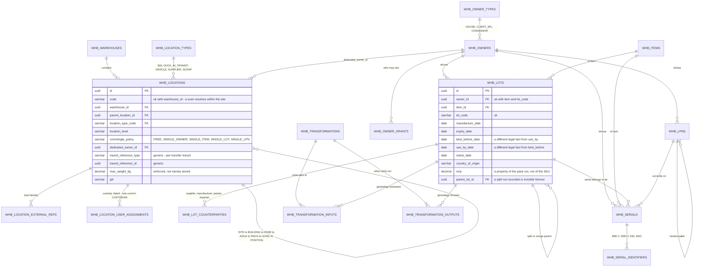

### 4.4 Reservations, allocation and cost — `warehouse-base`

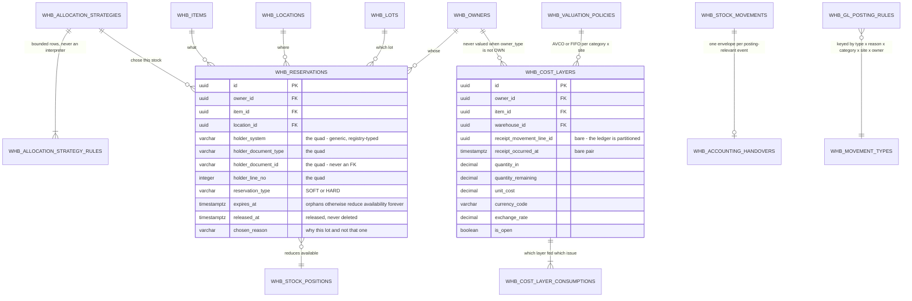

### 4.5 The port, the outbox and ingestion — `warehouse-base`

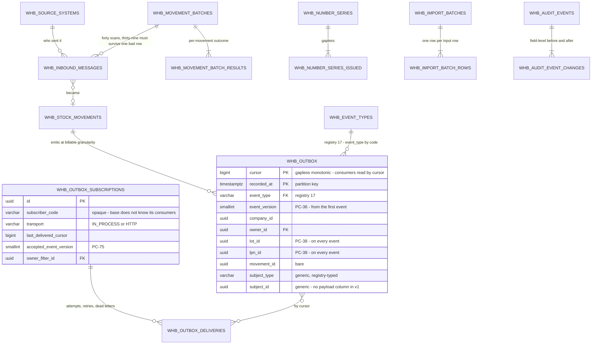

### 4.6 Inbound — `warehouse`

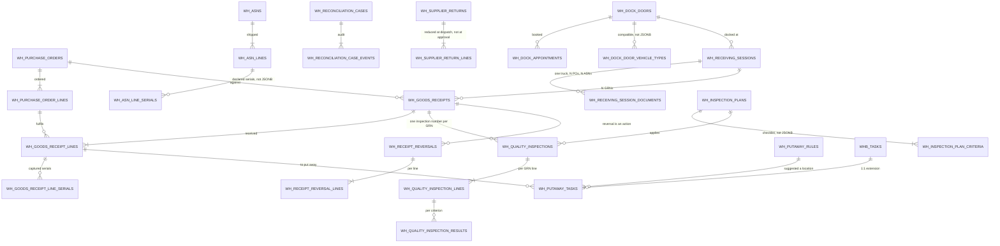

### 4.7 Outbound — `warehouse`

```mermaid
erDiagram
    WH_DEMAND_ORDERS ||--|{ WH_DEMAND_ORDER_LINES : "six quantity columns"
    WH_DEMAND_ORDER_LINES ||--o{ WHB_RESERVATIONS : "holder quad points here"
    WH_WAVES ||--o{ WH_WAVE_ORDERS : "groups"
    WH_WAVES ||--o{ WH_WAVE_CRITERIA : "bounded rows, not JSONB"
    WH_DEMAND_ORDERS ||--o{ WH_WAVE_ORDERS : "in wave"

    WHB_TASKS ||--o| WH_PICK_TASKS : "1:1 extension"
    WH_DEMAND_ORDER_LINES ||--o{ WH_PICK_TASKS : "to pick"
    WHB_RESERVATIONS ||--o| WH_PICK_TASKS : "picks this reservation"
    WH_WAVES ||--o{ WH_PICK_TASKS : "released in"

    WH_PACK_SESSIONS ||--o{ WH_CARTONS : "one active carton"
    WH_CARTONS ||--|{ WH_CARTON_CONTENTS : "to the serial"
    WH_CARTONS ||--o{ WH_CARTON_EVIDENCE : "photo and scale weight at pack time"
    WH_SHIPMENTS ||--o{ WH_CARTONS : "loaded as cartons, not as items"
    WH_SHIPMENTS ||--o{ WH_SHIPMENT_ORDERS : "many orders per shipment"
    WH_DEMAND_ORDERS ||--o{ WH_SHIPMENT_ORDERS : "many shipments per order"

    WH_CARRIERS ||--|{ WH_CARRIER_SERVICES : "service levels"
    WH_CARRIERS ||--|{ WH_CARRIER_ACCOUNTS : "owner_id nullable - ship on the client account"
    WH_CARRIERS ||--o{ WH_SHIPMENTS : "carried by"
    WH_SHIPMENTS ||--o{ WH_SHIPMENT_TRACKING_EVENTS : "normalised and raw"
    WH_SHIPMENTS ||--o| WH_CONSIGNMENTS : "1:1 and optional"
    WH_MANIFESTS ||--|{ WH_MANIFEST_SHIPMENTS : "the carrier signed list"
    WH_HANDOVERS ||--o{ WH_SHIPMENTS : "our record that they left"
    WH_SHIPMENTS ||--o{ WH_SHIPMENT_NDRS : "response clock"
    WH_SHIPMENT_NDRS ||--|{ WH_NDR_ACTIONS : "what we did"
    WH_SHIPMENTS ||--o| WH_RTO_CONSIGNMENTS : "an inbound stock stream"
    WH_RTO_CONSIGNMENTS ||--o| WH_RETURN_RECEIPTS : "received back"
    WH_COD_REMITTANCES ||--|{ WH_COD_REMITTANCE_LINES : "unmatched is a first-class state"

    WH_PRINT_TEMPLATES ||--|{ WH_PRINT_TEMPLATE_VERSIONS : "never edited in place"
    WH_PRINT_TEMPLATE_VERSIONS ||--o{ WH_PRINT_JOBS : "rendered from"
    WH_PRINTERS ||--o{ WH_PRINT_JOBS : "printed on"
```

### 4.8 Counting, adjustment, transfer and returns — `warehouse`

```mermaid
erDiagram
    WH_COUNT_PROGRAMS ||--o{ WH_COUNT_PROGRAM_SCOPES : "zone, ABC, item - not JSONB"
    WH_COUNT_PROGRAMS ||--o{ WH_COUNTS : "generates"
    WH_COUNTS ||--|{ WH_COUNT_LINES : "book quantity frozen at start"
    WH_COUNTS ||--o{ WH_COUNT_ZONE_ASSIGNMENTS : "multi-counter"
    WHB_TASKS ||--o| WH_COUNT_TASKS : "1:1 extension"
    WH_COUNTS ||--o{ WH_COUNT_TASKS : "to count"
    WH_COUNT_LINES ||--o| WH_STOCK_ADJUSTMENT_LINES : "proposes, never writes on-hand"

    WH_STOCK_ADJUSTMENTS ||--|{ WH_STOCK_ADJUSTMENT_LINES : "one location, one status, one owner per line"
    WH_TRANSFER_ORDERS ||--|{ WH_TRANSFER_ORDER_LINES : "three legs: depart, in-transit, arrive"
    WH_TRANSFER_ORDERS }o--|| WHB_LOCATIONS : "per-transfer transit location"

    WH_HOLD_TYPES ||--o{ WH_HOLDS : "blocks_allocation, blocks_pick, blocks_ship"
    WH_HOLDS }o--o{ WH_DEMAND_ORDERS : "an order can be on two holds at once"

    WH_RMAS ||--|{ WH_RMA_LINES : "optional authorisation"
    WH_RETURN_RECEIPTS ||--|{ WH_RETURN_RECEIPT_LINES : "the primary object"
    WH_RMAS ||--o{ WH_RETURN_RECEIPTS : "matched later, on a screen"
    WH_RETURN_RECEIPT_LINES ||--o{ WH_RETURN_GRADINGS : "graded at the point of receipt"
    WHB_DISPOSITIONS ||--o{ WH_RETURN_RECEIPT_LINES : "each value posts a specified movement"
    WH_RECALLS ||--|{ WH_RECALL_LINES : "every shipment that carried the lot"

    WH_INSUFFICIENT_STOCK_LOG }o--|| WHB_ITEMS : "and the lost sale"
    WH_BLOCKED_MOVEMENTS }o--|| WHB_WAREHOUSES : "a rejected move is a first-class object"
    WH_RECONCILIATION_EXCEPTIONS }o--|| WHB_POSITION_DRIFT_FINDINGS : "with an owner and an ageing clock"
```

### 4.9 3PL billing — `warehouse-3pl`

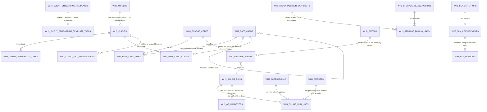

### 4.10 India — `warehouse-india`

```mermaid
erDiagram
    WHB_COMPANIES ||--o{ WHIN_GSTIN_PROFILES : "per registration"
    WHIN_GSTIN_PROFILES ||--|{ WHIN_GSTIN_PROFILE_BRANCHES : "principal and additional places of business, dated"
    BRANCHES ||--o{ WHIN_GSTIN_PROFILE_BRANCHES : "one registration per company at a time (platform)"
    WHIN_COMPLIANCE_REGISTRATIONS ||--|{ WHIN_COMPLIANCE_REGISTRATION_DOCUMENT_KINDS : "document kinds as rows"
    WHIN_COMPLIANCE_PROVIDERS ||--|{ WHIN_COMPLIANCE_PROVIDER_ENVIRONMENTS : "sandbox and production"
    WHIN_COMPLIANCE_PROVIDERS ||--|{ WHIN_COMPLIANCE_CREDENTIAL_SPECS : "fields as rows, so a new provider is data"
    WHIN_GSTIN_PROFILES ||--o{ WHIN_COMPLIANCE_REGISTRATIONS : "registered with"
    WHIN_COMPLIANCE_REGISTRATIONS ||--|{ WHIN_COMPLIANCE_CREDENTIALS : "encrypted, masked at the edge"
    WHIN_COMPLIANCE_REGISTRATIONS ||--o{ WHIN_COMPLIANCE_AUTH_SESSIONS : "tokens"
    WHIN_COMPLIANCE_REGISTRATIONS ||--o{ WHIN_COMPLIANCE_DOCUMENTS : "every payload and response"
    WHIN_COMPLIANCE_REGISTRATIONS ||--o{ WHIN_COMPLIANCE_API_LOGS : "latency, for provider disputes"

    WHIN_DELIVERY_CHALLANS ||--|{ WHIN_DELIVERY_CHALLAN_LINES : "one challan table, six purposes"
    WHIN_GSTIN_PROFILES ||--o{ WHIN_DELIVERY_CHALLANS : "from and to"
    WHB_NUMBER_SERIES ||--o{ WHIN_DELIVERY_CHALLANS : "per-branch gapless series"
    WHIN_DELIVERY_CHALLANS ||--o| WHIN_EWAY_BILLS : "carries"
    WHB_TRANSPORT_DETAILS ||--o| WHIN_EWAY_BILLS : "Part-B fields, country-neutral"
    WHIN_EWAY_BILLS ||--o{ WHIN_EWAY_BILL_VEHICLE_UPDATES : "Part-B in transit"
    WHIN_EWAY_BILLS ||--o{ WHIN_EWAY_BILL_EXTENSIONS : "validity"
    WHIN_EWAY_BILLS ||--o| WHIN_EWAY_BILL_CANCELLATIONS : "within the window"
    WHIN_EWAY_BILLS_CONSOLIDATED ||--|{ WHIN_EWAY_BILL_CONSOLIDATED_ITEMS : "one vehicle, many bills"

    WHIN_JOB_WORK_REGISTRATIONS ||--|{ WHIN_JOB_WORK_DISPATCH_LINES : "owner unchanged, clock running"
    WHIN_ITC04_RETURNS ||--|{ WHIN_ITC04_LINES : "filed from warehouse data"
    WHIN_STOCK_ACCOUNT_PERIODS ||--|{ WHIN_STOCK_ACCOUNT_LINES : "the Rule 56 categories"
    WHIN_BONDED_LICENCES ||--o{ WHIN_WAREHOUSING_BONDS : "a running utilisation balance"
    WHIN_WAREHOUSING_BONDS ||--|{ WHIN_BOND_UTILISATIONS : "consumed"
    WHIN_WAREHOUSING_BONDS ||--o{ WHIN_EX_BOND_CLEARANCES : "identified bonded quantity"
```

### 4.11 The adapters, and the shape they all share

```mermaid
erDiagram
    WHB_SOURCE_SYSTEMS ||--o{ WHB_STOCK_MOVEMENTS : "one row per adapter, registered by its own migration"
    WHB_ITEM_EXTERNAL_REFS }o--|| WHB_ITEMS : "map, not mirror"

    WHAD_VEHICLE_FITMENTS }o--|| WHB_ITEMS : "fitment lives in the adapter, never in base"
    WHAD_COUNTER_SALES ||--|{ WHAD_COUNTER_SALE_LINES : "sub-ten-second bill"
    WHAD_COUNTER_SALES }o--o| WH_DEMAND_ORDERS : "posts as demand"
    WHAD_OEM_ORDERS ||--|{ WHAD_OEM_ORDER_LINES : "allocated, backordered, ETA"
    WHAD_OEM_ORDERS }o--o| WH_PURCHASE_ORDERS : "becomes"
    WHAD_PRICE_FILES ||--|{ WHAD_PRICE_FILE_LINES : "dry-run diff before apply"
    WHAD_CORE_EXCHANGES }o--|| WHB_SERIALS : "cores are inventory"

    WHAS_MATERIAL_REQUESTS ||--|{ WHAS_MATERIAL_REQUEST_LINES : "against a job card"
    WHAS_MATERIAL_REQUEST_LINES }o--o| WHB_RESERVATIONS : "reserve before picking"
    WHAS_MATERIAL_REQUEST_LINES ||--o{ WHAS_JOB_PART_ISSUES : "issued"
    WHAS_JOB_PART_ISSUES ||--o{ WHAS_FITTED_SERIALS : "records the vehicle at issue time"
    WHAS_JOB_PART_ISSUES ||--o| WHAS_WARRANTY_HOLDS : "scrap and hold"

    WHAF_VAN_STOCK_ASSIGNMENTS }o--|| WHB_LOCATIONS : "the van IS a location"
    WHAF_VAN_STOCK_ASSIGNMENTS ||--o{ WHAF_VAN_REPLENISHMENTS : "by transfer"
    WHAF_VAN_STOCK_ASSIGNMENTS ||--o{ WHAF_JOB_CONSUMPTIONS : "consumed at the job"

    WHAA_SPARE_CONSUMPTIONS }o--|| WHB_ITEMS : "against a complaint resolution"
    WHAA_ASSET_ITEM_LINKS }o--|| WHB_SERIALS : "warehouse owns it as stock, assets once capitalised"
```

---

## 5. Money, quantity, precision and rounding

### 5.1 The ruling — cited from accounting, not re-derived

`OD-7` names the deadline (*before `P0-02`*) and the recommendation (*adopt accounting's resolved set
verbatim, including the corrected `DECIMAL(9,6)` for percentages, **and cite it rather than restating
it***). The authority is `accounting/docs/DATA-MODEL.md` §5.1 at `:2443-2453`, and its two normative
tie-breaks at `:2455-2470`. Reproduced here **only** with the warehouse columns each kind applies to,
so a migration author does not have to open the other repository to type a `CREATE TABLE`:

| Kind | Type | Warehouse columns |
|---|---|---|
| **Quantities** | `DECIMAL(18,4)` | `quantity`, `base_quantity`, `secondary_quantity`, `quantity_on_hand`, `quantity_reserved`, `quantity_available`, `quantity_in`, `quantity_remaining`, `quantity_consumed`, every `*_quantity` on every document line, `count_snapshot_quantity`, `counted_quantity`, `variance_quantity` |
| **Money / extended value** | `DECIMAL(19,4)` | `extended_cost`, `layer_value`, `value_consumed`, `variance_value`, `total_value_impact`, `subtotal`, `tax_amount`, `total_amount`, `line_total`, `shipping_cost`, `credit_amount`, `core_deposit_amount`, `declared_value`, `allocated_amount`, every `wh3_` `amount` / `charge` / `rate`-as-money column, `write_down_amount` |
| **Per-unit cost and price** | `DECIMAL(19,6)` | `unit_cost`, `unit_price`, `unit_value`, `standard_cost`, `moving_average_after`, `old_unit_cost`, `new_unit_cost`, `assessed_nrv`, `rate` on `wh3_rate_card_lines` **where the rate is per unit** |
| **Percentages and ratios** | `DECIMAL(9,6)` | `variance_pct`, `over_receipt_tolerance_pct`, `recount_threshold_pct`, `approval_threshold_pct`, `min_shelf_life_receipt_pct`, `min_shelf_life_ship_pct`, `discount_percent`, `markup_percent`, `scrap_factor_percent`, `quantity_ratio`, `buffer_percent`, every `*_percent` and `*_ratio` |
| **Currency exchange rates** | `DECIMAL(19,8)` | `whb_cost_layers.exchange_rate`, and **nothing else** |
| **Physical measures** | `DECIMAL(12,3)` kg / `DECIMAL(12,2)` cm / `DECIMAL(15,2)` cc | `weight_gross_kg`, `weight_net_kg`, `gross_weight_kg`, `scale_weight_kg`, `tare_weight_kg`, `max_weight_kg`, `billable_weight_kg`, `length_cm`/`width_cm`/`height_cm`/`depth_cm`, `volume_cc`, `max_volume_cc`, `distance_km` `DECIMAL(10,2)` |

**The two tie-breaks are normative and are restated verbatim because an author reading the table
quickly resolves both the wrong way:**

1. **`unit_*` beats `value` and `*_amount`.** A per-unit figure is **always** the 6-decimal type;
   `DECIMAL(19,4)` is for **extended totals only**. The warehouse case that catches people is
   `whin_delivery_challan_lines.unit_value` — it ends in `value`, and `whb_cost_layers.layer_value`
   and `whb_cost_layer_consumptions.value_consumed` are both `DECIMAL(19,4)` — but it is per-unit and
   is `DECIMAL(19,6)`.
2. **`_percent` beats any reading of "rate".** `DECIMAL(19,8)` is the **currency-conversion** type and
   nothing else. `wh3_rate_card_lines.rate` contains the word *rate* and is **money per unit**, so it
   is `DECIMAL(19,6)`; `wh3_freight_billing_rules.markup_percent` also contains a rate-like reading
   and is `DECIMAL(9,6)`.

**Why not CLAUDE.md's `DECIMAL(15,2)`:** the four arguments are accounting's, at
`accounting/docs/DATA-MODEL.md:2472-2515`, and the second of them is *about this product* — an AVCO
unit cost is `Σ layer_value / Σ quantity` and almost never lands on two decimals, so at 2dp
`quantity × unit_cost ≠ layer_value` for essentially every item and the inventory-to-GL reconciliation
(`FR-247`) is blocked forever by an error nobody can clear. `DECIMAL(18,4)` is already used 26 times
in this repo for exactly this pairing, in the accessories inventory tables
(`accessories/…/V30131__…:13,23,24`).

### 5.2 The one addition warehouse needs, and it is genuinely open

`IRREVERSIBLE.md` §7.4 records it plainly:

> *"The one substantive divergence to resolve is `conversion_factor_used`: R4 proposes
> `numeric(18,8)`; the accounting set has no `*_factor` row, and its `DECIMAL(19,8)` is explicitly
> **the currency-conversion type and nothing else** (`accounting/docs/DATA-MODEL.md:2462-2467`)."*

**This document's ruling, offered to `OD-7` as the sixth kind rather than asserted as settled:**

| Kind | Type | Columns | Argument |
|---|---|---|---|
| **UoM conversion factor** | **`DECIMAL(18,8)`** | `whb_item_uom_conversions.conversion_factor`, `whb_stock_movement_lines.conversion_factor_used`, `whb_item_packaging_levels.quantity_in_parent` | It is **not** a currency rate, so tie-break 2 forbids `DECIMAL(19,8)`. It is **not** a percentage, so `DECIMAL(9,6)` is wrong and also too narrow — a `PALLET` of `EA` at 1,200 needs four integer digits and a milligram-scale decant needs eight decimals in the other direction. It is **not** a quantity, so `DECIMAL(18,4)` is wrong: at 4 decimals, `1 EA` of an item whose base UoM is `KG` at 0.000045 kg rounds the factor itself to `0.0000` and the conversion is *undefined before any quantity is multiplied*. `DECIMAL(18,8)` is R4's proposal and it is right; ten integer digits and eight decimals covers every real pack ratio in both directions |

`OD-7` is **open** until someone closes it. Every type in §5.1 is a *recommendation carrying a
citation*; §5.2 is a *recommendation carrying an argument*. Neither is authoritative until `OD-7` is
closed, and `OD-7`'s deadline is **before `P0-02`**, which is `V500030` — the migration that creates
the ledger and can never be altered afterwards.

### 5.3 Rounding

**R-1 — Function.** `HALF_UP` (away from zero), everywhere.
- PostgreSQL `round(numeric, int)` is HALF_UP for `numeric` and **banker's rounding for `double
  precision`**, so no quantity, cost or value may ever pass through a `float8` cast in a query, a view
  or a report. Greppable rule: `::float`, `::double precision` and `CAST(… AS DOUBLE PRECISION)` are
  forbidden on any `whb_`/`wh_`/`wh3_`/`whin_` numeric column.
- Java: `BigDecimal.setScale(dp, RoundingMode.HALF_UP)`. `double` and `float` never appear in a
  warehouse DTO, entity or service signature. `FR-031`: *"every quantity, cost and valuation figure is
  computed on the backend in `BigDecimal`; the frontend renders formatted strings."*

**R-2 — Round once.** Rounding happens exactly once, at the boundary where a computed value becomes a
stored column. A stored value is never re-rounded. Intermediate arithmetic runs at full `BigDecimal`
precision.

**R-3 — Complementary pairs are computed by subtraction, never by a second rounding.**
`backordered = ordered − allocated − shipped − cancelled`. `available = on_hand − reserved`.
`variance = counted − snapshot`. `net = gross − tare`. This guarantees the pair sums back to the
parent exactly.

**R-4 — Splits use largest remainder.** When one rounded amount is divided across N components —
landed cost apportioned across receipt lines, a minimum charge trued up across charge codes, a kit's
cost across outputs — assign `floor` of each provisional share, then distribute the remaining minor
units one at a time, **largest fractional remainder first, ties broken by the sink's declared ordinal** — `line_no` on a
document line, `line_no` on a billing run line, `sequence` on a kit output — and every sink of a
largest-remainder split must declare one (`RF-009`). Σ parts == whole,
always. This is why `wh_landed_cost_allocations` stores the allocated amount rather than recomputing
it: the apportionment must be reproducible next year, and a recomputation against a changed line set
would not be.

**R-5 — The conversion factor is frozen, not applied.** `L-7` and `IRR-34`: the line stores
`conversion_factor_used`, and `base_quantity = round(quantity × conversion_factor_used, 4)` is
computed **once, at post**. A ledger that re-derives from today's factor silently restates last year,
and the restatement is undetectable because both numbers are internally consistent.

### 5.4 The rounding-away-from-zero problem, and why it is sharper here than in accounting

**The failure.** A line's transaction quantity is real and non-zero; its base quantity rounds to zero.

```
item          : a bearing sold in EA, base UoM KG, conversion factor 0.000045
transaction   : quantity = 1, uom = EA
base_quantity = round(1 × 0.000045, 4) = 0.0000
```

**Why this is worse than accounting's version of the same problem.** Accounting's sub-unit base amount
(`accounting/docs/DATA-MODEL.md` §5.4, row 8) is caught by a `CHECK` — `chk_acc_journal_lines_base_mirrors_txn`
asserts `(debit_amount > 0) = (base_debit_amount > 0)` and would *reject* the line. **Warehouse has no
such backstop by default, because `L-1` would pass.** A movement with a `0.0000` base quantity on both
its lines sums to zero and balances **perfectly**. The conservation invariant — the strongest guard in
the product — reports success while the stock has not moved. The unit is issued from the shelf, the
ledger records nothing, and the position is wrong by one bearing forever.

**The rule, in three parts.**

1. **Round away from zero to the smallest representable base quantity.** Where
   `quantity <> 0` and `round(quantity × factor, 4) = 0`, the base quantity is `±0.0001` with the sign
   of `quantity`. The application never offers the database a zero base quantity for a non-zero
   transaction quantity.
2. **The counter-side line is generated from the primary line's `base_quantity`, never converted
   independently.** This is what keeps `L-1` exact. If a receipt line in `CASE` and its
   `SUPPLIER`-side counter line in `EA` were each converted from their own transaction quantity and
   each rounded, they would not cancel and every receipt would be out of balance by up to `0.0002`.
   The writer service computes the primary line's `base_quantity` once and negates it for the counter
   side, which is why `whb_stock_movement_lines.is_counter_side` exists: the generated line is
   identifiable, so the rule is auditable rather than assumed.
3. **The `CHECK` becomes a backstop rather than a rejection.** `I-8` asserts
   `(quantity = 0) = (base_quantity = 0)` — the mirror of accounting's shape, in the direction
   warehouse needs. Under rule 1 it never fires from the application, so it stays a guard against a
   writer that bypassed the rule, which is what a `CHECK` is for.

**And the conservation invariant does one thing about it that nothing else can.** `I-1` balances
`Σ base_quantity` per `(owner, item, lot, serial, duty_status)`. Under rule 2 the two sides of a
rounded-away-from-zero line are `+0.0001` and `−0.0001`, so **the movement balances and the position
moves by 0.0001 kg for a physical unit that weighs 0.000045 kg** — a 122% overstatement of that one
line's weight. That is a real, bounded, *visible* error, and it is the right trade against a silent
zero: the position is wrong by an amount that appears on a report, rather than right-looking and
missing a unit. Two mitigations, both cheap and both required:

- **The service warns at post** when a conversion rounds away from zero, naming the item, the UoM pair
  and the factor, and writes a `wh_blocked_movements`-adjacent advisory row. Repeated warnings on one
  item mean its base UoM is wrong for its trade unit, which is a master-data fix, not a rounding fix.
- **The base UoM is chosen so this does not happen.** `FR-054` makes the base stocking UoM immutable
  once a ledger row exists, enforced by a database trigger and not trusted to the service layer
  (`I-9`), precisely so that this decision is taken once, deliberately, at item creation — a bearing's
  base UoM is `EA`, not `KG`, and `DECIMAL(18,4)` is then never strained.

**Rejected, and recorded so it is not re-proposed:** relaxing to permit `base_quantity = 0` where
`quantity <> 0`. It admits lines with no ledger effect permanently, makes `L-4`'s rebuild
non-reproducible against the source documents, and — uniquely here — hides the failure behind a
*passing* conservation check, which is the one place in this design where a wrong number would look
verified.

---

## 6. The invariants as enforceable constraints

### 6.0 The rule accounting learned the hard way — state it once, act on it everywhere

> **A deferred constraint trigger raises at `COMMIT`, which is outside every `@Transactional`
> boundary. No service `catch` can translate it. The message never reaches a form field, the user sees
> an opaque 500, and the transaction is already unrecoverable.**
>
> **Therefore every trigger-enforced invariant below also has a service pre-check that rejects first,
> in the transaction, with a field-level error.** The trigger is the backstop for the paths the
> service does not own — a migration, a support script, a second writer, direct `psql`.
>
> **A trigger firing in production is an incident, not a validation.** If `I-1` ever raises, the
> question is not *"which field did the user get wrong"*; it is *"which writer bypassed the service"*.

This is `DECISIONS.md` §4's *"each has a database guard and a service guard; the service guard rejects
first, in the transaction, with a field-level error"* — restated here in the form that makes it
operational, because the reason is not obvious from the statement.

### 6.1 The verified PostgreSQL facts that constrain every trigger below

Three facts, each verified against the live PostgreSQL 17 stack (the verification is the accounting
set's, at `accounting/docs/DATA-MODEL.md:2744` and `:2751-2794`; nothing here re-derives it):

1. **A `CREATE CONSTRAINT TRIGGER` is `AFTER` and `FOR EACH ROW` only.** `FOR EACH STATEMENT` is a
   syntax error on a constraint trigger.
2. **A constraint trigger cannot use transition tables.** `REFERENCING NEW TABLE AS …` is unavailable
   on one. So *"statement-scoped over a transition table"* and *"deferred"* are **mutually
   exclusive** — you may have either, never both.
3. **A plain statement trigger accepts the transition table but cannot be deferred**, which breaks the
   header-then-lines insert that deferral exists to permit.

**The consequence, and it is the one that matters for warehouse.** A deferred `FOR EACH ROW` trigger
queues **one event per affected row**, and all of them fire at `COMMIT` against identical final state.
If the body re-runs a full `SUM` over the movement, an N-line movement performs N × N tuple reads for
an answer that cannot change between the first event and the last.

**The case that decides it is not hypothetical: it is `wh_opening_stock_batches`.** `FR-411` makes
opening stock a first-class feature, and an opening-stock import is **one movement with tens of
thousands of lines**. At 50,000 lines a naive deferred row trigger is ≈2.5 × 10⁹ tuple reads,
single-threaded in plpgsql, inside the commit. The go-live would appear to hang.

### 6.2 The memoisation pattern that makes a per-row deferred check O(N)

Use this shape in **every** deferred constraint trigger in this design. It is legal, it keeps the
trigger, and it turns O(N²) into O(N):

```sql
CREATE OR REPLACE FUNCTION whb_assert_movement_conserves() RETURNS TRIGGER AS $$
DECLARE
    v_movement_id UUID := COALESCE(NEW.movement_id, OLD.movement_id);
    v_seen        TEXT;
    v_key         TEXT := 'whb.conserved.' || v_movement_id::text;
    v_bad         RECORD;
    v_status      VARCHAR(30);
BEGIN
    -- 1. Memoise: the first queued event for this movement does the work; the rest return
    --    immediately. current_setting(..., true) returns NULL rather than raising when unset.
    v_seen := current_setting(v_key, true);
    IF v_seen IS NOT NULL THEN
        RETURN NULL;
    END IF;
    PERFORM set_config(v_key, '1', true);   -- is_local = true: reset at transaction end

    -- 2. Only a movement with ledger effect is asserted: approval_status NULL or APPROVED. A PENDING
    --    (or REJECTED / WITHDRAWN) movement is not; there is no status column (MPR-OPEN-05).
    SELECT approval_status INTO v_status FROM whb_stock_movements
     WHERE id = v_movement_id AND occurred_at = COALESCE(NEW.occurred_at, OLD.occurred_at);
    IF NOT FOUND OR (v_status IS NOT NULL AND v_status <> 'APPROVED') THEN
        RETURN NULL;
    END IF;

    -- 3. One aggregate over the whole movement, honouring the type's balance_rule.
    SELECT * INTO v_bad FROM (
        SELECT l.owner_id, l.item_id, l.lot_id, l.serial_id, l.duty_status,
               SUM(l.base_quantity) AS net
          FROM whb_stock_movement_lines l
         WHERE l.movement_id  = v_movement_id
           AND l.occurred_at  = COALESCE(NEW.occurred_at, OLD.occurred_at)
         GROUP BY l.owner_id, l.item_id, l.lot_id, l.serial_id, l.duty_status
        HAVING SUM(l.base_quantity) <> 0
    ) x LIMIT 1;

    IF FOUND THEN
        RAISE EXCEPTION
          'I-1 violated: movement % does not conserve (owner %, item %, net %). '
          'A receipt or issue must balance against a virtual location, never against nothing.',
          v_movement_id, v_bad.owner_id, v_bad.item_id, v_bad.net;
    END IF;
    RETURN NULL;
END;
$$ LANGUAGE plpgsql;

CREATE CONSTRAINT TRIGGER trg_whb_movement_lines_conserve
    AFTER INSERT OR UPDATE OR DELETE ON whb_stock_movement_lines
    DEFERRABLE INITIALLY DEFERRED
    FOR EACH ROW EXECUTE FUNCTION whb_assert_movement_conserves();
```

**Three details that are load-bearing and easy to get wrong:**

- **`current_setting(key, true)` — the second argument is `missing_ok`.** Without it the first call
  raises `unrecognized configuration parameter`, and the trigger fails on the first line of every
  movement.
- **`set_config(key, value, true)` — the third argument is `is_local`.** It scopes the setting to the
  transaction, so the next transaction re-checks. `false` would memoise for the whole session and the
  second movement in a batch would never be validated.
- **The `LIMIT 1` inside the subquery.** The trigger needs to know *whether* a group is unbalanced and
  *one example*; it does not need all of them, and on a 50,000-line movement the difference is
  material.

The alternative shape — **drop the row trigger and rely on a header trigger that fires once when the
status flips to `POSTED`** — is equally correct and is what `I-1b` below does. Both are implemented:
the header trigger is the primary, the memoised line trigger is the backstop that catches a line
inserted into an already-posted movement. Together they close the gap that a header-only check leaves.

### 6.3 The constraint table

Enforcement layers: **C** = DB `CHECK` · **U** = DB unique index or constraint · **T** = DB trigger ·
**TD** = **deferred** constraint trigger · **S** = service guard (always present, always first).

| # | Invariant | C | U | T | TD | S | Migration |
|---|---|:-:|:-:|:-:|:-:|:-:|---|
| **I-1** | `L-1` Conservation — lines sum to zero in base UoM per (owner, item, lot, serial, duty status) | | | ● | ● | ● | `V500030` |
| **I-2** | `L-2` Append-only — no `UPDATE`, no `DELETE`, no late `INSERT` into a posted movement | | | ● | | ● | `V500030` |
| **I-3** | `L-3` Correction is reversal — mirrored lines, mandatory reason, single-set link | ● | ● | ● | | ● | `V500030` |
| **I-4** | `L-2`/`IRR-03` Gapless `sequence_no` per warehouse + hash chain | | ● | ● | | ● | `V500030` |
| **I-5** | `L-5` The nine-member position key | | ● | | | ● | `V500031` |
| **I-6** | `L-6` Nonnegative ATP projection; signed on-hand follows effective policy; allocations check positive free stock | ● | | ● | | ● | `V500031` |
| **I-7** | `L-4` Positions are a cache — rebuild reproduces exactly | | | | | ● | job + `V500045` |
| **I-8** | `L-7` Base UoM and the frozen factor; zero-quantity mirror | ● | | | | ● | `V500030` |
| **I-9** | `L-7` Base stocking UoM immutable once stock exists | | | ● | | ● | `V500036` |
| **I-10** | `L-8` Period-bound posting, with session-GUC-gated override | | | ● | | ● | `V500032` |
| **I-11** | `L-9` Idempotent ingestion — `(source_system, idempotency_key)` unique **across months** on the non-partitioned `whb_movement_idempotency_keys` registry, never server-generated | | ● | | | ● | `V500030` |
| **I-12** | `L-10` Allocation is an open-item ledger with a holder quad | ● | | ● | | ● | `V500033` |
| **I-13** | `L-13` Three timestamps, and the line's `occurred_at` mirrors its header's | ● | | ● | | ● | `V500030` |
| **I-14** | `L-11` Ownership never changes silently | ● | | ● | | ● | `V500030` |
| **I-15** | `L-12` Traceability is reconstructible in both directions | ● | | | | ● | `V500030` + test |
| **I-16** | `L-14` Non-own stock is never valued | ● | | ● | | ● | `V500030` |
| **I-17** | `IRR-05` Every line resolves to a location, and virtual locations exist | ● | | | | ● | `V500013` + `V500030` |
| **I-18** | `D-10` No `CHECK (… IN (…))` on any of the **seventeen** registry columns, nor on any `CODE-LIST` column of §2.1.1's classification table | | | | | ● | `WarehouseBaseCouplingTest` |
| **I-19** | `IRR-19` Item uniqueness is `(owner_id, sku)`; serial uniqueness is `(owner, item, serial_number)` | | ● | | | ● | `V500015` / `V500018` |
| **I-20** | `L-6` Gapless document numbering, and the number is issued once | | ● | ● | | ● | `V500020` |
| **I-21** | `L-15` Value-only movements balance signed extended value by currency; no mixed quantity/value-only movement | | ● | ● | | ● | `V500030` |
| **I-22** | `D-14` A movement at an instant with no `REGISTERED` link is refused — `BEFORE INSERT` on `whb_stock_movements`: a `REGISTERED` link must cover `NEW.occurred_at` at `NEW.warehouse_id` | | | ● | | ● | `V500030` |
| **I-23** | `D-14` The `REGISTERED` history — the exclusion (no overlap, from `V500012`) and the append-only trigger (no `DELETE` and no key edit once a posted movement is in range; `effective_to` never inside a `CLOSED` period). It reads the ledger, so it cannot live in `V500012`. No at-least-one trigger (`D-14` item 8g) | | ● | ● | ● | ● | **`V500037`** |
| **I-24** | `RL-010` A rule row referenced by a reservation or task is immutable; an edit is copy-on-write (`version_no`, `supersedes_id`) | | | ● | | ● | `V500031`, `V500033`, `V510017` |

`I-21` — `L-15`'s value-conservation guard, allocated by `OD-14` — is owed to this table and is
transcribed verbatim from `OPEN-DECISIONS-RESOLVED.md` §2. `I-22`, `I-23` and `I-24` were allocated
2026-09-10 by `GAP-REGISTER-R4.md` §4.0 and follow it in number.

**Two `L-n` rows have no `TD`, deliberately.** `L-4` (`I-7`) is a *nightly reconciliation*, not a
constraint: a cache that is checked at `COMMIT` is not a cache, it is a synchronous double-write. And
`L-12` (`I-15`) is a *schema shape plus a test*, because "answerable in both directions" is a property
of the query surface, not of a row.

### 6.4 The constraints, in SQL

#### `I-1` — conservation (deferred trigger + header trigger + service pre-check) · `V500030`

The deferred line trigger is **§6.2 verbatim**, including the memoisation. Its primary partner fires
at commit for every header with ledger effect: at insert, and when a `PENDING` header is approved:

```sql
CREATE OR REPLACE FUNCTION whb_assert_movement_conserves_header() RETURNS TRIGGER AS $$
DECLARE v_bad RECORD; v_lines INTEGER; v_rule VARCHAR(40);
BEGIN
    -- PENDING / REJECTED / WITHDRAWN carry no ledger effect; there is no status column (MPR-OPEN-05)
    IF NEW.approval_status IS NOT NULL AND NEW.approval_status <> 'APPROVED' THEN RETURN NULL; END IF;

    SELECT balance_rule INTO v_rule FROM whb_movement_types WHERE code = NEW.movement_type_code;

    SELECT COUNT(*) INTO v_lines FROM whb_stock_movement_lines
     WHERE movement_id = NEW.id AND occurred_at = NEW.occurred_at;
    IF v_lines < 2 THEN
        RAISE EXCEPTION 'I-1 violated: posted movement % has % line(s); a movement is two or more '
                        'signed lines. A receipt balances against a virtual location, never nothing.',
                        NEW.id, v_lines;
    END IF;

    -- MUST_BALANCE_PER_OWNER_ITEM (default) | MUST_BALANCE_PER_ITEM | MUST_BALANCE_PER_MOVEMENT
    IF v_rule = 'MUST_BALANCE_PER_MOVEMENT' THEN
        SELECT NULL::uuid AS owner_id, NULL::uuid AS item_id, SUM(base_quantity) AS net
          INTO v_bad
          FROM whb_stock_movement_lines
         WHERE movement_id = NEW.id AND occurred_at = NEW.occurred_at
        HAVING SUM(base_quantity) <> 0;
    ELSIF v_rule = 'MUST_BALANCE_PER_ITEM' THEN
        SELECT NULL::uuid AS owner_id, item_id, SUM(base_quantity) AS net INTO v_bad
          FROM whb_stock_movement_lines
         WHERE movement_id = NEW.id AND occurred_at = NEW.occurred_at
         GROUP BY item_id HAVING SUM(base_quantity) <> 0 LIMIT 1;
    ELSE
        SELECT owner_id, item_id, SUM(base_quantity) AS net INTO v_bad
          FROM whb_stock_movement_lines
         WHERE movement_id = NEW.id AND occurred_at = NEW.occurred_at
         GROUP BY owner_id, item_id, lot_id, serial_id, duty_status
        HAVING SUM(base_quantity) <> 0 LIMIT 1;
    END IF;

    IF FOUND THEN
        RAISE EXCEPTION 'I-1 violated: movement % does not conserve under rule % (owner %, item %, net %)',
                        NEW.id, v_rule, v_bad.owner_id, v_bad.item_id, v_bad.net;
    END IF;
    RETURN NULL;
END;
$$ LANGUAGE plpgsql;

CREATE CONSTRAINT TRIGGER trg_whb_movements_conserve
    AFTER INSERT OR UPDATE ON whb_stock_movements
    DEFERRABLE INITIALLY DEFERRED
    FOR EACH ROW EXECUTE FUNCTION whb_assert_movement_conserves_header();
```

> **`balance_rule` lives on the movement type, not in the trigger** (`IRR-08`, `FR-042`). A 3PL's
> own packaging consumed against a client's order is one physical act and two owners; without a
> declared rule the movement is either refused or silently mis-attributed, and there is no atomic way
> to post it at all.

**The service pre-check** (`WhMovementWriterService.post`) sums the lines in Java, in the transaction,
before the flush, and throws a field-level `BusinessException` naming the unbalanced
`(owner, item, lot, serial, duty_status)` tuple and the net. **That is the error a user sees.** The
trigger's message is written for an on-call engineer, not for a form.

#### `I-2` — append-only (trigger + service) · `V500030`

One generic function, attached to both ledger tables. `to_jsonb` is a **transient expression**, chosen
over an enumerated column list so that a column added by a later `ALTER TABLE` is protected the day it
appears rather than the day someone remembers to update the trigger.

```sql
CREATE OR REPLACE FUNCTION whb_reject_posted_mutation() RETURNS TRIGGER AS $$
DECLARE
    v_mutable TEXT[] := TG_ARGV[0]::TEXT[];   -- columns still allowed to move after post
    v_old JSONB; v_new JSONB; v_col TEXT; v_approval VARCHAR(20); v_same_tx BOOLEAN;
BEGIN
    IF TG_OP = 'DELETE' THEN
        RAISE EXCEPTION 'I-2 violated: % row % is a posted ledger row and cannot be deleted by any '
                        'actor, including ADMIN. Correction is a REVERSAL, never an edit.',
                        TG_TABLE_NAME, OLD.id;
    END IF;

    -- "Posted" = any header whose approval_status is not PENDING; there is no status column
    -- (MPR-OPEN-05, decided 2026-09-14).
    IF TG_OP = 'INSERT' THEN
        -- a line inserted into an already-posted movement is as fatal as an UPDATE. The header's own
        -- transaction still writes its lines: that is how every movement is written.
        SELECT approval_status INTO v_approval
          FROM whb_stock_movements
         WHERE id = NEW.movement_id AND occurred_at = NEW.occurred_at;
        -- ⚠ v_same_tx = "the current transaction inserted this header". DELIBERATELY UNSPECIFIED:
        -- P0-02 chooses and proves the mechanism, and it must NOT read the header row's xmin
        -- (see the note after this block).
        IF FOUND AND v_approval IS DISTINCT FROM 'PENDING' AND NOT v_same_tx THEN
            RAISE EXCEPTION 'I-2 violated: cannot INSERT a line into posted movement %', NEW.movement_id;
        END IF;
        RETURN NEW;                        -- a BEFORE trigger: NULL would silently skip the insert
    END IF;

    IF TG_TABLE_NAME = 'whb_stock_movements' AND OLD.approval_status = 'PENDING' THEN
        RETURN NEW;                        -- not yet posted: approve / reject / withdraw flip it here
    END IF;

    v_old := to_jsonb(OLD);
    v_new := to_jsonb(NEW);
    FOR v_col IN SELECT jsonb_object_keys(v_old) LOOP
        IF v_col <> ALL (v_mutable)
           AND v_old -> v_col IS DISTINCT FROM v_new -> v_col THEN
            RAISE EXCEPTION 'I-2 violated: column %.% is immutable on a posted row (% -> %)',
                            TG_TABLE_NAME, v_col, v_old -> v_col, v_new -> v_col;
        END IF;
    END LOOP;
    RETURN NEW;                            -- an allowed update: NULL would silently drop the row change
END;
$$ LANGUAGE plpgsql;

-- the header: seven columns may still move after post, and no others
CREATE TRIGGER trg_whb_movements_immutable
    BEFORE UPDATE OR DELETE ON whb_stock_movements
    FOR EACH ROW EXECUTE FUNCTION whb_reject_posted_mutation(
        '{posting_status,handover_id,is_reversed,reversed_by_movement_id,updated_at,updated_by,version}');

-- the line: nothing may move, and a late INSERT is refused
CREATE TRIGGER trg_whb_movement_lines_immutable
    BEFORE INSERT OR UPDATE OR DELETE ON whb_stock_movement_lines
    FOR EACH ROW EXECUTE FUNCTION whb_reject_posted_mutation('{}');
```

> **⚠ Open for the P0-02 builder: the same-transaction allowance must not rely on `xmin`
> (`MPR-OPEN-05`).** The `INSERT` branch admits a line into a non-`PENDING` header only when the
> current transaction inserted that header. An earlier sketch tested the header row's
> `xmin = txid_current()`, and that test is wrong. `xmin` names the transaction that wrote the row's
> *current version*, and `I-3`'s conditional `UPDATE … SET is_reversed = true WHERE is_reversed = false`
> rewrites the **original** movement inside the reversal transaction. An `xmin` test would then let
> that transaction insert lines into the original, which is already posted. Any allowlisted update, and
> the approval of a `PENDING` header, rewrites the row the same way. This document does not choose the
> replacement. `P0-02` chooses the mechanism, proves it, and ships a test that reverses a movement and
> inserts the mirror's lines in one transaction: the mirror's lines insert, and a line added to the
> original in that same transaction is refused (`WH-SC-009`).
>
> **Every non-raising path returns `NEW`.** Both triggers are `BEFORE` row triggers, where
> `RETURN NULL` silently skips the row's `INSERT` or `UPDATE` without raising. Only the `AFTER`
> constraint triggers (`I-1`) may return `NULL`.

> **The allowlist is the whole design, and it is deliberately seven columns** — four business columns
> and the `updated_at`/`updated_by`/`version` stamp every allowlisted write carries (`MPR-OPEN-06`).
> `posting_status` and `handover_id` are written by the GL seam after the fact; `is_reversed` and
> `reversed_by_movement_id` by the reversal service. `approval_status`, `approved_by` and
> `approved_at` are **not** on it: they change only while the row is `PENDING`, which the function
> lets through before the allowlist is read. Everything else — including `unit_cost`,
> including `moving_average_after`, including `occurred_at` — is frozen. Adding a sixth column to this
> array is a design decision with an argument, not a convenience.
>
> **`RF-001`, adopted 2026-09-11: `moving_average_after` is never restated.** It is the snapshot of the
> average when that line posted (`IRR-39`). A backdated receipt inserts a cost layer, and the *current*
> average is `Σ open layer_value / Σ open quantity_remaining`, computed on read and never stored. A
> backdated FIFO layer is consumed by future issues only. The line allowlist therefore stays `'{}'`.
>
> **And the trap `IRREVERSIBLE.md` §3.1 names:** `ALTER TABLE … ADD COLUMN` is DDL, so this trigger
> does not block it — but `UPDATE` is DML, so it **does**. Every column added after `V500030` is
> `NULL` forever on every pre-existing row, with no backfill path, because the backfill is an
> `UPDATE`. That is why `PNR-1` and `PNR-2` are the same migration.

**Layer three:** `WhMovementWriterService` has **no update method and no delete method**, and no
repository path exists that could reach one. `L-3` closes the last escape — *"'Edit' is never offered
anywhere in the product"* — so there is no screen that would call one either.

#### `I-3` — correction is reversal · `V500030`

```sql
ALTER TABLE whb_stock_movements
  ADD CONSTRAINT chk_whb_movements_reversal_shape CHECK (
        (reversal_of_movement_id IS NULL)
     OR (reversal_of_movement_id IS NOT NULL AND reason_code_id IS NOT NULL)
  ),
  ADD CONSTRAINT chk_whb_movements_not_self_reversal CHECK (
        reversal_of_movement_id IS DISTINCT FROM id
  );

-- per-partition backstop only (§1.9 consequence 5); the guard is the trigger below
CREATE UNIQUE INDEX uk_whb_stock_movements_one_reversal
    ON whb_stock_movements (reversal_of_movement_id, occurred_at)
    WHERE reversal_of_movement_id IS NOT NULL;
```

Plus a trigger that, on insert of a reversal, sets `is_reversed = true` and
`reversed_by_movement_id` on the original **through the allowlisted columns of `I-2`** — which is the
reason those two columns are on the allowlist at all. **This trigger is the single-reversal guard**
(`MPR-OPEN-07`): it runs `UPDATE whb_stock_movements SET is_reversed = true, reversed_by_movement_id
= NEW.id … WHERE id = NEW.reversal_of_movement_id AND occurred_at = <the original's> AND is_reversed =
false` and raises when that touches no row. The row lock serialises two concurrent reversals, so the
second one finds `is_reversed = true` whatever partition the two reversals land in. The service
refuses first with `409 ALREADY_REVERSED`. The service additionally asserts that the
reversal's lines are the exact mirror of the original's, line for line, and that its
`movement_type_code` is the original type's declared `reversal_type_code`.

#### `I-4` — gapless sequence and the hash chain · `V500030`

```sql
-- per-partition backstop only (§1.9 consequence 5); the guard is the counter row below
CREATE UNIQUE INDEX uk_whb_stock_movements_sequence
    ON whb_stock_movements (warehouse_id, sequence_no, occurred_at);
```

Gaplessness itself is not expressible as a constraint — it is a property of the **issuing** path.
The locked counter row is also the **uniqueness** guard, because the index above cannot see across
partitions. A `PENDING` movement takes its number when it is accepted.
`whb_next_movement_sequence(warehouse_id)` takes a row lock on a per-warehouse counter row
(`SELECT … FOR UPDATE`), increments and returns, inside the posting transaction, so a rolled-back post
releases the number. A nightly job asserts `MAX(sequence_no) = COUNT(*)` per warehouse and raises a
`whb_position_drift_findings` row on a gap. `prev_payload_hash` is set from the previous
`sequence_no`'s `payload_hash` in the same statement; a chain break is the same nightly assertion.

#### `I-5` — the position key · `V500031`

§1.10's `CREATE UNIQUE INDEX … NULLS NOT DISTINCT`, verbatim. The correction of the prior art's
invalid table-level `UNIQUE (…, COALESCE(lot_id, …))` and of its three-member grain.

#### `I-6` — nonnegative ATP; negative signed on-hand is a policy · `V500031`

The cached `quantity_available` is ATP, not signed balance. Allocation admission checks actual positive free stock under the writer lock; the CHECK alone is not sufficient. Rebuild computes the same clamped projection and separately reports physical debt. The current negative-stock resolver is the effective `whb_negative_stock_policies` rule with global fallback; NULL/no match resolves to BLOCK. The legacy item-site-only trigger below is historical pseudocode and must not be copied as the current resolver. Simulation, posting and database guard use the same resolved policy identity/version; WARN acknowledgement and override authority cannot be inferred from the mode string alone.

```sql
ALTER TABLE whb_stock_positions
  ADD CONSTRAINT chk_whb_stock_positions_available_nonneg CHECK (quantity_available >= 0),
  ADD CONSTRAINT chk_whb_stock_positions_reserved_nonneg  CHECK (quantity_reserved  >= 0);
```

**There is deliberately no `CHECK (quantity_on_hand >= 0)`.** `L-6` makes negative on-hand a *policy*,
read from `whb_item_site_settings.negative_stock_mode` (`BLOCK`/`WARN`/`ALLOW`), and enforced by a
trigger that consults the policy:

```sql
CREATE OR REPLACE FUNCTION whb_assert_negative_stock_policy() RETURNS TRIGGER AS $$
DECLARE v_mode VARCHAR(10);
BEGIN
    IF NEW.quantity_on_hand >= 0 THEN RETURN NEW; END IF;
    SELECT COALESCE(s.negative_stock_mode, 'BLOCK') INTO v_mode
      FROM whb_item_site_settings s
     WHERE s.item_id = NEW.item_id AND s.warehouse_id = NEW.warehouse_id;
    IF v_mode = 'BLOCK' THEN
        RAISE EXCEPTION 'I-6 violated: on-hand for item % at warehouse % would go negative (%) and '
                        'the item-site policy is BLOCK', NEW.item_id, NEW.warehouse_id, NEW.quantity_on_hand;
    END IF;
    RETURN NEW;   -- WARN and ALLOW both permit; the service writes the wh_insufficient_stock_log row
END;
$$ LANGUAGE plpgsql;

CREATE TRIGGER trg_whb_positions_negative_policy
    BEFORE INSERT OR UPDATE ON whb_stock_positions
    FOR EACH ROW EXECUTE FUNCTION whb_assert_negative_stock_policy();
```

Note this trigger is **not deferred** and not a constraint trigger: it is a plain `BEFORE` trigger on
the cache, so it raises inside the statement and the service *can* catch and translate it. That is the
right choice here precisely because the outcome depends on configuration the user can change.

`FR-015`: every `WARN`/`ALLOW` breach writes a `wh_insufficient_stock_log` row and appears on a report.
A policy that permits an outcome without recording it is not a policy.

#### `I-7` — positions are a cache · nightly job + `V500045`

Not a constraint. The nightly job rebuilds every position from the ledger into a temporary relation and
compares:

```sql
WITH rebuilt AS (
    SELECT m.company_id, l.owner_id, l.item_id, l.location_id, l.lot_id, l.serial_id,
           l.lpn_id, l.stock_status_code, l.duty_status,
           SUM(l.base_quantity) AS qty
      FROM whb_stock_movement_lines l
      JOIN whb_stock_movements     m ON m.id = l.movement_id AND m.occurred_at = l.occurred_at
     WHERE m.approval_status IS NULL OR m.approval_status = 'APPROVED'   -- ledger effect only (MPR-OPEN-05)
     GROUP BY 1,2,3,4,5,6,7,8,9
)
INSERT INTO whb_position_drift_findings (run_id, finding_type, /* nine key members */,
                                         cached_quantity, rebuilt_quantity, difference)
SELECT :run_id, 'POSITION_DRIFT', /* … */,
       COALESCE(p.quantity_on_hand, 0), COALESCE(r.qty, 0),
       COALESCE(p.quantity_on_hand, 0) - COALESCE(r.qty, 0)
  FROM rebuilt r
  FULL OUTER JOIN whb_stock_positions p
    ON  p.company_id = r.company_id AND p.owner_id = r.owner_id AND p.item_id = r.item_id
    AND p.location_id = r.location_id
    AND p.lot_id    IS NOT DISTINCT FROM r.lot_id
    AND p.serial_id IS NOT DISTINCT FROM r.serial_id
    AND p.lpn_id    IS NOT DISTINCT FROM r.lpn_id
    AND p.stock_status_code = r.stock_status_code AND p.duty_status = r.duty_status
 WHERE COALESCE(p.quantity_on_hand, 0) <> COALESCE(r.qty, 0);
```

**`IS NOT DISTINCT FROM` on the three nullable members, not `=`.** With `=`, every null-lot row fails
to join and the job reports 100% drift on the first night. This is the same nullable-comparison trap
that `NULLS NOT DISTINCT` solves for the unique index, arriving in the join clause instead — and it is
the reason both are stated rather than left to the implementer.

The job also drives `FR-013`'s `GET /stock/as-at?at=…`, which answers a past balance **from the
ledger** — so the reconstructibility claim is exercised in production and not only in tests.

#### `I-8` — base UoM and the frozen factor · `V500030`

```sql
ALTER TABLE whb_stock_movement_lines
  ADD CONSTRAINT chk_whb_sml_factor_positive CHECK (conversion_factor_used > 0),
  -- the zero mirror: §5.4's backstop, in the direction warehouse needs
  ADD CONSTRAINT chk_whb_sml_zero_mirrors CHECK ((quantity = 0) = (base_quantity = 0)),
  ADD CONSTRAINT chk_whb_sml_sign_mirrors CHECK (sign(quantity) = sign(base_quantity)),
  -- IRR-37: value-only movements are legal. There is NO CHECK (quantity <> 0).
  ADD CONSTRAINT chk_whb_sml_value_only CHECK (quantity <> 0 OR unit_cost IS NOT NULL);
```

`chk_whb_sml_value_only` is the positive form of `IRR-37`: a zero-quantity line is legal **and** must
carry a value, so `LANDED_COST_APPLY` works and an accidental empty line does not.

#### `I-9` — base stocking UoM immutable once stock exists · `V500036`

```sql
CREATE OR REPLACE FUNCTION whb_assert_base_uom_immutable() RETURNS TRIGGER AS $$
BEGIN
    IF NEW.base_uom_code IS NOT DISTINCT FROM OLD.base_uom_code THEN RETURN NEW; END IF;
    IF EXISTS (SELECT 1 FROM whb_stock_movement_lines WHERE item_id = NEW.id LIMIT 1) THEN
        RAISE EXCEPTION 'I-9 violated: item % has ledger rows; its base stocking UoM cannot be '
                        'changed from % to %. Create a new item.', NEW.id, OLD.base_uom_code, NEW.base_uom_code;
    END IF;
    RETURN NEW;
END;
$$ LANGUAGE plpgsql;

CREATE TRIGGER trg_whb_items_base_uom_immutable
    BEFORE UPDATE ON whb_items
    FOR EACH ROW EXECUTE FUNCTION whb_assert_base_uom_immutable();
```

`FR-054` is explicit that this is *"enforced by a database trigger and not trusted to the service
layer"*, and §5.4 explains why: the base UoM choice is what keeps the rounding-away-from-zero case out
of the ledger, and it is the one decision that must be taken once.

#### `I-10` — period-bound posting, with a gated override · `V500032`

```sql
CREATE OR REPLACE FUNCTION whb_assert_period_open() RETURNS TRIGGER AS $$
DECLARE v_status VARCHAR(20); v_override TEXT;
BEGIN
    SELECT status INTO v_status FROM whb_stock_periods WHERE id = NEW.period_id;
    IF v_status = 'OPEN' THEN RETURN NEW; END IF;

    IF v_status = 'CLOSED' THEN
        RAISE EXCEPTION 'I-10 violated: period % is CLOSED and admits nothing, including a reversal',
                        NEW.period_id;
    END IF;

    -- SOFT_CLOSED: an approved override, set by the service as a LOCAL GUC for this transaction only
    v_override := current_setting('whb.period_override_id', true);
    IF v_override IS NULL THEN
        RAISE EXCEPTION 'I-10 violated: period % is SOFT_CLOSED and requires an approved override',
                        NEW.period_id;
    END IF;
    RETURN NEW;
END;
$$ LANGUAGE plpgsql;

CREATE TRIGGER trg_whb_movements_period_bound
    BEFORE INSERT ON whb_stock_movements
    FOR EACH ROW EXECUTE FUNCTION whb_assert_period_open();
```

**The session-GUC gate is the mechanism, and it has one rule that must not be relaxed:** the service
sets `whb.period_override_id` with `set_config(…, is_local => true)` **only after** it has written the
`whb_stock_period_overrides` row with an `approved_by` that is not the poster (`FR-408`: the approver
may not be the actor). `is_local` means the grant dies with the transaction; a session-scoped setting
would silently open the period for every subsequent statement on that connection, and connection
pooling makes that "every subsequent statement by anyone".

`I-10` fires on `INSERT` only, so a `PENDING` movement is checked when it is submitted. Approving it
after its period has closed is refused by the service: `409 PERIOD_CLOSED_SINCE_SUBMISSION` on
`posting_date`, message *"withdraw and resubmit current-dated"* (`RA-004`, `MPR-GRD-20`).

#### `I-11` — idempotent ingestion · `V500030`

```sql
-- the guard: not partitioned, so the key is unique across months (§1.9 consequence 5, MPR-OPEN-07)
CREATE TABLE whb_movement_idempotency_keys (
    source_system    VARCHAR(40)  NOT NULL REFERENCES whb_source_systems (code) ON UPDATE RESTRICT,
    idempotency_key  VARCHAR(200) NOT NULL,
    movement_id      UUID         NOT NULL,    -- bare: the ledger is partitioned (§1.9)
    occurred_at      TIMESTAMPTZ  NOT NULL,    -- finds the movement's partition
    payload_hash     CHAR(64)     NOT NULL,
    created_at       TIMESTAMPTZ  NOT NULL DEFAULT CURRENT_TIMESTAMP,
    PRIMARY KEY (source_system, idempotency_key)
);
CREATE INDEX idx_whb_movement_idempotency_keys_movement ON whb_movement_idempotency_keys (movement_id);

-- the backstop on the ledger itself: per partition only
CREATE UNIQUE INDEX uk_whb_stock_movements_idempotency
    ON whb_stock_movements (source_system, idempotency_key, occurred_at);
```

The writer inserts the registry row **in the posting transaction**. That covers a movement, a
reversal (its **own** key, `FR-035`) and a withdraw (its **own** key, `RA-004`, where `movement_id` is
the withdrawn movement). A concurrent request with the same key waits on the primary key, then fails.
The writer then re-reads the registry row and answers from it, which is why a replay across a month
boundary still returns `200` (`RL-011`).

**The key is never server-generated** (`IRR-04`). The port rejects a request whose `idempotency_key`
is absent with `IDEMPOTENCY_KEY_REQUIRED` (`MPR-OPEN-09`; `PC-15`) rather than inventing one, because *"a retried network timeout
posts twice"* is exactly what generating it produces. `FR-033`'s conflict semantics are exact: unseen
key → `201` with the assigned `sequence_no`; seen key with an identical `payload_hash` → `200` with the
original movement, posting nothing; seen key with a **different** `payload_hash` → `409`
`IDEMPOTENCY_KEY_REUSED`, which is the case `payload_hash` exists to distinguish.

#### `I-12` — allocation is an open-item ledger · `V500033`

```sql
ALTER TABLE whb_reservations
  ADD CONSTRAINT chk_whb_reservations_holder_complete CHECK (
        holder_system IS NOT NULL AND holder_document_type IS NOT NULL
    AND holder_document_id IS NOT NULL),
  ADD CONSTRAINT chk_whb_reservations_qty_positive CHECK (base_quantity > 0),
  ADD CONSTRAINT chk_whb_reservations_expiry CHECK (expires_at IS NULL OR expires_at > created_at);
```

Plus a trigger that recomputes `whb_stock_positions.quantity_reserved` and `quantity_available` from
the open reservations for the affected grain, in the same statement, so `I-6`'s `CHECK` sees the new
value. **The counter is never incremented in place**, which is the whole of `IRR-45`: accessories
proves the counter's fate — `quantity_reserved` is read in seven places and **written in none**, so
`quantity_available` (a `GENERATED` column, `V30130:14`) always equals `quantity_on_hand`.

`FR-170`'s expiry job releases expired reservations, notifies the holder, writes an audit row and feeds
an ageing report. A reservation with an `expires_at` and no job that reads it is `FR-165`'s *"threshold
column with no scheduled job — a defect at the moment it is merged"*.

#### `I-13` — three timestamps · `V500030`

```sql
ALTER TABLE whb_stock_movements
  ADD CONSTRAINT chk_whb_movements_occurred_not_future
      CHECK (occurred_at <= recorded_at + INTERVAL '5 minutes'),   -- FR-008, with clock-skew slack
  ADD CONSTRAINT chk_whb_movements_posting_date_sane
      CHECK (posting_date >= (occurred_at AT TIME ZONE 'UTC')::date - 366);
```

Plus a trigger asserting `whb_stock_movement_lines.occurred_at = whb_stock_movements.occurred_at` on
insert — the denormalised partition key must never diverge, or a line lands in a different partition
from its header and the composite FK (§1.9) rejects it with a message about a foreign key rather than
about a timestamp.

`FR-008`: *"an `occurred_at` in the future is refused outright, because a future business time breaks
every ageing calculation silently."* The five-minute slack is for device clock skew on offline replay
and is the smallest value that does not reject legitimate RF syncs.

#### `I-14` — ownership never changes silently · `V500030`

```sql
ALTER TABLE whb_stock_movement_lines
  ADD CONSTRAINT chk_whb_sml_owner_present CHECK (owner_id IS NOT NULL);
```

`NOT NULL` is declared in the `CREATE TABLE`; the named `CHECK` exists so that the invariant has an id
a failure message can carry. The behavioural half is a trigger asserting that a movement whose lines
carry **two different `owner_id` values for one item** has a `movement_type_code` whose
`balance_rule` permits it and, where the type is an ownership transfer, that the type's
`is_ownership_transfer` flag is set. A title transfer is an explicit movement type with its own reason
code: goods can change owner without moving, and can move without changing owner (`FR-111`, `L-11`).

#### `I-15` — traceability · `V500030` + a contract test

```sql
ALTER TABLE whb_stock_movements
  ADD CONSTRAINT chk_whb_movements_lineage_complete CHECK (
        source_system IS NOT NULL AND source_document_type IS NOT NULL
    AND source_document_id IS NOT NULL AND length(source_document_id) > 0);
```

The reconstructibility half is a **test, not a constraint**: `WhTraceabilityContractTest` posts a
receipt → transformation → issue chain and asserts that forward traceability (*where did this lot
go*) and backward traceability (*what went into this unit*) both resolve, through
`whb_transformation_inputs`/`_outputs` and the lineage quad, for the full retention period.

#### `I-16` — non-own stock is never valued · `V500030`

```sql
ALTER TABLE whb_stock_movement_lines
  ADD CONSTRAINT chk_whb_sml_bailment_not_valued CHECK (
        cost_basis <> 'ZERO_BAILMENT' OR unit_cost IS NULL OR unit_cost = 0);
```

Plus a trigger that, on insert, reads `whb_owners → whb_owner_types.posts_to_our_gl` for the line's
owner and forces `cost_basis = 'ZERO_BAILMENT'` where it is false, and refuses a non-null non-zero
`unit_cost`. **A 3PL that posts its clients' stock to its own balance sheet has a catastrophe in both
directions** (`S-078`). What the product carries for non-own stock is a **custody liability and an
insured value** — a different number, on a different report, never mixed into inventory value
(`FR-115`).

#### `I-17` — every line resolves to a location · `V500013` + `V500030`

`whb_stock_movement_lines.location_id NOT NULL` **is** `L-1`'s other half, and it is only satisfiable
because `V500013` seeds the virtual locations before `V500030` exists. The migration ordering is the
constraint: **`whb_locations` and `whb_location_types` must precede `P0-02`**, and §7.2's allocation
places them nine files earlier for exactly this reason.

#### `I-18` — no `CHECK` on a registry column · `WarehouseBaseCouplingTest`

Not SQL. A build-time assertion enumerating **seventeen** registry `table.column` pairs (the thirteen
of `FR-375`, `whb_condition_codes.code`, and round 4's `whb_duty_statuses`, `whb_warehouse_branch_roles`
and `whb_event_types`, §2.1.1) **plus every `CODE-LIST` column** of §2.1.1's classification table, and
failing if `pg_constraint` carries a `CHECK (… IN (…))` on any of them, or if the Java source declares
an `enum` over any of their vocabularies. Adding an eighteenth registry or a new code-list column means
adding a row to the test, which is the point.

#### `I-19` — the two unique keys that are one-way doors · `V500015` / `V500018`

```sql
CREATE UNIQUE INDEX uk_whb_items_owner_sku    ON whb_items   (owner_id, sku);
CREATE UNIQUE INDEX uk_whb_serials_owner_item ON whb_serials (owner_id, item_id, serial_number);
```

**Not** `uk(sku)` and **not** `uk(serial_number)`. `IRR-19`: a globally unique SKU means the second
client with a colliding SKU cannot be onboarded, and the repair is a re-key of the item master plus
every FK to it. `IRR-14`: a global serial unique is worse than a re-key, because **the rows the wrong
constraint rejected were never recorded at all**, so there is nothing to migrate them from.

`whb_items.code` and a `whb_serials.serial_number` index are still globally unique / indexed
respectively — the *stable string key* (`IRR-26`) and the *scan lookup* are different requirements
from the *identity key*, and conflating them is how the wrong constraint gets written.

#### `I-20` — gapless document numbering · `V500020`

```sql
CREATE UNIQUE INDEX uk_whb_number_series_issued_value  ON whb_number_series_issued (series_id, issued_value);
CREATE UNIQUE INDEX uk_whb_number_series_issued_number ON whb_number_series_issued (series_id, formatted_number);  -- RL-004
```

`whb_next_document_number(series_id)` takes `SELECT … FOR UPDATE` on the series row, increments,
inserts the issue row and returns — all in the caller's transaction, so a rollback releases the number
and gaplessness holds. A nightly job asserts `MAX(issued_value) = COUNT(*)` per series.

**Do not build this on the platform's existing code generator**: it is scan-based, explicitly not
gapless and racy (`C-019`), and a missing GRN number is an audit question.

#### `I-22` — no movement at an unregistered instant · `V500030`

```sql
-- BEFORE INSERT ON whb_stock_movements, not deferred, so the service can translate the failure
IF NOT EXISTS (SELECT 1 FROM whb_warehouse_branches wb
                WHERE wb.warehouse_id = NEW.warehouse_id
                  AND wb.relationship_role_code = 'REGISTERED'
                  AND wb.effective_from <= NEW.occurred_at
                  AND (wb.effective_to IS NULL OR wb.effective_to > NEW.occurred_at)) THEN
  RAISE EXCEPTION 'I-22 violated: warehouse % has no REGISTERED link at %', NEW.warehouse_id, NEW.occurred_at
        USING ERRCODE = 'P0001';                 -- surfaced as UNREGISTERED_INSTANT
END IF;
```

One seek on the partial index of `uk_whb_warehouse_branches_registered_history`. The service
pre-check runs first and names the field (`WH-SC-312`).

#### `I-23` — the `REGISTERED` history is exclusive and append-only · `V500012` + `V500037`

Two parts, stated in full with §2.1.2's DDL: the `EXCLUDE` on `REGISTERED` ranges (created with the
table in `V500012`); and the `BEFORE UPDATE OR DELETE` append-only trigger (guard 3). The second reads the
ledger — it seeks `idx_whb_stock_movements_wh_occurred` — so it is `P0-02`'s `V500037`, after `V500030`.
**There is no at-least-one trigger** (`D-14` item 8g): a site with no `REGISTERED` link is refused when
used (guard 1), not when saved.

#### `I-24` — a referenced rule row is immutable · `V500031`, `V500033`, `V510017`

`I-9`'s shape. A `BEFORE UPDATE OR DELETE` trigger on `whb_negative_stock_policies` (`V500031`),
`whb_allocation_strategies`, `whb_allocation_strategy_rules` and `whb_allocation_rules` (`V500033`) and
`wh_putaway_rules` (`V510017`) refuses any change to a row that a `whb_reservations` or
`wh_putaway_tasks` row references, except deactivation by the copy-on-write service, which inserts the
successor with `version_no + 1` and `supersedes_id` in the same transaction.

### 6.5 What is enforced only in the service, and why that is the correct choice

Recorded so a reviewer does not read the absence of a constraint as an omission.

| Rule | Why it is not a DB constraint |
|---|---|
| **The reversal's lines mirror the original's exactly** | A cross-row, cross-table comparison over two movements. As a deferred trigger it would run on every posted movement to check a property that only reversals have, and it is fully testable in the service |
| **`FR-408` — the approver may not be the actor** | The actor is known only to the request context; the DB sees two user ids and cannot know which was the session |
| **Allocation strategy resolution** | A read-time decision over bounded rows. Nothing is stored that could be constrained |
| **`FR-155` variance tolerance gating** | A policy comparison whose threshold is configuration. A `CHECK` would freeze today's threshold into the schema |
| **`FR-051` — deactivating an item with non-zero on-hand is blocked** | The check is *"across any site, status or owner"*, which is a query over the position cache. As a trigger it would fire on every item update; as a service check it fires on the one action that needs it, and produces the offered alternative (*"block it for receipt or issue instead"*) |
| **Commingle policy** | `whb_locations.commingle_policy` is evaluated against the *incoming* line and the *existing* position; the position row may not exist yet. The port evaluates it before it posts, which is also where `FR-087`'s rejection code comes from |

Every one of these is covered by a test, and the tests are named in the task files rather than here.

---

## 7. Migration allocation

### 7.1 The rules that make parallel work collision-free

1. **Every task owns a contiguous, pre-allocated block.** A task needing a second file uses the next
   number *inside its own block*, never the next globally free number. Two agents working
   simultaneously therefore cannot pick the same version.
2. **A number is never reused, even if the task is dropped.** A hole in the sequence is free.
3. **DDL before config.** All `CREATE TABLE` migrations for a module precede its permission, menu and
   grid-config migrations, so a config migration can always reference the table it configures.
4. **Base before application, structurally.** One ordered Flyway stream means V500000-range files
   always execute before V510000-range files. That is what makes §3's downward FKs resolvable, and it
   is why the ranges are not interleaved.
5. **`CacheConfiguration.java` is not a migration**, and `filterUtils.ts` is not a migration either.
   Both are **platform** files. Every warehouse grid edits both, and `D-10`'s corollary says so
   explicitly: the ratchet can only ever be *"zero commits to `warehouse-base`"*, never *"zero commits
   to `platform`"*. Computed 2026-09-01 for this document: **213** `COMMON_FILTER_CONFIGS` scopes
   (`awk 'NR>346' platform/frontend/src/utils/filterUtils.ts | grep -cE '^  [A-Z][A-Z0-9_]*: \{'`) and
   **235** registered cache names
   (`grep -cE '^\s+"[a-zA-Z]' platform/backend/src/main/java/ai/platform/config/CacheConfiguration.java`).
   They are listed as tasks with migration `none` so they cannot be forgotten.
6. **Every migration is individually idempotent and forward-only.** A released migration is never
   edited in place (`FR-374`). Menu inserts are guarded with `WHERE NOT EXISTS`, not
   `ON CONFLICT DO NOTHING`, because the menu table has no unique constraint on the natural key
   (`FR-410`).

### 7.2 `warehouse-base` — V500000 to V509999

> **★ POINT OF NO RETURN ★** appears in the row it binds. The four gates are `IRREVERSIBLE.md` §3.2's
> and are reproduced in place so a builder reading this table sees the deadline without opening
> another document.

| Task | Version(s) | Creates | Ver |
|---|---|---|---|
| WHB-00 | `V500000` | **Module bootstrap only.** `permissions.resource_type = 'WAREHOUSE_BASE'`, L1 menu `warehouse` (guarded `WHERE NOT EXISTS`). **Creates no table** | v1 |
| WHB-01 | `V500001` | `whb_companies`, `whb_company_external_refs`, **`whb_company_branches`** (dated; declares `btree_gist` itself; `RH-004`) | v1 |
| WHB-02 | `V500002` | `whb_source_systems`, `whb_document_types` + seed (incl. the **`ACCESSORIES` reserved, unclaimable** source-system row, `D-9`/`FR-367`) | v1 |
| WHB-03 | `V500003` | `whb_movement_types` + seed of the 14 types and their reversal counterparts, incl. `FR-046`'s four value-only types | v1 |
| WHB-04 | `V500004` | `whb_reason_codes` + seed of the eleven contexts, keyed **`uk(context, code)`** (`RL-003`), with `tax_treatment_code` (`RL-008`). **`context` carries no `CHECK`** | v1 |
| WHB-05 | `V500005` | `whb_stock_statuses`, **`whb_condition_codes`**, **`whb_duty_statuses`** (registry 15; base seeds `DOMESTIC` only, `RL-001`) + seed. **Must precede `V500021`** — the cost layer's `duty_status` is a real FK | v1 |
| WHB-06 | `V500006` | `whb_location_types` + seed, including every virtual and transit type | v1 |
| WHB-07 | `V500007` | `whb_owner_types` + seed; `whb_owners` with the **house owner seeded** | v1 |
| WHB-08 | `V500008` | `whb_item_types` + seed, incl. `PACKAGING`, `RETURNABLE_EQUIPMENT`, `TYRE`, `FUEL` | v1 |
| WHB-09 | `V500009` | `whb_uom_classes`, `whb_uoms` + seed carrying `unece_rec20_code` and `gst_uqc_code` | v1 |
| WHB-10 | `V500010` | `whb_task_types`, `whb_dispositions`, `whb_attribute_keys` + seed; **`whb_code_lists`, `whb_code_list_values`** + the eleven v1 lists (`RL-006`); **`whb_entity_attribute_values`** (`RL-007`) | v1 |
| WHB-11 | `V500011` | `whb_counterparty_roles` + seed; `whb_counterparties`, `whb_counterparty_role_links` (dated + `EXCLUDE`), `whb_counterparty_external_refs`, **`whb_counterparty_addresses`, `whb_counterparty_tax_registrations`** (`RG-003`) | v1 |
| WHB-12 | `V500012` | `whb_warehouses`; **`whb_warehouse_branch_roles`** (registry 16) + seed; **`whb_warehouse_branches`** with both `EXCLUDE`s, the partial uniques and `CREATE EXTENSION IF NOT EXISTS btree_gist` (`D-14`, `RG-001`). ★ **Before `PNR-1`** — `I-22` in `V500030` reads it ★ | v1 |
| **WHB-13** | **`V500013`** | **`whb_locations`, `whb_location_external_refs` + the virtual-location seed; `whb_location_user_assignments`** (`RG-004`). ★ **Must precede `V500030`** — `IRR-05` requires virtual locations to exist before the first movement can balance, and `whb_stock_movement_lines.location_id` is `NOT NULL` ★ | v1 |
| WHB-14 | `V500014` | `whb_item_categories`, `whb_item_variant_axes`, `whb_item_variant_axis_values` | v1 (schema) |
| WHB-15 | `V500015` | `whb_items` + **`uk(owner_id, sku)`** ★ **PNR-4 for the item key** — rows that merged under a narrower key cannot be un-merged ★; **`whb_item_category_assignments`, `whb_style_variant_axes`, `whb_item_variant_values`** (`RG-005`, `RG-009`) | v1 |
| WHB-16 | `V500016` | `whb_item_identifiers` (`owner_id` in the `RL-005` key), `whb_item_packaging_levels`, `whb_item_uom_conversions`, `whb_item_attribute_values`, **`whb_item_location_settings`** (`is_fixed`, dated — moved from `V500061`, `RG-008`) | v1 |
| WHB-17 | `V500017` | `whb_item_external_refs`, `whb_item_documents` | v1 |
| WHB-18 | `V500018` | `whb_lots`, `whb_serials` + **`uk(owner_id, item_id, serial_number)`**, `whb_lpns`, **`whb_lot_counterparties`, `whb_serial_identifiers`** (`RG-006`, `RG-007`) ★ **PNR-4 for the serial key**; the rows a global unique would have *rejected* were never recorded, so there is nothing to migrate them from ★ | v1 |
| WHB-19 | `V500019` | `whb_stock_periods`, `whb_stock_period_overrides`. **Must precede `V500030`** — `period_id` is `NOT NULL` on the movement | v1 |
| WHB-20 | `V500020` | `whb_number_series`, `whb_number_series_issued`, `whb_next_document_number()` + **`I-20`** | v1 |
| WHB-21 | `V500021` | `whb_valuation_policies`, `whb_cost_layers`, `whb_cost_layer_consumptions`. **Must precede `V500030`** — `whb_stock_movement_lines.cost_layer_id` is a real FK | v1 |
| — | `V500022`–`V500029` | *deliberate gap* — the eight numbers between the last prerequisite and the ledger, so a forgotten prerequisite has somewhere to land **before** the point of no return | — |
| **WHB-30** | **`V500030`** | ★★ **PNR-1 AND PNR-2, COLLAPSED INTO ONE FILE** ★★ `whb_stock_movements` + `whb_stock_movement_lines` + `whb_movement_line_attributes`, `PARTITION BY RANGE (occurred_at)` with monthly partitions and the partition-creation job, plus the **non-partitioned** `whb_movement_idempotency_keys` registry (`I-11`'s guard, `MPR-OPEN-07`) and the seed `INSERT` of the `REVERSAL` reason-code context (`whb_reason_codes.context` has no `CHECK`; no `ALTER`), **and every one of `I-1`, `I-2`, `I-3`, `I-4`, `I-8`, `I-11`, `I-13`, `I-14`, `I-15`, `I-16`, `I-17`, `I-22` in the same file**, plus the company assertion (the movement's `company_id` equals its site's, `RG-012`). After this migration, `UPDATE` is refused to every actor: **a column added later is `NULL` on every pre-existing row forever, with no backfill path, because the backfill is an `UPDATE`.** `IRREVERSIBLE.md` §3.5 — *"the gap between them is the only window in which a column can be added and backfilled, and a window that exists will be used, quietly, by someone who does not know what it costs"* | v1 |
| WHB-31 | `V500031` | `whb_stock_positions` + **`I-5`** (`NULLS NOT DISTINCT`) + **`I-6`**, and `whb_negative_stock_policies` — created **before** the trigger in the same file, because `I-6` calls its resolver (`Z-001`) | v1 |
| WHB-32 | `V500032` | **`I-10`** — the period trigger. A separate file because it needs both `V500019` and `V500030` | v1 |
| WHB-33 | `V500033` | `whb_reservations` + **`I-12`**, `whb_allocation_strategies`, `whb_allocation_strategy_rules`, `whb_allocation_rules` (`Z-001`) | v1 |
| WHB-34 | `V500034` | `whb_tasks` | v1 |
| WHB-35 | `V500035` | `whb_transformations`, `whb_transformation_inputs`, `whb_transformation_outputs` | v1 |
| WHB-36 | `V500036` | **`I-9`** — the base-UoM immutability trigger. Needs both `whb_items` and the ledger | v1 |
| `P0-02` | **`V500037`** | **`I-23`** — the append-only trigger on `whb_warehouse_branches` (no at-least-one trigger, `D-14` item 8g). A separate file because it reads the ledger (`RG-001`) | v1 |
| — | `V500038`–`V500039` | *gap* | — |
| WHB-40 | `V500040` | `whb_event_types` (registry 17) + seed; `whb_outbox` (`PC-36`'s columns, no `payload`; `PARTITION BY RANGE (recorded_at)`, PK `(cursor, recorded_at)`), `whb_outbox_subscriptions` (`accepted_event_version`), `whb_outbox_deliveries` (partitioned) + the cursor sequence | v1 |
| WHB-41 | `V500041` | `whb_inbound_messages`, `whb_movement_batches`, `whb_movement_batch_results` — the first and last partitioned (`RL-011`) | v1 |
| WHB-42 | `V500042` | `whb_accounting_handovers` (`envelope_version`; `VOIDED` in the ladder), `whb_gl_posting_rules` | v1 |
| WHB-43 | `V500043` | `whb_audit_events` (partitioned by `occurred_at`, PK `(sequence_no, occurred_at)`), `whb_audit_event_changes`, `whb_job_runs` | v1 |
| WHB-44 | `V500044` | `whb_owner_grants` | v1 |
| WHB-45 | `V500045` | `whb_stock_position_snapshots` (partitioned by `snapshot_date`, non-zero positions only), `whb_position_drift_findings` ★ **PNR-3 for the snapshot job's start date** — occupancy on each past day cannot be cheaply reconstructed, so storage billing, ageing, days-on-hand and obsolescence all begin on the day the job was switched on ★ | v1 |
| WHB-46 | `V500046` | `whb_import_batches`, `whb_import_batch_rows` | v1 |
| `P1-18` | `V500047` | `whb_warehouse_grants` (`RA-001`) — the warehouse axis beside `WHB-44`'s `whb_owner_grants`. After `PNR-1`; reversible | v1 |
| `P2-21` | `V500048` | `whb_metric_definitions` (`RC-007`) — the KPI catalogue. The first number of the plain gap, allocated 2026-09-11 by the round-3 fold (lane `W0-1b`) | v1 |
| — | `V500049` | *gap* | — |
| WHB-50 | `V500050` | `whb_item_site_settings`, `whb_item_supplier_sources`, `whb_item_supersessions` | v1 |
| WHB-51 | `V500051` | `whb_channels` | v1 |
| WHB-52 | `V500052` | `whb_transport_details` | v1 |
| WHB-53 | `V500053` | **`D-9`'s two mandatory mitigations:** `whb_category_stocking_ownership`, `whb_external_stock_snapshots` | v1 |
| WHB-54 | `V500054` | `whb_activity_history` **view** (`FR-428`). Creates no table | v1 |
| WHB-55 | `V500055` | `whb_master_merges` (`P1-21`) | v1 |
| WHB-56 | `V500056` | `whb_gs1_settings`, `whb_gs1_serial_counters`, plus the `epc` columns on `whb_serials` and `whb_lpns`, `is_authorised_source` on `whb_item_supplier_sources`, the `GS1_DIGITAL_LINK` value in the `BARCODE_FORMAT` code list (`whb_code_list_values`, `RL-006`) and the `SUSPECT` row in `whb_dispositions` (`P3-24`) | v1.1 |
| `P1-10` | `V500057` | **Correction of `V500046`**, which was applied before its gate finished — a forward-only migration, because a correction in the `V500022`–`V500029` gap would sort before `whb_import_batches` exists. `DISCARDED` joins `chk_whb_import_batches_status`; `uk_whb_import_batches_reversal_of` is recreated to ignore `FAILED`/`DISCARDED` reversals, so a failed reversal can be retried; `idx_whb_import_batches_document` and the partial unique `uk_whb_import_batches_document_landing` (one `APPLYING`/`APPLIED` landing per uploaded document). Creates no table | v1 |
| `P1-14` | `V500058` | **Seed correction of `V500005` and `V500010`**, which are applied — so forward-only, never an edit (§7.1 rule 6). Inserts the stock status `REJECTED` into `whb_stock_statuses` with `QUARANTINE`'s behaviour flags, and the disposition `REJECT` into `whb_dispositions` (`movement_type_code = STATUS_CHANGE`, `target_stock_status_code = REJECTED`, `requires_inspection = true`), idempotently. QC's reject arm and `WH-SC-071`/`WH-SC-072` need both, and `P0-05`'s seed rule makes a code the seed lacks a merge blocker. Claimed 2026-09-14 from this gap, the `P1-10`/`V500057` precedent (`docs/contracts/receipt-qc-putaway.contract.md` `RQP-OPEN-12`). Creates no table | v1 |
| `P1-11` | `V500059` | **Adds `whb_stock_movements.channel_id`** (user decision 2026-09-15), so the ledger's source lineage references the channel master (`issues/p1-11.md` acceptance; the item-alias half is `V500051`'s). A nullable `UUID` with `fk_whb_movements_channel` → `whb_channels(id)` `ON UPDATE RESTRICT ON DELETE RESTRICT` (`RL-013`) and the partial index `idx_whb_stock_movements_channel`, all on the partitioned parent. Forward-only and above `PNR-2`: no default and no backfill, so every movement posted before it keeps `NULL`; `I-2`'s mutable list is unchanged, so the column is sealed on post. Claimed 2026-09-15 from this gap, after the `P1-10`/`V500057` and `P1-14`/`V500058` precedent. Creates no table | v1 |
| WHB-60 | `V500060` | `whb_kit_definitions`, `whb_kit_components` | v1.1 |
| WHB-61 | `V500061` | **released (hole)** — `whb_item_location_settings` moved to `V500016` (`RG-008`). Never reused (§7.1 rule 2) | — |
| WHB-62 | `V500062` | `whb_devices`, **`whb_device_assignments`** (`RG-018`) | v1.1 |
| WHB-63 | `V500063` | `whb_alert_rules`, `whb_alert_rule_conditions`, `whb_alert_rule_recipients`, `whb_alert_events` | v1.1 |
| WHB-64 | `V500064` | `whb_ratio_pack_templates`, `whb_ratio_pack_template_lines` (`P5-20`) | v2 |
| WHB-65 | `V500065` | `whb_packaging_balances` (`P5-21`) | v2 |
| WHB-67 | `V500066` | `whb_api_clients`, `whb_api_client_keys`, **`whb_api_client_endpoints`, `whb_api_client_companies`** (`P5-22`, `RG-018`). **Numbered WHB-67, not WHB-66** — `WHB-66` is already `V500100` below and `DECISIONS.md` §7.4 forbids renumbering an allocated id | v2 |
| `P3-06` | `V500068` | `whb_location_zone_memberships` (`RG-015`) | v1.1 |
| `P1-03` | `V500069` | `abc_a_cutoff_pct`, `abc_b_cutoff_pct` on `whb_warehouses`; `previous_abc_class`, `abc_computed_at` on `whb_item_site_settings` (`RK-003`; folded from `P3-25`). Creates no table | v1.1 |
| `P1-05` | `V500070` | `whb_location_owner_dedications` (`RG-014`). The 2026-09-10 fold split former `P5-24`'s eight base tables and one column by parent table; the other six rows follow `V500071`. `whb_warehouse_companies` (`RG-012`) moved to `V500078` (`P1-22`, v1, `D-14` item 8) | v2 |
| `P1-19` | `V500071` | `whb_registry_translations` (`RL-015`; folded from `P5-28`) | v2 |
| `P0-04` | `V500072` | `whb_reason_code_tax_treatments` (`RG-020`) — fold split of former `P5-24` | v2 |
| `P1-22` | `V500073` | `whb_owner_companies` (`RG-013`) + backfill of one open row per owner from `whb_owners.company_id`; the one-house-owner-per-company index moves onto it; house owners sharing `HOUSE` renamed `HOUSE-<company code>`; `uk(code)`; drops `whb_owners.company_id` (`D-14` item 8; reassigned from `P0-06`). Creates the junction only | v1 |
| `P0-11` | `V500074` | `whb_outbox_subscription_owners` (`RG-018`) | v2 |
| `P1-01` | `V500075` | `whb_item_uom_defaults`, `whb_item_tax_classifications` (`RG-010`, `RG-020`) | v2 |
| `P1-02` | `V500076` | `whb_uom_scheme_codes` (`RG-020`), deliberately undated | v2 |
| `P1-03` | `V500077` | `warehouse_id` on `whb_item_supplier_sources` (`RG-011`). Creates no table | v2 |
| `P1-22` | `V500078` | `whb_warehouse_companies` (`RG-012`) + backfill of one open `OPERATOR` + `STOCK_HOLDER` pair per site from `whb_warehouses.company_id`; `uk(code)` in place of `uk(company_id, code)`; drops `whb_warehouses.company_id` (`D-14` item 8) | v1 |
| `P1-22` | `V500079` | `EXCLUDE USING gist (branch_id =, range &&)` on `whb_company_branches` — one company per branch at a time (`D-14` item 8e). Creates no table | v1 |
| `P1-22` | `V500080` | Drops `V500012`'s at-least-one `REGISTERED` guard — `trg_whb_warehouses_assert_registered`, `trg_whb_warehouse_branches_assert_registered` and `whb_warehouses_assert_registered()` — so a site saves with no link (`D-14` item 8g). Keeps the one-open-`REGISTERED` index and the history `EXCLUDE`. Creates no table | v1 |
| — | `V500081`–`V500099` | *gap* — post-v1 base DDL. (`V500067` is `WHB-69`'s, below; the earlier gap row starting at `V500067` was stale) | — |
| WHB-66 | `V500100` | `whb_stock_movements_archive`, `whb_stock_movement_lines_archive`, `whb_movement_line_attributes_archive` (`P6-01`). **The archive-run record is not allocated here** — §2.1.14 states why | v3 |
| — | `V500101`–`V500199` | *gap* — post-v1 base DDL, 99 numbers remaining | — |
| WHB-69 | `V500067` | `whb_retention_policies` (`P4-09`, `Z-006`). **`WHB-68` is deliberately skipped** — it is reserved for `P6-01`'s archive-run record, per `DESIGN-SET-DEFECTS.md` §6.4 `R-3` | v1 |
| WHB-70 | `V500200` | **Platform `CHECK` widening**, module-owned as every other module does it: `widget_definitions.chk_module` += `warehouse` (it has been dropped and rebuilt three times and still admits neither `warehouse` nor `logistics` — `V234:36` → `V276:10` → `V557:18`); `global_settings.chk_global_setting_module` defensively merged. **`FR-377`: the migration reads the existing constraint definition and unions the new value, never hardcoding a list**, because the last writer may sort after this file | v1 |
| — | `V500201`–`V500999` | **Reserved: 799 numbers** for DDL corrections found during the base build | — |
| WHB-71 | `V501000` | `permissions` rows for every base resource (view/create/edit/delete/export + verb permissions: `warehouse:movements:post`, `:reverse`, `:simulate`, `warehouse:periods:close`, `:reopen`, `:override`, `warehouse:reservations:release`, and round 4's `whb_accounting_handovers:void` and `warehouse:warehouses:change_registration`) + ADMIN and `ADMIN_GROUP` grants; **AUDITOR gets `:view` and never `:export`**; and **`FR-407` / `IRR-63`'s reserved `logistics:*` namespace with its `permission_dependencies` rows** — reserving the string costs one seed row, and a permission invented in v2 must otherwise be re-granted **by hand to every existing role across every install** | v1 |
| WHB-72 | `V501001` | `permission_dependencies` — every non-view permission requires its `:view`. Columns are `permission_id` and **`dependent_permission_id`** (not `depends_on_permission_id`). **`INSERT` only — never `CREATE TABLE`**: the table is platform's (`V248`), and `dealer/…/V20501:10` is the vestigial second attempt that documents the mistake (`C-017`, `IRR-63`) | v1 |
| WHB-73 | `V501010` | Menu tree: L2 nodes under L1 `warehouse`; L3 leaves for the base screens; `menu_translations` **en + fr + hi** (`FR-431` — follow the newest module, accounting-base, not the older ones); `menu_permissions`. **Guarded with `WHERE NOT EXISTS`**, not `ON CONFLICT` | v1 |
| WHB-74 | `V501020`–`V501099` | **Grid configuration — one migration per grid.** Each writes `grid_column_definitions`, `filter_definitions` (**the table is `filter_definitions`; `grid_filter_definitions` does not exist**) and `grid_preferences` with **both `default_columns` and `default_filters` populated as `'[…]'::jsonb`** | v1 |
| WHB-75 | `V501100` | `admin_settings` seed, category `WAREHOUSE`, base-owned keys (`warehouse.negative_stock.default_mode`, `warehouse.period.soft_close_requires_approval`, `warehouse.outbox.max_attempts`, `warehouse.reservation.default_ttl_minutes`, …) | v1 |
| WHB-76 | — | **No migration.** Register every base cache name in `CacheConfiguration.java` (`statistics.{entityCamelCase}`, `dropdown.{entity}`). **Filter-aware statistics get no cache name** (`FR-395`) | v1 |
| WHB-77 | — | **No migration.** Add every base scope to `COMMON_FILTER_CONFIGS` in `platform/frontend/src/utils/filterUtils.ts`. A field absent here is **silently dropped** by `convertFiltersForApi()` and the filter appears to do nothing | v1 |
| — | `V501101`–`V509999` | **Reserved: ~8,900 numbers** for post-v1 base work | — |

**Round-4 rows carry their owning task id, not a `WHB-`/`WH-` label** (`V500037`, `V500068`–`V500077`
here; `V510220`–`V510223` and `V511180` in §7.3). The owning ids are the hosts after the 2026-09-10 fold,
which folded the six round-4 task files into existing tasks and split former `P5-24`'s two migrations by
parent table (`GAP-REGISTER-R4.md` §4.6). A label is an id, and `GAP-REGISTER-R4.md` §4.0
allocated none; `WHB-68` stays reserved. The tables round 4 adds to an already-claimed migration are
named in that migration's row.

### 7.3 `warehouse` — V510000 to V519999

| Task | Version(s) | Creates | Ver |
|---|---|---|---|
| WH-00 | `V510000` | Module bootstrap only. Creates no table | v1 |
| WH-01 | `V510010` | `wh_dock_doors`, `wh_dock_door_vehicle_types`, `wh_dock_appointments` | v1 (schema) |
| WH-02 | `V510011` | `wh_purchase_orders`, `wh_purchase_order_lines` | v1 |
| WH-03 | `V510012` | `wh_asns`, `wh_asn_lines`, `wh_asn_line_serials` | v1.1 |
| WH-04 | `V510013` | `wh_receiving_sessions`, `wh_receiving_session_documents` | v1 |
| WH-05 | `V510014` | `wh_goods_receipts`, `wh_goods_receipt_lines`, `wh_goods_receipt_line_serials` ★ **PNR-3 for the lifecycle timestamps** — a duration cannot be backfilled, so the first client's month-one dock-to-stock report cannot be produced if they were not captured ★ | v1 |
| WH-06 | `V510015` | `wh_inspection_plans`, `wh_inspection_plan_criteria` | v1 |
| WH-07 | `V510016` | `wh_quality_inspections`, `wh_quality_inspection_lines`, `wh_quality_inspection_results` | v1 |
| WH-08 | `V510017` | `wh_putaway_rules`, `wh_putaway_tasks` | v1 |
| WH-09 | `V510018` | `wh_receipt_reversals`, `wh_receipt_reversal_lines` | v1 |
| WH-10 | `V510019` | `wh_reconciliation_cases`, `wh_reconciliation_case_events` | v1 |
| WH-11 | `V510020` | `wh_supplier_returns`, `wh_supplier_return_lines` | v1 |
| — | `V510021`–`V510029` | *gap* | — |
| WH-20 | `V510030` | `wh_stock_adjustments`, `wh_stock_adjustment_lines`, `wh_adjustment_approval_policies` (`RA-008`) | v1 |
| WH-21 | `V510031` | `wh_transfer_orders` (the ladder incl. `REQUESTED`; `source_warehouse_branch_id`/`destination_warehouse_branch_id`; the same-company guard), `wh_transfer_order_lines` (`approved_quantity`) — `RK-001`, `RG-001` | v1 |
| WH-22 | `V510032` | `wh_hold_types` + seed, `wh_holds` | v1 |
| WH-23 | `V510033` | `wh_count_programs`, `wh_count_program_scopes`, `wh_counts`, `wh_count_zone_assignments`, `wh_count_lines`, `wh_count_tasks` ★ **PNR-3 for `count_snapshot_quantity`** — variance computed against a *live* quantity is not reproducible, so last quarter's count cannot be defended ★ | v1 |
| WH-24 | `V510034` | `wh_insufficient_stock_log`, `wh_blocked_movements` | v1 |
| WH-25 | `V510035` | `wh_reconciliation_exceptions` | v1 |
| — | `V510036`–`V510039` | *gap* | — |
| WH-30 | `V510040` | `wh_demand_orders`, `wh_demand_order_lines`; **`ALTER TABLE` adds `demand_order_id` to `wh_transfer_orders` (`V510031`) and `wh_supplier_returns` (`V510020`)** — both predate the demand table (`RJ-003`) | v1 |
| WH-31 | `V510041` | `wh_pick_tasks` | v1 |
| WH-32 | `V510042` | `wh_cartons`, `wh_carton_contents`, `wh_carton_evidence` | v1 |
| WH-33 | `V510043` | `wh_shipments`, `wh_shipment_orders` | v1 |
| WH-34 | `V510044` | `wh_carriers` (**`uk(counterparty_id)`**, `RG-016`), `wh_carrier_services`, `wh_carrier_accounts` (**`owner_id` nullable**, `IRR-59`) | v1 |
| — | `V510045`–`V510049` | *gap* | — |
| WH-40 | `V510050` | `wh_rmas`, `wh_rma_lines`, `wh_return_receipts`, `wh_return_receipt_lines`, `wh_rto_consignments` (**`A-1`: basic returns are v1**) | v1 |
| WH-50 | `V510060` | `wh_print_templates`, `wh_print_template_versions`, `wh_print_jobs` (**`A-2`: templated document and label printing, including ZPL, is v1**) | v1 |
| WH-60 | `V510070` | `wh_replenishment_runs`, `wh_replenishment_suggestions`, `wh_demand_history` | v1 |
| WH-70 | `V510080` | `wh_landed_cost_documents`, `wh_landed_cost_allocations`, `wh_revaluations`, `wh_revaluation_lines` | v1 |
| WH-80 | `V510090` | `wh_opening_stock_batches`, `wh_opening_stock_lines`, `wh_cutover_checklists`, `wh_cutover_checklist_items` | v1 |
| `P2-21` | `V510091` | `wh_metric_targets` (`RC-007`). The first number of the plain gap after WH-80, allocated 2026-09-11 by the round-3 fold (lane `W0-1b`) | v1 |
| — | `V510092`–`V510099` | *gap* | — |
| WH-90 | `V510100` | `wh_waves`, `wh_wave_criteria`, `wh_wave_orders` | v1.1 |
| WH-91 | `V510101` | `wh_pack_sessions` (the carton tables are already at `V510042`) | v1.1 |
| WH-92 | `V510102` | `wh_work_orders`, `wh_work_order_lines`, `wh_vas_service_types` | v1.1 |
| WH-93 | `V510103` | `wh_printers`, `wh_print_routing_rules`, `wh_shipping_labels` | v1.1 |
| WH-94 | `V510104` | `wh_consignments`, `wh_manifests`, `wh_manifest_shipments`, `wh_handovers`, `wh_pickup_requests` | v1.1 |
| WH-95 | `V510105` | `wh_order_edit_rules` | v1.1 |
| WH-96 | `V510106` | `wh_kpi_snapshots` | v1.1 |
| WH-97 | `V510107` | `wh_migration_mappings` | v1.1 |
| WH-98 | `V510108` | `wh_replenishment_tasks` | v1.1 |
| — | `V510109`–`V510199` | *gap* | — |
| WH-100 | `V510200` | `wh_cross_dock_plans` | v2 |
| WH-101 | `V510201` | `wh_three_way_matches`, `wh_three_way_match_allocations` | v2 |
| WH-102 | `V510202` | `wh_working_calendars`, `wh_working_calendar_days`, **`wh_working_calendar_assignments`** (`RG-017`) | v2 |
| WH-103 | `V510203` | `wh_shipment_tracking_events`, `wh_carrier_status_mappings` | v2 |
| WH-104 | `V510204` | `wh_rate_quotes`, `wh_carrier_serviceability`, **`wh_carrier_account_scopes`** (`RG-016`) | v2 |
| WH-105 | `V510205` | `wh_awb_pools`, `wh_awb_numbers` | v2 |
| WH-106 | `V510206` | `wh_shipment_ndrs`, `wh_ndr_actions` | v2 |
| WH-107 | `V510207` | `wh_cod_remittances`, `wh_cod_remittance_lines` | v2 |
| WH-108 | `V510208` | `wh_channel_accounts`, `wh_channel_order_imports`, `wh_channel_publish_rules`, **`wh_channel_account_warehouses`** (`RG-017`) | v2 |
| WH-109 | `V510209` | `wh_tracking_links` | v2 |
| WH-110 | `V510210` | `wh_return_gradings`, `wh_obsolescence_returns`, `wh_obsolescence_return_lines` | v2 |
| WH-111 | `V510211` | `wh_recalls`, `wh_recall_lines` | v2 |
| WH-112 | `V510212` | `wh_nrv_assessments` | v2 |
| WH-113 | `V510213` | `wh_weighing_instruments`, `wh_weighing_records` | v2 |
| WH-114 | `V510214` | `wh_labour_tasks` | v2 |
| WH-115 | `V510215` | `wh_marketplace_claims` (`P5-13`) — the first number of the correction reserve, taken for a table `IMPLEMENTATION-PLAN.md` §2 omitted | v2 |
| WH-116 | `V510216` | `wh_supplier_claims`, `wh_supplier_claim_lines` (`P5-23`) | v2 |
| — | `V510217`–`V510219` | **Reserved** for DDL corrections during the app build | — |
| `P1-14` | `V510220` | `wh_inspection_plan_assignments` (`RG-018`) — carved from the correction reserve; fold split of former `P5-24` | v2 |
| `P5-08` | `V510221` | `wh_trade_portal_users` (dated) | v2 |
| `P2-23` | `V510222` | `wh_approval_levels` | v2 |
| `P5-21` | `V510223` | `wh_print_template_scopes` (`RG-018`) — fold split of former `P5-24` | v2 |
| — | `V510224`–`V510999` | **Reserved: 776 numbers** for DDL corrections during the app build | — |
| WH-200 | `V511000` | `permissions` + verb permissions for the app resources; ADMIN and AUDITOR grants | v1 |
| WH-201 | `V511001` | `permission_dependencies` — `INSERT` only | v1 |
| WH-202 | `V511010` | Menu tree, `menu_translations` en/fr/hi, `menu_permissions`, `WHERE NOT EXISTS`-guarded | v1 |
| WH-203 | `V511020`–`V511199` | Grid configuration — one migration per grid | v1 |
| `P2-23` | `V511180` | The `WS-241` grid configuration — one grid migration inside `WH-203`'s range, left free by `P3-04` | v2 |
| WH-204 | `V511200` | `admin_settings` seed, category `WAREHOUSE` (app-owned keys) | v1 |
| WH-205 | — | **No migration.** Cache names in `CacheConfiguration.java`; filter scopes in `filterUtils.ts` | v1 |
| WH-206 | `V511201`–`V511260` | **Verb permissions and their dependency rows, P2 onward** — `V511201`–`V511230` one permission migration per task that ships a transition, `V511231`–`V511260` its matching `permission_dependencies` row. Carved out of the reserved block so that no P2+ task has to edit `WH-200`'s released `V511000` (`Q-001`). **Claimed pairs** (`GAP-REGISTER-R4.md` §4.0, `RJ-005`): `V511201`+`V511231` `P2-01` · `V511202`+`V511232` `P2-02` (transfer `request` `approve` `reject` `report_variance` `cancel`) · `V511203`+`V511233` `P2-04` · `V511204`+`V511234` `P2-10` · `V511205`+`V511235` `P2-12` · `V511206`+`V511236` `P2-13` · `V511207`+`V511237` `P2-15` · `V511208`+`V511238` `P3-11` · `V511209`+`V511239` `P5-08` · `V511210`+`V511240` `P2-23` · `V511211`+`V511241` `P2-21` (`wh_metric_targets:*`, `RC-007`); `V511212`–`V511230` and `V511242`–`V511260` free | v1 |
| — | `V511261`–`V519999` | **Reserved: ~8,700 numbers** for post-v1 app work | — |

### 7.4 The adapters — V520000 to V529999, sub-allocated

| Sub-band | Owner | Prefix | Ships | Content |
|---|---|---|---|---|
| **V520000–V520999** | `warehouse-adapter-dealer` | `whad_` | v1 | `V520000` bootstrap + source-system and movement-type seed rows · `V520010` `whad_vehicle_fitments` · `V520011` `whad_counter_sales`, `whad_counter_sale_lines` · `V520012` `whad_oem_orders`, `whad_oem_order_lines` · `V520013` `whad_price_files`, `whad_price_file_lines` (v1.1) · `V520014` `whad_core_exchanges` (v2) · `V520015` `whad_price_levels`, `whad_item_prices` (`RA-002`) · `V520100`+ permissions, menus, grids |
| **V521000–V521999** | `warehouse-adapter-services` | `whas_` | v1 | `V521000` bootstrap + seed · `V521010` `whas_material_requests`, `whas_material_request_lines` · `V521011` `whas_job_part_issues` · `V521012` `whas_fitted_serials` · `V521013` `whas_warranty_holds` (v2) · `V521100`+ config |
| **V522000–V522999** | `warehouse-adapter-field-service` | `whaf_` | v1.1 | `V522000` bootstrap + seed · `V522010` `whaf_van_stock_assignments` · `V522011` `whaf_van_replenishments` · `V522012` `whaf_job_consumptions` · `V522100`+ config |
| **V523000–V523999** | `warehouse-adapter-assets` | `whaa_` | v1.1 | `V523000` bootstrap + seed · `V523010` `whaa_spare_consumptions` · `V523011` `whaa_asset_item_links` · `V523100`+ config |
| **V524000–V524999** | **RESERVED — the `logistics` *seam*, not the module** | `log_` | v3 | **No migration is written in v1, and none in this design set at all.** `FR-346` reserves the block, the prefix and the `logistics:*` permission namespace. The only v1 work is the permission seed, and it lives in **WHB-71 (`V501000`)**, not here — because a `logistics` permission must exist before a `logistics` module does, and reserving a block does not create one. **`D-2` gives `logistics` no band** and `FR-366` gives it no adapter, so the `log_*` schema is numbered **outside this design set's bands**; this block covers only the warehouse-side enablement — catalogue seed rows and the seam's permission, menu and grid config (§2.5.6). `P6-08` claims nothing here |
| **V525000–V525999** | `warehouse-adapter-example` | `whae_` *(provisional — §2.5.5)* | v1 | `V525000` bootstrap + one source-system, one movement-type and one document-type row · `V525010` `whae_example_documents`. CI builds it; it ships zero screens |
| **V526000–V529999** | **Free** — future adapters, 4,000 numbers | — | — | One 1,000-number sub-band per new adapter, allocated by amending this table |

**Every adapter registers its reference data by migration, in its own sub-band, idempotently**
(`FR-356`) — because any Flyway failure in this codebase takes the whole backend down, and because
`D-11` A6 is what makes an adapter addable without a base release. An adapter **never** `ALTER`s a base
table and **never** widens a base `CHECK`; it inserts a row.

### 7.5 `warehouse-3pl` — V530000 to V539999, v2

| Task | Version(s) | Creates |
|---|---|---|
| W3-00 | `V530000` | Bootstrap only |
| W3-01 | `V530010` | `wh3_clients` — **`uk(owner_id)`, one of the structural links into base (§3.2 `T1`–`T6`), pointing down**; **`wh3_client_counterparties`** (`RG-017`) |
| W3-02 | `V530011` | `wh3_client_onboarding_templates`, `wh3_client_onboarding_template_tasks`, `wh3_client_onboarding_tasks` |
| W3-03 | `V530020` | `wh3_charge_codes` |
| W3-04 | `V530021` | `wh3_rate_cards`, `wh3_rate_card_lines`, **`wh3_rate_card_clients`** (one `ACTIVE` card per client as an `EXCLUDE`, `RG-017`), **`wh3_storage_aging_bands`** (`RF-007`) |
| W3-05 | `V530030` | `wh3_billable_events` |
| W3-06 | `V530031` | `wh3_storage_billing_periods`, `wh3_storage_billing_lines` |
| W3-07 | `V530040` | `wh3_billing_runs`, `wh3_billing_run_lines` |
| W3-08 | `V530041` | `wh3_accessorials` |
| W3-09 | `V530042` | `wh3_disputes` |
| W3-10 | `V530043` | `wh3_ar_handovers` |
| W3-11 | `V530044` | `wh3_freight_billing_rules` |
| W3-12 | `V530050` | `wh3_sla_definitions`, `wh3_sla_measurements`, `wh3_sla_breaches`, **`wh3_sla_definition_clients`** (`RG-017`) |
| W3-13 | `V530060` | `wh3_client_gst_registrations` |
| W3-14 | `V530100` | `wh3_client_profitability_snapshots` (v3) |
| — | `V530101`–`V530999` | Reserved for corrections |
| W3-20 | `V531000`–`V531199` | Permissions, `permission_dependencies`, menus, grid configuration, `admin_settings` |
| — | `V531200`–`V539999` | Reserved |

### 7.6 `warehouse-india` — V540000 to V549999

| Task | Version(s) | Creates | Wave |
|---|---|---|---|
| WIN-00 | `V540000` | Bootstrap only | v1 |
| WIN-01 | `V540010` | `whin_gstin_profiles`, `whin_compliance_registrations`, **`whin_gstin_profile_branches`** (`RG-002`), **`whin_compliance_registration_document_kinds`** (`RG-018`) | **v1** |
| WIN-02 | `V540011` | `whin_compliance_providers`, `whin_compliance_provider_environments`, `whin_compliance_credential_specs`, `whin_compliance_credentials`, `whin_compliance_auth_sessions` | **v1** |
| WIN-03 | `V540012` | `whin_compliance_documents`, `whin_compliance_api_logs` | **v1** |
| WIN-04 | `V540020` | `whin_delivery_challans`, `whin_delivery_challan_lines` | **v1** |
| WIN-05 | `V540030` | `whin_eway_bills`, `whin_eway_bill_lines`, `whin_eway_bill_events` | **v1** |
| — | `V540031`–`V540099` | *gap* between the two waves | — |
| WIN-10 | `V540100` | `whin_eway_bill_vehicle_updates`, `whin_eway_bill_cancellations`, `whin_eway_bill_extensions` | v2 |
| WIN-11 | `V540101` | `whin_eway_bills_consolidated`, `whin_eway_bill_consolidated_items` | v2 |
| WIN-12 | `V540110` | `whin_gst_state_codes`, `whin_hsn_tax_master`, `whin_sac_master` | v2 |
| WIN-13 | `V540111` | `whin_tax_components`, `whin_tax_entity_types`, `whin_tax_rules`, `whin_tax_rule_components`, `whin_tax_rule_conditions`, `whin_tax_resolution_audit` | v2 |
| WIN-14 | `V540120` | `whin_job_work_registrations`, `whin_job_work_dispatch_lines`, `whin_itc04_returns`, `whin_itc04_lines` | v2 |
| WIN-15 | `V540130` | `whin_stock_account_periods`, `whin_stock_account_lines` | v2 |
| WIN-16 | `V540131` | `whin_itc_reversals` | v2 |
| WIN-17 | `V540140` | `whin_bonded_licences`, `whin_warehousing_bonds`, `whin_bond_utilisations`, `whin_ex_bond_clearances`; **seeds `BONDED`, `MOOWR`, `SEZ`, `FTWZ`, `EXPORT_UNDER_BOND` into `whb_duty_statuses`** (`RL-001` — a row, never a base `CHECK`) | v2 |
| WIN-18 | `V540150` | `whin_approval_dispatches`, `whin_approval_clocks` | v2 |
| WIN-19 | `V540160` | `whin_epr_categories`, `whin_epr_returns`, `whin_epr_return_lines` | v2 |
| WIN-20 | `V540170` | `whin_retention_policies` | v2 |
| WIN-21 | `V540180` | `whin_compliance_tasks`, `whin_compliance_rules`, `whin_compliance_rule_conditions` | v2 |
| WIN-22 | `V540181` | `whin_form3cd_runs`, `whin_form3cd_lines` (`P4-09`) — the first number of the correction reserve | v2 |
| WIN-23 | `V540182` | `whin_licence_types`, `whin_entity_licences`, `whin_counterparty_licences`, `whin_licence_quantity_ceilings`, `whin_schedule_h1_register`, `whin_recall_notifications` (`P4-13`) | v2 |
| — | `V540183`–`V540999` | Reserved for corrections | — |
| WIN-30 | `V541000`–`V541199` | Permissions, `permission_dependencies`, menus, grid configuration, `admin_settings` | v1/v2 |
| — | `V541200`–`V549999` | Reserved | — |

### 7.7 The four points of no return, in allocation order

Reproduced from `IRREVERSIBLE.md` §3.2 so a builder reading the allocation table sees the deadline
without opening another document.

| Gate | The migration | What it closes | Class it converts |
|---|---|---|---|
| **PNR-1** | **`V500030`** — and the six prerequisites that must precede it: `V500007` (owners), `V500013` (locations + virtual seed), `V500012` (warehouses), `V500015` (items), `V500019` (periods), `V500021` (cost layers), plus the seven ledger-referenced catalogues at `V500002`–`V500011` | Every column on the ledger header or line | Everything |
| **PNR-2** | **`V500030`** — *the same file*, per `IRREVERSIBLE.md` §3.5 | `UPDATE` is refused to every actor. A column added later is `NULL` forever on every pre-existing row | Converts everything still missing from *re-keyable* to **unbackfillable** |
| **PNR-3** | **The first movement posted in any install** — go-live, or the first demo on customer data. Not a migration | Everything observational: lifecycle timestamps (`V510014`, `V510040`, `V510043`), `count_snapshot_quantity` (`V510033`), the snapshot job's start date (`V500045`), lot attributes (`V500018`), the moving-average snapshot | Truth, not schema |
| **PNR-4** | **`V500015`** (`uk_whb_items_owner_sku`), **`V500018`** (`uk_whb_serials_owner_item`), **`V500031`** (`uk_whb_stock_positions_grain`) | The unique keys of the hot tables. Rows that merged under a narrower key cannot be un-merged | Re-keying |

**And the correction that removes a whole table's worth of anxiety:** `whb_stock_positions` has **no
independent deadline**. `L-4` makes it a cache, so a member added to its key after `V500031` is
recovered by dropping the index, adding the column and rebuilding from the ledger — *if and only if
the ledger line already carries the column.* That is the entire reason `owner_id`,
`stock_status_code`, `duty_status`, `lot_id`, `serial_id`, `lpn_id` and the company axis are specified
as **movement-line** columns in §2.1.8 and not as position columns. **Do not spend review time
defending `whb_stock_positions`; spend it defending `whb_stock_movement_lines`.**

### 7.8 Allocation integrity — what `tools/check-design-set.py` must verify

1. **Exactly one owner per number.** No version appears in two rows of §7.2–§7.6.
2. **Every number inside its module's band**, per `D-2`.
3. **Numeric order is a valid dependency order.** Every `REFERENCES` in a migration targets a table
   created by a strictly lower number in the same or a lower band. Forward references are resolved by
   ordering: `whb_locations.dedicated_owner_id` (owners at `V500007` precede locations at `V500013`),
   and round 4's junctions each land in or after the migration of both their parents
   (`whb_item_location_settings` in `V500016`, after items and locations; `whb_lot_counterparties` in
   `V500018`, after counterparties at `V500011`). **Round 4 removed the one genuine forward reference**
   — `whb_locations.fixed_item_id` and its `ALTER` in `V500016` are gone (`RG-008`), and
   `whb_lots.counterparty_id` is gone with them (`RG-007`). The one remaining deliberate exception is
   `demand_order_id` on `wh_transfer_orders` and `wh_supplier_returns`, added by `ALTER TABLE` in
   `V510040`; it is safe because neither is a ledger table, so `PNR-2` does not apply.
4. **No `wh_`, `wh3_`, `whin_` or `wha*_` name appears in any V50xxxx file.** This is §3's rule as a
   grep.
5. **No `CREATE TABLE permission_dependencies`, `CREATE TABLE grid_filter_definitions`, or any
   `CREATE TABLE` of a platform-owned name**, anywhere in V5xxxxx.
6. **Every grid migration emits both `default_columns` and `default_filters`** as `'[…]'::jsonb`.
7. **Every menu `INSERT` is `WHERE NOT EXISTS`-guarded**, never `ON CONFLICT DO NOTHING`.

---

## 8. Grand total

### 8.1 The inventory, and the command that counts it

**Never state a count you did not compute** (`DECISIONS.md` rule 1). The block below is the
machine-readable inventory this document's counts are derived from; every name in it appears in §2
with a purpose and in §7 with an owning migration, and both directions are checkable by the commands
that follow.

<!-- TABLE-INVENTORY-BEGIN -->
```
wh3_accessorials
wh3_ar_handovers
wh3_billable_events
wh3_billing_run_lines
wh3_billing_runs
wh3_charge_codes
wh3_client_counterparties
wh3_client_gst_registrations
wh3_client_onboarding_tasks
wh3_client_onboarding_template_tasks
wh3_client_onboarding_templates
wh3_client_profitability_snapshots
wh3_clients
wh3_disputes
wh3_freight_billing_rules
wh3_rate_card_clients
wh3_rate_card_lines
wh3_rate_cards
wh3_sla_breaches
wh3_sla_definition_clients
wh3_sla_definitions
wh3_sla_measurements
wh3_storage_aging_bands
wh3_storage_billing_lines
wh3_storage_billing_periods
wh_adjustment_approval_policies
wh_approval_levels
wh_asn_line_serials
wh_asn_lines
wh_asns
wh_awb_numbers
wh_awb_pools
wh_blocked_movements
wh_carrier_account_scopes
wh_carrier_accounts
wh_carrier_serviceability
wh_carrier_services
wh_carrier_status_mappings
wh_carriers
wh_carton_contents
wh_carton_evidence
wh_cartons
wh_channel_account_warehouses
wh_channel_accounts
wh_channel_order_imports
wh_channel_publish_rules
wh_cod_remittance_lines
wh_cod_remittances
wh_consignments
wh_count_lines
wh_count_program_scopes
wh_count_programs
wh_count_tasks
wh_count_zone_assignments
wh_counts
wh_cross_dock_plans
wh_cutover_checklist_items
wh_cutover_checklists
wh_demand_history
wh_demand_order_lines
wh_demand_orders
wh_dock_appointments
wh_dock_door_vehicle_types
wh_dock_doors
wh_goods_receipt_line_serials
wh_goods_receipt_lines
wh_goods_receipts
wh_handovers
wh_hold_types
wh_holds
wh_inspection_plan_assignments
wh_inspection_plan_criteria
wh_inspection_plans
wh_insufficient_stock_log
wh_kpi_snapshots
wh_labour_tasks
wh_landed_cost_allocations
wh_landed_cost_documents
wh_manifest_shipments
wh_manifests
wh_marketplace_claims
wh_metric_targets
wh_migration_mappings
wh_ndr_actions
wh_nrv_assessments
wh_obsolescence_return_lines
wh_obsolescence_returns
wh_opening_stock_batches
wh_opening_stock_lines
wh_order_edit_rules
wh_pack_sessions
wh_pick_tasks
wh_pickup_requests
wh_print_jobs
wh_print_routing_rules
wh_print_template_scopes
wh_print_template_versions
wh_print_templates
wh_printers
wh_purchase_order_lines
wh_purchase_orders
wh_putaway_rules
wh_putaway_tasks
wh_quality_inspection_lines
wh_quality_inspection_results
wh_quality_inspections
wh_rate_quotes
wh_recall_lines
wh_recalls
wh_receipt_reversal_lines
wh_receipt_reversals
wh_receiving_session_documents
wh_receiving_sessions
wh_reconciliation_case_events
wh_reconciliation_cases
wh_reconciliation_exceptions
wh_replenishment_runs
wh_replenishment_suggestions
wh_replenishment_tasks
wh_return_gradings
wh_return_receipt_lines
wh_return_receipts
wh_revaluation_lines
wh_revaluations
wh_rma_lines
wh_rmas
wh_rto_consignments
wh_shipment_ndrs
wh_shipment_orders
wh_shipment_tracking_events
wh_shipments
wh_shipping_labels
wh_stock_adjustment_lines
wh_stock_adjustments
wh_supplier_claim_lines
wh_supplier_claims
wh_supplier_return_lines
wh_supplier_returns
wh_three_way_match_allocations
wh_three_way_matches
wh_tracking_links
wh_trade_portal_users
wh_transfer_order_lines
wh_transfer_orders
wh_vas_service_types
wh_wave_criteria
wh_wave_orders
wh_waves
wh_weighing_instruments
wh_weighing_records
wh_work_order_lines
wh_work_orders
wh_working_calendar_assignments
wh_working_calendar_days
wh_working_calendars
whaa_asset_item_links
whaa_spare_consumptions
whad_core_exchanges
whad_counter_sale_lines
whad_counter_sales
whad_item_prices
whad_oem_order_lines
whad_oem_orders
whad_price_file_lines
whad_price_files
whad_price_levels
whad_vehicle_fitments
whae_example_documents
whaf_job_consumptions
whaf_van_replenishments
whaf_van_stock_assignments
whas_fitted_serials
whas_job_part_issues
whas_material_request_lines
whas_material_requests
whas_warranty_holds
whb_accounting_handovers
whb_alert_events
whb_alert_rule_conditions
whb_alert_rule_recipients
whb_alert_rules
whb_allocation_rules
whb_allocation_strategies
whb_allocation_strategy_rules
whb_api_client_companies
whb_api_client_endpoints
whb_api_client_keys
whb_api_clients
whb_attribute_keys
whb_audit_event_changes
whb_audit_events
whb_category_stocking_ownership
whb_channels
whb_code_list_values
whb_code_lists
whb_companies
whb_company_branches
whb_company_external_refs
whb_condition_codes
whb_cost_layer_consumptions
whb_cost_layers
whb_counterparties
whb_counterparty_addresses
whb_counterparty_external_refs
whb_counterparty_role_links
whb_counterparty_roles
whb_counterparty_tax_registrations
whb_device_assignments
whb_devices
whb_dispositions
whb_document_types
whb_duty_statuses
whb_entity_attribute_values
whb_event_types
whb_external_stock_snapshots
whb_gl_posting_rules
whb_gs1_serial_counters
whb_gs1_settings
whb_import_batch_rows
whb_import_batches
whb_inbound_messages
whb_item_attribute_values
whb_item_categories
whb_item_category_assignments
whb_item_documents
whb_item_external_refs
whb_item_identifiers
whb_item_location_settings
whb_item_packaging_levels
whb_item_site_settings
whb_item_supersessions
whb_item_supplier_sources
whb_item_tax_classifications
whb_item_types
whb_item_uom_conversions
whb_item_uom_defaults
whb_item_variant_axes
whb_item_variant_axis_values
whb_item_variant_values
whb_items
whb_job_runs
whb_kit_components
whb_kit_definitions
whb_location_external_refs
whb_location_owner_dedications
whb_location_types
whb_location_user_assignments
whb_location_zone_memberships
whb_locations
whb_lot_counterparties
whb_lots
whb_lpns
whb_master_merges
whb_metric_definitions
whb_movement_batch_results
whb_movement_batches
whb_movement_idempotency_keys
whb_movement_line_attributes
whb_movement_line_attributes_archive
whb_movement_types
whb_negative_stock_policies
whb_number_series
whb_number_series_issued
whb_outbox
whb_outbox_deliveries
whb_outbox_subscription_owners
whb_outbox_subscriptions
whb_owner_companies
whb_owner_grants
whb_owner_types
whb_owners
whb_packaging_balances
whb_position_drift_findings
whb_ratio_pack_template_lines
whb_ratio_pack_templates
whb_reason_code_tax_treatments
whb_reason_codes
whb_registry_translations
whb_reservations
whb_retention_policies
whb_serial_identifiers
whb_serials
whb_source_systems
whb_stock_movement_lines
whb_stock_movement_lines_archive
whb_stock_movements
whb_stock_movements_archive
whb_stock_period_overrides
whb_stock_periods
whb_stock_position_snapshots
whb_stock_positions
whb_stock_statuses
whb_style_variant_axes
whb_task_types
whb_tasks
whb_transformation_inputs
whb_transformation_outputs
whb_transformations
whb_transport_details
whb_uom_classes
whb_uom_scheme_codes
whb_uoms
whb_valuation_policies
whb_warehouse_branch_roles
whb_warehouse_branches
whb_warehouse_companies
whb_warehouse_grants
whb_warehouses
whin_approval_clocks
whin_approval_dispatches
whin_bond_utilisations
whin_bonded_licences
whin_compliance_api_logs
whin_compliance_auth_sessions
whin_compliance_credential_specs
whin_compliance_credentials
whin_compliance_documents
whin_compliance_provider_environments
whin_compliance_providers
whin_compliance_registration_document_kinds
whin_compliance_registrations
whin_compliance_rule_conditions
whin_compliance_rules
whin_compliance_tasks
whin_counterparty_licences
whin_delivery_challan_lines
whin_delivery_challans
whin_entity_licences
whin_epr_categories
whin_epr_return_lines
whin_epr_returns
whin_eway_bill_cancellations
whin_eway_bill_consolidated_items
whin_eway_bill_events
whin_eway_bill_extensions
whin_eway_bill_lines
whin_eway_bill_vehicle_updates
whin_eway_bills
whin_eway_bills_consolidated
whin_ex_bond_clearances
whin_form3cd_lines
whin_form3cd_runs
whin_gst_state_codes
whin_gstin_profile_branches
whin_gstin_profiles
whin_hsn_tax_master
whin_itc04_lines
whin_itc04_returns
whin_itc_reversals
whin_job_work_dispatch_lines
whin_job_work_registrations
whin_licence_quantity_ceilings
whin_licence_types
whin_recall_notifications
whin_retention_policies
whin_sac_master
whin_schedule_h1_register
whin_stock_account_lines
whin_stock_account_periods
whin_tax_components
whin_tax_entity_types
whin_tax_resolution_audit
whin_tax_rule_components
whin_tax_rule_conditions
whin_tax_rules
whin_warehousing_bonds
```
<!-- TABLE-INVENTORY-END -->

**Total, computed:**

```bash
sed -n '/^<!-- TABLE-INVENTORY-BEGIN -->$/,/^<!-- TABLE-INVENTORY-END -->$/p' docs/DATA-MODEL.md \
  | grep -cE '^(whb|wh|wh3|whin|whad|whas|whaf|whaa|whae)_[a-z0-9_]+$'
```

**Per module, computed:**

```bash
sed -n '/^<!-- TABLE-INVENTORY-BEGIN -->$/,/^<!-- TABLE-INVENTORY-END -->$/p' docs/DATA-MODEL.md \
  | grep -oE '^(whb|wh|wh3|whin|whad|whas|whaf|whaa|whae)_[a-z0-9_]+$' \
  | sed -E 's/^(whb|wh3|whin|whad|whas|whaf|whaa|whae)_.*/\1/; s/^wh_.*/wh/' \
  | sort | uniq -c | sort -rn
```

**Every inventory table has an owning migration, computed:**

```bash
python3 - <<'PY'
import re
s = open('docs/DATA-MODEL.md').read()
inv = re.search(r'<!-- TABLE-INVENTORY-BEGIN -->\n```\n(.*?)\n```\n<!-- TABLE-INVENTORY-END -->',
                s, re.S).group(1).split()
sec7 = s[s.index('## 7. Migration allocation'):]
missing = [t for t in inv if t not in sec7]
print(f'{len(inv)} tables, {len(missing)} without an allocated migration')
for m in missing:
    print('  UNALLOCATED:', m)
PY
```

### 8.2 The result

Re-run 2026-09-02 against this file, after the eleven tables §7 allocated on that date (`WHB-64`,
`WHB-65`, `WHB-66`, `WH-115`, `WIN-05`'s two children and `WIN-22`) were added to the inventory, and
again after the round-2 review added thirteen more (`WHB-55`, `WHB-56`, `WHB-67`, `WH-116`, `WIN-23`),
and again **2026-09-10 after round 4 added forty-one** (`D-14`'s junctions, registries 15–17, the code
lists and typed attributes, and the v1.1/v2 tables `GAP-REGISTER-R4.md` §4.0 allocated — 29 base,
7 app, 2 India, 3 3PL; 317 → 358), and **2026-09-11 after round 3's fold added one** (`whb_warehouse_grants`,
`RA-001`; 358 → 359), and **the same day after its second lane (`W0-1b`) added six**
(`whb_metric_definitions`, `wh_adjustment_approval_policies`, `wh_metric_targets`,
`wh3_storage_aging_bands`, `whad_price_levels`, `whad_item_prices`; 359 → 365):

| Module | Prefix | Tables | Band | Ships |
|---|---|---:|---|---|
| `warehouse-base` | `whb_` | **131** | V500000–V509999 | v1 · v1.1 · v2 · v3 |
| `warehouse` | `wh_` | **130** | V510000–V519999 | v1 · v1.1 · v2 |
| `warehouse-india` | `whin_` | **58** | V540000–V549999 | v1 wave · v2 wave |
| `warehouse-3pl` | `wh3_` | **25** | V530000–V539999 | v2 · v3 |
| `warehouse-adapter-dealer` | `whad_` | **10** | V520000–V520999 | v1 · v1.1 · v2 |
| `warehouse-adapter-services` | `whas_` | **5** | V521000–V521999 | v1 · v2 |
| `warehouse-adapter-field-service` | `whaf_` | **3** | V522000–V522999 | v1.1 |
| `warehouse-adapter-assets` | `whaa_` | **2** | V523000–V523999 | v1.1 |
| `warehouse-adapter-example` | `whae_` | **1** | V525000–V525999 | v1 |
| **Total** | | **365** | | |

**Cross-check: `0` tables without an allocated migration** (the third command above, re-run
2026-09-10 after the round-4 additions).

### 8.3 What the total is not

Four things are deliberately **not** in the 358, so the number is not quietly wrong:

1. **`whb_activity_history` is a view, not a table** (`FR-428`). It is created by `WHB-54`
   (`V500054`) and it is not counted.
2. **Platform tables are never created, only written to.** `permissions`,
   `permission_dependencies`, `menus`, `menu_translations`, `menu_permissions`,
   `grid_column_definitions`, `filter_definitions`, `grid_preferences`, `admin_settings`,
   `documents`, `users`, `branches`, `currencies` — every one is platform's. A `CREATE TABLE` of any
   of those names in a V5xxxxx file is defect `C-017` repeating itself, and §7.8 rule 5 greps for it.
3. **`log_*` is reserved, not built — and not numbered here.** V524000–V524999 creates nothing in v1
   (`FR-346`), and the `log_*` schema is numbered outside this design set's bands, because `D-2`
   allocates one to warehouse's five modules and `logistics` is not one of them (§2.5.6, §7.4).
4. **The twenty `*_rpt_*` names are grid identifiers, not tables. There is no DDL for any of them.**
   `BUILD-SPEC-SCREENS.md` §7 gives every report screen a `gridIdentifier` so it can carry
   `grid_column_definitions`, `filter_definitions` and a `grid_preferences` row like any other grid —
   and for a report there is no table behind it, only a query over the ledger and the masters. The
   names read exactly like tables, which is why they are enumerated here rather than left to be
   discovered: **anyone who writes a `CREATE TABLE` for one of these has created a second truth about
   a number the ledger already answers.**

   | Grid identifier | Screen | Reads |
   |---|---|---|
   | `wh_rpt_stock_on_hand` | WS-208 | `whb_stock_positions` + masters |
   | `wh_rpt_movement_register` | WS-209 | movement + line |
   | `wh_rpt_godown_statement` | WS-210 | movements aggregated per site |
   | `wh_rpt_valuation` | WS-211 | ledger + `whb_cost_layers` |
   | `wh_rpt_ageing` | WS-212 | `whb_stock_positions` + snapshots |
   | `wh_rpt_adjustment_register` | WS-213 | movements with an adjustment type |
   | `wh_rpt_count_variance` | WS-214 | `wh_counts` + `wh_count_lines` |
   | `wh_rpt_low_stock` | WS-215 | positions + `whb_item_site_settings` |
   | `wh_rpt_kpis` | WS-216 | lifecycle timestamps; `wh_kpi_snapshots` only where proven |
   | `wh_rpt_parts_kpis` | WS-217 | ledger + `wh_demand_history` + `wh_insufficient_stock_*` |
   | `wh_rpt_traceability` | WS-218 | movements + `whb_transformations` |
   | `wh_rpt_stock_to_gl` | WS-219 | movements + `whb_accounting_handovers` |
   | `wh_rpt_in_transit_ageing` | WS-220 | positions at per-transfer transit locations |
   | `wh_rpt_expiry` | WS-221 | positions + `whb_lots` |
   | `wh_rpt_consolidated_valuation` | WS-222 | `whb_stock_positions` + `whb_external_stock_snapshots` |
   | `wh_rpt_health` | WS-223 | jobs, queues, positions |
   | `wh_rpt_stock_as_at` | WS-224 | **the ledger, never balances** |
   | `wh_rpt_coexistence` | WS-225 | `whb_item_external_refs` + `whb_external_stock_snapshots` |
   | `whin_rpt_stock_by_mrp` | WS-226 | positions joined through `whb_lots.mrp` |
   | `wh3_rpt_custody_value` | WS-227 | positions where `owner_type != OWN` |

   `BUILD-SPEC-SCREENS.md` §7 is the authority for the column and filter sets; this list exists so
   that a name matching the table-shaped `wh*_` pattern **resolves here to "not a table"** instead of
   dangling. A twenty-first report grid is added to this table in the same PR that adds its screen.

### 8.4 Version split, for planning

The version is the one the **table** lands in, which is not always the one its screens land in — a
`v1` table may carry `v2` columns, and about a third of the v1 tables have no v1 screen at all. That
is `IRREVERSIBLE.md` working as designed, not an inconsistency.

<!-- TABLE-VERSIONS-BEGIN -->
```
wh3_accessorials v2
wh3_ar_handovers v2
wh3_billable_events v2
wh3_billing_run_lines v2
wh3_billing_runs v2
wh3_charge_codes v2
wh3_client_counterparties v2
wh3_client_gst_registrations v2
wh3_client_onboarding_tasks v2
wh3_client_onboarding_template_tasks v2
wh3_client_onboarding_templates v2
wh3_client_profitability_snapshots v3
wh3_clients v2
wh3_disputes v2
wh3_freight_billing_rules v2
wh3_rate_card_clients v2
wh3_rate_card_lines v2
wh3_rate_cards v2
wh3_sla_breaches v2
wh3_sla_definition_clients v2
wh3_sla_definitions v2
wh3_sla_measurements v2
wh3_storage_aging_bands v2
wh3_storage_billing_lines v2
wh3_storage_billing_periods v2
wh_adjustment_approval_policies v1
wh_approval_levels v2
wh_asn_line_serials v1.1
wh_asn_lines v1.1
wh_asns v1.1
wh_awb_numbers v2
wh_awb_pools v2
wh_blocked_movements v1
wh_carrier_account_scopes v2
wh_carrier_accounts v1
wh_carrier_serviceability v2
wh_carrier_services v1
wh_carrier_status_mappings v2
wh_carriers v1
wh_carton_contents v1
wh_carton_evidence v1
wh_cartons v1
wh_channel_account_warehouses v2
wh_channel_accounts v2
wh_channel_order_imports v2
wh_channel_publish_rules v2
wh_cod_remittance_lines v2
wh_cod_remittances v2
wh_consignments v1.1
wh_count_lines v1
wh_count_program_scopes v1
wh_count_programs v1
wh_count_tasks v1
wh_count_zone_assignments v1
wh_counts v1
wh_cross_dock_plans v2
wh_cutover_checklist_items v1
wh_cutover_checklists v1
wh_demand_history v1
wh_demand_order_lines v1
wh_demand_orders v1
wh_dock_appointments v1
wh_dock_door_vehicle_types v1
wh_dock_doors v1
wh_goods_receipt_line_serials v1
wh_goods_receipt_lines v1
wh_goods_receipts v1
wh_handovers v1.1
wh_hold_types v1
wh_holds v1
wh_inspection_plan_assignments v2
wh_inspection_plan_criteria v1
wh_inspection_plans v1
wh_insufficient_stock_log v1
wh_kpi_snapshots v1.1
wh_labour_tasks v2
wh_landed_cost_allocations v1
wh_landed_cost_documents v1
wh_manifest_shipments v1.1
wh_manifests v1.1
wh_marketplace_claims v2
wh_metric_targets v1
wh_migration_mappings v1.1
wh_ndr_actions v2
wh_nrv_assessments v2
wh_obsolescence_return_lines v2
wh_obsolescence_returns v2
wh_opening_stock_batches v1
wh_opening_stock_lines v1
wh_order_edit_rules v1.1
wh_pack_sessions v1.1
wh_pick_tasks v1
wh_pickup_requests v1.1
wh_print_jobs v1
wh_print_routing_rules v1.1
wh_print_template_scopes v2
wh_print_template_versions v1
wh_print_templates v1
wh_printers v1.1
wh_purchase_order_lines v1
wh_purchase_orders v1
wh_putaway_rules v1
wh_putaway_tasks v1
wh_quality_inspection_lines v1
wh_quality_inspection_results v1
wh_quality_inspections v1
wh_rate_quotes v2
wh_recall_lines v2
wh_recalls v2
wh_receipt_reversal_lines v1
wh_receipt_reversals v1
wh_receiving_session_documents v1
wh_receiving_sessions v1
wh_reconciliation_case_events v1
wh_reconciliation_cases v1
wh_reconciliation_exceptions v1
wh_replenishment_runs v1
wh_replenishment_suggestions v1
wh_replenishment_tasks v1.1
wh_return_gradings v2
wh_return_receipt_lines v1
wh_return_receipts v1
wh_revaluation_lines v1
wh_revaluations v1
wh_rma_lines v1
wh_rmas v1
wh_rto_consignments v1
wh_shipment_ndrs v2
wh_shipment_orders v1
wh_shipment_tracking_events v2
wh_shipments v1
wh_shipping_labels v1.1
wh_stock_adjustment_lines v1
wh_stock_adjustments v1
wh_supplier_claim_lines v2
wh_supplier_claims v2
wh_supplier_return_lines v1
wh_supplier_returns v1
wh_three_way_match_allocations v2
wh_three_way_matches v2
wh_tracking_links v2
wh_trade_portal_users v2
wh_transfer_order_lines v1
wh_transfer_orders v1
wh_vas_service_types v1.1
wh_wave_criteria v1.1
wh_wave_orders v1.1
wh_waves v1.1
wh_weighing_instruments v2
wh_weighing_records v2
wh_work_order_lines v1.1
wh_work_orders v1.1
wh_working_calendar_assignments v2
wh_working_calendar_days v2
wh_working_calendars v2
whaa_asset_item_links v1.1
whaa_spare_consumptions v1.1
whad_core_exchanges v2
whad_counter_sale_lines v1
whad_counter_sales v1
whad_item_prices v1
whad_oem_order_lines v1.1
whad_oem_orders v1
whad_price_file_lines v1.1
whad_price_files v1.1
whad_price_levels v1
whad_vehicle_fitments v1
whae_example_documents v1
whaf_job_consumptions v1.1
whaf_van_replenishments v1.1
whaf_van_stock_assignments v1.1
whas_fitted_serials v1
whas_job_part_issues v1
whas_material_request_lines v1
whas_material_requests v1
whas_warranty_holds v2
whb_accounting_handovers v1
whb_alert_events v1.1
whb_alert_rule_conditions v1.1
whb_alert_rule_recipients v1.1
whb_alert_rules v1.1
whb_allocation_rules v1
whb_allocation_strategies v1
whb_allocation_strategy_rules v1
whb_api_client_companies v2
whb_api_client_endpoints v2
whb_api_client_keys v2
whb_api_clients v2
whb_attribute_keys v1
whb_audit_event_changes v1
whb_audit_events v1
whb_category_stocking_ownership v1
whb_channels v1
whb_code_list_values v1
whb_code_lists v1
whb_companies v1
whb_company_branches v1
whb_company_external_refs v1
whb_condition_codes v1
whb_cost_layer_consumptions v1
whb_cost_layers v1
whb_counterparties v1
whb_counterparty_addresses v1
whb_counterparty_external_refs v1
whb_counterparty_role_links v1
whb_counterparty_roles v1
whb_counterparty_tax_registrations v1
whb_device_assignments v1.1
whb_devices v1.1
whb_dispositions v1
whb_document_types v1
whb_duty_statuses v1
whb_entity_attribute_values v1
whb_event_types v1
whb_external_stock_snapshots v1
whb_gl_posting_rules v1
whb_gs1_serial_counters v1.1
whb_gs1_settings v1.1
whb_import_batch_rows v1
whb_import_batches v1
whb_inbound_messages v1
whb_item_attribute_values v1
whb_item_categories v1
whb_item_category_assignments v1
whb_item_documents v1
whb_item_external_refs v1
whb_item_identifiers v1
whb_item_location_settings v1.1
whb_item_packaging_levels v1
whb_item_site_settings v1
whb_item_supersessions v1
whb_item_supplier_sources v1
whb_item_tax_classifications v2
whb_item_types v1
whb_item_uom_conversions v1
whb_item_uom_defaults v2
whb_item_variant_axes v1
whb_item_variant_axis_values v1
whb_item_variant_values v1
whb_items v1
whb_job_runs v1
whb_kit_components v1.1
whb_kit_definitions v1.1
whb_location_external_refs v1
whb_location_owner_dedications v2
whb_location_types v1
whb_location_user_assignments v1
whb_location_zone_memberships v1.1
whb_locations v1
whb_lot_counterparties v1
whb_lots v1
whb_lpns v1
whb_master_merges v1
whb_metric_definitions v1
whb_movement_batch_results v1
whb_movement_batches v1
whb_movement_idempotency_keys v1
whb_movement_line_attributes v1
whb_movement_line_attributes_archive v3
whb_movement_types v1
whb_negative_stock_policies v1
whb_number_series v1
whb_number_series_issued v1
whb_outbox v1
whb_outbox_deliveries v1
whb_outbox_subscription_owners v2
whb_outbox_subscriptions v1
whb_owner_companies v1
whb_owner_grants v1
whb_owner_types v1
whb_owners v1
whb_packaging_balances v2
whb_position_drift_findings v1
whb_ratio_pack_template_lines v2
whb_ratio_pack_templates v2
whb_reason_code_tax_treatments v2
whb_reason_codes v1
whb_registry_translations v2
whb_reservations v1
whb_retention_policies v1
whb_serial_identifiers v1
whb_serials v1
whb_source_systems v1
whb_stock_movement_lines v1
whb_stock_movement_lines_archive v3
whb_stock_movements v1
whb_stock_movements_archive v3
whb_stock_period_overrides v1
whb_stock_periods v1
whb_stock_position_snapshots v1
whb_stock_positions v1
whb_stock_statuses v1
whb_style_variant_axes v1
whb_task_types v1
whb_tasks v1
whb_transformation_inputs v1
whb_transformation_outputs v1
whb_transformations v1
whb_transport_details v1
whb_uom_classes v1
whb_uom_scheme_codes v2
whb_uoms v1
whb_valuation_policies v1
whb_warehouse_branch_roles v1
whb_warehouse_branches v1
whb_warehouse_companies v1
whb_warehouse_grants v1
whb_warehouses v1
whin_approval_clocks v2
whin_approval_dispatches v2
whin_bond_utilisations v2
whin_bonded_licences v2
whin_compliance_api_logs v1
whin_compliance_auth_sessions v1
whin_compliance_credential_specs v1
whin_compliance_credentials v1
whin_compliance_documents v1
whin_compliance_provider_environments v1
whin_compliance_providers v1
whin_compliance_registration_document_kinds v1
whin_compliance_registrations v1
whin_compliance_rule_conditions v2
whin_compliance_rules v2
whin_compliance_tasks v2
whin_counterparty_licences v2
whin_delivery_challan_lines v1
whin_delivery_challans v1
whin_entity_licences v2
whin_epr_categories v2
whin_epr_return_lines v2
whin_epr_returns v2
whin_eway_bill_cancellations v2
whin_eway_bill_consolidated_items v2
whin_eway_bill_events v1
whin_eway_bill_extensions v2
whin_eway_bill_lines v1
whin_eway_bill_vehicle_updates v2
whin_eway_bills v1
whin_eway_bills_consolidated v2
whin_ex_bond_clearances v2
whin_form3cd_lines v2
whin_form3cd_runs v2
whin_gst_state_codes v2
whin_gstin_profile_branches v1
whin_gstin_profiles v1
whin_hsn_tax_master v2
whin_itc04_lines v2
whin_itc04_returns v2
whin_itc_reversals v2
whin_job_work_dispatch_lines v2
whin_job_work_registrations v2
whin_licence_quantity_ceilings v2
whin_licence_types v2
whin_recall_notifications v2
whin_retention_policies v2
whin_sac_master v2
whin_schedule_h1_register v2
whin_stock_account_lines v2
whin_stock_account_periods v2
whin_tax_components v2
whin_tax_entity_types v2
whin_tax_resolution_audit v2
whin_tax_rule_components v2
whin_tax_rule_conditions v2
whin_tax_rules v2
whin_warehousing_bonds v2
```
<!-- TABLE-VERSIONS-END -->

**Computed:**

```bash
python3 - <<'EOF'
import re
from collections import defaultdict
s = open('docs/DATA-MODEL.md').read()
rows = re.search(r'<!-- TABLE-VERSIONS-BEGIN -->\n```\n(.*?)\n```\n<!-- TABLE-VERSIONS-END -->',
                 s, re.S).group(1).splitlines()
def module(n):
    for p in ('whb_', 'wh3_', 'whin_'):
        if n.startswith(p):
            return p.rstrip('_')
    return 'adapters' if n.startswith('wha') else 'wh'
grid = defaultdict(int)
for line in rows:
    name, ver = line.split()
    grid[(ver, module(name))] += 1
    grid[(ver, 'TOTAL')] += 1
    grid[('TOTAL', module(name))] += 1
    grid[('TOTAL', 'TOTAL')] += 1
cols = ['whb', 'wh', 'whin', 'wh3', 'adapters', 'TOTAL']
print(f"{'':8}" + ''.join(f'{c:>10}' for c in cols))
for v in ['v1', 'v1.1', 'v2', 'v3', 'TOTAL']:
    print(f'{v:8}' + ''.join(f'{grid[(v, c)]:>10}' for c in cols))
EOF
```

**Round-2 correction, 2026-09-02.** The block above was **eleven rows short of §8.1** before this
review: `WHB-64`/`WHB-65`/`WHB-66`/`WH-115`/`WIN-05`'s two children/`WIN-22` were added to the §8.1
inventory when they were allocated, and the version block was not regenerated with them — so the
recorded result table below asserted totals (301, and `v1` 169) that the block it claims to be
computed from could not produce. The eleven are now present at the version §2 gives each
(`wh_marketplace_claims` v2; `whb_packaging_balances` v2; `whb_ratio_pack_templates` and
`whb_ratio_pack_template_lines` v2; the three archive tables v3; `whin_eway_bill_events` and
`whin_eway_bill_lines` v1; `whin_form3cd_runs` and `whin_form3cd_lines` v2), the round-2 thirteen are
present too, and the table below is the command's actual output. Recorded rather than silently
corrected, per `DECISIONS.md` §7 rule 1.

**Round-4 regeneration, 2026-09-10.** §8.1 and this block were regenerated **together**, so the two
cannot drift as they did before round 2: the same forty-one names were inserted into both, each at the
version its §2 row gives (a `v1 schema, v2 screens` row counts as `v1`), and the command's output below
replaces the 2026-09-02 figures (v1 173 → 191, v1.1 40 → 42, v2 100 → 121, total 317 → 358).

**Round-3 regeneration, 2026-09-11.** Re-run after the round-3 fold's second lane (`W0-1b`) inserted its
six tables into both §8.1 and this block at the versions their §2 rows give. The figures also pick up
`whb_warehouse_grants` (v1), which the first round-3 lane added to §8.2's module table but not to the
block (v1 191 → 197, v2 121 → 122, total 358 → 365).

Re-run 2026-09-11 against this file:

| Version | Base | App | India | 3PL | Adapters | Total |
|---|---:|---:|---:|---:|---:|---:|
| **v1** — the stock ledger and inventory control | 100 | 70 | 16 | 0 | 11 | **197** |
| **v1.1** — execution and mobile | 12 | 22 | 0 | 0 | 8 | **42** |
| **v2** — India statutory, 3PL, channels, reverse logistics | 16 | 38 | 42 | 24 | 2 | **122** |
| **v3** — optimisation, planning, the logistics seam | 3 | 0 | 0 | 1 | 0 | **4** |
| **Total** | **131** | **130** | **58** | **25** | **21** | **365** |

**197 tables in v1 is the number to argue with, and it is deliberately large.** Roughly a third of
them carry no v1 screen: the ledger's twelve prerequisites, the seventeen registries, the four
external-ref tables, the outbox, the owner grants, the transformation genealogy, the cost layers, the
snapshot table, and `D-9`'s two mandatory coexistence tables. Every one of them is on
`IRREVERSIBLE.md`'s list because it is free now and either unaffordable or untruthful later.
`IRREVERSIBLE.md` §6 lists what is deliberately **not** on that list — waves, packing, the client
portal, the whole of 3PL billing, e-way bills, RF screens, slotting, EPCIS, carrier integration,
channel connectors, cross-docking, dock-appointment scheduling — and every one of those is additive
and deferrable without anxiety. **A list that contains everything protects nothing.**

---

## 9. The prior art re-homed, the divergences, and what could not be verified

### 9.1 Where a source review is superseded, and by what

`DECISIONS.md`'s preamble requires that a disagreement with a source review be **stated rather than
diverged from silently**. Every row here is a place this document does not do what a review said.

| Source | What it proposed | What supersedes it | Effect here |
|---|---|---|---|
| **R4 §3.3 / R5 row 20** — `from_location_id` **and** `to_location_id` (and `from_stock_status_code`, `from_lpn_id`/`to_lpn_id`) on **one** line | — | `D-4` + `L-1`: a movement is **two or more signed lines that conserve quantity**. `IRREVERSIBLE.md` §7.1 already applied the correction; **this document keeps it** | §2.1.8 gives the line **one** `location_id`, **one** `stock_status_code`, **one** `owner_id`, **one** `lpn_id`, **one** `duty_status`, and a signed `base_quantity`. The irreversible *content* of both proposals survives: virtual locations exist so no side is ever absent (`IRR-05`, `I-17` here), and status is on the line and in the position key (`IRR-10`, `I-5` here) |
| **R4 §3.2/§3.3** names the ledger `whb_movements` / `whb_movement_lines` | — | `DECISIONS.md` `L-1`/`L-2`/`L-4` name them `whb_stock_movements` / `whb_stock_movement_lines` | Names corrected throughout. No content change |
| **R4 §5.1/§5.6** places `warehouse-3pl` at V930000–V939999 | — | `D-2`: V900000+ is **occupied** — 135 OEM-seed files, 434 per-client files with versions deliberately reused, and `FlywayConfiguration.java:296-327` renumbers legacy history into both bands then **`DELETE`s duplicates**, so a collision deletes a history row rather than failing loudly | `warehouse-3pl` is **V530000–V539999** (§7.5). Re-verified: `find … | awk '$1>=130000 && $1<=599999' | wc -l` → **0** |
| **R3** uses `wh_` for base tables throughout (`wh_items`, `wh_stock_balances`, `wh_uoms`, `wh_cost_layers`) and proposes `wh_external_item_map` | — | `D-3`: **`wh_` is the application, `whb_` is the base** — *"R3's usage is the one that changes"*. `D-9` names the table `whb_item_external_refs` | Every R3 base table is re-prefixed `whb_`. R3's `map_status` enrichment (`MAPPED`/`UNMAPPED`/`AMBIGUOUS`/`DELIBERATELY_SEPARATE`) **is carried forward** on `whb_item_external_refs` (§2.1.5) |
| **R2 §3** names the task table `wb_tasks`; **R7 §4.5** uses the adapter prefix `wha_<vertical>_` | — | `D-3` fixes eight prefixes. There is no `wb_` and no bare `wha_` | `whb_tasks` (§2.1.13); `whad_`/`whas_`/`whaf_`/`whaa_` (§2.5) |
| **`D-3`'s worked example** `whad_part_supersessions` | — | `FR-071` places supersession chains in **base** | `whb_item_supersessions` (§2.1.5). **`D-3` fixes the prefix, not the allocation** — stated in §2.5 rather than diverged from |
| **`D-10`'s registry list** — thirteen including *hold types* and *charge codes*, excluding *counterparty role*, *disposition* and *attribute key* | — | `FR-375` and `IRREVERSIBLE.md` §5 agree with each other exactly on a different thirteen | §2.1.1 reconciles them: the thirteen base registries are `FR-375`'s; `D-10`'s two extras are built as `wh_hold_types` (app, `FR-151`) and `wh3_charge_codes` (3PL, `FR-286`). **No vocabulary named by either document is lost** |
| **`IRREVERSIBLE.md` §7.3 item 1** — the cost-layer tables' module placement is open | — | **`D-6` as rewritten**: *"warehouse runs the costing engine and owns `whb_cost_layers`"* | `whb_cost_layers`, `whb_cost_layer_consumptions`, `whb_valuation_policies` are **base** (§2.1.11). The open placement is **closed** |
| **`IRREVERSIBLE.md` §7.3 item 2** — whether the task table is base or app is open | — | `FR-212`, `FR-213`, `FR-215` all mark tasks `base` | `whb_tasks` is base; `wh_pick_tasks` and its three siblings are 1:1 **app extensions** (§2.1.13). This closes the placement *and* fixes wrong-way FK **X-4** *and* reconciles `FR-212` with `D-3`'s `wh_pick_tasks` example |
| **`IRREVERSIBLE.md` §7.4** — `conversion_factor_used`'s precision is unresolved | — | Nothing. It is still open | §5.2 proposes **`DECIMAL(18,8)` as a sixth precision kind** with the argument, and refers it to `OD-7`. It is a recommendation, not a ruling |
| **The brief's facility wording** — *"`whb_sites` → zones → aisles → `whb_locations`"* | — | `IRREVERSIBLE.md` §3.4/§4.5 name the site table **`whb_warehouses`**; `FR-082` makes zone and aisle **levels of one self-referencing table** | §2.1.2: `whb_warehouses` is the site; zones and aisles are `whb_locations` rows with a `location_level`. **There is no `whb_sites`, `whb_zones` or `whb_aisles` table** |
| **R7 §4.6 item 4 vs R3 `M3`** — union valuation report, or a "these two inventories are separate" statement | — | **Neither.** `IRREVERSIBLE.md` §7.2 records it as an unresolved product decision that gates no migration | No table either way. `COEXISTENCE.md` §5 `M3` carries it and it needs an `OD-` row in `DECISIONS.md` — **that document's to allocate, not this one's** |

### 9.2 The prior art, re-homed table by table

R6 §2 carries **80 tables with DDL** across `WMS_DATABASE_DESIGN.md` (72) and the wider corpus (8),
plus the 46 `supply-chain-core` tables of R6 §2.9. Every one is accounted for below: re-prefixed and
re-banded, merged into a successor, or dropped with a reason.

#### The 72 + 8, by fate

| Prior art | Fate | Successor | What changed, and why |
|---|---|---|---|
| `wms_warehouses` | re-homed | `whb_warehouses` | Gains `state_code`, `gln`, `is_physical`; its companies are dated `whb_warehouse_companies` rows, not a `company_id` column (`D-14` item 8c). **No branch, legal-entity or tax-registration column** — the site's tax identity is read through its dated `REGISTERED` link (`D-14`, `RG-001`). **Loses `operating_hours JSONB` and `metadata JSONB`** → `wh_working_calendars`/`_days` and `whb_item_attribute_values`-shaped normalisation. Loses `total_locations`/`total_pallet_positions` (derived counters that drift; computed at read time) |
| `wms_warehouse_branches` | **re-homed** | `whb_warehouses` → **`whb_warehouse_branches`** | The M:N junction, **restored by `D-14`** — round 3's drop in favour of a scalar `whb_warehouses.branch_id` is reversed (`RG-001`). Gains what the prior art and accessories' `accessory_warehouse_branch` both lacked: a role (`whb_warehouse_branch_roles`), a half-open date range with `EXCLUDE`, exactly one `REGISTERED` link at every instant, no `ON DELETE CASCADE`. `C-016` and `C-030` are superseded |
| `wms_warehouse_locations` | **dropped** | — | The building/floor level between warehouse and zone. **The prior art's own review already dropped it** (`WAREHOUSE_CORE_ISSUES.md` DB-2). It is a `whb_locations` row with `location_level = 'BUILDING'` |
| `wms_zones` | merged | `whb_locations` | `location_level = 'ZONE'`. `IRR-16`: a hierarchy, not a separate entity per level. Temperature and hazmat constraints move onto the location's constraint block |
| `wms_locations` | re-homed | `whb_locations` | **The flat `aisle`/`rack`/`level`/`bin` VARCHARs become `parent_location_id` + `location_level`.** Gains `commingle_policy`, `dedicated_owner_id`, `gln`, `transit_reference_*`, custody through `whb_location_user_assignments` (not an `assigned_user_id` scalar, `RG-004`), and a `status` with a block reason. Capacity columns are **enforced**, not merely stored (`C-029`) |
| `wms_dock_doors` | re-homed | `wh_dock_doors` | **App**, not base. `compatible_vehicles JSONB` → `wh_dock_door_vehicle_types` |
| `wms_dock_appointments` | re-homed | `wh_dock_appointments` | Gains `arrived_at`/`docked_at`/`released_at`/`departed_at`/`no_show` — **the detention clock, which cannot be backfilled** (`IRR-23`). Schema in v1 even though scheduling is v1.1 |
| `wms_item_categories`, `wms_item_subcategories` | merged | `whb_item_categories` | One self-referencing table with `parent_category_id`. Two tables for two levels does not survive a third level |
| `wms_units_of_measure` | re-homed | `whb_uoms` | Gains `unece_rec20_code`, `gst_uqc_code`, `decimal_places`, `is_base_for_class` |
| `wms_uom_conversions` | re-homed | `whb_item_uom_conversions` | **Grain already correct** (per-item) — R6 notes it satisfies R2 `T-011`. Kept verbatim in shape |
| `wms_items` | re-homed | `whb_items` | Gains **`owner_id` in the unique key** (`uk(owner_id, sku)`), the four independent status facts, `lifecycle_status`, `tax_classification_code`, `is_catch_weight`, variant values through `whb_style_variant_axes`/`whb_item_variant_values` (not a fixed triple, `RG-009`), `epr_category`, `regulatory_class`. **Loses `metadata JSONB`** → `whb_item_attribute_values`. **Loses `tracking_mode`** — `FR-144`: tracking is decided by the item's lot and serial **control policies**, never by a mode string read in isolation |
| `wms_item_physical`, `wms_item_storage` | merged | `whb_items` | Six side tables on one master is a join per screen. Both are column blocks on `whb_items` |
| `wms_item_procurement` | **split** | `whb_item_supplier_sources` + dropped | Supply attributes (`lead_time_days`, `min_order_qty`, `economic_order_qty`, `default_supplier_id`) move to `whb_item_supplier_sources`, per supplier. **`standard_cost` stays on the item** as a policy input; **`last_purchase_price` and `retail_price` are dropped** — `FR-052`: there is no cost column on the item master, cost is a property of a receipt layer |
| `wms_item_stocking` | re-homed | `whb_item_site_settings` | **Grain corrected from item to item × site** (`FR-053`, R6 `P-030`'s contested grain). Gains `negative_stock_mode` (`L-6`) |
| `wms_item_analysis` | merged | `whb_item_site_settings` | The five axes (`abc`/`xyz`/`ved`/`fsn`/`hml`) are per site, not per item — a part is A-class at the hub and C-class at a branch |
| `wms_item_classification_history` | **dropped** | `whb_audit_events` | A per-entity history table is a second audit trail. Classification changes are audit events with field-level before/after (`whb_audit_event_changes`) |
| `wms_item_barcodes` | merged | `whb_item_identifiers` | **One alias table** (`FR-059`). Gains **`uom_code` + `pack_quantity`** (`IRR-43` — without them a case scan books one *each*), `packaging_level_id`, `counterparty_id`, `channel_id`. The prior art's `barcode UNIQUE` becomes `RL-005`'s key over `identifier_type`, the normalised value, `owner_id`, `counterparty_id` and `channel_id` |
| `wms_item_images` | re-homed | `whb_item_documents` | Kept its best property — linking through the **platform** `documents` table — and made the FK `ON DELETE NO ACTION` (`FR-077`) |
| `wms_item_supersessions` | re-homed | `whb_item_supersessions` | Gains `supersession_type`, `quantity_ratio`, `stock_treatment`, `is_bidirectional`, `end_date` (`FR-071`, `FR-072`) |
| `wms_interchangeability_groups`, `wms_interchangeability_group_items` | merged | `whb_item_supersessions` | `FR-073`: interchange and alternates are **bidirectional supersession rows**. Two tables for the same relation, expressed twice, is how the two disagree |
| `wms_item_service_parts` | re-homed | `whb_items` + `whb_item_types` + `whad_*` | `is_vor_eligible` and `criticality_level` become item columns; `is_core_exchange` becomes `item_type_code = 'CORE'`; `core_deposit_amount` moves to `whad_core_exchanges`, because a core deposit is a dealer commercial term |
| `wms_purchase_orders`, `wms_purchase_order_lines` | re-homed | `wh_purchase_orders`, `wh_purchase_order_lines` | Gains lifecycle timestamps, `order_source`, `owner_id`. `spi_recommendation_id` → `replenishment_suggestion_id` |
| `wms_advanced_shipping_notices`, `wms_asn_lines` | re-homed | `wh_asns`, `wh_asn_lines` | **`serial_numbers JSONB` → `wh_asn_line_serials`** |
| `wms_goods_receipts`, `wms_goods_receipt_lines` | re-homed | `wh_goods_receipts`, `wh_goods_receipt_lines` | Gains `owner_id`, `match_status`, `free_quantity` + `scheme_reference`, `is_cross_dock`, `duty_status`, `ownership_transfer_point`, `invoice_matched`, and the dock-to-stock timestamp. `condition` becomes `condition_code` FK |
| `wms_quality_inspections` | **restructured** | `wh_quality_inspections` + `_lines` + `_results` + `wh_inspection_plans` + `_criteria` | **The prior art's grain is the GRN line; `FR-133` makes it a header over lines, one inspection number per GRN.** `inspection_criteria JSONB` becomes a plan with criteria rows and per-criterion typed results |
| `wms_putaway_tasks` | **split** | `whb_tasks` + `wh_putaway_tasks` | The generic execution instruction is base (`IRR-46`); the putaway-specific columns are a 1:1 app extension. This is fix **X-4** |
| `wms_inventory` | re-homed | `whb_stock_positions` | **The biggest change in the document.** Gains `owner_id`, `lpn_id`, `serial_id`, `duty_status` and `company_id` in the key — nine members, not three. `quantity_available` stops being `GENERATED` (§2.1.8). The seven `quantity_*` status buckets are **deleted**: status is a key member, not seven columns, so a new status is a row and not a migration. **The invalid `UNIQUE (…, COALESCE(lot_id, …))` becomes `CREATE UNIQUE INDEX … NULLS NOT DISTINCT`** (§1.10). Gains `@Version`, and `last_outward_movement_at` as a column distinct from `last_movement_at` |
| `wms_stock_transactions` | **replaced** | `whb_stock_movements` + `whb_stock_movement_lines` | **Not re-homed — replaced.** It is single-sided, carries `from_location_id`/`to_location_id` on one row, has no `location_id`, no `owner_id`, no idempotency key, no sequence, no period, one timestamp, and **no database immutability guard** despite being *declared* immutable. `D-4`/`L-1`/`L-2` make every one of those a defect. `IRR-01` exists to prevent exactly this shape |
| `wms_lots` | re-homed | `whb_lots` | Gains `owner_id` in the key, `best_before_date` and `use_by_date` as **separate columns**, `retest_date`, `country_of_origin`, `mrp`, `net_content`, `parent_lot_id`, `normalised_lot_code`. **`grn_id` is removed** — it is a base → app FK (fix **X-8**); replaced by `first_receipt_movement_id` |
| `wms_serial_numbers` | re-homed | `whb_serials` | **`uk(owner_id, item_id, serial_number)`, never a global unique** (`IRR-14`). **`grn_id` and `shipment_id` removed** (fix **X-8**) → `last_movement_id` + the lineage quad. Secondary identities (IMEI 2, EID, MAC) are rows of `whb_serial_identifiers`, not a second column (`RG-007`) |
| `wms_stock_adjustments`, `wms_stock_adjustment_lines` | re-homed | `wh_stock_adjustments`, `wh_stock_adjustment_lines` | **The line loses `from_location_id`/`to_location_id` and `from_status`/`to_status`** — one location, one status, one owner per line, per `D-4`. Gains an approval threshold **by value as well as by quantity** (`FR-145`) |
| `wms_transfer_orders`, `wms_transfer_order_lines` | re-homed | `wh_transfer_orders`, `wh_transfer_order_lines` | **Gains the third leg**: `transit_location_id`, `dispatched_at`, `received_at`, and per-line `depart_movement_id`/`arrive_movement_id`. The prior art has no in-transit stock at all — R1 §5.1 item 15 and `IRR-29`. Gains `is_taxable_supply`, `transfer_price_basis`, `ownership_transfer_point` |
| `wms_carriers` | re-homed | `wh_carriers` (+ `wh_carrier_services`) | **App, not base** — it is one of the five relocatable objects (R7 §2.6). `service_levels JSONB` → `wh_carrier_services` |
| `wms_sales_orders`, `wms_sales_order_lines` | re-homed | `wh_demand_orders`, `wh_demand_order_lines` | **Generalised from sales to *demand*** (`FR-177`): one model for sales, transfer, work order, replenishment, VAS, sample, scrap and job issue. `dealer_id`/`spi_order_id` become `owner_id` + the channel triple. Gains the sixth quantity column (`cancelled_quantity`) and the six lifecycle timestamps |
| `wms_stock_allocations` | re-homed | `whb_reservations` | **Base**, and gains the **holder quad** + `expires_at` + `released_at` + the chosen-strategy columns. **`sales_order_line_id` removed** — a base → app FK (fix **X-9**) |
| `wms_waves`, `wms_wave_orders` | re-homed | `wh_waves`, `wh_wave_orders` | `grouping_criteria JSONB` → `wh_wave_criteria`. v1.1, and the deferral is **stated** (`FR-187`) |
| `wms_pick_tasks` | **split** | `whb_tasks` + `wh_pick_tasks` | Same split as putaway. Keeps `is_short_pick`, `short_pick_quantity`, `short_pick_action` on the app extension |
| `wms_shipments`, `wms_shipment_orders` | re-homed | `wh_shipments`, `wh_shipment_orders` | Gains `owner_id`, `carrier_account_id`, the four lifecycle timestamps, `ship_movement_id`. `pod_signature`/`pod_photo_url` → `pod_document_id` through platform `documents` |
| `wms_shipment_cartons`, `wms_carton_items` | re-homed | `wh_cartons`, `wh_carton_contents` | Gains `lpn_id` (the carton **is** an LPN), `scale_weight_kg`, `volumetric_weight_kg`, and `wh_carton_evidence` for the pack photo (`FR-206`). `lot_number`/`serial_number` strings become `lot_id`/`serial_id` FKs |
| `wms_return_authorizations`, `wms_return_authorization_lines` | **restructured** | `wh_rmas`/`_lines` + `wh_return_receipts`/`_lines` | **`FR-269` inverts the prior art**: the return *receipt* is the primary object and the RMA is optional, matched later on a screen. `approved_credit_type` and `credit_amount` are **dropped** — `FR-274`: the warehouse emits the disposition and never decides a refund |
| `wms_core_exchanges` | re-homed | `whad_core_exchanges` | **Adapter**, not app — a core deposit is a dealer commercial term (R6 mapped it to **A**) |
| `wms_cycle_count_programs` | re-homed | `wh_count_programs` + `wh_count_program_scopes` | The three `scope_*_ids JSONB` columns become rows. Gains `approval_threshold_value` alongside the percentage |
| `wms_cycle_count_tasks` | **split** | `whb_tasks` + `wh_count_tasks` | Same split |
| `wms_cycle_count_results` | re-homed | `wh_count_lines` | Gains **`count_snapshot_quantity`** (`IRR-52` — variance against a *live* quantity is not reproducible), `recount_sequence`, `owner_id`, `duty_status`, `adjustment_movement_id` |
| `wms_label_templates` | re-homed | `wh_print_templates` + `wh_print_template_versions` | **App, not base**, and **v1 not v2** (`A-2`). Split into template and version so a reprint reproduces last month's layout. `default_printer_name` becomes `wh_print_routing_rules` |
| `wms_alert_rules` | re-homed | `whb_alert_rules` + `_conditions` + `_recipients` | `trigger_conditions JSONB`, `recipient_roles` and `recipient_user_ids` all become rows |
| `wms_alert_history` | re-homed | `whb_alert_events` | Kept its acknowledge/resolve/escalate trail verbatim |
| `wms_kpi_snapshots` | re-homed | `wh_kpi_snapshots` | v1.1, and **only for what is proved slow** (`FR-394`). The 29 metrics are kept; the *table* is not the primary source, the ledger is |
| `wms_dashboard_tasks` | **dropped** | — | An operator to-do list is the platform widget framework plus `whb_tasks`. A third task-shaped table is how three of them disagree |
| `wms_cross_dock_plans` | re-homed | `wh_cross_dock_plans` | v2, with the **nullable `is_cross_dock` column on the v1 receipt line** so *"which receipts were cross-docked"* is answerable for the past (`FR-137`) |
| `wms_kit_definitions`, `wms_kit_components` | re-homed | `whb_kit_definitions`, `whb_kit_components` | Base, v1.1. Gains `kit_type` (`PHANTOM`/`STOCKED`) as `FR-075` requires |
| `wms_kit_work_orders`, `wms_vas_work_orders` | **merged** | `wh_work_orders`, `wh_work_order_lines` | `FR-262`: **the work order is both the VAS record and the light-manufacturing record.** Two tables for one lifecycle is two state machines to keep in step |
| `wms_vas_service_types` | **split** | `wh_vas_service_types` + `wh3_charge_codes` | The catalogue stays in the app; **`unit_rate` and `billing_unit`-as-price move to `warehouse-3pl`** (R6 `P-047`). A rate in the app is a billing engine in the app |
| `wms_suppliers` | re-homed | `whb_counterparties` + `whb_counterparty_role_links` | **A role link, not a `supplier_type` enum** (`IRR-33`). `payment_terms`, `currency`, `certifications JSONB` are **dropped** (`FR-119` — the counterparty carries no commercial terms) |
| `wms_supplier_items` | re-homed | `whb_item_supplier_sources` + `whb_item_identifiers` | `supplier_part_number` and `supplier_barcode` become identifier rows with `counterparty_id`; the supply attributes stay. **`unit_price`, `currency` and `price_effective_from`/`_to` are dropped** — the PO line carries the price |
| `wms_supplier_performance` | **deferred, not dropped** | evidence only | `FR-142`: receipt facts (on-time, short, damaged, labelling, ASN accuracy) are **emitted as evidence**; the scorecard itself is a supply-chain concern in v3. No table in v1/v2 |
| `wms_documents` | **dropped** | platform `documents` + per-entity link tables | The prior art's polymorphic table carries **its own `file_url`**, which is a second document store next to the platform's. Replaced by `whb_item_documents` and the named `*_document_id` FKs of §3.2 W16 |
| `wms_packaging_types`, `wms_packaging_classes`, `wms_product_packaging_profiles` | merged | `whb_item_packaging_levels` | Three tables and a superseded fourth (`wms_product_packaging`) for one relation. R6 `P-035` records the class table as contested; `FR-057`/`FR-058` need a per-item, per-supplier, prioritised **level**, which is one table |
| `wms_packaging_rules`, `wms_packaging_templates` | **deferred** | — | Cartonisation is v1.1 (`FR-190`) and additive (`IRREVERSIBLE.md` §6). No v1 table |
| `wms_packaging_assets` | merged | `whb_items` | `FR-265`: **packaging and consumables are ordinary stock items** with `item_type_code = 'PACKAGING'`, consumed by a line on the same movement as the pack. A separate asset table is a fourth stock truth |
| `wms_package_events` | **dropped** | `whb_outbox` | Package lifecycle events are outbox events at carton granularity (`IRR-50`) |
| `wms_invoice_orders` | re-homed | `wh_three_way_match_allocations` | The prior art's own `V200075` correction — replacing polymorphic columns with a junction — is **kept and generalised**: the junction carries an allocated **quantity and amount**, which is what `FR-140` needs |

#### The `supply-chain-core` 46, by fate

| Group | Fate |
|---|---|
| **Shared masters** — `scc_units_of_measure`, `scc_uom_conversions`, `scc_carriers`, `scc_suppliers`, `scc_brands`, `scc_customers`, `scc_customer_addresses`, `scc_document_sequences` | **Folded into base**, not recreated as a master module (R6 `P-042`): `whb_uoms`, `whb_item_uom_conversions`, `wh_carriers`, `whb_counterparties` (+ roles), `whb_item_categories`/attributes, `whb_counterparties`, `whb_counterparty_addresses`, `whb_number_series`. **The previous attempt at a separate master module produced 84 wrong-way FKs** (R7 `G-025`) |
| **GST reference** — `scc_hsn_tax_master`, `scc_gst_state_codes`, `sac_master` | → `whin_hsn_tax_master`, `whin_gst_state_codes`, `whin_sac_master` (v2) |
| **Relational tax engine** — `tax_components`, `tax_entity_types`, `tax_rules`, `tax_rule_components`, `tax_rule_conditions`, `tax_resolution_audit` | → `whin_tax_*` (v2), **prefixed** — the un-prefixed names are a namespace collision waiting to happen in a flattened migration directory |
| **Compliance** — the eighteen `scc_compliance_*` / `scc_ewb_*` / `scc_irn_*` tables | → `whin_compliance_*` and `whin_eway_bill_*`. The five R6 marks as **deleted orphans** (`scc_compliance_api_logs`, `scc_irn_cancellations`, `scc_ewb_extensions` and the two it flags) are **re-instated only where a requirement names them**: `whin_compliance_api_logs` (`FR-326`, provider disputes) and `whin_eway_bill_extensions` (`FR-309`, the lifecycle). `scc_irn_cancellations` is **not** re-homed — `FR-311` routes the IRN through the same e-invoicing adapter as a sales invoice, and cancellation is a `whin_compliance_documents` row |
| **Fleet / driver** — the ten `scc_vehicle_*` / `scc_driver_*` tables | **Out of scope** (R6 `P-060`). They are TMS. The v1 reservation is the band and the prefix (`FR-346`), not a table |
| **Wrongly created** — `permission_dependencies` inside a tax migration | **Deleted, and the mistake is a rule**: §7.8 rule 5 greps for any `CREATE TABLE` of a platform-owned name in V5xxxxx (`C-017`) |

#### The eleven JSONB columns, and what replaced each

`FR-383` and CLAUDE.md forbid JSONB on a new business table. Listed so the prohibition is checkable
rather than asserted.

| Prior-art JSONB column | Replacement |
|---|---|
| `wms_items.metadata` | `whb_item_attribute_values` + `whb_attribute_keys` (registered keys only) |
| `wms_warehouses.metadata` | same shape, or a typed column on request |
| `wms_warehouses.operating_hours` | `wh_working_calendars` + `wh_working_calendar_days` |
| `wms_asn_lines.serial_numbers` | `wh_asn_line_serials` |
| `wms_quality_inspections.inspection_criteria` | `wh_inspection_plans` + `wh_inspection_plan_criteria` + `wh_quality_inspection_results` |
| `wms_cycle_count_programs.scope_zone_ids` / `scope_abc_classes` / `scope_item_ids` | `wh_count_program_scopes` (three columns, one table) |
| `wms_alert_rules.trigger_conditions` | `whb_alert_rule_conditions` (bounded, whitelisted operators) |
| `wms_alert_rules.recipient_roles` / `recipient_user_ids` | `whb_alert_rule_recipients` |
| `wms_carriers.service_levels` | `wh_carrier_services` |
| `wms_suppliers.certifications` | **Dropped.** `FR-119`: the counterparty carries no scorecard and no commercial profile. `FR-142` emits receipt facts as evidence and defers the supplier scorecard to a supply-chain concern in v3 |
| `wms_dock_doors.compatible_vehicles` | `wh_dock_door_vehicle_types` |
| `wms_waves.grouping_criteria` | `wh_wave_criteria` |

Four `TEXT` payload columns remain, and each is stored **verbatim for replay and hash verification and
never queried by SQL**: `whb_inbound_messages.payload`, `whb_outbox.payload`,
`whb_accounting_handovers.payload`, `whin_compliance_documents.request_payload`/`response_payload`
(plus `wh3_ar_handovers.payload` and `wh_shipment_tracking_events.raw_payload`). Everything the system
needs to *query* is normalised alongside them. This is accounting's `D-4` deviation, applied for the
same reason.

### 9.3 Indexes: what is deliberately absent

CLAUDE.md's *"indexes on every filterable and sortable column"* is inherited **but not applied
literally**, for the reason the accounting set states with a live counter-example: read as a rule to
execute, it generates several hundred single-column indexes over append-heavy tables, and
`departments` already holds **0 rows and 14 indexes**, two of which duplicate its own unique
constraints.

What this document does instead:

1. **Every index ships in the same migration as the table it indexes**, inside the `CREATE TABLE`
   file. Indexes are not a separate task.
2. **No index duplicates a unique key.** `uk_whb_items_owner_sku` is not shadowed by an
   `idx_whb_items_owner_id`.
3. **Composite index column order follows selectivity, then range.** `idx_whb_sml_item_occurred
   (item_id, occurred_at DESC)` — the equality predicate first, the range predicate last.
4. **Partial indexes where the table is mostly the uninteresting case.** The three position indexes
   carry `WHERE quantity_on_hand <> 0`; the reservation indexes carry `WHERE released_at IS NULL`; the
   handover and outbox-delivery indexes carry `WHERE status IN (…)`.
5. **No index on the `item_id` of the four external-ref tables.** The accounting precedent states why
   (`accounting-base/…/V600001:231-233`): the query these tables exist to serve is *"which warehouse
   item is source X's item Y"*, which the unique key seeks directly.
6. **Nothing is indexed on a partitioned table that the partition pruning already answers.** There is
   no standalone `idx` on `occurred_at`; the partition key is the index.

### 9.4 Open items this document does not close

| # | Open | Owner | Deadline |
|---|---|---|---|
| **`OD-6`** | Valuation method scope in v1 | `DECISIONS.md` | before `P2`. §2.1.11 builds `whb_valuation_policies` with `method ∈ AVCO/FIFO/STANDARD` and the layer tables present, which is `OD-6`'s recommendation — **but the recommendation is not a ruling** |
| **`OD-7`** | Precision, **including §5.2's proposed sixth kind** for `conversion_factor_used` | `DECISIONS.md` | **before `P0-02`**, which is `V500030` and can never be altered |
| **`OD-5`** | Whether a TypeScript string union may enumerate an open backend catalogue | the standards owner | before the first warehouse page. §2.1.1's seventeen registries make this a real conflict on day one |
| **`OD-1`** | The reciprocal accounting edits — accounting standing down `acc_stock_balances`, `acc_physical_stock_counts`, `acc_stock_journals` and its own cost layers when warehouse is installed | the `accounting` design set | before accounting's P3 **and** before `V500030` |
| **`whae_`** | The reference adapter's prefix. `D-3` fixes eight prefixes and this is a ninth | `DECISIONS.md` `D-3` | before `V525000` |
| **R3 `M3` vs R7 §4.6 #4** | Union valuation report, or a "these two inventories are separate" statement | needs an `OD-` row in `DECISIONS.md` | gates no migration |

### 9.5 `UNVERIFIED`, stated plainly

`DECISIONS.md` rule 2: *if you could not verify it, write `UNVERIFIED` and say what would verify it.*

- **Task ids.** `ls issues/` in `warehouse-issues` returns an empty directory and
  `GAP-REGISTER.md` does not exist. **This document cites no `Pn-nn` task id except `P0-02`**, which
  `DECISIONS.md` `OD-1`/`OD-7` already fix, and it cites no `WH-SC-nnn` and no issue `#NN` — every one
  would resolve to nothing. The `WHB-nn` / `WH-nn` / `W3-nn` / `WIN-nn` labels in §7 are **migration
  block labels local to §7**, not task ids, and §7's rows are what a task file claims when it is
  written.
- **The screen, permission and grid counts** behind `V501020`–`V501099` and `V511020`–`V511199` are
  **UNVERIFIED** — they are ranges, not counts, because no screen inventory document exists yet. What
  would verify them: a `BUILD-SPEC-SCREENS.md` equivalent listing every warehouse grid identifier.
  The ranges are sized generously for exactly that reason, and §7.8 rule 1 checks ownership, not
  density.
- **`NULLS NOT DISTINCT` requires PostgreSQL 15+.** The live stack is PostgreSQL 17, verified by the
  accounting set against the running `platform-postgres` container
  (`accounting/docs/DATA-MODEL.md:2744`). **This document did not re-run that verification.** What
  would verify it: `docker compose exec -T postgres psql -U $POSTGRES_USER -d $POSTGRES_DB -c 'select version()'`
  using `shared/docker/.env`. It is the single hardest minimum-version dependency in the schema
  (§1.10) and it should be re-confirmed before `V500031` is written.
- **`FOR UPDATE SKIP LOCKED` has zero precedent in this codebase** (`FR-425`). `whb_tasks` claiming
  and `wh_awb_numbers` claiming both need it. Flagged as new work rather than assumed, exactly as
  `FR-425` requires.
- **The India rule detail** behind `duty_status`, the tax-mapped reason codes, the HSN snapshot, the
  UQC codes and the warehouse legal identity is R5's, and **R5 states its own knowledge ends May
  2026** and that at least one of its numbers is probably already wrong. Nothing in this document
  depends on a threshold, a rate or a periodicity — only on the **existence of the columns**, which is
  not date-sensitive.
- **Every `file:line` citation of the `classic` checkout** was re-verified for this document on
  2026-09-01, except those inherited verbatim from `IRREVERSIBLE.md` §2 and R6 §2, which carry their
  own verification dates. The four counts re-run here are: the empty-band check (0 files), the
  `filterUtils.ts` scope count (213), the `CacheConfiguration.java` cache-name count (235), and
  `branches.branch_name` at `platform/…/V149__create_branches_table.sql:18` with `V160` dropping
  `owner_type`/`owner_id` and adding `uk_branches_code`.

### 9.6 Referred to the standards reviewer — not this document's business

One line each, because `.claude/commands/standards-parity-checklist.md` and the `reviewer` agent own
them:

- `OD-5` — whether a TypeScript string union may enumerate an open backend catalogue (§2.1.1).
- Every warehouse grid needs a `COMMON_FILTER_CONFIGS` scope, a `CacheConfiguration` cache name,
  `grid_column_definitions` + `filter_definitions` rows, and **both**
  `grid_preferences.default_columns` and `default_filters` populated.
- Web↔mobile parity (`D-13`, CLAUDE.md Principle #3) applies to every warehouse screen; the RF screen
  family is a deliberate divergence from `EntityListScreen` and needs an explicit ruling. Note
  `C-044`: `mobile/src/components/common/ListHeader.tsx:210-218` now supports
  `type?: 'dropdown' | 'text'` — **date filters are still unsupported**.
- Three locales (`en`/`fr`/`hi`) on every warehouse translation file, following accounting-base rather
  than the older modules (`FR-431`).
- The `DECIMAL(19,4)` / `DECIMAL(19,6)` / `DECIMAL(18,8)` deviations from CLAUDE.md's
  `DECIMAL(15,2)` are §5's, argued and cited; a reviewer citing CLAUDE.md against them should be
  pointed at §5.1 and at `accounting/docs/DATA-MODEL.md:2472-2515`.

---

*Established 2026-09-01. Subordinate to [`DECISIONS.md`](DECISIONS.md) and
[`IRREVERSIBLE.md`](IRREVERSIBLE.md). Every count in this document was produced by a command that is
in the document; re-run them before treating one as current.*
