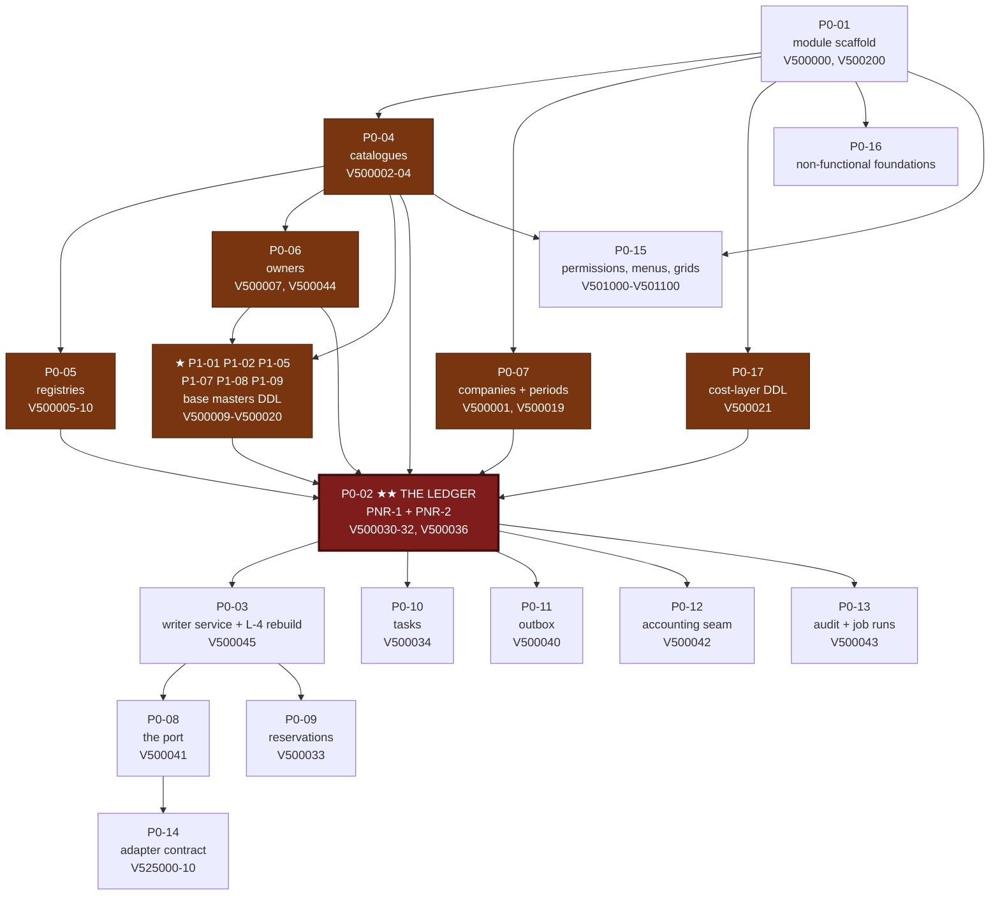
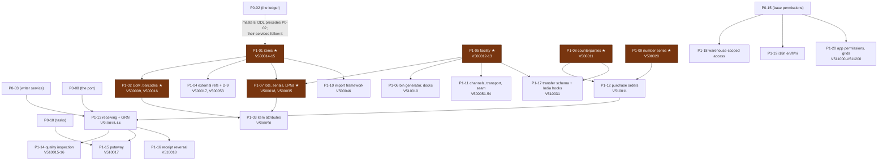
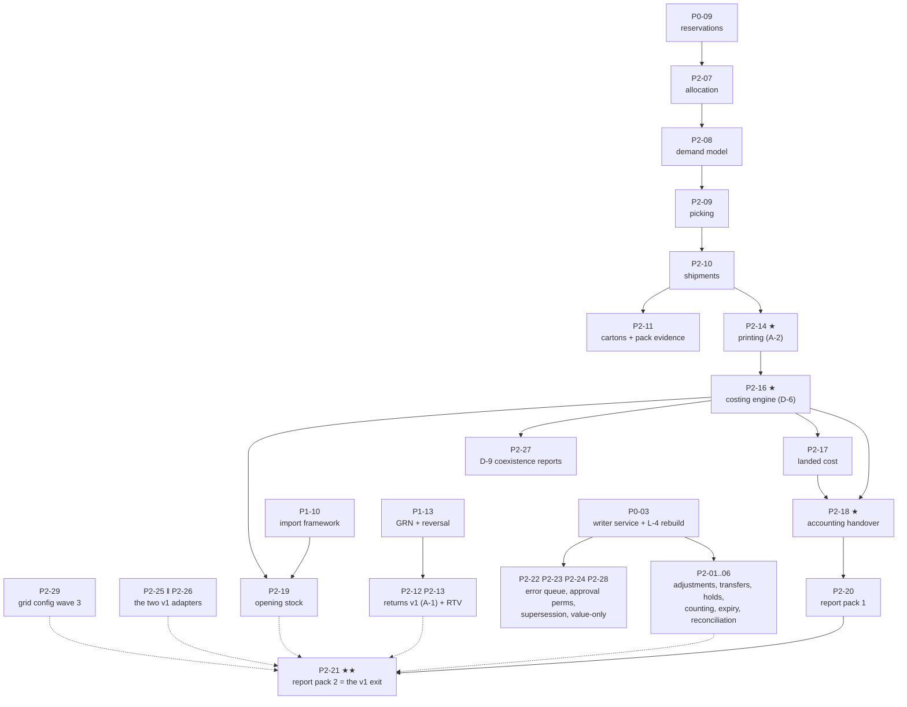
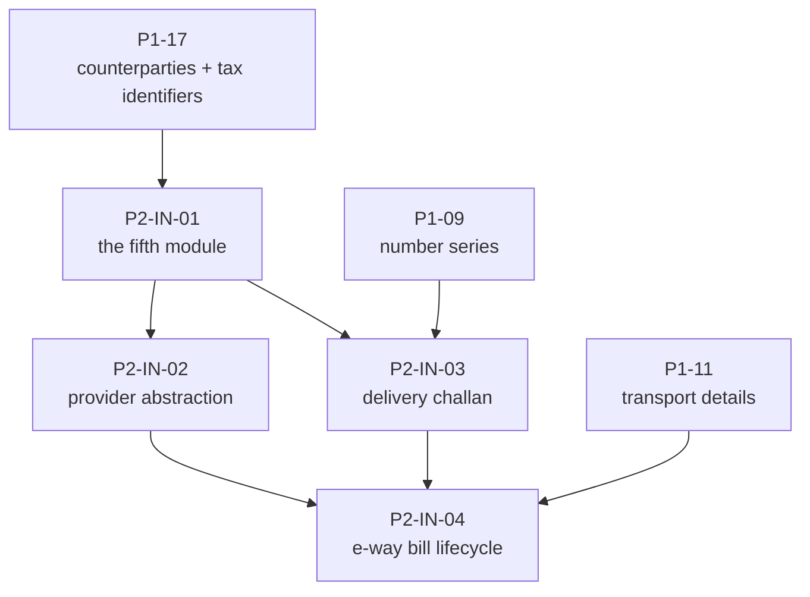
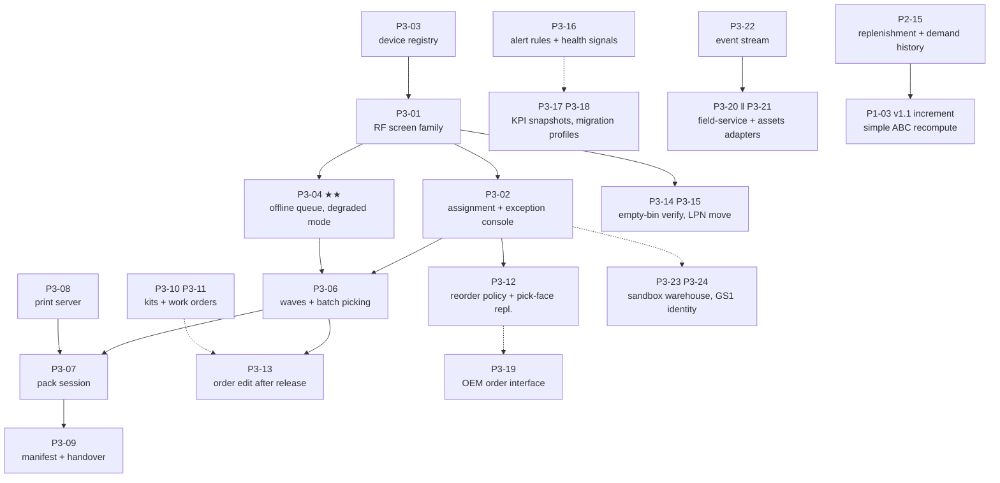
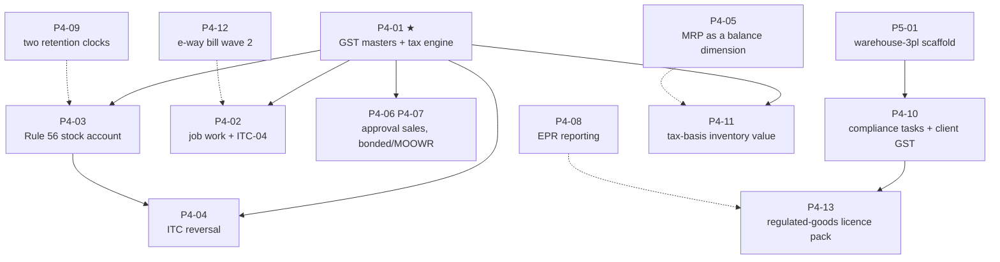
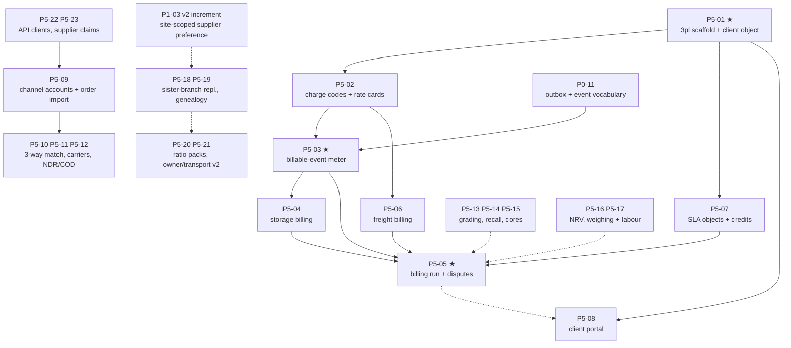
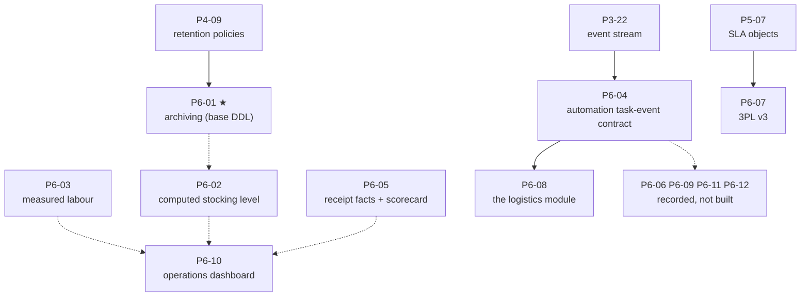

# Implementation plan — the Warehouse programme

<!-- check-design-set: issue-citations file #2 — `#2` and `#9` are ordinals in prose, not issue references — *Refusal #2*, *Adapter #2 (services)*, *ship-blocker #2*, *logistics needs #1, #2, #3, #5, #6, #10* — and at COMPETITOR-BENCHMARK.md:70/:146 `#9` is the markdown in-page anchor `[§9](#9--where-the-audits-disagree)`. In this repository `#2` and `#9` are in fact the two **pull requests** opened while the backlog was being filed, so no issue row can ever exist for either: see issues/CREATED.md -->

**143 tasks · 8 phases · 4 versions · 5 modules · 469 requirements · 317 tables · 239 screens.**
*(Round 4, 2026-09-10: six task files, ten requirements and two screens added by `GAP-REGISTER-R4.md`
§4.0. The table figure is `DATA-MODEL.md` §8.2's to regenerate.)*

> **What wins, and in what order.** [`DECISIONS.md`](DECISIONS.md) wins over this document on module
> names, bands, prefixes, id namespaces and the version ladder.
> [`DATA-MODEL.md`](DATA-MODEL.md) §7 wins on **migration numbers** — where §2 of this page and §7 of
> that one disagree, that one is right and this page is a defect. [`IRREVERSIBLE.md`](IRREVERSIBLE.md)
> §3 wins on **sequencing** — its four points of no return are constraints, not advice.
> [`WAREHOUSE-FUNCTIONAL-REQUIREMENTS.md`](WAREHOUSE-FUNCTIONAL-REQUIREMENTS.md) wins on **what a
> requirement says**; this page decides only **which task owns it**.
> [`reviews/R1-codebase-reality.md`](reviews/R1-codebase-reality.md) wins on any question about what
> the existing `classic` codebase does.
>
> Every count on this page was computed by a command, and the command is in §8. No count here was
> typed from memory.

Authored 2026-09-01.

---

## 0. The cut line, in one paragraph

A stock product is judged on whether a storekeeper can **receive it, put it away, find it, pick it,
ship it, count it, correct it and value it** — and on whether the number the finance controller
prints at month end can be **rebuilt from the movements that produced it**. Everything that makes
that loop work is in v1, including the three things the first authoring wave had cut and the
amendments in `DECISIONS.md` §5.1 put back: **returns** (`A-1`), **printing** (`A-2`) and **the India
movement documents** (`A-4`). Waving, labour management, slotting, 3PL billing and the marketplace
surface are not in v1, and none of them is a column — they are screens on a schema that v1 already
carries. What v1 must not get wrong is the **grain**: `owner_id`, `duty_status`, `stock_status_code`,
`lot_id`, `serial_id`, `lpn_id`, `company_id` and three separate timestamps are free today and
unbackfillable the moment `V500030` runs. That is the whole argument of this plan, and it is why
`P0-02` is one migration and not five.

---

## 1. The phases

Phases are the delivery unit; versions are the release unit (`DECISIONS.md` §5). Eight phases across
four versions. `P2-IN` is the v1 India wave added by `DECISIONS.md` `A-4`; its tasks are numbered
**`P2-IN-01`…** so that no reader can confuse them with a `P2-nn` task — the id still carries a phase
digit and a hyphen-separated pair, as `DECISIONS.md` §6 requires.

| Phase | Name | Version | Modules | Tasks | FRs owned | Migration blocks |
|---|---|---|---|---:|---:|---|
| **P0** | Ledger foundation | v1 | `warehouse-base`, `warehouse-adapter-example` | 17 | 117 | `V500000`–`V500021`, `V500030`–`V500036`, `V500040`–`V500046`, `V500200`, `V501000`–`V501049`, `V501100`, `V525000`–`V525010` |
| **P1** | Masters, identity, inbound | v1 | `warehouse-base` + `warehouse` | 21 | 107 | `V500009`–`V500020`, `V500050`–`V500055`, `V501050`–`V501069`, `V510010`–`V510018`, `V510031`, `V511000`–`V511059`, `V511200` |
| **P2** | Outbound, counting, valuation, returns, printing, reports | v1 | `warehouse` + `warehouse-base` + two adapters | 29 | 102 | `V500021`\*, `V501070`–`V501099`, `V510019`–`V510090`, `V511060`–`V511139`, `V520000`–`V520149`, `V521000`–`V521149` |
| **P2-IN** | The India movement documents | v1 | `warehouse-india` (wave 1) | 4 | 7 | `V540000`–`V540030`, `V541000`–`V541049` |
| **P3** | Execution & mobile | v1.1 | `warehouse` + base + mobile + two adapters | 24 | 43 | `V500056`, `V500060`–`V500063`, `V501101`–`V501109`, `V510012`, `V510100`–`V510108`, `V511140`–`V511179`, `V520013`, `V522000`–`V522149`, `V523000`–`V523149` |
| **P4** | India statutory & compliance | v2 | `warehouse-india` (wave 2) | 13 | 18 | `V530060`, `V540100`–`V540180`, `V540182`, `V541100`–`V541149` |
| **P5** | 3PL, channels & reverse logistics | v2 | `warehouse-3pl` + `warehouse` + adapters | 23 | 49 | `V500066`, `V510200`–`V510214`, `V510216`, `V520014`, `V521013`, `V530000`–`V530050`, `V531000`–`V531099` |
| **P6** | Optimisation, planning & the logistics seam | v3 | `warehouse-base`, `warehouse`, `warehouse-3pl`, `logistics` | 12 | 16 | `V500100`–`V500101`, `V510300`–`V510302`, `V530100`–`V530111` (**no `V524xxx`** — §11's withdrawal, `H-006`) |

\* `V500021` (`whb_valuation_policies`, `whb_cost_layers`, `whb_cost_layer_consumptions`) is owned by
**`P0-17`**, a P0 task, because `whb_stock_movement_lines.cost_layer_id` is a real FK and the table
must exist before `V500030`. The costing *engine* that fills it is `P2-16`. This is the one place in
the plan where a table's DDL and its behaviour sit two phases apart, and it is deliberate.

---

### 1.1 · P0 — Ledger foundation · **v1**

**Modules.** `warehouse-base` only, plus the CI-only `warehouse-adapter-example` fixture.

**What it delivers.** The immutable, double-sided, append-only stock ledger at full grain and
everything that must exist before its first row: the thirteen open catalogues, owners, companies,
stock periods, the position cache and its rebuild proof, the inbound movement port with its
idempotency contract, reservations as an open-item ledger, tasks, the outbox, the accounting-handover
seam, the ledger's own audit trail, base permissions and menus, and the adapter contract as a
build-time test rather than an intention.

**Migration blocks.** `V500000`–`V500021` (bootstrap, catalogues, owners, companies, periods,
cost-layer schema) · `V500030`–`V500036` (the ledger, positions, the period trigger, the base-UoM
trigger) · `V500040`–`V500046` (outbox, inbound messages, handovers, audit, owner grants, snapshots,
import batches) · `V500200` (the platform `CHECK` widening) · `V501000`–`V501049` + `V501100` (base
permissions, dependencies, menus, the first grid block, admin settings) ·
`V525000`–`V525010` (the reference adapter).

**Exit criterion.** On a **Mode F** install — `platform` + `warehouse-base` only, no application, no
vertical, no accounting — all of the following hold in one sitting:

1. An integration principal posts a two-line receipt through `POST /api/warehouse/movements` carrying
   its own `idempotency_key`; the lines sum to zero against a **virtual location**; the response
   carries the assigned gapless `sequence_no`.
2. The **same key with the same payload hash** returns `200` with the original movement and writes
   nothing; the same key with a **different** hash returns `409`.
3. `POST /movements/{id}/reverse` with a catalogue reason code produces the mirror, links it and
   refuses to reverse the reversal. No endpoint anywhere offers an edit or a delete.
4. `GET /stock/as-at?at=…` reproduces a past balance **from the ledger**, and a full rebuild of
   `whb_stock_positions` from `whb_stock_movements` reproduces every row **exactly**; the drift job
   reports zero findings.
5. A movement whose `effective_date` falls in a `CLOSED` period is refused, **including a reversal**;
   a `SOFT_CLOSED` period admits it only with the override permission and records the override.
6. `WarehouseBaseCouplingTest` passes and CI builds `warehouse-adapter-example` green: no forbidden
   import, no FK out of `warehouse-base`, no `CHECK (x IN (…))` on any of the thirteen catalogues.

Scenario coverage: `SCENARIO-CATALOGUE.md` §3.1 (`WH-SC-001`…`WH-SC-043`) plus `WH-SC-044`.

**What P0 deliberately does not do.** No receiving screen, no picking, no counting, no valuation
engine, no report beyond the movement register and the position enquiry, no India, no mobile screen.
Fifteen screens ship (`WS-001`…`WS-004`, `WS-006`, `WS-008`, `WS-009`, `WS-019`, `WS-020`, `WS-040`,
`WS-041`, `WS-042`, `WS-045`, `WS-046`, `WS-059`) and they exist to make the ledger inspectable, not
to run a warehouse.

---

### 1.2 · P1 — Masters, identity, inbound · **v1**

**Modules.** `warehouse-base` (masters) + `warehouse` (inbound documents).

**What it delivers.** One item master with its variant schema, UoM and packaging and the barcode
registry, the item's commercial and compliance attributes, supersession chains, the facility model
with its virtual-location seed and the bin generator, lots and serials and LPNs, counterparties,
gapless document numbering, the import framework, and the whole inbound chain: purchase order →
receiving session → GRN → QC → putaway, with reversal and the layered-truth model.

**Migration blocks.** `V500009`–`V500020` (UoM, counterparties, warehouses, locations, item
categories and variants, items, identifiers, external refs, lots/serials/LPNs, number series) ·
`V500035` (transformations) · `V500050`–`V500054` (item×site settings, channels, transport details,
the D-9 mitigation tables, the activity-history view) · `V501050`–`V501069` (base grids, wave 2) ·
`V510010`–`V510018` (docks, POs, receiving sessions, GRNs, inspection, putaway, reversal) ·
`V510031` (transfer orders — schema only, because it carries the India hooks) ·
`V511000`–`V511059` + `V511200` (app permissions, menus, grids wave 1, admin settings).

> **★ Seven P1 tasks are P0-blocking.** `IRREVERSIBLE.md` §3.4 is explicit: six master tables carry
> `NOT NULL` foreign keys from `whb_stock_movement_lines`, so *"`P0-02` is therefore not the first
> warehouse migration; it is roughly the tenth."* `P1-01`, `P1-02`, `P1-05`, `P1-07`, `P1-08` and
> `P1-09` — plus `P0-17` — must have their **migrations written and merged before `P0-02`'s**, even
> though their screens and services are P1 work. §3 lists them again as a dependency edge. Anyone who
> plans `P0-02` as migration one will meet this at the first `REFERENCES` clause and will be tempted
> to make the foreign keys nullable. Do not.

**Exit criterion.** On a **Mode A** install (`platform` + `warehouse-base` + `warehouse`), the
scenarios `WH-SC-045`…`WH-SC-052` run in order: create a warehouse under a branch with a structured
address and a timezone; generate 1,152 bins from a format mask with the count and the first and last
codes previewed **before** anything is written; import an item master where the dry run reports
per-row, per-cell errors and `validate` **persists nothing** (asserted by row count); post opening
stock as `OPENING_BALANCE` movements from the opening virtual location with unit costs, never as a
position `UPDATE`; produce the closing-value tie-out certificate; receive against a purchase document
with a **gapless** GRN number issued from the locked counter row; and put away with a suggested
location, an accepted override and the override reason captured.

**What P1 deliberately does not do.** No allocation, no picking, no shipping, no counting, no
valuation, no printing, no returns, no reports beyond the masters' own grids. The ASN is **not** in
P1 — it is `P3-05`, because the ASN's job is to drive dock appointments, pre-allocation and
cross-dock, none of which exists yet. Blind receipt (`FR-128`) is what covers the no-PO case in v1.

---

### 1.3 · P2 — Outbound, counting, valuation, returns, printing, reports · **v1**

**Modules.** `warehouse` (the bulk) + `warehouse-base` (costing, snapshots, the interface queue) +
`warehouse-adapter-dealer` + `warehouse-adapter-services`.

**What it delivers.** The other half of the daily loop and the numbers that prove it: adjustments
with value-based approval thresholds, three-leg transfers through a per-transfer in-transit location,
holds as records, cycle and physical counting with a frozen book quantity, expiry as a state,
allocation and discrete picking to a real staging location, ship confirm as the single inventory-relief
event, cartons and pack evidence, basic returns and return-to-vendor, **templated document and label
printing including a ZPL path**, replenishment suggestions and demand history, the costing engine
(weighted average + FIFO on `whb_cost_layers`), landed cost and revaluation, the accounting handover
and the stock-to-GL reconciliation, opening stock and cut-over, the report pack, and **both v1
adapters**, because one adapter proves nothing about genericity.

**Migration blocks.** `V510019`–`V510020` (reconciliation cases, supplier returns) ·
`V510030`–`V510035` (adjustments, holds, counts, insufficient-stock and blocked-move logs,
reconciliation exceptions) · `V510040`–`V510044` (demand orders, pick tasks, cartons, shipments,
carriers) · `V510050` (returns) · `V510060` (printing) · `V510070` (replenishment) · `V510080`
(landed cost, revaluation) · `V510090` (opening stock, cut-over) · `V501070`–`V501099` and
`V511060`–`V511139` (grids wave 3) · `V520000`–`V520149` (dealer adapter) ·
`V521000`–`V521149` (services adapter).

**Exit criterion.** `DECISIONS.md` §5's v1 sentence, decomposed by `SCENARIO-CATALOGUE.md` §3.2 into
**nineteen scenarios `WH-SC-044`…`WH-SC-062`, run in order, on one Mode-A install, in one sitting**.
The three that decide it are the last three:

- **`WH-SC-060`** — the stock ledger, the position report and the valuation report **reconcile to
  each other, to the unit and to the paisa**: the movement register's `opening + in − out` equals
  the position report's closing, and the valuation report's closing value equals the sum of the cost
  layers' remaining quantity × cost.
- **`WH-SC-061`** — a full rebuild from `whb_stock_movements` reproduces the position report
  **exactly, row for row**.
- **`WH-SC-062`** — the valuation is produced **with no accounting module installed**, because
  warehouse holds the grain (`D-6`).

Plus the port proof: `warehouse-adapter-dealer` and `warehouse-adapter-services` both post through
`POST /api/warehouse/movements` with **zero commits to `warehouse-base`** (`D-11`, `FR-352`).

**What P2 deliberately does not do.** No waves (v1 ships the **Release** action on the demand header
and says so — `FR-187`). Discrete picking only; batch, cluster and zone picking are `P3-06`. No pack
session as an operator flow — cartons exist, the flow is `P3-07`. No print server, printer registry
or routing rules — the renderer and the job log are v1, the server is `P3-08` (`A-2` splits it there
deliberately). No carrier integration beyond the carrier, service and account masters. No grading, no
NDR, no COD, no RTO workflow — only the RTO **columns** (`FR-205`).

---

### 1.4 · P2-IN — The India movement documents · **v1**

**Module.** `warehouse-india`, wave 1 only.

**What it delivers.** The answer to one question: **can the truck leave?** The module scaffold, GSTIN
profiles and compliance registrations; the transplanted compliance-provider stack (providers,
environments, credential specs, encrypted credentials, auth sessions, documents, API logs); the
**delivery challan** as a numbered document on a per-branch series covering every non-supply movement
kind; and the **e-way bill** lifecycle — Part A generated by the consignor, Part B fillable later and
required before the vehicle moves — with the gate pass conditional on it.

**Migration blocks.** `V540000` (bootstrap) · `V540010` (GSTIN profiles, compliance registrations) ·
`V540011`–`V540012` (the provider stack) · `V540020` (challans) · `V540030` (e-way bills) ·
`V541000`–`V541049` (permissions, menus, grids, i18n).

**The hooks are not here.** `FR-305` (cross-GSTIN transfer as a deemed supply), `FR-306` (the
transfer's valuation method and price), `FR-308` (polymorphic transport details) and `FR-312`'s clock
columns land in **P1** (`P1-11`, `P1-17`) as columns on tables that already exist, because a challan
row written without its clock can never acquire one (`INDIA-LOCALISATION-PACK.md` §1.4). P2-IN
consumes them; it does not create them.

**Exit criterion.** On a **Mode D** install, a branch transfer between two GSTINs derives
`is_taxable_supply` **at creation and freezes it**, issues a numbered delivery challan from the
sending branch's own series, generates an e-way bill Part A from the compliance provider, accepts
Part B before the vehicle number is recorded, and the gate pass is **refused** where an e-way bill is
legally required and absent — and issues freely where it is not (`FR-195`). And the negative test:
none of that code is reachable, and no `whin_` table is referenced, in a Mode-A install.

**What P2-IN deliberately does not do.** No statutory register, no filing, no tax computation
(`OD-9`: warehouse never computes tax — it captures the facts and hands them over), no MRP dimension,
no bonded warehousing, no ITC-04. All of that is P4.

> **Two divergences between the India documents, carried not resolved.** (a)
> `INDIA-LOCALISATION-PACK.md` §1.2 counts **14** wave-1 tables and includes three seed masters —
> `whin_gst_state_codes`, `whin_hsn_codes`, `whin_uqc_codes`; `DATA-MODEL.md` §7.6 puts the
> equivalents (`whin_gst_state_codes`, `whin_hsn_tax_master`, `whin_sac_master`) at **`WIN-12`,
> wave 2**, leaving 12 tables in wave 1. (b) The two documents name the registration table differently
> (`whin_gst_registrations` vs `whin_gstin_profiles` + `whin_compliance_registrations`). **This plan
> follows `DATA-MODEL.md`**, which is the migration authority, and files both divergences for the
> India pack to reconcile before `P2-IN-01` is written.

---

### 1.5 · P3 — Execution & mobile · **v1.1**

**Modules.** `warehouse` + `warehouse-base` + `mobile` + `warehouse-adapter-field-service` +
`warehouse-adapter-assets`.

**What it delivers.** The warehouse floor. The RF screen family with its own interaction contract —
one active input, scan advances, no free text where a scan exists, no mouse (`FR-219`) — and its nine
screens; task assignment pull **and** push with qualifications and a supervisor exception console;
the device registry with device-bound sessions and shift handover; offline read-cached lists and
queued writes with a per-scan idempotency key; the ASN and live dock appointments with seals captured
at load and unload; waves and batch picking; the pack session as an operator flow; the print server,
printer registry and routing rules; manifests, handovers and pickup requests; kits and work orders and
VAS; item×location settings and pick-face replenishment; order-edit rules after release; LPN move
expansion and GS1 element-string parsing; alert rules and install health signals; the migration
workbench; and the field-service and assets adapters.

**Migration blocks.** `V500060`–`V500063` (kits, item×location, devices, alerts) · `V501101`–`V501109`
(base grids, wave 4) · `V510012` (ASN) · `V510100`–`V510108` (waves, pack sessions, work orders,
printers, manifests, order-edit rules, KPI snapshots, migration mappings, replenishment tasks) ·
`V511140`–`V511179` (app grids, wave 4) · `V520013` (dealer price files) ·
`V522000`–`V522149` and `V523000`–`V523149` (the two v1.1 adapters).

**Exit criterion.** `DECISIONS.md` §5, verbatim: *an operator completes a full
receive→putaway→pick→pack→ship cycle **entirely on a handheld**, and a wave of 200 order lines
releases, picks and ships with task interleaving.* Two additions this plan makes testable:
scan-to-response is measured at the handheld and is **under 300 ms** (`FR-424`), and task claiming
uses `FOR UPDATE SKIP LOCKED` — which has **zero precedent in this codebase** and is therefore built
and load-tested, not assumed (`FR-425`).

**What P3 deliberately does not do.** No voice picking, no automation control, no engineered labour
standards — labour *timing* is P5 and *standards* are refused until we have a year of our own data
(`FR-228`). No cluster or zone picking (P5). No India, no 3PL, no channels.

---

### 1.6 · P4 — India statutory & compliance · **v2**

**Module.** `warehouse-india`, wave 2, plus one table in the 3PL band.

**What it delivers.** Everything that reads history and files it: the relational tax engine with its
known defects fixed as blockers rather than deferred; job work and ITC-04; the **Rule 56 statutory
stock account** per registration and per period in the mandated categories; ITC reversal reaching back
to the receipt that brought the lot in, and scrap sale as a supply; MRP as a balance dimension with
MRP-inclusive back-calculation; goods on approval with the deemed-supply clock; bonded and MOOWR
warehousing with licences, bonds, utilisation and ex-bond clearance; EPR reporting; the two retention
clocks; the compliance task and rules engine; the tax-basis inventory value; and the e-way bill wave-2
lifecycle (vehicle updates, extensions, cancellations, consolidated bills).

**Migration blocks.** `V540100`–`V540101` (e-way wave 2) · `V540110`–`V540111` (tax masters and the
rule engine) · `V540120`–`V540180` (job work, stock account, ITC reversal, bonded, approval, EPR,
retention, compliance rules) · `V541100`–`V541149` (config) · `V530060`
(`wh3_client_gst_registrations` — in the **3PL** band per `DATA-MODEL.md` `W3-13`, owned by a **P4**
task because `FR-301`'s phase is P4; §2 flags it).

**Exit criterion.** `DECISIONS.md` §5's v2 half: *a customer files ITC-04 and the Rule 56 stock
account from warehouse data* — and, added here so the criterion is falsifiable, **reproduces the
identical figures a quarter later from the same closed period**, because a statutory register that
moves after filing is worse than no register.

**What P4 deliberately does not do.** It does not compute tax (`OD-9`), and it does not issue an
invoice or a credit note — those are accounting's. It does not build the six conditional `whin_`
tables that a warehouse-side tax engine would have needed.

---

### 1.7 · P5 — 3PL, channels & reverse logistics · **v2**

**Modules.** `warehouse-3pl` (new) + `warehouse` + `warehouse-adapter-dealer` +
`warehouse-adapter-services`.

**What it delivers.** Three products that share one base. **3PL**: clients as objects with contracts
and onboarding templates, charge codes, versioned effective-dated rate cards, the append-only
reversible billable-event meter, storage billing in four methods with the minimum-monthly true-up as a
visible metered event, billing runs with a frozen approved state, accessorials, disputes, the AR
handover envelope, freight billing modes, SLA definitions and measurements and breaches, the client
portal as a permission surface, and row-level owner segregation with a negative test per endpoint.
**Channels and carriers**: channel accounts and idempotent order import, publish rules as the oversell
control, tracking events normalised and raw, rate shopping with the quote persisted, pincode
serviceability, AWB pools claimed transactionally, NDR with a response clock, COD remittance
reconciliation, RTO as an inbound stock stream. **Reverse logistics**: grading at receipt,
obsolescence returns, the marketplace claim window, recall, cores, warranty scrap-and-hold, NRV
write-down as a register, the COGS recognition policy.

**Migration blocks.** `V510200`–`V510214` (cross-dock, three-way match, calendars, tracking, rate
quotes, AWB, NDR, COD, channels, tracking links, grading, recalls, NRV, weighing, labour) ·
`V520014` (core exchanges) · `V521013` (warranty holds) · `V530000`–`V530050` (the whole 3PL module) ·
`V531000`–`V531099` (config).

**Exit criterion.** `DECISIONS.md` §5's other v2 half — *a 3PL bills a client for a month of storage
and handling from metered events* — with three additions that make it a real test: the invoice
arithmetic is **reproducible from the meter** (re-rating the same period against the same card
version returns the same total); a client user logged into the portal **cannot see another client's
stock through any endpoint**, proved by a negative test per endpoint (`FR-300`); and a channel order
imported twice on the same `(channel account, external order id)` produces **one** demand order.

**What P5 deliberately does not do.** No rate escalation, no SLA penalty posting, no client
profitability — all P6, and each is deferred with a stated reason rather than silently. No
consumer-facing returns portal, ever (a named refusal). No retail-compliance EDI, ever.

---

### 1.8 · P6 — Optimisation, planning & the logistics seam · **v3**

**Modules.** `warehouse-base`, `warehouse`, `warehouse-3pl`, and the new **`logistics`** module in
the band reserved for it since v1.

**What it delivers.** Ledger archiving as a transaction that writes an `OPENING_BALANCE` movement at
the cut-off before it moves a row, so the rebuild still reproduces; the computed best stocking level
with phase-in and phase-out; labour standards measured from a year of our own data; the automation and
AS/RS event contract; supplier scorecard evidence emission; the `party-base` extraction trigger;
rate escalation, SLA penalty events and client profitability; the operations dashboard on the
platform widget framework; the documented accessories absorption path and the dealer vehicle-inventory
test; and **the `logistics` module itself**.

**Migration blocks.** `V500100`–`V500101` (archiving, the automation event contract) ·
`V510300`–`V510302` (stocking level, labour standards, dashboard) · `V530100`, `V530110`–`V530111`
(3PL v3). **`P6-08` writes no migration** — the `V524000`–`V524099` claim this line used to carry was
withdrawn in §11 and is not re-stated here (`H-006`); `V524000`–`V524999` stays a reservation the
`logistics` design set numbers, not this one.

**Exit criterion.** `DECISIONS.md` §5's v3 sentence, made mechanical: the `logistics` module ships
trips, ePOD and freight settlement, moves stock **only** through `POST /api/warehouse/movements`, and
`git log --oneline -- warehouse-base/` shows **zero** commits attributable to it. Plus
`FR-336`'s two deletion tests: delete `logistics` and warehouse still works; delete `warehouse` and
`logistics` degrades to a stated, documented mode rather than failing to start.

**What P6 deliberately does not do.** Nothing in `COMPETITOR-BENCHMARK.md` §7's refusal list — voice
picking as a built capability, AS/RS control, multi-level BOM with routings, demand forecasting inside
warehouse, a consumer returns portal, retail-compliance EDI, UDI healthcare, international trade
compliance. Each has a stated re-entry path and none is a gap.

---

## 2. The task list

**143 tasks.** The count fell out of the decomposition; it was not targeted. Round 4 filed six —
`P3-25` at v1.1 and `P5-24`…`P5-28` at v2 — under `D-14` item 7, and on 2026-09-10 folded each into its
most similar existing task under the user rule *no duplicate tasks* (`GAP-REGISTER-R4.md` §4.6). A
folded item keeps its own version and is marked in its host as a *v1.1* or *v2 increment*. Sizing rule: one task is
one coherent unit of work for one engineer, or one `/create-entity` run plus its screens — not a whole
phase, not a single column.

**How to read a row.**

| Column | Meaning |
|---|---|
| **Task** | `P0-01`…`P6-12`. `P2-IN-nn` for the v1 India wave. ★ marks a task whose **migration** must land before `P0-02`'s, per `IRREVERSIBLE.md` §3.4 |
| **Mod** | `base` · `app` · `ad-*` (adapter) · `3pl` · `india` · `mobile` · `platform` |
| **Migrations** | Pre-allocated, contiguous, exactly one owner per number, inside the module's band (`D-2`). `—` means the task writes no migration; that is not a defect, it is the DDL sitting in another task or the work being service/frontend/registry only |
| **Screens** | `WS-nnn` from [`BUILD-SPEC-SCREENS.md`](BUILD-SPEC-SCREENS.md) §1 |
| **Closes** | The FRs this task owns. **Every FR is owned by exactly one task** (§8) |
| **Dep** | Tasks that must complete first |

**The ownership rule for a multi-phase FR.** 51 of the 459 requirements carry two or three phases
(`FR-104` is `P0·P4`, `FR-186` is `P2·P3·P5`). Ownership goes to the task that **first makes the
requirement true in the product** — usually the earliest phase, because that is where the
irreversible half sits. The later task is named in the owning task's notes so the obligation is not
lost. §8.2 lists all 51 with both ends.

---

### 2.1 · P0 — Ledger foundation · 17 tasks · v1 · `warehouse-base`

| Task | Title | Mod | Migrations | Screens | Closes | Dep |
|---|---|---|---|---|---|---|
| **P0-01** | Five-module scaffold and the 16-file registration runbook: Maven profiles, both Dockerfiles and the assertion block, compose, `start.sh`, `ModuleImportSelector`, `tsconfig`, SafeTranslation, `jest.config.js`, CI. Plus the platform `CHECK` widening (`widget_definitions.chk_module`, `global_settings`) by **reading and unioning** the live constraint, never hardcoding a list | base+platform | `V500000` `V500200` | — | `FR-371…FR-374` `FR-377…FR-379` `FR-383` `FR-434` `FR-435` `FR-440` | — |
| **P0-02** | ★★ **The ledger.** `whb_stock_movements` + `whb_stock_movement_lines` + `whb_movement_line_attributes`, `PARTITION BY RANGE` with the monthly partition job, **and `I-1`,`I-2`,`I-3`,`I-4`,`I-8`,`I-11`,`I-13`,`I-14`,`I-15`,`I-16`,`I-17` in the same file**; `whb_stock_positions` with `I-5`/`I-6`; the period trigger; the base-UoM immutability trigger. **PNR-1 and PNR-2 collapsed into one migration**; `I-22` in `V500030` and the `REGISTERED`-history guard `I-23` in `V500037` (`RG-001`) | base | `V500030` `V500031` `V500032` `V500036` `V500037` | `WS-040` `WS-041` `WS-042` | `FR-001` `FR-002` `FR-004…FR-011` `FR-018` `FR-021` `FR-022` `FR-024…FR-027` `FR-030` `FR-031` `FR-042` `FR-104` `FR-107` `FR-110` `FR-318` `FR-423` `FR-439` | P0-04 P0-05 P0-06 P0-07 P0-17 P1-01 P1-02 P1-05 P1-07 P1-09 |
| **P0-03** | The **single writer service** — the only path that touches the ledger and the position cache, asserted by an architecture test; availability computed never stored; negative-available refusal and the negative-on-hand policy; the concurrency discipline (advisory lock + `@Version` + `CHECK` + stated lock ordering); the as-at query; the stable error-code vocabulary; the nightly rebuild that proves `L-4` and the drift-finding table | base | `V500045` | `WS-043` `WS-044` | `FR-012…FR-014` `FR-016` `FR-029` `FR-039` `FR-040` `FR-175` `FR-436` `FR-437` | P0-02 |
| **P0-04** | The open-catalogue framework and the four the ledger cannot exist without: source systems and document types (incl. the **reserved, unclaimable `ACCESSORIES` row**), movement types with their behaviour flags and the four value-only types, reason codes with their eleven contexts and their **ITC treatment and statutory category**. Document display resolvers as a bean-collection registry with a base fallback. **No `CHECK`, no Java enum, no TypeScript union**. *v2 increment* (from `P5-24`): `whb_reason_code_tax_treatments` (`RG-020`) | base | `V500002` `V500003` `V500004` `V500072` | `WS-001` `WS-002` `WS-003` `WS-006` | `FR-003` `FR-019` `FR-046` `FR-315` `FR-357` `FR-367` `FR-375` `FR-376` `FR-380` | P0-01 |
| **P0-05** | The remaining ledger-facing registries: stock statuses with their nine behaviour flags, condition codes, location types, item types, task types, dispositions (incl. `return_type`), attribute keys. Status change as a **balanced two-line movement at the same location** | base | `V500005` `V500006` `V500008` `V500010` | `WS-004` `WS-008` `WS-010` `WS-012` `WS-013` `WS-014` | `FR-102` `FR-103` `FR-270` `FR-274` `FR-448` | P0-04 |
| **P0-06** | **Owners.** `whb_owner_types` + `whb_owners` with the house owner seeded; `owner_id` on every line, position, lot, serial, LPN, reservation and cost layer; two owners in one movement under `balance_rule`; `is_financial` + `cost_basis` and the never-value-non-own rule; consignment/VMI/customer-owned/job-work as one model in three configurations; owner grants and the **single server-side owner resolver** with a contract test. *v2 increment* (from `P5-24`): `whb_owner_companies` (`RG-013`) | base | `V500007` `V500044` `V500073` | `WS-009` `WS-019` `WS-020` | `FR-108` `FR-109` `FR-111…FR-114` `FR-406` | P0-04 |
| **P0-07** | Companies and the company axis; stock periods, soft/hard close, the override with its recorded reason, and the **synchronisation with accounting periods** so the two ledgers cannot be closed at different dates | base | `V500001` `V500019` | `WS-015` `WS-045` `WS-046` | `FR-020` `FR-251` | P0-01 |
| **P0-08** | **The movement port.** `POST /movements`, `/batch` (per-movement transaction and result array), `/{id}/reverse`, `/simulate`, the lineage `GET`; the exact idempotency conflict semantics; the envelope and what it must **not** carry; `@PreAuthorize` on every method plus the per-source-system posting check; persist-before-process inbound messages; the v1 offline hooks (client transaction id, device `occurred_at`) shipped even though v1 is online-only | base | `V500041` | `WS-053` `WS-054` `WS-055` | `FR-017` `FR-032…FR-037` `FR-041` `FR-043` `FR-044` `FR-047` | P0-03 |
| **P0-09** | **Reservations as an open-item ledger**, never a counter: the holder quad, `expires_at`, `DELETE /reservations?holder=…`, availability as a computed value; the allocation-strategy and strategy-rule tables | base | `V500033` | `WS-047` | `FR-166…FR-168` | P0-03 |
| **P0-10** | `whb_tasks` — the execution object, in v1 even though v1 has no RF gun: one task per putaway/pick/count line, with `assigned_at`/`started_at`/`completed_at`/paused seconds/`device_id`/travel distance, priority, zone and required resource type **from v1**, because a duration cannot be backfilled | base | `V500034` | `WS-059` | `FR-212` `FR-213` `FR-215` | P0-02 |
| **P0-11** | **The outbox** — no precedent anywhere in this repository. The table, the gapless monotonic cursor, the fixed v1 event vocabulary at **billable granularity**, subscriptions as a v1 table, the publisher job with backoff, the dead-letter grid, replay-from-cursor. Base does not know its consumers. Plus `FR-336`'s two deletion tests as build-time assertions. *v2 increment* (from `P5-24`): `whb_outbox_subscription_owners` (`RG-018`) | base | `V500040` `V500074` | `WS-056` `WS-057` `WS-058` | `FR-330…FR-333` `FR-336` | P0-02 |
| **P0-12** | The accounting seam: `whb_accounting_handovers`, `whb_gl_posting_rules`, `handover_id` + `posting_status` on the movement, the rejected-handover queue, and the **architecture test that fails the build** if anything under `ai.warehouse*` names an `acc_*` table or an `ai.accounting*` type | base | `V500042` | `WS-051` `WS-052` | `FR-230…FR-232` | P0-02 |
| **P0-13** | The ledger **is** the audit trail: `whb_audit_events` + change rows with the append-only hash chain, `on_behalf_of_actor_id` from the first migration, `whb_job_runs`; and the **dated-obligation register** — every threshold column in the product is listed with the scheduled job that reads it, and a column with no job is a merge-blocking defect | base | `V500043` | `WS-063` `WS-064` | `FR-165` `FR-409` `FR-427` | P0-02 |
| **P0-14** | The adapter contract as artefacts: what an adapter MAY and MUST NOT do; the **sibling** package rule; `warehouse-adapter-example` shipped and built by CI with zero screens; `WarehouseBaseCouplingTest`'s six assertions; per-module `ArchitectureInvariantsTest`; adapters register reference data by idempotent migration in their own sub-band; the ratchet stated honestly as *zero commits to `warehouse-base`*, never to `platform` | base+ad-example | `V525000` `V525010` | — | `FR-349…FR-351` `FR-353…FR-356` | P0-01 P0-08 |
| **P0-15** | Base permissions for every resource plus the verb permissions (`warehouse:movements:post`/`:reverse`/`:simulate`, `:periods:close`/`:reopen`/`:override`, `:reservations:release`); `permission_dependencies` **inserted, never created**; AUDITOR gets `:view` and never `:export`; the **reserved `logistics:*` namespace and its dependency rows**; menus guarded `WHERE NOT EXISTS`; the first grid block with **both** `default_columns` and `default_filters`; admin settings; the three-mode view predicate | base | `V501000` `V501001` `V501002` `V501010` `V501020`–`V501049` `V501100` | — | `FR-346` `FR-401…FR-404` `FR-407` `FR-410` | P0-01 P0-04 |
| **P0-16** | Non-functional foundations, written down so they can be tested against: the performance targets (1M ledger rows/day at peak); the partition and archive strategy stated **at design time**; the mobile-decision-per-screen contract where silence is a defect; offline behaviour decided per screen; and the **platform restore task filed** with an owner, because a statutory ledger with no restore is not sellable; and the v1 mobile vocabulary rule — a registry-backed field is never a `z.enum` (`FR-382`, moved from `P3-04` by `RL-009`) | base+platform | — | — | `FR-218` `FR-221` `FR-382` `FR-422` `FR-429` | P0-01 |
| **P0-17** | **Cost-layer schema, DDL only.** `whb_valuation_policies`, `whb_cost_layers`, `whb_cost_layer_consumptions`. **Closes no FR** — it exists solely because `whb_stock_movement_lines.cost_layer_id` is a real foreign key and `DATA-MODEL.md` `WHB-21` requires `V500021` to precede `V500030`. Its behaviour and its FRs are `P2-16` | base | `V500021` | — | — | P0-01 |

---

### 2.2 · P1 — Masters, identity, inbound · 21 tasks · v1 · `warehouse-base` + `warehouse`

| Task | Title | Mod | Migrations | Screens | Closes | Dep |
|---|---|---|---|---|---|---|
| **P1-01** | ★ **The item master.** One `whb_items`, `uk(owner_id, sku)` (**PNR-4**) plus a globally unique `item_code`; `item_type` as a registry row; four independent status facts plus a lifecycle status; deactivation blocked while on-hand is non-zero anywhere; **no cost column**; item categories; typed attribute definitions and values; **no user-defined JSONB**; and the **style/variant schema** — parent style, ordered variant axes and values — as v1 schema with v2 screens. *v2 increment* (from `P5-24`): `whb_item_uom_defaults`, `whb_item_tax_classifications` (`RG-010`, `RG-020`) | base | `V500014` `V500015` `V500075` | `WS-022` `WS-023` | `FR-048…FR-052` `FR-060` `FR-076` `FR-443` `FR-444` | P0-04 P0-06 |
| **P1-02** | ★ UoM and identity: base stocking UoM **immutable once a ledger row exists** (database trigger, not the service); conversion on the **item**, not the UoM master; `unece_rec20_code` + `gst_uqc_code` on every UoM; barcodes resolving to a **packaging level**, not to an item; supplier-specific packaging with a deterministic resolution order; one alias table for owner SKU / GTIN / UPC / marketplace / OEM / supplier / customer / legacy codes; `sscc` and `gln`; the **one scan-resolution service**. *v2 increment* (from `P5-24`): `whb_uom_scheme_codes` (`RG-020`) | base | `V500009` `V500016` `V500076` | `WS-007` `WS-024` `WS-025` `WS-026` `WS-034` `WS-071` | `FR-054…FR-059` `FR-062` `FR-064` `FR-078` | P1-01 |
| **P1-03** | The item's commercial and compliance block: reorder point / safety stock / min / max / reorder quantity / lead time on **item × site**; catch weight as a second independent quantity; `tax_classification_code` as a string never an FK, snapshotted onto documents; the hazmat block; temperature/storage class; the three shelf-life columns; ABC / velocity / count-frequency classes as v1 columns — *v1.1 increment* (from `P3-25`): the simple ABC recompute, a monthly job per site over twelve months of issue value with two Pareto cut-offs on the site and the previous class kept one cycle (`RK-003`), velocity and XYZ staying in `P6-02`; supersession chains with cycle detection; MRP / net content / country of origin / pack month-year **on the lot** with item defaults; the statutory unit-quantity code; every statutory date as a **`DATE`, not a timestamp**. *v2 increment* (from `P5-24`): the site-scoped preferred supplier (`RG-011`) | base+app | `V500050` `V500069` `V500077` | `WS-027` `WS-029` `WS-030` `WS-016` `WS-093` | `FR-053` `FR-065…FR-071` `FR-252` `FR-319` `FR-320` `FR-327` `FR-463` | P1-01 P1-07 (v1.1 increment: P2-15 P2-16 P0-13) |
| **P1-04** | `whb_item_external_refs` and `whb_item_documents` (`ON DELETE NO ACTION` — a GRN photo that vanishes with the file is not evidence); and **`D-9`'s two mandatory mitigations**: an `ACCESSORIES` cross-map row for every dual-stocked SKU, and the category-stocking-ownership table with its external-stock snapshot | base | `V500017` `V500053` | `WS-031` `WS-066` `WS-067` | `FR-061` `FR-077` `FR-368` | P1-01 |
| **P1-05** | ★ **The facility model.** A warehouse is **linked to branches** through `whb_warehouse_branches` with exactly one `REGISTERED` link at every instant, which supplies its GSTIN; *Change registration* is maker–checker and refused while stock is held (`D-14`, `RG-001`, `OD-19`); structured address, `gln`, `timezone`; **`is_physical`** permitting a warehouse that maps to no building; the self-referencing location hierarchy with `location_level`; `location_type` as a registry with behaviour flags; **the virtual-location seed per install and per site**; transit locations **per reference**, never one global bucket; capacity and constraint columns; `commingle_policy` + `dedicated_owner_id`; custody through `whb_location_user_assignments` (`RG-004`) with `MOBILE`/`VEHICLE` types (van stock is the same object as a delivery vehicle's load); location external refs; location status and blocking; occupancy derived at read time. *v2 increment* (from `P5-24`): `whb_warehouse_companies` and `whb_location_owner_dedications` (`RG-012`, `RG-014`), and `FR-468`, whose other parts are v2 increments of their parent-table owners | base | `V500012` `V500013` `V500070` | `WS-005` `WS-016` `WS-017` | `FR-079…FR-088` `FR-090` `FR-091` `FR-093` `FR-460` `FR-468` | P0-04 P0-06 |
| **P1-06** | The **location generator** — zone/aisle/rack/level/position ranges, a format mask, default capacities, and a preview showing the count and the first and last codes **before** anything is written; dock doors and staging lanes as locations, with the dock-appointment schema landing in v1 | base+app | `V510010` | `WS-018` `WS-085` | `FR-089` `FR-092` | P1-05 |
| **P1-07** | ★ Lots, serials and LPNs as **entities**, not `VARCHAR`s: `uk(owner, item, lot_code)` with codes normalised on write; best-before and use-by as **separate columns with different despatch rules**; serials `uk(owner, item, serial_number)` — **never globally unique** (**PNR-4**); serial and lot control as **modes** on the item; the LPN as a ledger object with `parent_lpn_id`; duplicate serial / LPN / lot detection at receipt; the transformation tables that make genealogy answerable in both directions | base | `V500018` `V500035` | `WS-036` `WS-037` `WS-038` `WS-039` | `FR-094` `FR-095` `FR-097` `FR-098` `FR-100` `FR-105` `FR-106` | P1-01 P1-05 |
| **P1-08** | ★ **Counterparties** — `warehouse-base` owns a thin identity because nothing else in the repo does. Code, name, legal name, national tax id, active flag; roles as a many-to-many with validity dates; external refs keyed `(source_module, external_id)` with `source_module` an **opaque string, never an FK**; and the exclusion list stated: no payment terms, no credit limit, no bank details, no contacts, no scorecard | base | `V500011` | `WS-011` `WS-021` | `FR-116…FR-119` | P0-04 |
| **P1-09** | ★ **Gapless document numbering** from a locked counter row, module-scoped so a future consumer need not build a second generator, with the issued-numbers audit table and `I-20` | base | `V500020` | `WS-061` `WS-062` | `FR-426` | P0-01 |
| **P1-10** | The import framework in the **handler-registry shape** — batches, rows, a typed handler per import kind, and a **reversal path**; a `validate` endpoint that honours dry-run and **persists nothing**, asserted by row count on both the target table and the batch table | base | `V500046` | `WS-065` | `FR-416…FR-418` | P1-01 |
| **P1-11** | The channel master in base; `whb_transport_details` attaching **polymorphically** to a transfer, a challan or an issue and carrying every field an e-way bill needs; warehouse's **own** activity-history view (never the dealer-owned cross-module one); and the logistics-seam v1 columns — transport equipment / tyres / depot fuel / fleet spares as warehouse item types, the vehicle's **two identities** (a location row and an asset row, neither the other's master), and a yard trailer as a warehouse location | base | `V500051` `V500052` `V500054` | `WS-068` | `FR-207` `FR-308` `FR-337` `FR-339` `FR-341` `FR-428` | P1-05 |
| **P1-12** | Purchase orders: PO and GRN as **distinct documents**; ordered / received / cancelled per line; the **layered-truth model** stated with its worked number (PO = commitment · ASN = declaration · receipt = physical truth); the PO detail page as the **lifecycle command centre** with every GRN, invoice, return, QC result, putaway and exception rolling up; cancellation as a cascade with a stock gate | app | `V510011` | `WS-072` `WS-073` | `FR-122` `FR-123` `FR-125` `FR-132` | P1-08 P1-09 |
| **P1-13** | Receiving: a session as one truck against N POs × N ASNs × N GRNs with a nullable supplier; **receiving behaviour as per-warehouse configuration**, not two parallel workflows; verification always, inspection optionally; **blind receipt as a first-class v1 flow**; receipt into a non-available status defaulted item → supplier → `AVAILABLE`; over/short tolerance with `match_status` and an explicit close-short action; the item identified by id **or** sku **or** barcode **or** `(source_module, external_id)`; the UoM convertibility guard on the GRN modal; tracking decided by the item's control policy, never a mode string; free/scheme quantity; the nullable cross-dock reference | app | `V510013` `V510014` | `WS-075` `WS-076` `WS-077` | `FR-038` `FR-120` `FR-124` `FR-126…FR-130` `FR-137` `FR-141` `FR-143` `FR-144` | P1-12 P0-08 |
| **P1-14** | Quality inspection as a **header over lines** — one inspection number per GRN, plans and criteria, results, and the rollup rules stated to the value: all pass → `PASS`, all fail → `FAIL`, anything mixed → `PARTIAL`. *v2 increment* (from `P5-24`): `wh_inspection_plan_assignments` (`RG-018`) | app | `V510015` `V510016` `V510220` | `WS-079` `WS-080` | `FR-133` | P1-13 |
| **P1-15** | Putaway rules as **data**, evaluated in sequence, returning a suggested location the operator may override **with a captured reason**; putaway tasks. v1 ships the evaluation harness; the optimiser is v3 | app | `V510017` | `WS-081` `WS-082` | `FR-135` | P1-13 P0-10 |
| **P1-16** | **Receipt reversal as an action, not a data fix**: a `REVERSAL` movement linked to the original, the PO line's received quantity decremented, and the reversal blocked once the stock has moved on | app | `V510018` | `WS-078` | `FR-131` | P1-13 |
| **P1-17** | **Transfer-order schema with the India and ownership hooks** — created in P1 because the columns must exist before the challan does. The two branch references and `is_taxable_supply` **derived at creation and frozen**; the transfer's valuation method and price (cost / transfer price / open-market value) so the basis is defensible three years later; `ownership_transfer_point` on the purchase and transfer document. The three-leg **workflow** is `P2-02`; the challan is `P2-IN-03`. *v2 increment* (from `P5-26`): inter-company movement as a linked sale and purchase created in one action, never a transfer (`RK-007`) | app | `V510031` | `WS-090` | `FR-305` `FR-306` `FR-344` `FR-465` | P1-05 P1-08 (v2 increment: P2-08 P1-12 P2-18) |
| **P1-18** | **Warehouse-scoped user access** in every management query's `WHERE` predicate — a record-level guard, not a UI gate. A storekeeper at branch A must not adjust branch B's stock, and the negative test is per endpoint | base+app | — | — | `FR-405` `FR-450` | P0-15 |
| **P1-19** | i18n **en / fr / hi** on every warehouse translation file (following the newest module, not the older ones), registration in `WarehouseBaseSafeTranslation` and `WarehouseSafeTranslation`, seeded menu translations, and the status-badge **variant read from a column on the registry row** with i18n falling back to the registry row's name. *v2 increment* (from `P5-28`): `whb_registry_translations`, read by the fallback before the row's own name (`RL-015`) | app+base | `V500071` | — | `FR-381` `FR-431` `FR-469` | P0-15 (v2 increment: P0-04) |
| **P1-20** | App permissions, dependencies and menus; grid configuration wave 1 with **both** `default_columns` and `default_filters`; every filter scope registered in `COMMON_FILTER_CONFIGS` and every cache name in `CacheConfiguration.java` — **and the expiry, count and reservation-expiry jobs registered with them**; and the native-query timestamp mapper that handles **all four** types a driver may return and logs a warning on a fifth | app+platform | `V501050`–`V501069` `V511000` `V511001` `V511010` `V511020`–`V511059` `V511200` | — | `FR-432` `FR-433` `FR-438` | P0-15 |
| **P1-21** | **Master merge** — two duplicate items, or two duplicate counterparties, reconciled by a **stock transfer to the survivor posted through the port** with a dedicated reason code, plus a pre-check listing everything that references the loser, deactivation with a scan redirect, and an explicit refusal where `base_uom_code`, `lot_control_mode` or `serial_control_mode` differ. **History is never re-pointed** (`L-2`). A 40,000-SKU import against `uk(owner_id, sku)` produces duplicates on day one, and without this the team does it in `psql` against an append-only ledger | base | `V500055` | `WS-021` `WS-023` | `FR-451` | P1-16 P0-02 |

---

### 2.3 · P2 — Outbound, counting, valuation, returns, printing, reports · 29 tasks · v1

| Task | Title | Mod | Migrations | Screens | Closes | Dep |
|---|---|---|---|---|---|---|
| **P2-01** | Adjustments with a **mandatory catalogue reason code** and an approval threshold expressed **by value as well as by quantity**; `affects_demand_history` on the reason code so a write-off does not inflate the reorder point; scrap and write-off as explicit value-destroying movements; the insufficient-stock log; the **blocked-move queue** that makes a rejected physical move a first-class object with an operator and a resolution | app | `V510030` `V510034` `V511201` `V511231` | `WS-089` `WS-096` `WS-097` | `FR-015` `FR-028` `FR-145` `FR-146` `FR-164` | P1-13 P0-05 |
| **P2-02** | **Transfers as three legs**: depart into a **per-transfer** in-transit location at the sending site, arrive from in-transit into the receiving site, with the residue visible; the in-transit ownership policy stated (the sender bears the risk); the in-transit ageing report; bin-to-bin as an ordinary two-line movement; in-transit stock **countable, adjustable, ageable and attributable**; and "delivery is not a movement" true for a customer and **false for our own branch**; a destination branch **requests**, the source approves or part-approves (`RK-001`), and reservation, pick and dispatch run through the demand model (`RJ-003`) | app | `V511202` `V511232` | `WS-220` | `FR-147…FR-150` `FR-335` `FR-342` `FR-462` | P1-17 P1-05 |
| **P2-03** | **Holds as records with a release audit, not a status** — an order or a lot can be on two holds at once; hold types with `blocks_allocation` / `blocks_pick`; mass hold and release by lot, LPN, location, supplier, item or date range, each posting a balanced status-change movement with a reason | app | `V510032` | `WS-091` `WS-092` | `FR-151` `FR-152` | P0-05 |
| **P2-04** | **Counting.** A count is a document that proposes an adjustment and **never writes on-hand**; the book quantity frozen at count start and stored on the line; blind counting; recount thresholds and sequences; multi-counter assignment; variance tolerance gating posting by quantity percentage **and** by value; cycle-count programmes as policy objects; the full physical stocktake with a freeze window and approval; **one movement per non-zero variance line** carrying the count's reason code. *v2 increment* (from `P5-24`): a `WAREHOUSE` programme scope (`RG-018`) | app | `V510033` `V511203` `V511233` | `WS-093` `WS-094` `WS-095` | `FR-153…FR-157` `FR-159` | P2-01 P0-10 |
| **P2-05** | **Expiry is a state, not an alert** — a scheduled job moves lots past expiry into `EXPIRED` and notifies at `expiry − n`; the **four shelf-life enforcement points named separately** rather than collapsed into "FEFO"; aged-stock and no-movement buckets measured from the **last outward movement**, not from receipt; the lot's own status independent of item and location; the serial's three post-sale answers (where, sold to whom, in warranty) | base+app | — | `WS-221` | `FR-096` `FR-099` `FR-160…FR-162` | P1-07 P2-03 |
| **P2-06** | The **reconciliation-exception grid** — ledger-vs-position drift, position-vs-allocation drift and orphaned reservations, each with an owner and an action rather than a log line | app | `V510035` | `WS-098` | `FR-163` | P0-03 P0-09 |
| **P2-07** | Allocation: soft and hard reservations as distinct things with **the Release action present in v1 even though the wave is not**; reservation expiry as a scheduled job that notifies the holder and feeds an ageing report; deterministic reason-coded de-allocation with a stated acceptance test; **strategy as a configured row**, not an `if`; the rule and strategy that chose the stock **recorded on the reservation and shown on its detail view**; the single and bulk availability API; supersession-aware allocation under an explicit flag | base+app | — | `WS-048` | `FR-169…FR-174` `FR-176` | P0-09 P1-03 |
| **P2-08** | **One demand model for every demand type** — sales, transfer, work order, replenishment, VAS, sample, scrap, job issue — with document-specific extras in adapter tables; **six quantity columns** on the line (ordered, allocated, picked, shipped, cancelled, backordered); priority, `promised_ship_at`, `promised_deliver_at` and an SLA reference as v1 columns; order holds gating release | app | `V510040` | `WS-099` `WS-100` | `FR-177` `FR-178` `FR-180` `FR-182` | P2-07 P2-03 |
| **P2-09** | Discrete picking: pick tasks; **a short pick as a first-class outcome**, not a silently reduced quantity — the shortfall recorded against an exception code and the unmet reservation released; **pick moves stock to a real, countable staging location**; ship confirm relieves from staging to the virtual customer location and closes the reservation; **dispatch is the inventory-relief event and it is the only one**; the wave deferral stated as a deferral, with Release on the demand header in v1 | app | `V510041` | `WS-102` | `FR-185` `FR-187…FR-189` `FR-449` | P2-08 P0-10 |
| **P2-10** | Shipments and the outbound object chain — **shipment (ours) → consignment (transport) → manifest → trip** with "add truck" on the transport side; order → many shipments → many cartons as three tables even though v1 ships one carton per shipment; carrier, carrier service and carrier account masters with **`owner_id` nullable** on the account; the five relocatable objects referenced by stable code | app | `V510043` `V510044` `V511204` `V511234` | `WS-105` `WS-106` `WS-107` `WS-108` `WS-109` | `FR-179` `FR-193` `FR-196` `FR-199` `FR-447` | P2-09 |
| **P2-11** | Cartons, carton contents and **pack evidence captured at pack time in v1** — the photo and the scale weight, because the evidence for a carrier weight-discrepancy dispute cannot be created after the dispute; the enumerated reasons cartons are mandatory | app | `V510042` | `WS-104` | `FR-191` `FR-206` | P2-10 |
| **P2-12** | **Returns, v1 (`A-1`).** The **return receipt is the primary object and the RMA is optional**, matched later on a screen rather than by re-receiving; returns land in a **dedicated stock status, never straight to available**; disposition as a registry shipping the **three that close the loop** — restock, quarantine, scrap — each posting a specified movement to a specified status; return to vendor as an ordinary outbound with a vendor party and a link to the originating receipt or lot; the **RTO columns** on the shipment, with the RTO workflow deferred to P5 | app | `V510050` `V511205` `V511235` | `WS-122` `WS-135` `WS-136` | `FR-205` `FR-269` `FR-271` `FR-273` `FR-275` | P2-10 P0-05 |
| **P2-13** | Supplier returns as their own document with their own state ladder and **inventory reduced only at dispatch**; quarantine disposition with a QA-role gate and regulated classes quarantined by default; **inbound reconciliation as a decision centre that never moves stock itself** — a case with a type, an owner and an action | app | `V510019` `V510020` `V511206` `V511236` | `WS-083` `WS-084` | `FR-134` `FR-138` `FR-139` | P1-14 P2-01 |
| **P2-14** | **Printing (`A-2`) — net-new infrastructure with zero precedent in this codebase.** A repo-wide case-insensitive `grep -rl` for `zpl`, `escpos` and `dymo` across all Java and TypeScript returns **0** (the alternation form of the command is in `issues/p2-14.md`; a literal pipe inside a cell splits this row). Print templates with versions, the print-job log **with reprints flagged**, and the **eleven label and document kinds**: item/shelf, LPN/pallet with GS1-128, carton, shipping, location, GRN, pick list, packing slip, delivery challan, e-way bill print, hazmat class. **ZPL is the primary target**; PDF for laser. The printer registry and routing rules are `P3-08` | app+base | `V510060` | `WS-131` `WS-132` | `FR-224` `FR-225` | P1-05 P2-09 |
| **P2-15** | Replenishment: the run **produces a document, not a grid** — suggestions carrying on-hand, allocated, on-order, ROP, suggested quantity and a reason; demand history per item × site × month maintained by movement posting, with adjustments and internal issues excluded; **lost sales captured** automatically by the insufficient-stock guard and manually for "not catalogued"; order source on the purchase document with a customer-wait flag; a **scheduled** nightly run per site and the first warehouse notification to the buyer role (`RK-004`, `RH-007`) | app | `V510070` `V511207` `V511237` | `WS-140` `WS-141` `WS-143` | `FR-253` `FR-256` `FR-257` `FR-260` | P2-01 P1-12 |
| **P2-16** | **The costing engine (`D-6`).** Cost held as **layers with a remaining quantity plus a consumption table** linking each issue to the layers it consumed; **weighted average and FIFO in v1**, method configurable per item category × site; the **valuation grain declared** as `(company, owner, item, site)`; the **moving average after the movement snapshotted on the movement row**; `currency_code` + `exchange_rate` on the layer from v1; and `FR-446`'s **two falsifiers as acceptance tests** — a standalone install produces a defensible valuation with no accounting module, and accounting does not re-cost what warehouse hands it | base | — | `WS-049` `WS-050` | `FR-234…FR-237` `FR-245` `FR-446` | P0-17 P0-03 |
| **P2-17** | **Landed cost** with an apportionment basis per charge (value / quantity / weight / volume / manual) that **lives on the receipt, not on the freight charge**, retrospectively revaluing the receipt layer; **revaluation as a document, not an `UPDATE`** — a movement type with zero quantity and a non-zero value | app+base | `V510080` | `WS-147` `WS-148` | `FR-238…FR-240` | P2-16 |
| **P2-18** | The accounting handover: **one envelope per posting-relevant event** through accounting's existing source-document port, carrying the **classification quad** (movement type, reason code, item group, owner type) that **accounting** resolves to an account; the cut-off answered by three columns plus the owner dimension; the inter-branch transfer's **two numbers** (transfer price and cost) plus the elimination data; **opening balance as a movement, not a column**; the **stock-to-GL reconciliation report**; failures into a retryable queue, never a swallowed exception. Warehouse publishes valued movements and **never writes a journal** | base+app | — | `WS-219` | `FR-233` `FR-242` `FR-244` `FR-246…FR-249` | P2-16 P0-12 |
| **P2-19** | **Opening stock as a first-class feature, not an import script** — quantity **and** cost **and** layers **and** lot **and** expiry **and** MRP **and** serial; the go-live **closing-value tie-out against the source and the reconciliation certificate** the customer signs; the cut-over checklist screen with the documented freeze-count procedure | app | `V510090` | `WS-150` `WS-151` | `FR-411…FR-413` | P2-16 P1-10 |
| **P2-20** | Report pack 1, all computed **from the ledger**: stock on hand by every dimension with a by-location and a by-item tab; the **stock movement register — report number one**; the godown-wise stock statement (godown × item group × item, opening/inward/outward/closing/value); **stock valuation with an as-at date** that reproduces the same answer next year; stock ageing by last-outward bucket with value per bucket; and stock as at a back date computed from movements, **never from balances** | app | — | `WS-208`…`WS-212` `WS-224` | `FR-328` `FR-384…FR-388` | P2-16 P2-04 |
| **P2-21** | Report pack 2: the adjustment register by reason, user and value — *the first report an auditor asks for*; the count history and variance register including recounts; low / insufficient stock and replenishment suggestions as **shipped reports, not grid filters**; operational KPIs computed from the lifecycle timestamps; the **four parts KPIs with frozen definitions rendered in the metric explainer**; the twenty-nine-metric warehouse KPI list; **forward and backward traceability** — lot → every shipment and consignee, serial → supplier lot and receipt | app | — | `WS-213`…`WS-218` | `FR-389…FR-394` `FR-396` | P2-20 |
| **P2-22** | The **interface error queue** over failed inbound messages and failed posting events, with a reprocess action that is idempotent by construction and an escalation path | base | — | — | `FR-045` | P0-08 P0-11 |
| **P2-23** | **Approval permissions distinct from execution permissions**, and the approver may not be the actor — the counter may not approve their own count variance, the adjuster may not approve their own write-off. *v2 increment* (from `P5-27`): value-banded approval levels, `wh_approval_levels` — ordered typed rows, not a workflow engine (`RK-008`) | app | `V510222` `V511180` `V511210` `V511240` | `WS-241` | `FR-408` `FR-466` | P2-01 P2-04 (v2 increment: P1-12 P2-02) |
| **P2-24** | Supersession **stock and demand treatment** — `KEEP_SEPARATE`, `MERGE_DEMAND` weighted by the quantity ratio, or `MERGE_STOCK` as a movement; bidirectional interchange with the counter enquiry showing *"not in stock — 2 available as `<interchange>`"*; and **vehicle fitment in `warehouse-adapter-dealer`**, never in base | app+ad-dealer | `V520010` | `WS-195` | `FR-072…FR-074` | P1-03 P2-25 |
| **P2-25** | **`warehouse-adapter-dealer`** — the first port proof. Counter sale (**keyboard-first**: scan or part number, quantity, price level, print, next — a sub-ten-second bill with trade price levels), OEM order, core return; its own movement types, document types and item cross-references registered by **idempotent migration in its own sub-band**, with **zero commits to `warehouse-base`**; the serving-branch rule at the counter — direct only on a same-GSTIN link, else `422 CROSS_GSTIN_COUNTER_SALE` and *Raise request* (`RK-002`) | ad-dealer | `V520000` `V520011` `V520012` `V520100`–`V520149` | `WS-194` | `FR-352` `FR-358` `FR-359` `FR-461` | P0-14 P2-09 |
| **P2-26** | **`warehouse-adapter-services`** — the genericity proof, because one adapter proves nothing. A material request against a job card → a reservation before it is an issue; parts issued to open jobs reported as **work-in-progress at every month end** (neither stock nor cost of sale); a serialised part **records the vehicle it was fitted to at issue time**, because retro-linking a year of issues is guesswork | ad-services | `V521000` `V521010` `V521011` `V521012` `V521100`–`V521149` | `WS-199` `WS-200` `WS-201` | `FR-360…FR-362` | P0-14 P2-09 |
| **P2-27** | The `D-9` coexistence reports: the **category-ownership reconciliation** naming every violation, and the counted cost of the separation surfaced **in the product** — 17 duplicated tables, 71 backend files, 11 reports, 33 mobile screens, two stock truths, no unified report | app | — | `WS-225` | `FR-369` `FR-370` | P1-04 P2-20 |
| **P2-28** | Value-only movements: the `VALUE_OFFSET` virtual location and the **value-conservation invariant** for lines where `quantity = 0 AND unit_cost IS NOT NULL` (`OD-11`); freight capitalisation crossing the seam as a zero-quantity value movement; and **daily storage snapshots persisted, not recomputed** — one row per date, client, owner, warehouse, basis and identity, carrying the oldest receipt date | base | — | — | `FR-289` `FR-345` | P2-16 P0-02 |
| **P2-29** | Grid configuration wave 3, and the two rules that decide whether a grid works: **export follows the visible columns and is a superset of them**, carrying created-by and updated-by wherever the grid shows them, with a 100,000-row target that requires a **streaming** path rather than `BaseExportService`'s materialising one; and **filter-aware statistics carry no cache name** — the platform cache registry already records that exact mistake with its issue numbers | app+platform | `V501070`–`V501099` `V511060`–`V511139` | — | `FR-395` `FR-400` | P1-20 |

---

### 2.4 · P2-IN — The India movement documents · 4 tasks · v1 · `warehouse-india` wave 1

| Task | Title | Mod | Migrations | Screens | Closes | Dep |
|---|---|---|---|---|---|---|
| **P2-IN-01** | The **fifth module**: `warehouse-india` scaffold (`ai.warehouseindia`, band `V540000`–`V549999`, prefix `whin_`), GSTIN profiles and compliance registrations, and the wave-1 permissions, menus, grids and i18n. Putting India in `warehouse` makes the core product unsellable outside India; putting it in an adapter makes it invisible to a pharma customer | india | `V540000` `V540010` `V541000`–`V541049` | `WS-173` `WS-175` | `FR-304` | P0-01 P1-05 |
| **P2-IN-02** | The **compliance-provider abstraction, transplanted** rather than reinvented: providers, per-provider environments, credential specifications, encrypted credentials, auth sessions, compliance documents and API logs. The e-way bill adapter reads **only** the v1 columns plus this store — it never reaches into an operational table for a field the schema did not plan to give it | india | `V540011` `V540012` | `WS-174` `WS-176` `WS-177` | `FR-310` `FR-326` | P2-IN-01 |
| **P2-IN-03** | The **delivery challan** as a numbered document on its own **per-branch series** — not a print template — covering branch transfer, job work, goods on approval and the rest. **There is one challan table**: warehouse's delivery challan *is* the challan, and the accounting set's parallel job-work challan is reduced to a view over it | india | `V540020` | `WS-178` | `FR-307` `FR-313` | P2-IN-01 P1-17 P1-09 |
| **P2-IN-04** | The **e-way bill lifecycle implemented in v1, not just its number**: Part A generated by the consignor, Part B fillable later and **required before the vehicle moves**, validity and distance, the provider round-trip logged. And the **gate pass as e-way-bill-conditional** — issued freely where none is required, blocked only where one is legally required and absent | india | `V540030` | `WS-179` | `FR-195` `FR-309` | P2-IN-02 P2-IN-03 P1-11 |

---

### 2.5 · P3 — Execution & mobile · 24 tasks · v1.1

| Task | Title | Mod | Migrations | Screens | Closes | Dep |
|---|---|---|---|---|---|---|
| **P3-01** | The **RF screen family** and its interaction contract: one active input, scan advances, no free text where a scan exists, no mouse, no scrolling, a persistent context header. A **separate family** from `EntityListScreen`, which is the wrong base for one-handed gloved operation. The nine screens named in the design set at the same time as the web ones. Scan-to-response **under 300 ms** at the handheld | mobile | — | `WS-229`…`WS-237` | `FR-217` `FR-219` `FR-220` `FR-424` | P2-09 P0-10 |
| **P3-02** | Task assignment **pull and push from one table**, honouring zone, task type and equipment capability, with user qualifications so a trolley picker is not sent to a high rack; the supervisor exception console as **one grid** over short and exception-coded tasks, reconciliation exceptions and failed inbound messages; and `FOR UPDATE SKIP LOCKED` claiming, flagged as **new work with zero precedent in this codebase** and load-tested rather than assumed | app | — | `WS-153` `WS-154` | `FR-214` `FR-216` `FR-425` | P0-10 P2-06 |
| **P3-03** | The **device registry**: device inventory and assignment, device-bound long sessions, fast shared-device sign-in, session handover at shift change | base | `V500062` | `WS-060` | `FR-222` | P3-01 |
| **P3-04** | Offline, decided per screen and stated: **read-cached** lists for putaway and pick, **queued writes** with a per-scan idempotency key for counting, receiving and picking, and true offline promised nowhere; the **degraded-mode paper fallback and the catch-up entry mode** that accepts backdated movements carrying the true `occurred_at`; the mobile vocabulary consideration for every registry, because `common.schemas.ts` is a third copy of every dropdown vocabulary — the rule itself is `P0-16`'s from v1 (`FR-382`, `RL-009`); `warehouse.mobile.min_app_version` with `426 CLIENT_UPGRADE_REQUIRED` (`RL-017`). Plus grid configuration wave 4 | mobile+app | `V501101`–`V501109` `V511140`–`V511179` | — | `FR-430` | P3-01 P0-08 |
| **P3-05** | The **ASN** as a document with shipped quantity, lot, expiry, serial and SSCC per line, driving dock appointments, pre-allocation and cross-dock; live dock appointments with `arrived_at`/`docked_at`/`departed_at`/`no_show`; **seal numbers captured at load and at unload**, with the receiving session owning the seal, the gate pass, the driver and the arrival photographs | app | `V510012` | `WS-074` `WS-086` | `FR-136` `FR-211` | P1-06 P1-13 |
| **P3-06** | **Waves** as a real object — criteria, orders, release — and the staged picking methods with each deferral stated: discrete in v1, **batch in v1.1**, cluster/zone/pick-and-pass/pick-to-carton in v2; functional pick, labour and count zones as `whb_location_zone_memberships` beside the physical tree (`RG-015`) | base+app | `V500068` `V510100` | `WS-101` | `FR-186` | P2-09 P3-02 |
| **P3-07** | The **pack session as an operator flow, not arithmetic**: one active carton, auto-create the first on session start, auto-create the next on close; and **scan verification as configuration per task type** — requires location scan, item scan, lot scan, serial scan, quantity entry — honoured identically on web and handheld | app+mobile | `V510101` | `WS-103` | `FR-190` `FR-192` | P2-11 P3-01 |
| **P3-08** | The **print server**: printers with zone/dock assignment, default label size, **DPI (203 vs 300 changes every barcode's width)** and media type; print routing rules; direct-to-printer from the handheld over the network; shipping labels as **stored artefacts with a void path, never deleted** — a reprinted SSCC is a duplicate licence plate in the wild | app | `V510103` | `WS-114` `WS-133` `WS-134` | `FR-197` | P2-14 P3-01 |
| **P3-09** | **Manifest, handover and pickup request as three objects, not one**: the carrier's signed AWB list, *our* record that N shipments physically left with whom, and the request that brought the vehicle. Plus consignments | app | `V510104` | `WS-110`…`WS-113` | `FR-194` | P2-10 |
| **P3-10** | Kits as a master with components, and **virtual and physical kits as different objects with the same BOM** — a virtual kit never holds stock | base | `V500060` | `WS-035` | `FR-075` | P1-01 |
| **P3-11** | The **work order is both the VAS record and the light-manufacturing record**. Kit assembly and disassembly as **balanced ledger transactions**, never an update to a parent quantity; assembly completion posting one movement that balances **by value, not by quantity**, with a variance; repack, break-case and UoM conversion as two-sided ledger events; **packaging and consumables as ordinary stock items** consumed on the same movement as the pack; the work-order verbs (`RJ-005`) | app | `V510102` `V511208` `V511238` | `WS-144` `WS-145` | `FR-261…FR-265` | P3-10 P2-16 |
| **P3-12** | Reorder policy at **item × location** (v1 was item × site), and **pick-face replenishment tasks** generated from location min/max with priority against pick starvation, reading `whb_item_location_settings` from `P1-02`'s `V500016` (`RG-008`; this task's former base number is released as a hole) | base+app | `V510108` | `WS-028` `WS-142` | `FR-255` | P1-03 P3-02 |
| **P3-13** | **Order edit after release** governed by a seeded rule matrix — from-status × edit type → allowed, required permission, compensating action; and **fulfilment policy** (ship complete / ship partial and backorder / ship partial and cancel) set per owner and per channel with a minimum fill rate | app | `V510105` | `WS-128` | `FR-183` `FR-184` | P2-08 P2-09 |
| **P3-14** | **Zero-stock / empty-bin verification** triggered on the last pick from a location — the highest-yield count type per hour, and nearly free once tasks exist | app | — | — | `FR-158` | P2-04 P3-02 |
| **P3-15** | LPN handling: an LPN move is **one movement whose lines the service expands from the LPN's current contents and stores**, never leaves implicit; nested LPNs; and **GS1 element-string parsing** (AI `01`/`10`/`17`/`21`/`00`/`310n`, fixed vs variable length, FNC1) returning a composite | base | — | — | `FR-063` `FR-101` | P1-07 P1-02 |
| **P3-16** | Alert rules with conditions and recipients, alert events, and **per-install health signals**: movements posted today against a baseline, handovers stuck pending, counts overdue, negative positions, orphaned reservations | base+app | `V500063` | `WS-069` `WS-070` `WS-223` | `FR-398` | P0-13 P2-06 |
| **P3-17** | KPI snapshots, and the disputed-but-built `D-9` mitigations: the **consolidated valuation view spanning both inventories, tagged by source system, with the differing-valuation-method caveat rendered on the report** — never a grand total; the cross-system availability lookup; one reporting scope | app | `V510106` | `WS-222` | `FR-397` | P2-21 P2-27 |
| **P3-18** | **Migration mapping profiles** for the incumbent products (item master with classification, UoM and alternate units, godowns, parties, opening stock); **twelve months of demand history importable and marked as migrated**, because otherwise the computed stocking level takes a year to become useful; and the OEM price file with a **dry-run diff before apply**; and the **configuration-package** import kinds that carry install configuration between databases (`RL-012`, `OD-3`) | app+ad-dealer | `V510107` `V520013` | `WS-152` `WS-197` | `FR-414` `FR-415` `FR-419` | P1-10 P2-19 |
| **P3-19** | The **OEM order interface** — transmit the order, consume the acknowledgement (allocated and back-ordered quantities and an ETA per line) | ad-dealer | — | `WS-196` | `FR-420` | P2-25 |
| **P3-20** | **`warehouse-adapter-field-service`** — the van as a **mobile location owned by a technician**, replenished by a transfer, consumed at the job. It works because `assigned_user_id` and the `MOBILE`/`VEHICLE` location types shipped in `P1-05` | ad-fs | `V522000` `V522010` `V522011` `V522012` `V522100`–`V522149` | `WS-203` `WS-204` `WS-205` | `FR-363` | P0-14 P2-02 |
| **P3-21** | **`warehouse-adapter-assets`** — spares issued against a complaint resolution, with the boundary stated: warehouse owns the item and the movement, assets owns the asset and the complaint | ad-assets | `V523000` `V523010` `V523011` `V523100`–`V523149` | `WS-206` `WS-207` | `FR-364` | P0-14 P2-09 |
| **P3-22** | The event stream as **the adapters' subscription point** and the automation vendor's integration surface — in-process and HTTP subscribers registered by the consumer, never by base; `document.status_changed` from the single transition helper and the `WhTransitionGuard` SPI (`RL-014`) | base | — | — | `FR-334` | P0-11 P0-14 |
| **P3-23** | A **sandbox / practice warehouse with disposable data**, and in-product help content per screen on the platform's existing help affordance. For a warehouse, "try it on live stock" is not a training plan | app | — | — | `FR-442` | P2-09 |
| **P3-24** | **GS1 identity**: SSCC **allocated** from a company prefix, extension digit, per-key gapless counter and mod-10 check digit — never typed in, because a label already printed cannot be reallocated; `epc` on the serial and the LPN with the reader event entering through **`whb_inbound_messages`** rather than a second ingestion table (`L-9`); `GS1_DIGITAL_LINK` as a **registry row, never a `CHECK`**, and a scan resolver that accepts a URI; and counterfeit control as `is_authorised_source` on item × supplier plus a `SUSPECT` disposition row | base | `V500056` | `WS-012` `WS-024` `WS-029` `WS-037` `WS-038` | `FR-452` `FR-453` `FR-454` `FR-455` | P1-04 P3-02 |

---

### 2.6 · P4 — India statutory & compliance · 13 tasks · v2 · `warehouse-india` wave 2

| Task | Title | Mod | Migrations | Screens | Closes | Dep |
|---|---|---|---|---|---|---|
| **P4-01** | GST state codes, the HSN and SAC masters, and the **relational tax engine carried forward with its known defects fixed as blockers of the India pack, not deferred** — a deterministic discriminator, the resolution audit; plus the inter-state stock-transfer **invoice reference number** routed through the same e-invoicing adapter as a sales invoice. Bounded by `OD-9`: warehouse captures the facts, it does not compute the tax | india | `V540110` `V540111` `V541100`–`V541149` | `WS-192` `WS-193` | `FR-311` `FR-325` | P2-IN-04 |
| **P4-02** | **Job work and ITC-04**: goods leave under a job-work challan to a location at the job worker's premises **with the owner unchanged**, carrying the expected return date and the deemed-supply clock that `P1-17` put on the challan line in wave 1; registrations, dispatch lines, ITC-04 returns and their lines | india+app | `V540120` | `WS-181` `WS-182` | `FR-312` | P4-01 P2-IN-03 |
| **P4-03** | The **Rule 56 statutory stock account** — a shipped report, per registration and per period, in the mandated categories: opening, receipts, supplies, goods lost/stolen/destroyed/written off, closing | india | `V540130` | `WS-183` | `FR-314` | P4-01 P2-20 |
| **P4-04** | **ITC reversal** — the amount needs the original credit, so a write-off movement must be able to reach the receipt that brought the lot in, which is the layer link `P2-16` built; and **scrap sale as a supply** with its own classification code and a TCS flag, not as shrinkage | india+app | `V540131` | `WS-184` | `FR-316` `FR-317` | P4-03 P2-16 |
| **P4-05** | **MRP as a balance dimension** for non-batch-tracked items too, with a stock-by-MRP report and MRP-inclusive back-calculation of the taxable value. Note `OD-10`: MRP is **not** in the position unique key — it lives on the lot, and this report reads it from there | india+app | — | `WS-226` | `FR-321` | P1-03 P2-20 |
| **P4-06** | **Goods sent on approval / sale or return** — a stock state at the customer that is still our asset, on a challan, with a deemed-supply clock whose anchor column shipped in wave 1 | india+app | `V540150` | `WS-188` | `FR-322` | P4-02 |
| **P4-07** | **Bonded and MOOWR warehousing**: the site as a licensed object with a validity, a warehousing bond with a running utilisation balance, per-bill-of-entry ex-bond clearance. It works only because `duty_status` shipped in `V500030` — bonded and duty-paid stock of one SKU commingled is a customs offence, not a data-quality issue | india | `V540140` | `WS-185` `WS-186` `WS-187` | `FR-323` | P4-01 P0-02 |
| **P4-08** | **Extended-producer-responsibility reporting** by category for batteries, e-waste, tyres and plastic packaging — pure reporting over quantities we already hold | india | `V540160` | `WS-189` | `FR-324` | P4-03 |
| **P4-09** | **Two retention clocks on the same rows** — the Companies Act's financial years and the GST period — with per-item shelf-life-based retention; and **retention beats erasure**, satisfied by pseudonymising the person and never the quantity, stated once so the precedence question is not re-litigated | india+base | `V500067` · `V540170` · `V540181` | `WS-190` | `FR-329` `FR-441` | P4-03 |
| **P4-10** | Compliance tasks, rules and rule conditions; and **client GST registrations** with the warehouse declared as an additional place of business, a certificate document, effective dates and an **expiry alarm**. ⚠ This task owns `V530060`, which sits in the **3PL** band per `DATA-MODEL.md` `W3-13` while `FR-301`'s phase is P4 — see §2.9 | india+3pl | `V540180` `V530060` | `WS-169` `WS-191` | `FR-301` | P4-01 P5-01 |
| **P4-11** | A **second, tax-basis inventory value** carried alongside the book value where the jurisdiction requires inventory to be valued inclusive of duties and taxes | base+india | — | — | `FR-250` | P2-16 P4-01 |
| **P4-12** | E-way bill **wave 2**: vehicle updates, cancellations, extensions, and consolidated e-way bills with their item lines. **Closes no FR of its own** — `FR-309` already requires the lifecycle in v1; these four tables complete it for the v2 statutory surface, and `DATA-MODEL.md` `WIN-10`/`WIN-11` allocate them to v2 | india | `V540100` `V540101` | `WS-180` | — | P2-IN-04 |
| **P4-13** | **The regulated-goods licence pack** — one licence object, one expiry clock, one **hard despatch guard** and one register, serving pharma, food, liquor, pesticides and narcotics because they differ in the fields and the ceiling, not the shape: a licence-type registry, our own licences, **counterparty licences (the half that actually blocks a despatch)**, period quantity ceilings, the **Schedule H1 register as a rebuildable run over the ledger, not a parallel book**, and the regulator-notification half of a recall. **Gated on the `S-035` decision: build it or decline the segment in writing** | india | `V540182` | `WS-185` | `FR-456` `FR-457` | P2-IN-04 P5-14 P3-24 |

---

### 2.7 · P5 — 3PL, channels & reverse logistics · 23 tasks · v2

| Task | Title | Mod | Migrations | Screens | Closes | Dep |
|---|---|---|---|---|---|---|
| **P5-01** | **`warehouse-3pl`** scaffold, and the proof that it is a module: base and app depend on **neither** it nor its tables — no `whb_`/`wh_` foreign key to a `wh3_` table, no service import, asserted at build time. A client as an **object** (contract dates, notice period, billing cycle and day, currency, terms, credit limit) linked to base by exactly one structural edge, `uk(owner_id)`, **pointing down**; onboarding as a **task set from a template** with a per-client document series; and the confirmation that **one database per customer stands** — a 3PL's clients are an owner dimension, not tenants | 3pl | `V530000` `V530010` `V530011` `V531000`–`V531099` | `WS-155` `WS-156` `WS-157` | `FR-281…FR-283` `FR-303` | P0-06 P2-29 |
| **P5-02** | **Charge codes** as a master (category, default UoM, recurring / pass-through / taxable flags, tax code, SAC/HSN, revenue treatment); **rate cards versioned and effective-dated**, a card able to inherit a standard card and override lines | 3pl | `V530020` `V530021` | `WS-158` `WS-159` | `FR-286` `FR-287` | P5-01 |
| **P5-03** | The **billable-event meter — append-only and reversible, exactly like the stock ledger**, with its own idempotency key on `(source_system, source_event_key)`, fed by `P0-11`'s outbox at **billable granularity**. This is why the event vocabulary was fixed in v1 | 3pl | `V530030` | `WS-160` | `FR-285` | P5-01 P0-11 |
| **P5-04** | **Storage billing in four methods** — period-end snapshot, period-start snapshot, anniversary (each pallet billed for a storage month from its own receipt date) and daily-average — reading `P2-28`'s persisted daily snapshots; and the **minimum monthly charge posting a metered true-up event on a seeded charge code with the arithmetic shown**, not a hidden invoice line | 3pl | `V530031` | `WS-161` | `FR-288` `FR-290` | P5-03 P2-28 |
| **P5-05** | The **billing run as an object with a frozen approved state** — period, type, status ladder, rated/approved/invoiced timestamps, totals; **accessorials** as ad-hoc charges with an author, date, reason and a second-approver threshold; **disputes as records** raisable from the portal, an upheld dispute posting a reversing event; and the AR handover — **`warehouse-3pl` contains no invoice, no numbering sequence and no tax engine, in any version** | 3pl | `V530040` `V530041` `V530042` `V530043` | `WS-162` `WS-163` `WS-164` `WS-170` | `FR-291…FR-294` | P5-02 P5-04 |
| **P5-06** | **Four freight-billing modes** — at cost, cost plus percent, cost plus fixed, own published tariff, and the client's own carrier account with no freight billing at all | 3pl | `V530044` | `WS-165` | `FR-295` | P5-05 |
| **P5-07** | **SLA definitions, measurements and breaches as objects** — a metric, a target, a comparison, a measurement window, a calendar, exclusions; and the portal's performance tab rendering trend plus current period with drill-through to the failing orders | 3pl | `V530050` | `WS-166` `WS-167` `WS-168` | `FR-297` `FR-298` | P5-01 P2-21 |
| **P5-08** | The **client portal as a permission surface over the existing screens**, not a second application with its own authentication; **owner segregation enforced at the row level in the query layer with a negative test per endpoint**; and the custody-liability and insured-value report for non-own stock — **a different number, on a different report**, never mixed into the inventory asset. Plus the trade-customer persona (from `P5-25`, `RK-006`): a second persona on the same surface and resolver — availability as a flag, `DRAFT` orders, no pricing or payment — built as its own increment so the 3PL portal ships alone | 3pl+app | `V510221` `V511209` `V511239` | `WS-172` `WS-227` `WS-240` | `FR-115` `FR-284` `FR-300` `FR-464` | P5-01 P0-06 P2-08 P1-08 |
| **P5-09** | Channel accounts; **channel order import idempotent on `(channel account, external order id)`** with an external version so a stale re-poll is discarded; **publish rules as the oversell control** (basis, buffer, maximum, floor); the signed expiring public tracking link and consumer notification rules; and cross-dock plans; channel accounts fulfil from several sites through `wh_channel_account_warehouses` (`RG-017`); and drop-shipment as `OD-18` decides — **blocked on `OD-18`** (`RK-005`) | app | `V510200` `V510208` `V510209` | `WS-087` `WS-123`…`WS-126` | `FR-208…FR-210` `FR-467` | P1-11 P2-08 |
| **P5-10** | The **three-way match built on an allocation junction** — invoice line × GRN line × PO line with an allocated quantity and amount, never a 1:1:1 header assumption; and a **working calendar** with per-warehouse and per-client working days, open/close and cut-off times and holidays, used by **the same code** for both | app | `V510201` `V510202` | `WS-088` `WS-127` | `FR-140` `FR-181` | P1-12 P2-13 |
| **P5-11** | Carrier integration: tracking events stored **normalised and raw** with per-carrier status mappings held as **data** so a mapping can be corrected and the history re-derived; **rate shopping that persists the quote** (carrier, service, account, amount, transit estimate, billable weight, selected and why); **pincode serviceability gating the rate shop while address validation only warns**; and an **AWB pool** claimed transactionally from blocks fetched ahead of time | app+ad | `V510203` `V510204` `V510205` | `WS-115`…`WS-119` | `FR-198` `FR-200…FR-202` | P2-10 |
| **P5-12** | **NDR as a workflow with a response clock**, not an exception code — a reason, a computed response-due time from a per-carrier SLA, an action, an escalation; and **COD remittance reconciliation where the AWB lives** — a UTR, gross, deductions and net, with lines matched to shipments | app+ad | `V510206` `V510207` | `WS-120` `WS-121` | `FR-203` `FR-204` | P5-11 |
| **P5-13** | **Inspection and grading at the point of receipt** — a condition grade from a seeded vocabulary, notes, photographs, serial and lot verification; **obsolescence return to the OEM** with an authorisation window, allowance and claimed amounts, per-line eligibility and a restocking fee; and the **marketplace return-claim window** with a due date computed at receipt from a per-channel window | app+ad | `V510210` · `V510215` | `WS-137` `WS-138` | `FR-272` `FR-276` `FR-279` | P2-12 P5-09 |
| **P5-14** | **Recall**: quarantine all matching on-hand stock **in place** with a status-change movement, list every shipment that carried the lot with its consignee, and drive the notification | app | `V510211` | `WS-139` | `FR-280` | P2-12 P2-21 |
| **P5-15** | **Cores are inventory** — a `CORE` item type linked to the serviceable part, a core charge, a **core-bank location with its own valuation**, a core transaction ledger; and **warranty scrap-and-hold** — a part replaced under warranty moved to a warranty-hold location tagged with the claim and held to a retention date | app+ad | `V520014` `V521013` | `WS-198` `WS-202` | `FR-277` `FR-278` | P2-25 P2-26 |
| **P5-16** | **NRV write-down as a register, not a one-way provision column** — item or lot, assessed net realisable value, basis, assessor, date, amount, **and the reversal**; and the **COGS recognition point as a configured policy** (dispatch / delivery / invoice) with a stock state per stage and an in-transit account | app+base | `V510212` | `WS-149` | `FR-241` `FR-243` | P2-16 P2-18 |
| **P5-17** | A weighing or measuring instrument as a **legal instrument** — a verification certificate number and validity, with a weighing performed on an expired instrument flagged; and **labour tasks timed** (who, from when to when, paused seconds, units, reference, device) as the only honest input to a future standard | app | `V510213` `V510214` | `WS-129` `WS-130` `WS-146` | `FR-223` `FR-227` | P3-02 P2-11 |
| **P5-18** | Replenishment beyond the reorder point: the run **proposing a sister-branch transfer before a purchase** where another branch holds stock above its own minimum; and emergency replenishment on a short pick, opportunistic top-off during idle time, and break-case replenishment from case reserve to an each pick face | app | — | — | `FR-254` `FR-259` | P2-15 P3-12 |
| **P5-19** | **Lot and serial genealogy surviving assembly** — which input lots and serials went into which output unit, recorded at completion, so a recall can reach the units built from a lot; and **VAS priced by the labour minute**, reading the timed work-order task, which is also the cost side of client profitability | base+3pl | — | — | `FR-266` `FR-267` | P3-11 P5-17 |
| **P5-20** | **Ratio and assortment packs** — a pack template naming a quantity per variant, received and shipped as one line and **exploded into variant-level movements**; and the style × variant matrix screens on the schema `P1-01` shipped | app+base | `V500064` | `WS-032` `WS-033` | `FR-445` | P1-01 P2-10 |
| **P5-21** | The four remaining owner- and transport-shaped v2 items: **`owner_id` on the print template**, because client-specific label layouts are a real 3PL requirement and that column is the whole of it; a tyre fitted to an axle and a tarpaulin issued to a trip as **fitments and reservations against warehouse stock**, posted through the port; **the gate belonging to neither module** — a gate event answers which vehicle crossed a line, not how much of what; and **returnable packaging carrying a per-counterparty balance** with a deposit. Plus `wh_print_template_scopes` (from `P5-24`, `RG-018`) | app+base | `V500065` `V510223` | — | `FR-226` `FR-338` `FR-340` `FR-343` | P2-14 P1-11 P5-01 |
| **P5-22** | **The integration surface**: named API clients, keys as **rotatable objects with an overlap window** stored hashed and shown once, per-client rate limit and replay tolerance — **and the lag-shaped signal the outbox does not have**. Every queue signal in the set is failure-shaped; a subscriber that is up, returning `200` and falling steadily behind produces zero `RETRY` and zero `DEAD` rows, and in v2 that subscriber is the 3PL billing meter. The lag is one subtraction over two existing columns. **Argue `OD-8` as platform work first** | base | `V500066` | `WS-056` `WS-057` `WS-058` | `FR-458` | P2-05 P1-20 |
| **P5-23** | **One supplier claim register**, not three: short shipment, damage in transit, quality reject, obsolescence and price are one object with one status ladder, one settlement and — the whole commercial point — **one ageing report**. Every line traces to the receipt line that evidences it; `wh_obsolescence_returns` stays as the authorisation and loses its settlement columns; **the warehouse raises and ages the claim, accounting posts the credit** (`FR-274`) | app | `V510216` | `WS-084` `WS-138` | `FR-459` | P2-12 P5-14 |

---

### 2.8 · P6 — Optimisation, planning & the logistics seam · 12 tasks · v3

| Task | Title | Mod | Migrations | Screens | Closes | Dep |
|---|---|---|---|---|---|---|
| **P6-01** | **Archiving as a transaction**: for each surviving position tuple, write an `OPENING_BALANCE` movement dated at the cut-off, **then** move the archived rows — so the rebuild still reproduces and neither retention clock nor the as-at query breaks | base | `V500100` | — | `FR-023` | P0-03 P4-09 |
| **P6-02** | **The best stocking level is computed, not typed**: phase-in after *k* hits in *m* months, a level from the demand window and a days-supply target, phase-out, and the parts manager's override with a reason. This is the single row a parts manager tests us on | app | `V510300` | — | `FR-258` | P2-15 P3-18 |
| **P6-03** | **Engineered labour standards are not built before a year of our own actual data.** We measure actual task duration from `P5-17`'s timed tasks and report it; we do not claim to engineer a standard we cannot evidence | app | `V510301` | — | `FR-228` | P5-17 |
| **P6-04** | Automation, conveyors, sorters, AS/RS and robotics integrating through a **published task-event contract and the movement port** with `actor_type = DEVICE` — an interface, never a control layer | base | `V500101` | — | `FR-229` | P0-11 P3-22 |
| **P6-05** | Receipt facts — on-time, short, damaged, labelling, ASN accuracy — **emitted as evidence**. The supplier scorecard itself is a supply-chain concern and is not built here | app | — | — | `FR-142` | P1-13 P0-11 |
| **P6-06** | The trigger for extracting a shared `party-base` is **recorded rather than acted on**: the third module that needs the same GSTIN to be authoritative for tax filing. Until then, extraction is speculative | base | — | — | `FR-121` | P1-08 |
| **P6-07** | 3PL v3: **rate escalation generating a new rate-card version for review, never mutating an active card**; a confirmed SLA breach posting a **negative billable event** on the SLA-credit code subject to approval and visible on the invoice; and **client profitability** joining metered revenue to labour minutes at a loaded rate and storage snapshots at a space cost | 3pl | `V530100` `V530110` `V530111` | `WS-171` | `FR-296` `FR-299` `FR-302` | P5-05 P5-07 P6-03 |
| **P6-08** | **The `logistics` module** in the band, prefix and permission namespace reserved for it since v1: trips, ePOD and freight settlement, posting through the port and getting **no adapter** — an adapter exists to translate a vertical that does not know about warehouse, and logistics will. Plus the pre-flight enumeration of the four transport-shaped surfaces already in this monorepo, and the naming of the driver/vehicle master overlap with platform HR and two verticals | platform+logistics | — (outside these bands) | — | `FR-347` `FR-348` `FR-366` | P0-08 P0-14 P1-11 |
| **P6-09** | The dealer **vehicle-inventory test**, stated rather than answered (`OD-2`): *can the serial-controlled item model carry a vehicle without weakening it?* The ledger is proved on parts first; the answer is a v3 decision | ad-dealer | — | — | `FR-365` | P2-25 |
| **P6-10** | A **real-time operations dashboard** on the platform's widget framework — possible only because `P0-01` widened `widget_definitions.chk_module` to admit `warehouse` before the first widget insert | app | `V510302` | `WS-228` | `FR-399` | P0-01 P2-21 |
| **P6-11** | The accessories absorption path, **stated in advance** so it is a decision rather than a discovery: import current balances as opening-balance movements at a cut-over date, keep the cross-map, retire the second item master. Only if the decision is ever taken | app | — | — | `FR-421` | P2-27 P2-19 |
| **P6-12** | **Multi-level BOM with routings is not built.** It belongs to a manufacturing module; the re-entry path is that a manufacturing system posts N issues and one receipt through the port. Recorded so the refusal is a decision with a way back in | — | — | — | `FR-268` | P3-11 |

---

### 2.9 · Divergences from `DATA-MODEL.md` §7, stated rather than silently taken

Seven — row 7 is round 4's. None renumbers an allocated block; all five sub-allocations subdivide a block §7 already declared
as a range, which §7.1 rule 1 explicitly permits (*"a task needing a second file uses the next number
inside its own block"*).

| # | §7 says | This plan does | Why |
|---|---|---|---|
| **1** | `WHB-74` = grid configuration, `V501020`–`V501099`, one migration per grid | Sub-allocated across four tasks: `P0-15` `V501020`–`V501049` · `P1-20` `V501050`–`V501069` · `P2-29` `V501070`–`V501099` · `P3-04` `V501101`–`V501109` | A single grid-config task spanning four phases cannot be scheduled or reviewed. `V501101`–`V501109` comes out of §7.2's *"reserved for post-v1 base work"*, which is what P3 is |
| **2** | `WH-203` = grid configuration, `V511020`–`V511199` | Sub-allocated: `P1-20` `V511020`–`V511059` · `P2-29` `V511060`–`V511139` · `P3-04` `V511140`–`V511179`. `V511180` is `P2-23`'s `WS-241` grid (row 7, `RK-008`; its v2 increment, from `P5-27`); `V511181`–`V511199` left free | Same reason. Twenty numbers are left unallocated on purpose, per §7.1 rule 2 |
| **2a** | `WH-206` = verb permissions and dependencies, `V511201`–`V511260` | One number from each half per task that ships a transition, claimed in that task's own header; `P2-29` is the gate that checks the claim, not the author. **Claimed in round 4** (`RJ-005`, `GAP-REGISTER-R4.md` §4.0): `P2-01` `V511201`/`V511231` · `P2-02` `V511202`/`V511232` · `P2-04` `V511203`/`V511233` · `P2-10` `V511204`/`V511234` · `P2-12` `V511205`/`V511235` · `P2-13` `V511206`/`V511236` · `P2-15` `V511207`/`V511237` · `P3-11` `V511208`/`V511238` · `P5-08` `V511209`/`V511239` · `P2-23` `V511210`/`V511240` (the last two pairs were claimed for `P5-25`/`P5-27` and moved with them at the 2026-09-10 fold) | `V511000` and `V511001` are released; a P2+ task that seeds a verb permission into them would edit an applied migration (`Q-001`) |
| **3** | `WIN-30` = permissions/menus/grids, `V541000`–`V541199` | `P2-IN-01` `V541000`–`V541049` (wave 1) · `P4-01` `V541100`–`V541149` (wave 2). `V541050`–`V541099` and `V541150`–`V541199` left free | The India module ships in two waves a release apart; one config task cannot own both |
| **4** | `V510215`–`V510999` = *"reserved for DDL corrections during the app build"* | `V510300`–`V510302` carved out for v3 app DDL (`P6-02`, `P6-03`, `P6-10`); `V510215`–`V510299` left for corrections as intended, less the four round-4 carves (row 7) | §7.3 allocates **no** v3 block for `warehouse`, and three v3 tables need numbers. Carving the top of the reserve is cheaper than opening a new band |
| **5** | `V530101`–`V530999` = *"reserved for corrections"* | `V530110`–`V530111` carved out for `P6-07`'s rate-escalation and SLA-penalty tables; `V530100` is `W3-14` as allocated | Same reason: §7.5 allocates only one v3 table (`W3-14`) and v3 needs three |
| **6** | `W3-13` `V530060` = `wh3_client_gst_registrations`, in the **3PL** band | Owned by **`P4-10`**, a P4 task, not by a P5 task | `FR-301`'s module is `3pl·india` and its phase is **P4**. The band follows the table's prefix; the task follows the requirement's phase. Both rules are obeyed; the crossing is flagged so a reader does not read it as an error. `P4-10` therefore depends on `P5-01`, which is the only P4→P5 dependency in the plan and is called out in §3 |
| **7** | `V510215`–`V510999` = the app correction reserve; `V511180`–`V511199` = free inside `WH-203`; `V500068`–`V500099` = the post-v1 base gap | Round 4 carves `V510220` (`P1-14`), `V510221` (`P5-08`), `V510222` (`P2-23`) and, at the 2026-09-10 fold, `V510223` (`P5-21`) from the reserve; takes `V511180` for `P2-23`'s `WS-241` grid; takes `V500068` (`P3-06`), `V500069` (`P1-03`), `V500070` (`P1-05`) and `V500071` (`P1-19`) from the base gap, and at the fold `V500072`–`V500077` (`P0-04`, `P0-06`, `P0-11`, `P1-01`, `P1-02`, `P1-03`) when former `P5-24`'s one base migration was split across its parent-table owners; and **releases `V500061`**, whose table moved into `P1-02`'s `V500016` (`RG-008`) — a hole, never reused | `GAP-REGISTER-R4.md` §4.0 allocated every number before the fold, so no fold author picked one (`DATA-MODEL.md` §7.1 rules 1 and 2). The seven numbers the 2026-09-10 fold took are recorded in `GAP-REGISTER-R4.md` §4.6 |

**And one correction to a number this plan nearly introduced.** An early draft of `P5-09` cited
`V510126` for `wh_tracking_links`. That number is not allocated by §7.3 and the table is `WH-109` at
`V510209`. Corrected before publication; recorded here because an invented migration number that
*looks* plausible is precisely the failure mode `DECISIONS.md` §7 rule 3 exists to prevent.

### 2.10 · One divergence from `PLATFORM-DEPENDENCIES.md`, unresolved and escalated

`FR-022` and `DATA-MODEL.md` `WHB-30` both specify `whb_stock_movements` as
**`PARTITION BY RANGE (occurred_at)`**. `PLATFORM-DEPENDENCIES.md` `PD-D5` recommends
**`posting_date`**, with the deadline *"before P0 writes the first migration — a partition key cannot
be added to a populated table without a rewrite."* **The two documents disagree and nothing resolves
them.** This plan does not choose. It escalates: see §7, where it is carried as an unnumbered gate
needing an `OD-` row in `DECISIONS.md` before `P0-02` is written.

---

## 3. The critical path and the sequencing constraints

### 3.1 The one sentence

**`P0-02` gates the entire programme, and seven tasks gate `P0-02`.** Every other ordering question in
this plan is negotiable. That one is not, because `P0-02` collapses `PNR-1` and `PNR-2` into a single
migration and, after it runs, *"a column added later is `NULL` on every pre-existing row forever, with
no backfill path, because the backfill is an `UPDATE`"* (`IRREVERSIBLE.md` §3.1).

### 3.2 The four points of no return, and what must precede each

| Gate | The migration | Tasks that must land first | What is lost if they do not |
|---|---|---|---|
| **PNR-1** | `V500030` (`P0-02`) | `P0-04` (`V500002`–`V500004`) · `P0-05` (`V500005`, `V500006`, `V500008`, `V500010`) · `P0-06` (`V500007`) · `P0-07` (`V500001`, `V500019`) · `P0-17` (`V500021`) · **`P1-01`** (`V500014`, `V500015`) · **`P1-02`** (`V500009`, `V500016`) · **`P1-05`** (`V500012`, `V500013`) · **`P1-07`** (`V500018`) · **`P1-08`** (`V500011`) · **`P1-09`** (`V500020`) | `whb_stock_movement_lines` carries `NOT NULL` foreign keys into every one of them. Miss one and the only way to compile is to make the foreign key nullable — which silently converts the grain from *enforced* to *hoped for* |
| **PNR-2** | `V500030` — **the same file** | as above | The gap between creating the table and sealing it is the only window in which a column can be added and backfilled, *"and a window that exists will be used, quietly, by someone who does not know what it costs"* |
| **PNR-3** | **the first movement posted in any install** — go-live, or the first demo on customer data | `P1-13` (`V510014` GRN lifecycle timestamps) · `P2-04` (`V510033` `count_snapshot_quantity`) · `P0-03` (`V500045` the snapshot job's start date) · `P1-03`/`P1-07` (lot attributes) · `P2-16` (the moving-average snapshot) | Nothing breaks. Truth is simply absent: a duration cannot be backfilled, so the first client's month-one dock-to-stock report cannot be produced; a variance computed against a *live* quantity is not reproducible, so last quarter's count cannot be defended; occupancy on each past day cannot be reconstructed, so storage billing, ageing, days-on-hand and obsolescence all begin on the day the job was switched on |
| **PNR-4** | `V500015` (`P1-01`), `V500018` (`P1-07`), `V500031` (`P0-02`) | the same set | **Rows that merged under a narrower key cannot be un-merged.** `whb_stock_positions` is the exception and has no independent deadline — `L-4` makes it a cache, so a key member added later is recovered by dropping the index and rebuilding **if and only if the ledger line already carries the column.** Do not spend review time defending `whb_stock_positions`; spend it defending `whb_stock_movement_lines` |

### 3.3 The dependency graph — P0



**Read the graph this way.** The amber band is everything `P0-02` needs in the database first — six P0
tasks and six P1 tasks. The P1 tasks appear here because `IRREVERSIBLE.md` §3.4 puts them here:
*"`P0-02` is therefore not the first warehouse migration; it is roughly the tenth."* Their **screens and
services** are P1 work and are not on this path; only their `CREATE TABLE` migrations are.

### 3.4 The dependency graph — P1



### 3.5 The critical path, end to end

```
P0-01 → P0-04 → P0-06 → {P1-01, P1-05, P1-07, P1-08, P1-09, P1-02, P0-17} → P0-02 → P0-03 → P0-08
      → P1-12 → P1-13 → P2-08 → P2-09 → P2-10 → P2-14 → P2-16 → P2-18 → P2-20 → P2-21     ← v1 ships
```

**Past the v1 cut** (`H-003` — this chain used to stop at `P2-21`, which is the last link of v1 and not
the last link of the programme; a P3 lead reading it found no path at all):

```
P2-21 → P3-01 → P3-02 → P3-04 → P3-06 → P3-13                                       ← v1.1 ships
P3-13 → P5-01 → P5-02 → P5-03 → P5-05 → P5-07 → P4-10                               ← v2, 3PL leg
P3-13 → P4-01 → P4-03 → P4-04                                                       ← v2, India leg
{P4-04, P4-10} → P6-01 → P6-04 → P6-08                                              ← v3 ships
```

**Thirty-eight tasks end to end.** Three notes on the extension:

- **`P3-04` (the offline queue) is the v1.1 long pole**, not `P3-08` (the print server). It is the only
  P3 task that changes what `occurred_at` means for every writer downstream of it — `L-13`'s three
  timestamps stop being a schema decision and start being an operational one the moment a device can
  post yesterday's movement. `P3-01`'s RF screens are wide; `P3-04` is deep.
- **`P4-10` is at the end of the 3PL leg, not the start of the India leg.** It writes
  `wh3_client_gst_registrations` in the **3PL** band (§2.9 divergence 6), so it needs `wh3_clients`
  from `P5-01`. It is the one edge between the two v2 phases, and its direction is the opposite of the
  one a reader guesses from the task numbers.
- **`P6-01` (archiving) is the first v3 link because it is the only one that touches `warehouse-base`
  DDL.** Everything else in P6 is derived numbers and new modules; archiving changes where ledger rows
  live, and `L-2`/`L-4`/`L-13` all have to survive it.

Twenty-one tasks to v1. Everything else in v1 hangs off it. Three notes on why each late link is on the path and
not beside it:

- **`P2-14` (printing) is on the critical path, not beside it.** `A-2` moved it into v1 because
  `grep -rli "zpl\|escpos\|dymo"` across all Java and TypeScript returns **0** — it is net-new
  infrastructure with no precedent, and the v1 exit scenario `WH-SC-055` requires a printed pick list
  and delivery document produced by the shipped renderer and logged, with the second render **flagged
  as a reprint**.
- **`P2-16` (costing) gates `P2-18` and `P2-20`.** `D-6` makes warehouse authoritative for cost
  wherever it is installed, and `WH-SC-062` requires a defensible valuation with **no accounting
  module present**. A report pack built before the costing engine reports a number nobody can defend.
- **`P2-21` is the last link because the v1 exit is a reconciliation, not a feature.** `WH-SC-060` and
  `WH-SC-061` require three reports to agree with each other and with a full ledger rebuild.

### 3.6 What can run in parallel

| Stream | Tasks | Can start after |
|---|---|---|
| **Ledger plumbing** | `P0-09` `P0-10` `P0-11` `P0-12` `P0-13` | `P0-02` — four independent tables, four engineers, no shared file |
| **Registries and config** | `P0-05` `P0-15` `P0-16` `P1-19` | `P0-04`. Config work is the classic thing deferred to the end of a phase; a grid without its `grid_preferences` row and its `filterUtils` scope **looks built and is not usable**, so it is scheduled with its screens, not after them |
| **Adapters** | `P0-14` then `P2-25` ‖ `P2-26` | `P0-08`. The two v1 adapters are independent of each other by construction — that independence *is* the genericity proof |
| **Inbound vs inventory control** | `P1-12`→`P1-16` ‖ `P2-01`→`P2-06` | `P0-03`. Receiving and counting/adjustment touch different `wh_` tables |
| **Outbound vs valuation** | `P2-08`→`P2-11` ‖ `P2-16`→`P2-17` | `P2-07`. They meet at `P2-18` |
| **India wave 1** | `P2-IN-01`→`P2-IN-04` | `P1-17`. Runs alongside all of P2 except that `P2-IN-03` needs `P1-09`'s number series and `P2-IN-04` needs `P1-11`'s transport details |
| **Reports** | `P2-20` ‖ `P2-21` after both, `P2-27` | `P2-16` |
| **P3 adapters** | `P3-20` ‖ `P3-21` | `P0-14` + their verticals' P2 dependencies |
| **P4 ‖ P5** | the whole of each | v2 is two independent products on one base. The **only** edge between them is **`P5-01` before `P4-10`**, because `wh3_client_gst_registrations` needs `wh3_clients`. *(Round 2, `H-003`: this cell read `P4-10 → P5-01`, which reverses its own justification under §3.8's arrow convention — `06-EPIC-p4.md` has the same glyph and the right words beside it, *"`P4-10` waits on `P5-01`"*.)* |

### 3.8 The dependency graph — P2 … P6 (added in round 2, `H-003`)

**§3.3 and §3.4 graphed P0 and P1 and stopped.** The 105 tasks in P2 … P6 had no graph, no phase build
order and no critical path past `P2-21`, so a phase lead's first day was spent re-deriving a sequence
that four documents already imply. These graphs close that.

> **Arrow convention, stated once because it was being read both ways.** In every graph in §3, and in
> every `## Build order` section in `issues/`, **`A --> B` means "A precedes B" / "B depends on A"**.
> The prose glyph `→` in a phase epic sometimes meant the opposite; where round 2 found that, it is
> fixed and flagged (§3.6 row 9).
>
> **Hard edge** = the successor writes to a table or calls a service the predecessor creates; it cannot
> compile without it. **Soft edge** = the successor is buildable but not demonstrable — its scenario
> cannot be walked. Soft edges are dashed. Only hard edges bind a schedule.

#### P2 — the v1 completion graph



**`P2-16` is the phase's long pole and its riskiest link.** `D-6` makes warehouse authoritative for
cost wherever it is installed, and `WH-SC-062` requires a defensible valuation **with no accounting
module present** — so `P2-17`, `P2-18`, `P2-19`, `P2-20`, `P2-21` and `P2-27` all wait on it. It is the
one P2 task where a wrong answer is not recoverable by a later task: layers already consumed cannot be
re-consumed on a different basis.

#### P2-IN — the India wave-1 graph



Wave 1 runs alongside all of P2. `A-4` put it in v1 because **goods physically cannot move between
Indian branches without these documents**, so a v1 shipping transfers and no challan ships a feature an
Indian customer may not legally use.

#### P3 — v1.1



**Three edges here were already discoverable in the files and are the seed rows for this graph**
(`H-003`): `p3-01.md:92`, `p3-02.md:44`, and `07-EPIC-p5.md`'s `P5-01` before `P4-10`.

**The first of them is a genuine two-way edge, and the graph above hides it.** `p3-01.md:92` says
`WS-237` *"pulls its next task through"* `FOR UPDATE SKIP LOCKED` and that **the claiming query is
`P3-02`'s, load-tested there, not assumed here** — so `P3-01`'s screen cannot run without `P3-02`'s
query. In the other direction `P3-02`'s assignment board and exception console are *screens over* the
RF family's interaction contract; `WS-153` is described as *"one screen over `WS-097`, `WS-098`,
`WS-054`"*. **Neither task is buildable end to end before the other.** The graph draws
`P3-01 --> P3-02` because the interaction contract is the wider of the two interfaces, but the
schedulable unit is the pair: **one engineer, or two on one branch, with the claiming query written
first.** A phase lead who schedules them a sprint apart will find the second half of each blocked.
`SKIP LOCKED` has **zero precedent in this repository** (`grep -rn "SKIP LOCKED" --include=*.java
--include=*.sql .` → 0 on 2026-09-02), which is the reason the query, not the screen, is the risk.

**The simple ABC recompute (round 4, `RK-003`) is `P1-03`'s v1.1 increment and hangs off P2, not P3**
(folded from `P3-25` on 2026-09-10). Its job reads `P2-15`'s demand history and
writes the class `P2-04`'s count programme reads, so it can start as soon as v1 ships, and nothing in
P3 waits on it.

`p3-02.md:44` gives the second: `P3-02`, `P3-06` and `P3-12` all close `WH-SC-228` and *"all three must
land before it walks"* — so they are **one schedulable cluster**, and none of the three can report done
against its own scenario list alone.

#### P4 — v2, India wave 2



**`P4-05` (MRP as a balance dimension) is not on this graph's critical path and is on `P0`'s.** `OD-10`
decides whether MRP is a **position-key dimension**, and a position key is `L-5`, decided before
`V500030`. If it is, the column lands in P0 and `P4-05` builds screens over it; if it is not, `P4-05`
carries a second balance model for the life of the product. **This is the tightest open deadline in the
programme** and it is not a P4 decision.

#### P5 — v2, 3PL and fulfilment



**Round 4's five P5 task files were folded into existing tasks on 2026-09-10** (no duplicate tasks). The
trade-customer persona is an increment inside `P5-08` and the print-template scopes one inside `P5-21`;
the rest are v2 increments of P0–P2 hosts (`P0-04`, `P0-06`, `P0-11`, `P1-01`, `P1-02`, `P1-03`, `P1-05`,
`P1-14`, `P1-17`, `P1-19`, `P2-04`, `P2-23`), scheduled into this wave's gaps. The dashed
`P1-03 (v2) -.-> P5-18` is `WH-SC-324`: the site-scoped supplier preference is what sister-branch
replenishment reads per site.

**`P5-03`'s first act is to verify `P0-11`'s event vocabulary**, and that is a hard edge drawn across
four phases. `PC-42`/`F-012`: a design that emits only `order.shipped` makes per-line handling billing
— how every audited 3PL prices — **permanently unavailable for the past**. If `pick.line.confirmed`
does not carry quantity, item and location, the defect is `P0-11`'s and P5 stops until it is fixed.

#### P6 — v3



**`P6-01` refuses to run where no retention policy resolves** (`NO_RETENTION_POLICY`), which makes
`P4-09 --> P6-01` the only hard cross-version edge into v3. `P6-06`, `P6-09`, `P6-11` and `P6-12` write
records and decisions rather than code; they have no successors by design, and that is why they are
grouped.

### 3.7 The sequencing constraints that are not dependencies

Four rules that no arrow expresses:

1. **`P0-01` before every other line of code, including the first `CREATE TABLE`.** `MODULE-INTEGRATION.md`
   §14 is a 23-step numbered order across two build systems, and three of its gates fail **silently** —
   `ModuleImportSelector.java` (the JAR is on the classpath and nothing loads), `filterUtils.ts` (the
   filter UI appears to do nothing), `jest.config.js` (suites are written and never run). Verify with
   `docker logs platform-backend | grep "Module configuration found"` before step two.
2. **The CHECK widening (`V500200`) lands before any widget or global setting.** `widget_definitions.chk_module`
   has been dropped and rebuilt three times and still admits neither `warehouse` nor `logistics`. The
   migration must **read the existing constraint definition and union the new value**, never hardcode a
   list, because the last writer may sort after this file.
3. **`warehouse-adapter-example` lands with the *first* adapter, not after the second.** Its whole
   purpose is to find base gaps before the base ships. `P0-14`, not `P2-26`.
4. **Warehouse-first installs need `FLYWAY_OUT_OF_ORDER=true`.** The effective Docker setting is
   `out-of-order: false`. A warehouse-only install (V5xxxxx applied) that later adds dealer (V2xxxx)
   is **refused** unless the flag is flipped. State it in the install guide; it is not discoverable.

---

## 4. The highest-risk tasks

Six. Each is ranked by what has to be rebuilt if it is wrong, not by how hard it is.

### R1 · `P0-02` — the ledger · **rebuild the product**

`PNR-1` and `PNR-2` in one file. Forty of R4's v1 items and twenty-eight of R5's are columns with no v1
screen at all; they are all in this migration or they are gone. The failure is not that the build
breaks — it is that the build succeeds and a column is `NULL` forever on every row that already
existed, **to every actor, including `ADMIN`**, because the backfill is an `UPDATE` and the `UPDATE` is
refused. The specific traps: `IRR-01` (a single row carrying `from_*`/`to_*` makes conservation
uncheckable and a forgotten destination line a **silent stock leak**); `IRR-21` (one timestamp cannot be
split into three later, and collapsing them kills offline replay, cut-off, anniversary billing and
EPCIS simultaneously); `IRR-34` (a ledger that re-derives quantity from today's conversion factor
silently restates last year, and **both numbers are internally consistent**, so the restatement is
undetectable). **Mitigation:** `OD-7`, `OD-10`, `OD-11` and the partition-key question in §2.10 are all
answered **before** this file is written, not during; the whole of `IRREVERSIBLE.md` §2 is walked
row-by-row against the `CREATE TABLE`; and `IRREVERSIBLE.md` §3.6's four-question header goes into the
file itself.

### R2 · `P0-06` — owners · **rebuild `warehouse-3pl`**

`owner_id` is called *"the single most expensive column to add late in the entire design"* by
`IRREVERSIBLE.md` `IRR-06`, and four lenses reached it independently. There is no rule that recovers whose
a unit was, so everything historical defaults to `OWN` — which means consignment stock received before
the column existed is **already on the balance sheet** and cannot be reclassified without restating
closed periods. It simultaneously changes the unique key of the hottest table in the product, so it is a
re-key **and** an unbackfillable. The trap is not omitting it — `D-5` is emphatic — it is shipping a
"single-owner mode" for v1 convenience. `FR-109` forbids exactly that: **v1 posts against the seeded
house owner on every movement, so the code path is exercised from day one.** The same argument governs
`duty_status`: bonded and duty-paid stock of one SKU commingled is a customs offence, not a data-quality
issue, and no algorithm separates them afterwards.

### R3 · `P0-04` — the open catalogues · **a base release per adapter, forever**

Thirteen vocabularies with no `CHECK`, no Java enum and no TypeScript union. Getting this wrong does not
break anything on the day — it breaks the **adapter model**, permanently: an adapter that needs
`PDI_CONSUME` or `TRANSFER_DEPART` then needs a core release, which is the precise thing `D-11` exists
to prevent. Two failure modes, and the second is the likely one. **First**, someone adds
`CHECK (direction IN ('IN','OUT'))` because it feels safe. **Second — and this is the live risk —**
the *frontend* re-closes what the backend opened, because CLAUDE.md TypeScript rule #6 mandates string
unions over enums and `OD-5` records this as *a documented recurring defect in this codebase*. `FR-380`
is the rule; the gate is `OD-5`, and it must be answered **before the first warehouse page is written**,
which is `P0-04`'s own screens.

### R4 · `P0-08` — the movement port · **a wire contract you cannot take back**

This is the API a future `logistics` module, a POS, an eCommerce channel and every adapter builds
against. `PORT-AND-ADAPTER-CONTRACT.md` §10.6 names four API decisions that are unrecoverable later, and
§2.10 names **twelve provably unaddable properties**. The idempotency semantics in particular are
either exact or worthless: unseen key → `201`; seen key with an identical `payload_hash` → the original
movement and **nothing written**; seen key with a different hash → `409`. And `L-9`'s hardest clause —
**the key is never server-generated** — is what makes the v1.1 offline queue buildable at all. Ship the
constraint in v1; ship the queue in v1.1. The second risk is authentication: `OD-8` is unanswered, there
is no API-key table in platform, and *the auth model shapes the endpoint*.

### R5 · `P0-03` — the writer service and the `L-4` rebuild · **no precedent to copy**

`PLATFORM-DEPENDENCIES.md` §4.9 is blunt: *balance-cache-with-rebuild — **warehouse invents it. Budget
it.*** There is one good precedent for a balance derived from an append-only table (dealer's) and none
at all for a cache that a full rebuild must reproduce **exactly**, proved nightly, with drift alerting.
Three things ride on it and all three are v1 exit criteria: `WH-SC-061` (the rebuild reproduces the
position report row for row), `FR-012` (the nightly job proves it and writes findings), and every
report in `P2-20`. The concurrency half is equally unprecedented — `FR-016` requires **all three** of
optimistic `@Version`, a database `CHECK` and a stated lock-ordering discipline, and warns that a
*generated* available column is not a substitute. Two pickers and one unit is a correctness problem, not
a speed problem.

### R6 · `P2-16` — the costing engine · **the number the customer signs**

`D-6` makes warehouse authoritative for **cost** wherever it is authoritative for **quantity**, and
overrules R5 `S-066` to get there. Three consequences land in this one task. **One:** a standalone
install with no accounting module must produce a defensible inventory valuation — `FR-446` makes that a
falsifier with an acceptance test, not an aspiration. **Two:** accounting must **not** re-cost what it
is handed, which is `OD-1`, an edit to a *different repository's* design set that is cheap now and
expensive once `acc_valuation_entries` has rows. **Three:** the moving average **after** the movement
must be snapshotted on the movement row, because a backdated receipt recomputes the average and without
the snapshot there is no way to say what the ledger believed at the time. Ship this late and the
opening-stock task (`P2-19`) has no layers to write into, which is the one thing a go-live tie-out
cannot fake.

---

## 5. The v1 cut line

**v1 = P0 + P1 + P2 + P2-IN. 71 tasks, 337 requirements, 168 tables, four modules
(`warehouse-base`, `warehouse`, two adapters) plus `warehouse-india` wave 1.**

### 5.1 In

The stock ledger at full grain and everything that writes to it; the movement port and two proved
adapters; one item master with variants in schema; UoM, packaging, barcodes and the scan resolver;
the facility model with virtual locations and a bin generator; lots, serials and LPNs; counterparties;
gapless numbering; the import framework; PO → receiving → QC → putaway → reversal; adjustments,
transfers with in-transit, holds, cycle and physical counting, expiry as a state; allocation, discrete
picking, staging, ship confirm, cartons and pack evidence; **basic returns and return-to-vendor
(`A-1`)**; **templated document and label printing including ZPL (`A-2`)**; replenishment suggestions
and demand history; weighted-average and FIFO costing, landed cost, revaluation, the accounting
handover and the stock-to-GL reconciliation; opening stock and the go-live certificate; the report
pack; **the India movement documents — challan, e-way bill, the GST-aware transfer (`A-4`)**; and the
whole nine-dimension grain shipped in columns whether or not its screen ships.

**Round 4 (2026-09-10) added four requirements to v1 and no v1 task.** `FR-460` (the branch junction,
`P1-05`), `FR-461` (the serving-branch rule, `P2-25`) and `FR-462` (a transfer **request** and approval,
`P2-02`, `RK-001`) are new. `FR-382` moved in from v1.1 (`P0-16`, `RL-009`). And **`RK-004`'s scheduled
replenishment run with its buyer notification** is v1 inside `P2-15`'s existing `FR-253`. The v1 task
set gained work, not tasks (`GAP-REGISTER-R4.md` §8).

### 5.2 Out

Waves, batch/cluster/zone picking, the pack session as a flow, RF/handheld screens, the print server
and printer routing, dock appointments live, ASN, kits and VAS, the device registry, offline queues,
item×location replenishment, order-edit rules, the migration workbench, GS1 parsing, the field-service
and assets adapters — **all v1.1/P3**. The India statutory registers, job work and ITC-04, the Rule 56
stock account, MRP as a dimension, bonded/MOOWR, EPR — **v2/P4**. 3PL billing, the client portal,
channels, carrier integration, NDR/COD/RTO, grading, recall, cores — **v2/P5**. Slotting, planning,
labour standards, the logistics module — **v3/P6**.

### 5.3 What a v1 buyer does not get — cross-referenced to `COMPETITOR-BENCHMARK.md` §4.1

`COMPETITOR-BENCHMARK.md` §4.1 was written **before** `DECISIONS.md` §5.1's amendments landed. Three of
its thirteen loss rows are closed by those amendments and must not be quoted as live losses; the
rest stand.

> **Updated 2026-09-02.** `X-050`'s remediation pass applied these corrections to the benchmark itself,
> so §4.1 and §4.2 now read correctly at source and this table is no longer a required overlay. The
> quoted row titles below are the **pre-fix** ones — §4.1 row 1 is now *"Products with a full
> reverse-logistics suite"*, row 2 *"Every product with a managed print fleet"*, and §4.2's apparel row
> was deleted rather than rewritten. The table is kept because it names the **task** that closes each
> row, which the benchmark deliberately does not.

| §4.1 row | Status after `A-1`/`A-2`/`A-3`/`A-4` | Closed by |
|---|---|---|
| *"Everyone with a returns screen"* — **the row §4.1 itself calls "the most damaging line in the table and self-inflicted"** | **CLOSED for v1.** Sales return, purchase return and disposition to restock/quarantine/scrap ship in v1 | `A-1` · `P2-12` |
| *"Every product with a label printer"* — R5's **ship-blocker #2** | **CLOSED for v1** for rendering; the print *server* remains v1.1 | `A-2` · `P2-14` (renderer), `P3-08` (server) |
| *"Anyone needing an apparel matrix"* (§4.2, *"still undecided, and unrecoverable if the v1 schema shipped flat"*) | **CLOSED as schema.** Parent style, ordered variant axes and values ship in v1; the matrix screens are v2 | `A-3` · `P1-01` (schema), `P5-20` (screens) |
| *"The whole Indian statutory set"* (§4.2) | **PARTLY CLOSED.** Goods can now legally move — challan, e-way bill, GST-aware transfer — in v1. Filing (Rule 56, ITC-04) remains v2 | `A-4` · `P2-IN` (v1), `P4` (v2) |

**And the losses that stand, unsoftened:**

| We lose to | On | Closes at |
|---|---|---|
| **CDK · Reynolds · Tekion · Karmak · Autologue** | **Computed best stocking level** (`FR-258`) — *"the single row a parts manager tests us on"*. Lost-sale capture and OEM interfaces are closer, but the computed level is v3 | `P6-02` (v3) — **the most commercially dangerous deferral in the plan**, in the one segment we are best positioned to win |
| **Oracle WMS Cloud · Körber** | RF flows the customer configures without the vendor; LPN-native receiving | v1.1 (LPN), v3 (RF config). Do not bid |
| **Manhattan · Blue Yonder · SAP EWM** | Waving, labour management, slotting, integrated planning, MFS/AS-RS | v1.1 waves; the rest refused. Correct loss — Manhattan's labour management alone is larger than our whole v1 |
| **Infor WMS · Extensiv · Camelot · Infoplus · Logiwa · CartonCloud** | 3PL billing, rate cards, storage/handling meters, client portal — **we cannot bill for stored goods at all in v1** | v2 · `P5`. We *can* hold them correctly, which is the part that cannot be added later |
| **Unicommerce · EasyEcom · Vinculum · Shiprocket · WareIQ · Cin7 Omni** | The entire Indian D2C surface — marketplace connectors, AWB pools, pincode serviceability, NDR, COD, RTO | v2 · `P5`. **Do not bid the segment at v1** |
| **SkuVault · Increff · Cin7 · NetSuite WMS · D365 Advanced** | Wave/cluster picking, putaway optimisation, handling units, cartonisation, offline RF | v1.1–v2. Right loss: a 400–5,000 SKU parts store does not pick in waves |
| **Marg · GoFrugal · Busy** | Schemes beyond free quantity, van sales, expiry/breakage claim automation, decades of Indian distribution muscle memory, a price point we cannot match | v2 / unplaced. Acceptable — provided we do not also lose on batch, expiry, MRP, godown statement, challan or as-at date, **all of which are in the v1 cut for exactly this reason** |
| **Tally Prime** | Ten valuation methods, instant back-dated everything, universal accountant familiarity | never. Not the fight. We win as the *operational* system feeding one GL |
| **Zoho Inventory · Unleashed · Katana · inFlow · Fishbowl** | Polish, onboarding speed, price | never, **and it does not matter** — none of them can issue a part to a job card, model a core or a supersession, or produce a godown-wise stock statement |

**Segments a v1 install cannot serve at all:** pharmaceutical distribution, cold chain, 3PL contract
logistics and eCommerce fulfilment — all v2. Apparel and footwear becomes servable at v2 **because**
`A-3` put the variant schema in v1; had it not, the segment would have been permanently declined.

### 5.4 The honest one-line summary

A v1 install is a **correct, auditable, multi-site, multi-owner stock ledger with a parts catalogue, an
Indian-legal movement document set and enough screens for a storekeeper to run a day** — and it is not
a warehouse *execution* system, a 3PL platform, a fulfilment platform or a compliance filing product
until v1.1, v2 and v2 respectively.

---

## 6. Platform prerequisites

Work that **blocks warehouse and is not warehouse's to build**, plus three items the brief and the
market both call "platform gaps" that `PLATFORM-DEPENDENCIES.md` §3 proves are **ours**. Naming the
owner wrongly is how a blocker sits unclaimed for a release, so the ownership column is the point of
this table.

| # | What | Owner | Needed by | Warehouse's fallback if it does not arrive |
|---|---|---|---|---|
| **PP-1** | **A restore path.** `grep -c -i "restore" DatabaseBackupService.java` → **0**. `pg_dump`, retention, cleanup, history and download URLs all exist; there is **no restore method, no WAL archiving, no PITR, no restore-verification job and no stated RPO/RTO** | **platform** | **before the first pilot install** (`PD-D7`) | None that is honest. A statutory stock ledger whose backup cannot be restored does not satisfy the Rule 56 / 3CD reproducibility obligation. If it does not arrive, the product ships with a **written** RPO/RTO of "unknown" in the install guide and the customer decides. It does not compete with warehouse engineers, which is exactly why it must be filed **now** rather than assumed |
| **PP-2** | **A platform service principal** — a first-class non-human identity with role grants, so the movement port needs no auth mechanism of its own. There is no API-key table in platform (grep → 0); the only API-key path in the repo is per-handler inside the boom-barrier webhook | **platform** (`OD-8`) | **before `P0-08`**, because *the auth model shapes the endpoint* | Warehouse ships the port authenticated by an ordinary user account with `warehouse:movements:post`, and an out-of-process consumer (a separately deployed `logistics`) is **not supported until v3**. That is a v1-acceptable fallback and a v3 blocker |
| **PP-3** | **`ListHeader` / `EntityListScreen` date filters.** `mobile/…/ListHeader.tsx:210-218` supports `type?: 'dropdown' \| 'text'`; **date filters are still unsupported** | **platform-adjacent** (`PD-D9`) | **before P3** | Design the mobile warehouse grids without date ranges — which loses expiry, ageing and count-date filtering on the handheld. Extending `ListHeader` with a `'date'` type is small and unblocks every module, not just warehouse; the fallback is worse than the fix |
| **PP-4** | **Support impersonation** — consent flow, time-box, session mechanism, UI. `grep -ril "impersonat"` → 5 files, all in `accounting-base`, all the *audit schema* anticipating it. There is no feature | **platform** | feature: any time. **Column: `P0-13`, v1** | Warehouse carries `on_behalf_of_actor_id` on the movement and the audit event **from the first migration** regardless (`PD-D12`). Without the feature, the column is always null; without the column, year one — *the year the first audit covers* — cannot answer "was this posted by the user or by support acting as them" |
| **PP-5** | **`widget_definitions.chk_module` and `global_settings.chk_global_setting_module`** must admit `warehouse` | **module-owned migration** (`P0-01`, `V500200`) — platform *table*, warehouse *migration* | **before the first widget insert** (`P6-10`) and the first global setting | None needed. `chk_module` has been dropped and rebuilt three times (`V234:36` → `V276:10` → `V557:18`) and admits neither `warehouse` nor `logistics`; the migration **reads the live constraint and unions the value**, per `FR-377`, because the last writer may sort after this file |
| **PP-6** | **Export beyond 10,000 rows.** `BaseExportService.DEFAULT_MAX_EXPORT_ROWS = 10_000`; the target is 100,000. Three problems, and raising the constant solves only the first — the transaction is held open for the duration, and a per-cell style blows the 64k Excel cell-style limit at scale, not in dev | **`warehouse-base`** — *not* platform (`PD-D3`) | **before P2** (`P2-29`) | Add a **streaming** export path (`Stream<T>` with a fetch size, written straight to the output) in `warehouse-base` rather than editing `BaseExportService`; propose the platform extraction **separately** so the two are not coupled |
| **PP-7** | **Ledger grid pagination.** `OFFSET` depth is not survivable at 100M rows | **`warehouse`** (`PD-D2`) | **before P2** | Enforced date-range filter in v1 — cheap and honest; keyset/seek in v1.1 |
| **PP-8** | **Filter-aware statistics** over ledger-sized tables. Caching is unavailable because the strips are filter-aware, and `CacheConfiguration.java:190-196` already records what registering a `statistics.*` name for one costs | **`warehouse`** (`PD-D4`) | **before P2** (`P2-29`) | Rollup tables maintained by **the same job that proves `L-4`** — decided *with* the reconciliation design, not after it. Never a `statistics.*` cache name |
| **PP-9** | **`filterUtils.ts` (213 scopes) and `CacheConfiguration.java` (235 names)** have no per-module extension point. A ~40-grid product adds ~40 scopes and ~80 names to two **platform** files | **shared, every phase** — `P0-15`, `P1-20`, `P2-29`, `P3-04`; round 4 adds `P0-01`, `P2-15`, `P3-01`, `P6-10` | continuously | None, and none is wanted. `D-10`'s corollary says it plainly: **the ratchet can only ever be "zero commits to `warehouse-base`", never "zero commits to `platform`."** A `filterUtils` scope missed is a filter that silently does nothing. **Round 4 adds seven more platform files to the same ledger** (`MODULE-INTEGRATION.md` §12): `NotificationCategory.java` (`WAREHOUSE_REPLENISHMENT`) and one `EmailTemplateDefaults.java` registration, first written by `P2-15` (`RH-007`); the dashboard `FALLBACK_MODES` and the `registry.ts` union, by `P6-10` (`RH-006`); the three mobile navigation files `lazyScreens.ts`, `RootNavigator.tsx` and `GenericScreen.tsx`'s route chain, by `P0-01` (`RH-008`); and the shared GS1 scanner extracted from `AssetQrScannerScreen`, by `P3-01` (`RH-008`) |
| **PP-10** | **Label rendering** — `grep -rli "zpl\|escpos\|dymo"` across all Java and TypeScript → **0** | **`warehouse-base`/`warehouse`** — **not platform.** Nothing else in the suite has a use for it and the label content is warehouse's domain | `P2-14` (renderer + job log, v1) · `P3-08` (printer registry, routing, v1.1) | Not applicable — it is ours. Listed here only because it is routinely mistaken for a platform gap, and because `A-2` moved it into v1 on exactly that argument |
| **PP-11** | **The transactional outbox** — `grep -ril "outbox"` across all `.java` and `.sql` → **0** | **`warehouse-base`** — **not platform** | `P0-11` (table, cursor, vocabulary: v1) · delivery machinery v1.1/v2 | Not applicable — it is ours. An `@TransactionalEventListener(AFTER_COMMIT)` cannot substitute: no durability, no retry, no ordering, no "stuck in PENDING" query |
| **PP-12** | **The offline mutation queue** in mobile | **`warehouse-base` + mobile** — **not platform** | idempotency key: `P0-08`, **v1** · the queue: `P3-04`, v1.1 | Not applicable — it is ours. The **irreversible** half is the per-scan idempotency key: replayed scans without one produce duplicate ledger rows, and a duplicate in an append-only ledger can only be corrected by a reversal that looks like an adjustment |
| **PP-13** | ~~**Extract branch-scope enforcement to platform**~~ — **WITHDRAWN 2026-09-10** (`RH-002`) | — | — | Nothing to extract: platform already ships `BranchScopeService` and the `:view:all`/`:view:branch` permission pair. `P1-18` wraps `branchScopeService.resolveStrict(...)` and returns the allowed warehouse ids; `P0-15` and `P1-20` seed the pair for every management resource. `PD-D11` is withdrawn with it |

**The four that stop a first real customer:** PP-1 (restore), PP-10 (labels), PP-11/PP-12's v1 halves
(the `posting_status` columns and the idempotency key), and PP-4's column. Only **PP-1** is platform's.

---

## 7. The open decisions as gates

Eleven `OD-` rows from round 1, two from round 4 (`OD-18`, `OD-19`), plus one unnumbered conflict.
Each names the task it blocks and the phase by which it
must be answered. An `OD-` row is not a note — it is a **merge gate on a named task**.

> # ⛔ `OD-10` IS THE TIGHTEST DEADLINE IN THE PROGRAMME
>
> **Is MRP a dimension of the stock position?** (`FR-321`.)
>
> **It must be answered before `P0-02` writes migration `V500030`** — the migration that sets the
> position unique key and, in the same file, seals the ledger against `UPDATE` forever. There is no
> later window. A tenth member added to the position key after `V500030` is recoverable **only**
> because `L-4` makes the position a cache — and **only if the ledger line already carries the
> column.** If MRP is in the key and the line does not carry it, the answer is a re-key of the hottest
> table in the product plus an unbackfillable column, simultaneously.
>
> **The recommendation is NO.** MRP belongs on the **lot**, not on the position key. A tenth key member
> costs every index and every rebuild; the lot already carries it (`FR-320`), and retail MRP
> segregation is a lot-level question. `P4-05` reads it from there.
>
> **If this is wrong it is unrecoverable, so it must be answered, not assumed.**

| # | Decision | Blocks | Answer by | Recommendation carried from `DECISIONS.md` §3 |
|---|---|---|---|---|
| **OD-10** | **MRP in the position key?** | **`P0-02` / `V500030`** | **before `P0-02`** — see the box above | **No.** MRP on the lot |
| **OD-7** | **Precision** — quantities `DECIMAL(18,4)`, money `DECIMAL(19,4)`, per-unit cost `DECIMAL(19,6)`, percentages `DECIMAL(9,6)`; plus `conversion_factor_used`, where R4 proposes `numeric(18,8)` and accounting's `DECIMAL(19,8)` is explicitly *"the currency-conversion type and nothing else"* | **`P0-02`**; every numeric column in the ledger | **before `P0-02`** | Adopt accounting's resolved set **verbatim**, including the corrected `DECIMAL(9,6)`, and cite it rather than restate it. Check it against `currencies.default_decimal_places CHECK (<= 4)` (`V203:17`) |
| **OD-11** | **Do value-only movements conserve value?** `L-1`…`L-14` conserve **quantity only**, and a landed-cost movement posts `quantity = 0` with a value | **`P0-02`** (the invariant is a trigger on the ledger) and `P2-16`/`P2-17`/`P2-28` | **before `P0-02`.** `DECISIONS.md` §3 says *"before P2 valuation"*; `PORT-AND-ADAPTER-CONTRACT.md` §12.2 says *"before `P0-02` writes the ledger"*. **The tighter deadline wins** — a conservation invariant is a constraint on the table, not on the report | Add a `VALUE_OFFSET` virtual location and an `L-15` applying only where `quantity = 0 AND unit_cost IS NOT NULL`. Cheaper than discovering that landed cost silently unbalances the value column |
| **OD-1** | **The reciprocal accounting edits.** `D-6` requires `accounting` to stand down `acc_stock_balances`, `acc_physical_stock_counts`, `acc_stock_journals`, `acc_cost_layers`' quantity grain and the port's `unit_cost` semantics when warehouse is installed | **`P0-02`** and **`P2-16`**/`P2-18` | **before `P0-02`**, and before accounting's P3 starts | Amend the accounting set with a **third install state**: *"a warehouse product is present and owns quantity."* Cheap now — accounting P3 is unbuilt. Expensive once `acc_valuation_entries` has rows. **This is an edit to a different repository's design set and is that set's to make** |
| **OD-8** | **How does an out-of-process consumer authenticate to the port?** | **`P0-08`** | **before `P0-08`**, because the auth model shapes the endpoint | A **platform service principal** — a non-human identity with role grants. It is the only item in this set that platform must build for warehouse (`PP-2`) |
| **OD-5** | **Does the frontend re-close the vocabularies the backend opens?** CLAUDE.md TypeScript rule #6 mandates string unions; `D-10` mandates open catalogues; R2 records the conflict as a **documented recurring defect in this codebase** | **`P0-04`** — its catalogue screens are the first warehouse pages written | **before the first warehouse page** | Referred to the standards owner. Recommended: catalogue-backed dropdowns **fetch** their values; string unions permitted only for **closed** system vocabularies (e.g. `posting_status`). `FR-380` is the rule; this is the ruling that makes it enforceable |
| **OD-6** | **Valuation method scope in v1** — FIFO + weighted average + standard, or weighted average only? | **`P2-16`** | **before P2's valuation tasks** | **Weighted average + FIFO in v1**, `whb_cost_layers` present, method configurable per item category × site; standard cost with variances in v1.1. **LIFO is never built** (prohibited under Ind AS 2 / IAS 2) |
| **OD-9** | **Does `warehouse` carry a tax engine, or never compute tax?** `FR-325` has it carrying one; `FR-294` and R3 say it never computes tax. The India pack is **50 or 56 tables** depending on the answer | **`P2-IN-01`** and **`P4-01`** | **before `P2-IN`** | **Warehouse never computes tax.** It captures the facts (HSN, place of supply, `is_taxable_supply` frozen at creation, taxable value) and hands them over. Same three-state shape as `OD-1`. **This drops the 6 conditional tables** |
| **OD-3** | **One database per customer, or shared multi-tenancy?** `grep -ril "tenant" platform/backend/src/main/java` → **0 files** | **`P5-01`** | **before `warehouse-3pl` starts** | Keep one-DB-per-customer. `owner_id` already carries the 3PL case. **Do not re-litigate.** Two consequences that are easy to miss: the second customer is a *different database*, so every mapping profile, import template, label template and reason-code catalogue must be exportable and importable; and `platform/…/db/client/` version numbers are deliberately reused across clients, which is why `V910000+` was unusable and `D-2` moved the bands |
| **OD-4** | **Who owns the shared supplier/counterparty master long-term?** | **`P6-06`** (`P1-08` proceeds regardless) | v3 | `warehouse-base` keeps its own; any future module joins through `whb_counterparty_external_refs`. **Never an FK from base into another module** — the previous attempt at this seam died of exactly that: 84 FK references into `scc_*`, several to tables that never existed |
| **OD-2** | **Does the dealer vehicle inventory migrate onto the warehouse ledger?** | **`P6-09`** | **v3 planning, not before** | **Do not migrate in v1 or v2.** Model it as a documented future adapter and **prove the ledger on parts first**. `FR-365` states the *test* rather than the answer: can the serial-controlled item model carry a vehicle without weakening it? |
| **OD-19** | **The statutory treatment of on-hand stock when a site's `REGISTERED` branch moves to another GSTIN** (`RG-001`, `D-14` item 4) | **`P1-05`'s *Change registration* action** only; the `V500012` history table does not wait | **before `P1-05` ships *Change registration*** | **Escalated.** The safe default is in force until it is answered: the change is **refused** while the site holds stock under a different GSTIN, and the operator empties the site by taxable transfers first. A different ruling relaxes `P1-05`'s guard and `P4-03`'s split with no schema change |
| **OD-18** | **What does v1 record for a drop-shipment?** (`RK-005`) | **`P5-09`** — `FR-467` | **the first drop-shipped purchase** | **Escalated.** Recommended: one movement, `−q` at `SUPPLIER` and `+q` at `CUSTOMER`, both documents in the source quad, serial and lot capture mandatory where tracked. The movement type is **not** seeded in v1; `D-10` lets any module seed it once the row is answered |
| **⛔ unnumbered** | **The ledger's partition key: `occurred_at` or `posting_date`?** `FR-022` and `DATA-MODEL.md` `WHB-30` say `occurred_at`; `PLATFORM-DEPENDENCIES.md` `PD-D5` says `posting_date`. **Nothing resolves them** | **`P0-02`** | **before `P0-02`** — *"a partition key cannot be added to a populated table without a rewrite"* | **Needs an `OD-` row in `DECISIONS.md` before `P0-02` is written.** This plan does not choose; it refuses to let the conflict be discovered at `CREATE TABLE`. Note the substantive argument on each side: `occurred_at` partitions by when it physically happened, which is what the as-at query and EPCIS want; `posting_date` partitions by the accounting date, which is what period close and the statutory register want. `L-13` says these are **different columns**, so the choice is real |

### 7.1 The gate, as a rule

> No task in the "Blocks" column above may be merged while its `OD-` row is open. For `P0-02` that is
> **five** open decisions — `OD-1`, `OD-7`, `OD-10`, `OD-11` and the partition key — and it is the
> single reason `P0-02` is not the first task started.
>
> **Round 4's two gates are narrower.** `OD-19` gates one action on one screen (`P1-05`'s *Change
> registration*), not the task, because the refusal default is safe. `OD-18` gates `P5-09`'s drop-ship
> requirement (`FR-467`), not its channel work.

---

## 8. Traceability

### 8.1 Every requirement is owned by exactly one task

The mapping in §2 was written into a machine-checkable form and verified. Reproduce it with:

```bash
# from the warehouse-issues repo root.
# assign.txt: one line per task — "<task-id> <fr-number> <fr-number> ..." — transcribed from §2's
# "Closes" column. tools/check-design-set.py must generate it from this document rather than by hand.

# 1 · how many requirements exist
grep -c '^| \*\*FR-' docs/WAREHOUSE-FUNCTIONAL-REQUIREMENTS.md                         # → 459
grep -oE '^\| \*\*FR-[0-9]{3}\*\*' docs/WAREHOUSE-FUNCTIONAL-REQUIREMENTS.md \
  | grep -oE 'FR-[0-9]{3}' | sort -u | wc -l                                            # → 459 (no duplicate ids)

# 2 · how many tasks exist
awk 'NF' assign.txt | wc -l                                                             # → 143

# 3 · every FR owned exactly once, and every citation resolves
python3 - <<'PY'
import collections
frd = {l.split('|')[1].strip().strip('*')
       for l in open('docs/WAREHOUSE-FUNCTIONAL-REQUIREMENTS.md') if l.startswith('| **FR-')}
owner, dup = {}, collections.defaultdict(list)
for line in open('assign.txt'):
    p = line.split()
    if not p: continue
    for n in p[1:]:
        fid = 'FR-' + n
        dup[fid].append(p[0]) if fid in owner else owner.setdefault(fid, p[0])
print('requirements in the FRD :', len(frd))
print('requirements owned      :', len(owner))
print('owned twice             :', dict(dup)          or 'none')
print('owned by no task        :', sorted(frd-set(owner)) or 'none')
print('cited but non-existent  :', sorted(set(owner)-frd) or 'none')
PY
```

**Result, re-run 2026-09-02 against this document, with `assign.txt` generated from §2 rather than
transcribed by hand:**

```
requirements in the FRD : 459
requirements owned      : 459
owned twice             : none
owned by no task        : none
cited but non-existent  : none
```

**459 of 459 owned, by exactly one task each. No requirement is unowned; no citation dangles.**

**Round 4 (2026-09-10) moves the expected figures to 469 requirements and, after the same day's fold, 143 tasks.** `FR-460`…`FR-469`
are assigned in §2 to `P1-05`, `P2-25`, `P2-02`, `P1-03`, `P5-08`, `P1-17`, `P2-23`, `P5-09`, `P1-05` and
`P1-19` (the six round-4 task files were folded into these hosts); `FR-382` moves from `P3-04` to `P0-16`. The result block above is the 2026-09-02 run and is
not restated until it is re-run. `tools/check-design-set.py --check 10` asserts the new figures once all
four fold partitions merge (`GAP-REGISTER-R4.md` §4.1 rule 3).

**The numbers are unchanged from the 2026-09-01 hand run; what changed is that they are now
reproducible.** Between the two runs `P2-14`'s §2 row was fixed: its description cell carried a
`grep` alternation with two escaped pipes, and a literal `|` splits a table row into **9 cells
instead of 7**, moving the `Closes` column from column 6 to column 8. A human transcribing
`assign.txt` read `FR-224` and `FR-225` off the rendered table and got the right answer; every
mechanical reader — `tools/check-design-set.py` check 10 included — read column 6, found
`` `V510060` ``, and reported both requirements as **owned by no task** while `p2-14.md` claimed
them. A row that only parses for a human is a row that fails silently. **Never write a literal or
escaped `|` inside a §2 cell** — put the command in the task file and describe it here.

This is stated as a computed result, not as a claim. The accounting programme's recurring failure was
that each round's work *looked* finished and was not — findings indexed but not traced, epics not
listing the tasks added after them. The command above is the defence, and it belongs in
`tools/check-design-set.py` as a build failure, not in a reviewer's memory.

### 8.2 The 51 multi-phase requirements — owner and follow-on

Fifty-one requirements carry two or three phases. Ownership goes to the task that **first makes the
requirement true**; the follow-on task is named so the second half is not lost. Compute the list with:

```bash
awk -F'|' '/^\| \*\*FR-/ && $(NF-2) ~ /·/ {gsub(/[ *]/,"",$2); gsub(/^ +| +$/,"",$(NF-2));
  print $2, $(NF-2)}' docs/WAREHOUSE-FUNCTIONAL-REQUIREMENTS.md | wc -l     # → 51
```

| FR | Phases | Owner (first truth) | Follow-on |
|---|---|---|---|
| `FR-053` | `P1·P3` | `P1-03` item × site | `P3-12` item × location |
| `FR-065` `FR-068` | `P1·P5` | `P1-03` columns | `P5-13`/`P5-11` behaviour |
| `FR-070` | `P1·P6` | `P1-03` the class columns | `P1-03`'s own v1.1 increment, the simple ABC recompute (its own `FR-463`, `RK-003`, folded from `P3-25`); `P6-02` velocity and XYZ |
| `FR-086` `FR-092` | `P1·P3` | `P1-05`/`P1-06` schema | `P3-05` live appointments; `P3-02` capacity enforcement |
| `FR-100` | `P1·P3` | `P1-07` the LPN object | `P3-15` LPN move expansion |
| `FR-101` | `P3·P5` | `P3-15` | `P5-11` |
| `FR-104` | `P0·P4` | `P0-02` `duty_status` in the key | `P4-07` bonded/MOOWR |
| `FR-105` | `P1·P5` | `P1-07` transformation tables | `P5-19` genealogy through assembly |
| `FR-111` `FR-113` `FR-114` | `P0·P5` | `P0-06` owners | `P5-08` portal scoping |
| `FR-135` | `P1·P3` | `P1-15` the harness | `P3-02` task-driven putaway |
| `FR-137` `FR-141` | `P1·P5` | `P1-13` the v1 columns | `P5-09` cross-dock; `P5-13` claims |
| `FR-152` `FR-161` | `P2·P5` | `P2-03`/`P2-05` | `P5-14` recall; `P5-13` grading |
| `FR-186` | `P2·P3·P5` | `P3-06` (the staged-methods requirement is mostly v1.1) | `P5` cluster/zone |
| `FR-187` | `P2·P3` | `P2-09` Release in v1 | `P3-06` the wave object |
| `FR-191` | `P1·P5` | `P2-11` cartons (the table is `V510042`, a P2 block) | `P5-11` consignment packaging |
| `FR-193` `FR-205` `FR-206` | `P2·P5` | `P2-10`/`P2-12`/`P2-11` | `P5-11`/`P5-12`/`P5-13` |
| `FR-207` | `P1·P5` | `P1-11` the channel master in base | `P5-09` channel accounts |
| `FR-215` `FR-221` `FR-333` `FR-409` | `P0·P3` | `P0-10`/`P0-16`/`P0-11`/`P0-13` — all v1 columns | `P3-02`/`P3-04`/`P3-22`/platform |
| `FR-224` `FR-235` | `P2·P3` | `P2-14`/`P2-16` | `P3-08` print server; standard cost v1.1 |
| `FR-238` `FR-242` `FR-273` `FR-275` `FR-289` `FR-345` | `P2·P5` | `P2-17`/`P2-18`/`P2-12`/`P2-12`/`P2-28`/`P2-28` | `P5-16`/`P5-16`/`P5-13`/`P5-13`/`P5-04`/`P5-11` |
| `FR-244` | `P2·P2-IN` | `P2-18` the two numbers | `P2-IN-03` on the challan |
| `FR-252` | `P1·P3` | `P1-03` item × site | `P3-12` item × location |
| `FR-304` | `P0·P2-IN` | `P2-IN-01` the module | `P4` wave 2 |
| `FR-305` `FR-306` `FR-307` `FR-308` | `P1·P2-IN` | `P1-17`/`P1-17`/`P2-IN-03`/`P1-11` | the P2-IN documents that read them |
| `FR-312` | `P1·P4` | `P4-02` ITC-04 (the wave-1 clock columns ride on `P1-17`) | — |
| `FR-315` | `P0·P4` | `P0-04` the reason code's ITC treatment | `P4-04` the reversal |
| `FR-341` `FR-344` `FR-443` `FR-444` | `P1·P5` | `P1-11`/`P1-17`/`P1-01`/`P1-01` | `P5-21`/`P5-16`/`P5-20`/`P5-20` |
| `FR-419` | `P3·P5` | `P3-18` the dry-run diff | `P5-13` the return direction |

### 8.3 Migration allocation integrity

```bash
# migs.txt: one line per task — "<task-id> <version|range> ..." — transcribed from §2's
# "Migrations" column, 'none' where the task writes no migration.
python3 - <<'PY'
import collections
bands = {'warehouse-base':(500000,509999), 'warehouse':(510000,519999),
         'adapters':(520000,529999), 'warehouse-3pl':(530000,539999),
         'warehouse-india':(540000,549999)}
own, dup, oob, nomig = {}, collections.defaultdict(list), [], 0
for line in open('migs.txt'):
    p = line.split()
    if not p: continue
    if p[1:] == ['none']: nomig += 1
    for tok in p[1:]:
        if tok == 'none': continue
        a, _, b = tok.partition('-')
        for n in range(int(a), int(b or a) + 1):
            dup[n].append((own[n], p[0])) if n in own else own.setdefault(n, p[0])
            if not any(lo <= n <= hi for lo, hi in bands.values()): oob.append((n, p[0]))
print('migration numbers owned :', len(own))
print('owned by two tasks      :', dict(dup) or 'none')
print('outside its module band :', oob or 'none')
print('tasks writing no migration:', nomig)
print(collections.Counter(k for n in own for k,(lo,hi) in bands.items() if lo<=n<=hi))
PY
```

**Result, re-run 2026-09-02:**

```
migration numbers owned : 823
owned by two tasks      : none
outside its module band : none
tasks writing no migration: 32
Counter({'adapters': 220, 'warehouse': 220, 'warehouse-base': 146,
         'warehouse-india': 120, 'warehouse-3pl': 117})
```

**The drop from 914 is one row, and it is the honest direction.** `P6-08` claimed
`V524000`–`V524099` — **100 numbers** — for the `logistics` module, which `D-2` gives no band. This
design set does not number another module's migrations, so that claim is withdrawn (`DECISIONS.md`
`D-2`, `DATA-MODEL.md` §2.5.6). Four numbers were **added** in the same pass, each for a table a task
named and no allocation carried: `V500064` (`P5-20`), `V500065` (`P5-21`), `V510215` (`P5-13`) and
`V540181` (`P4-09`). Net **−96**.

**Round 2 added five, one per new task:** `V500055` (`P1-21`), `V500056` (`P3-24`), `V500066`
(`P5-22`), `V510216` (`P5-23`) and `V540182` (`P4-13`). `P5-22`'s number is **`V500066` owned by
`WHB-67`**, not `WHB-66` — `WHB-66` is already allocated at `V500100` and `DECISIONS.md` §7.4 forbids
renumbering an allocated id, so the id and the version deliberately do not run in step there
(`DATA-MODEL.md` §7 records it). Net **+5**, 818 → **823**.

**Round 4 claims twenty-nine and releases one** (`GAP-REGISTER-R4.md` §4.0). Base gains `V500037`
(`P0-02`), `V500068` (`P3-06`), `V500069` (`P3-25`, now `P1-03`), `V500070` (`P5-24`, now `P1-05`) and `V500071` (`P5-28`, now
`P1-19`), and loses `V500061` (`P3-12`, `RG-008`). `warehouse` gains `V510220`–`V510222` (`P5-24`, `P5-25`,
`P5-27` — now `P1-14`, `P5-08`, `P2-23`), `V511180` (`P5-27`, now `P2-23`) and the ten `WH-206` pairs `V511201`–`V511210` + `V511231`–`V511240` (§2.9 row 2a).
Net **+28**, 823 → **851**. **The 2026-09-10 fold adds seven** — `V500072`–`V500077` and `V510223` —
because former `P5-24`'s two migrations were split across the tasks that own their parent tables, and one
number cannot have two owners: **858** — base 156 · `warehouse` 245 · adapters 220 · india 120 · 3PL 117.
Tasks writing no migration: **28** — `P2-02` claims its pair; at the fold `P5-26` left the task list and
`P1-19`, `P2-23` and `P5-08` gained claims. Re-run the
script above to confirm; the header claims are also what `tools/check-design-set.py --check 4` reads.

**858 numbers, exactly one owner each, every one inside its module's band.** A collision here
crash-loops Flyway — and worse than crash-loops it, because `FlywayConfiguration.java:296-320`
renumbers legacy history rows into the very bands the original brief proposed and `:322-327` then
**`DELETE`s duplicate history rows**, so a collision does not fail loudly, it silently deletes a
history row. That is why `D-2` moved the bands and why this check is a build gate.

**28 tasks write no migration.** That is not a defect: they are service-layer work (`P0-03`, `P0-16`,
`P2-16`), frontend/registry work (`P1-18`), reports over existing tables (`P2-20`, `P2-21`),
or behaviour on a table another task created (`P2-02` on `P1-17`'s transfer orders). **`P6-08` is a
twenty-ninth of a different kind** — it writes plenty of DDL, and none of it in a band this design set
owns. **One task —
`P0-17` — writes a migration and closes no requirement**, and **one task — `P4-12` — closes no
requirement at all**; both are explained in their rows and both are listed here so the anomaly is
declared rather than found.

### 8.4 Screens

```bash
f=docs/BUILD-SPEC-SCREENS.md
sed -n '236,492p' $f | grep -cE '^\| WS-[0-9]{3} \|'                # → 237  (the index)
grep -oE 'WS-[0-9]{3}' $f | sort -u | wc -l                         # → 237  (distinct ids)
awk -F'|' '/^\| WS-[0-9]{3} \|/ && $7 ~ /Y/' $f | wc -l             # → 215  (configured grids)
```

237 screens, 215 of them carrying a `gridIdentifier` and therefore a
`grid_column_definitions` + `filter_definitions` + `grid_preferences` migration.

**Every screen is claimed by exactly one task, and every screen id cited in §2 resolves.** The check (`screens.py`, run from the repo root):

```python
import re
plan = open('docs/IMPLEMENTATION-PLAN.md').read()
scr  = open('docs/BUILD-SPEC-SCREENS.md').read().split('\n')[235:492]   # the §1 index only
real = {m.group(1) for l in scr if (m := re.match(r'\| (WS-\d{3}) \|', l))}
cited = set(re.findall(r'WS-\d{3}', plan))
for a, b in re.findall(r'WS-(\d{3})`?…`?WS-(\d{3})', plan):        # expand the ranges
    cited |= {'WS-%03d' % n for n in range(int(a), int(b) + 1)}
print('screens in the index   :', len(real))
print('claimed by a task      :', len(cited & real))
print('claimed by no task     :', sorted(real - cited) or 'none')
print('cited but not a screen :', sorted(cited - real) or 'none')
```

**Result, run 2026-09-01:**

```
screens in the index   : 237
claimed by a task      : 237
claimed by no task     : none
cited but not a screen : none
```

Every `Ver · Ph` in that index also matches the phase of the task that claims it.

### 8.5 The counts on this page, and where each came from

| Count | Value | Command |
|---|---|---|
| Requirements | **469** | `grep -c '^\| \*\*FR-' docs/WAREHOUSE-FUNCTIONAL-REQUIREMENTS.md` |
| Requirements owned exactly once | **469** | §8.1 |
| Tasks | **143** | `awk 'NF' assign.txt \| wc -l` · `ls issues/p*.md \| wc -l` |
| Tasks per phase | P0 17 · P1 21 · P2 29 · P2-IN 4 · P3 24 · P4 13 · P5 23 · P6 12 | `awk '{split($1,a,"-"); print (a[1]=="P2"&&a[2]=="IN")?"P2-IN":a[1]}' assign.txt \| sort \| uniq -c` |
| Tasks per version | v1 **71** · v1.1 **24** · v2 **36** · v3 **12** | §9 |
| Requirements per version of owning task | v1 **342** · v1.1 **42** · v2 **69** · v3 **16** — round 4: v1 +4 (`FR-460`…`FR-462`, and `FR-382` in from v1.1), v1.1 −1 (`FR-382` out), v2 +1 (`FR-467`); and since the 2026-09-10 fold five round-4 requirements are owned by v1 hosts as later-version increments (`FR-463` v1.1 in `P1-03`; `FR-465`, `FR-466`, `FR-468`, `FR-469` v2 in `P1-17`, `P2-23`, `P1-05`, `P1-19`) — `FR-464` stays v2 in `P5-08` | §9 |
| Migration numbers allocated | **858** | §8.3 |
| Tables | **317** | `DATA-MODEL.md` §8.2 |
| Tables per version | v1 **170** · v1.1 **40** · v2 **100** · v3 **4** | `awk '/TABLE-VERSIONS-BEGIN/,/TABLE-VERSIONS-END/' docs/DATA-MODEL.md \| grep -E '^wh' \| awk '{print $2}' \| sort \| uniq -c` |
| Screens | **237** | §8.4 |
| Configured grids | **215** | §8.4 |
| Scenarios | **305** | `grep -cE '^\| \*\*WH-SC-[0-9]{3}\*\*' docs/SCENARIO-CATALOGUE.md` — **was `119`, which no command on this page ever returned** (`X-007` ≡ `X-034`, closed 2026-09-02) |
| Scenarios in the v1 exit decomposition | **19** (`WH-SC-044`…`WH-SC-062`) | `awk '/^### 3\.2 /,/^### 3\.3 /' docs/SCENARIO-CATALOGUE.md \| grep -cE '^\| \*\*WH-SC-'` — **the trailing spaces are load-bearing**: without them `/^### 3\.2/` also matches `### 3.20` and `### 3.21` and the command returns 35, not 19 (`X-007`) |
| Review findings this programme derives from | **637** across `R1`–`R15` — 575 round-1 + 62 round-2 | `DECISIONS.md` preamble · `GAP-REGISTER-R2.md` §1 |

**Nothing on this page was counted by eye.**

---

## 9. Estimation and staffing shape

### 9.1 What this section will not do

It will not give day counts. There is no velocity history for this team on this codebase for this kind
of work, and a plan that invents one converts an unknown into a number people then commit to. What
follows is **relative sizing** and **team shape**, with the assumptions named so they can be disagreed
with.

### 9.2 The sizing scale

| Size | Shape | Typical content |
|---|---|---|
| **S** | One entity or one behaviour on an existing table. One `/create-entity` run, or a service change with no DDL | `P1-09` number series · `P2-22` the interface error queue · `P6-06` the extraction trigger |
| **M** | Two to four related tables, their screens, their grids, one workflow | `P1-12` purchase orders · `P2-03` holds · `P5-02` charge codes and rate cards |
| **L** | A workflow spanning several tables with real state, or a subsystem with no precedent to copy | `P0-08` the port · `P2-04` counting · `P2-14` printing · `P3-01` the RF family |
| **XL** | Irreversible, unprecedented, or gating a whole phase. Never assigned to one engineer without a second reviewing the schema before it merges | `P0-02` · `P0-03` · `P0-06` · `P1-05` · `P2-16` |

### 9.3 Size distribution per phase

Sizes are assigned from the task's content in §2, not from its FR count — `P0-17` closes zero
requirements and is still a real piece of DDL, and `P1-03` closes twelve and is one migration.

| Phase | XL | L | M | S | Tasks | Where the weight is |
|---|---:|---:|---:|---:|---:|---|
| **P0** | 4 | 6 | 5 | 2 | 17 | `P0-02`, `P0-03`, `P0-06`, `P0-08` are more than half the phase's effort and all four are unprecedented in this codebase |
| **P1** | 2 | 6 | 9 | 4 | 21 | `P1-05` (facility) and `P1-01`/`P1-02` (item and identity) dominate; the inbound chain is a lot of M |
| **P2** | 2 | 9 | 13 | 5 | 29 | Broad rather than deep — except `P2-16` (costing, XL) and `P2-14` (printing, L, net-new) |
| **P2-IN** | 0 | 1 | 2 | 1 | 4 | Genuinely small. `INDIA-LOCALISATION-PACK.md` §1.2: *"one document object, one filing object, one transport block, and twenty-four columns"* |
| **P3** | 1 | 8 | 10 | 5 | 24 | `P3-01` (the RF family, XL) plus a long tail. Mobile is where the estimate is least trustworthy — see §9.6 |
| **P4** | 0 | 4 | 6 | 3 | 13 | Reporting and filing over data that already exists; the hard part is domain correctness, not code |
| **P5** | 1 | 6 | 12 | 4 | 23 | `P5-05` (billing runs, XL — it is money). Two independent sub-streams (3PL; channels/carriers) |
| **P6** | 1 | 3 | 4 | 4 | 12 | `P6-08` (the `logistics` module, XL) is a module, not a task, and will decompose further when it is planned |
| **Total** | **11** | **43** | **61** | **28** | **143** | |

**The five round-2 tasks are sized here too, not left out of the total.** `P1-21` (master merge) is
**L** — it moves posted ledger rows through the port and the refusal rules are the hard part; `P4-13`
(the regulated-goods licence pack) is **L** — six tables and a domain no one on the team has built;
`P3-24` (GS1 identity), `P5-22` (the integration surface) and `P5-23` (the supplier claim register) are
each **M** — two tables or a column set, one screen family, no new state machine.

**The six round-4 task files were sized, then folded (2026-09-10).** As tasks, `P5-24`, `P5-25` and
`P5-27` were **M** and `P3-25`, `P5-26` and `P5-28` **S**; they leave the table above. Folded, they are
increments that grow their hosts — `P1-03`, `P1-05`, `P1-17`, `P1-19`, `P2-23` and `P5-08` most — and **the
host sizes are not re-graded here**: schedule each increment at its former size, in its own version's wave.

### 9.4 What the phases imply for a team

Stated as ranges, with the assumptions immediately below them.

| Phase | Backend | Frontend | Mobile | QA / domain | Comment |
|---|---|---|---|---|---|
| **P0** | **2–3, no more** | 1 | 0 | 1 | The bottleneck is **review, not typing**. `P0-02` is one file that decides the product; adding engineers to it makes it worse. The parallel streams (`P0-09`…`P0-13`) only open **after** `P0-02` merges |
| **P1** | 3–4 | 2–3 | 0 | 1 | The first phase that genuinely parallelises: masters and inbound are separable, and the six P0-blocking master DDLs are already written by then |
| **P2** | 4–5 | 3–4 | 0 | 2 | The widest phase — 29 tasks in six streams. Add `+1` if the two adapters are built concurrently rather than sequentially |
| **P2-IN** | 1 | 1 | 0 | **1 with Indian GST domain knowledge** | Small in code, unforgiving in domain. Runs alongside P2 |
| **P3** | 3–4 | 2 | **2–3** | 2 | The **only** phase with a real mobile load, and mobile is a distinct skill here: object-literal APIs, `EntityListScreen`'s constraints, and an RF screen family that deliberately does not use it |
| **P4** | 2 | 2 | 0 | **1–2 with Indian statutory knowledge** | Independent of P5 apart from `P4-10 → P5-01` |
| **P5** | 3–4 | 3 | 1 | 2 | Two independent sub-streams. Billing needs someone who has built billing before |
| **P6** | 2–3 | 2 | 0 | 1 | `P6-08` is a module and will be re-planned as one |

### 9.5 The assumptions, named

1. **Docker-only build.** There is no usable local toolchain — Apple `java_home` is broken, the default
   `mvn` is Java 17 against a Java 21 project, and module `frontend/` directories have no
   `node_modules`. Every verification loop is a container build. This is a **constant tax on every
   task** and it is why the sizes above are relative rather than absolute.
2. **Two platform files are touched by nearly every screen task** — `filterUtils.ts` and
   `CacheConfiguration.java` — and both are **silent** when missed. Budget the merge contention.
3. **The seven-layer definition of done governs every task** (`FR-435`): database column or seed,
   service method, endpoint with its authorisation, frontend, i18n, mobile counterpart or a stated
   decision that there is none, and the test. A task "done" at layer four is not done, and the sizes
   above assume all seven.
4. **The mobile counterpart is inside the task, not after it** (`D-13`). A phase that defers mobile to
   the end acquires a second phase nobody planned.
5. **`P0` does not compress by adding people.** Its critical path is eleven serialised tasks ending in
   one irreversible migration, and five open decisions gate that migration. The honest lever on P0 is
   **answering the `OD-` rows earlier**, not staffing.
6. **P4 and P5 are two products.** They can run fully concurrently with two teams and one shared
   reviewer for the base; they cannot be compressed into one team without serialising v2.
7. **`P6-08` (`logistics`) is out of scale with every other row here.** It is a module with its own
   band, its own prefix, its own permission namespace and its own planning exercise. It is carried as
   one task because `D-12` requires every capability to be placed and carried **now**; it will not stay
   one task.

### 9.6 Where this estimate is least trustworthy, stated rather than hidden

- **`P3` mobile.** Nine RF screens in a screen family that does not exist yet, with a 300 ms
  scan-to-response target, on a stack whose `EntityListScreen` is explicitly the wrong base. There is
  nothing in this repository to size against.
- **`P0-03`'s rebuild.** *"Balance-cache-with-rebuild — warehouse invents it. Budget it."* No precedent
  means no estimate, only a range.
- **`P2-14` printing.** `grep -rli "zpl\|escpos\|dymo"` → 0. A ZPL renderer, eleven document kinds and
  a reprint-flagged job log, from nothing.
- **`P6-08` `logistics`.** Not sized. Re-plan it when v3 is planned.

---

## 10. Definition of done — every task

Every one of the 143 tasks, without exception:

- **`/grill` run before any code**, and the chosen canonical reference named — Department (simple CRUD),
  Customer (relations + cascading filters + `useQueryInvalidation`) or Service Vehicle (stateful
  workflow + bulk import + multi-modal transitions) — then **diffed against it**.
- **`reviewer` agent**: zero load-bearing findings, zero parity findings.
- **`functional-reviewer` in conformance mode** against the matching contract in
  [`contracts/`](contracts/), authored in the task if the workflow has none.
- **The `WH-SC-nnn` scenarios the task claims to close are walked in the running app**, not reasoned
  about.
- **Migration** idempotent (`IF NOT EXISTS` / `ON CONFLICT` / `WHERE NOT EXISTS`), forward-only, never
  edited in place, number matching [`DATA-MODEL.md` §7](DATA-MODEL.md#7-migration-allocation) and owned
  by exactly one task — and carrying `IRREVERSIBLE.md` §3.6's **four-question header comment**.
- **Permissions** granted with the `role_permissions` back-fill in the same migration;
  `permission_dependencies` rows for every non-view permission, **`INSERT`ed, never `CREATE TABLE`d**;
  AUDITOR gets `:view` and never `:export`.
- **Grid** ships column definitions, `filter_definitions` (**the table is `filter_definitions`;
  `grid_filter_definitions` does not exist and inserting into that name crash-loops the backend**), and
  `grid_preferences` with **both** `default_columns` and `default_filters`.
- **Filter keys** in `COMMON_FILTER_CONFIGS.{SCOPE}` **and** accepted by the controller; every as-on /
  from-to filter authored as **two `date` filters** — there is no `daterange` type.
- **Cache names** registered in `CacheConfiguration.java` — and **filter-aware statistics registered
  nowhere**, per `FR-395`.
- **Export** a superset of the visible grid columns, honouring filters and sort, carrying
  created-by/updated-by wherever the grid shows them.
- **i18n en / fr / hi** and registered in the module's SafeTranslation.
- **Mobile counterpart delivered, or its absence declared with a reason** — silence is a defect
  (`FR-218`, `D-13`).
- **Docker build requested.** There is no local toolchain; never run `mvn`, `npm` or `tsc` to "verify".

**Four additions specific to this programme:**

1. **A migration that only `RAISE NOTICE`s its checks is not verified.** Assert what matters with
   `RAISE EXCEPTION`, so a future apply against a different database fails loudly.
2. **Every `L-n` invariant has a database guard *and* a service guard**, and the service guard rejects
   first, in the transaction, with a field-level error. **A trigger firing in production is an incident,
   not a validation.**
3. **The loose-coupling ratchet runs in CI**, not in a reviewer's memory: `WarehouseBaseCouplingTest`'s
   six assertions, a per-module `ArchitectureInvariantsTest`, and `warehouse-adapter-example` built
   green — with `warehouse-ratchets` on the required status checks.
4. **Every threshold column ships with the scheduled job that reads it** (`FR-165`). A dated obligation
   with no actor is a defect **at the moment it is merged**, not when it is noticed.

---

## 11. What this plan does not settle

Stated plainly, because a plan that hides its own gaps is the failure mode this programme is
explicitly designed against.

1. **The ledger's partition key** — `occurred_at` (FRD + data model) or `posting_date`
   (platform dependencies). Unresolved by any document. Needs an `OD-` row **before `P0-02`**. §2.10, §7.
2. **The India wave-1 table set** — `INDIA-LOCALISATION-PACK.md` §1.2 says 14 tables including three
   seed masters; `DATA-MODEL.md` §7.6 says 12 and puts those three in wave 2. The two documents also
   name the registration table differently. This plan follows `DATA-MODEL.md` and files the divergence.
   §1.4.
3. **`P6-08` is not decomposed.** The `logistics` module is carried as one task to satisfy `D-12`; it is
   a planning exercise, not a task, and §9.5 says so.
4. **No task file exists yet.** `issues/` is empty. `DECISIONS.md` §6 makes `issues/pN-nn.md` — *"the
   file glob is the count"* — the authority on the task list. **The moment those files exist, they win
   over §2 of this page**, and `tools/check-design-set.py` must fail on drift between them.
5. **`GAP-REGISTER.md` does not exist**, so this plan traces requirements to tasks (§8) but **does not
   trace the 575 review findings to tasks**. `D-12` requires that, and it is the next document, not this
   one. Until it exists, "every finding is dispositioned" is an intention, not a computed fact — and it
   is exactly the class of claim that the accounting programme's post-mortem says looked finished and
   was not.
