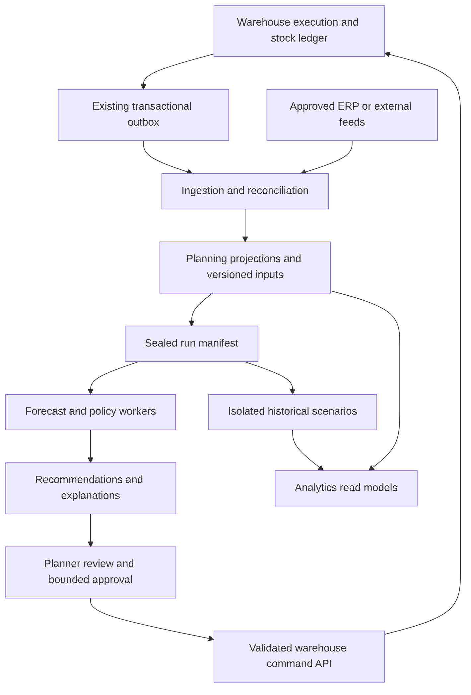

# Proposed planning architecture and durable contracts

Research date: 2026-09-30. **Everything in this file is a proposal for our product**, unless explicitly described as an existing component. It is not a claim about PTC internals. Competitor evidence is in [file 01](01-Competitor-Reference.md); implementation evidence and gates are in [file 02](02-Warehouse-Gaps.md).

## 1. Recommended architecture

Keep the existing warehouse as the execution authority. Introduce a separately owned planning component with versioned projections, input snapshots and recommendation APIs. Begin with the existing relational stack and isolated worker resources; justify additional analytics infrastructure with measurements.



A scenario has no edge to the warehouse command API. Enforce this in credentials and application authorization, not just the diagram. Native execution can provide frequent updates, while planning calculations can run daily or on selected exceptions. Event freshness and full-network recalculation frequency are independent choices.

### Component responsibilities

| Component | Owns | Contract boundary |
|---|---|---|
| `warehouse-base` | Physical stock, stock dimensions, movement/reservation rules, outbox | Stable identities, typed events and validated commands; no optimizer dependency |
| `warehouse` | Purchase/transfer/replenishment execution documents, operational demand inputs | Dated document projections, acceptance APIs, fulfillment feedback |
| Planning component, name to be decided | Forecasts, policy versions, network model, runs/scenarios, recommendations | Reads supported feeds; writes through execution APIs |
| Integration adapters | External identities, feed validity/completeness, mapping and acknowledgments | Explicit capabilities and source authority; no inferred zero data |
| Analytics/read models | Aggregated planner/management views | Version/freshness labels; scoped access; rebuildable projections |
| Platform services | Identity, grants, jobs, storage, audit, reporting | Reuse existing infrastructure, extend only where needed |

Do not require a new distributed service for every box. A modular deployment with separate worker pools and schemas can provide the initial separation. Preserve module boundaries so independent scaling is possible later. Follow adopted repository decisions when implementing; this research document does not silently replace them.

## 2. Decisions to settle before schema freeze

| ID | Decision | Recommended initial choice | Why / verification |
|---|---|---|---|
| D01 | Initial customer | Distributor/service-parts operator with reliable stock and purchase history | Validate with actual pilot interviews; do not design the MVP around an unmeasured global OEM workload |
| D02 | Source support | Native warehouse first; documented optional external-feed contract | Avoid deleted-adapter assumptions; record external-only planning as a separate product-scope decision |
| D03 | Policy authority | Planning owns calculated policy; warehouse stores effective execution values | Resolve #99 and manual override precedence before parallel jobs write the same fields |
| D04 | Base technology | Existing relational infrastructure with isolated planning workers | Snowflake is optional analytics infrastructure, not a parity prerequisite |
| D05 | Model execution | Versioned worker interface; deterministic baselines first | Statistical libraries/solver choices require a separate current-version/licensing review |
| D06 | Initial forecast granularity | Preserve daily source facts; aggregate to configurable model buckets | Monthly summaries alone cannot support daily replay and netting |
| D07 | Time semantics | Explicit business date and observation cutoff | Never change global application time to simulate history |
| D08 | Initial policy scope | Explainable single-site policies and constrained transfer suggestions | Label full multi-echelon optimization separately until validated |
| D09 | Stock ownership | Reuse company/owner/item/site identities | No pooling of economically separate stock without a permitted transaction |
| D10 | Recommendations | Immutable calculation results; independently versioned approval/execution state | A recalculation cannot silently alter an approved recommendation |
| D11 | Write-back | Typed command, optimistic precondition, business idempotency key | Safe retries and stale-plan rejection |
| D12 | Automation | Shadow → advisory → reviewed execution → bounded auto-release | Advancement based on evidence, not elapsed calendar time |
| D13 | History | Append/version business facts and retain sealed run manifests | Explicit corrected-history and as-known views |
| D14 | Scenario isolation | Separate namespace/output store and no execution credentials | Sandbox site flags alone are insufficient |
| D15 | Numeric handling | Exact decimal at quantities/money/contracts; documented tolerances inside models | Preserve execution precision; do not require inappropriate decimal arithmetic for every statistical routine |
| D16 | Cost objective | Service targets first; economics where inputs are reliable | Never invent stockout penalties to manufacture precision |
| D17 | New/no-stock pairs | Configured planning universe independent of ledger activity | New sites/items must be planned before first receipt |
| D18 | Retention | Customer-agreed periods per fact, snapshot, output and model artifact | Cost, reproducibility and deletion implications decided together |
| D19 | Expansion | Repair/installed-base/network/last-buy as independently gated capabilities | Keep extension points; avoid implementing all enterprise scope before first customer value |
| D20 | Release measurement | Defined data size, run duration, OLTP impact and recovery tests | Replace unsupported SKU/pair scale promises |

## 3. Canonical input contracts

These are logical fields, not a mandate to duplicate every source column. Native identities must be reused, and immutable references can point to retained versioned data. Names below are proposed contract names.

### 3.1 Common envelope

Every feed needs:

- `sourceSystem`, `sourceEntity`, `sourceRecordId`, `sourceRevision`, `schemaVersion`.
- Company/owner/site scope where applicable; external identifier mapping and its version.
- Business occurrence/effective time, source observation time, received time and correction/supersedes reference.
- `loadId`, snapshot-versus-delta mode, completeness status, `observedThrough`, expected/actual row counts where meaningful.
- Canonical UOM/currency, original UOM/currency and frozen conversion version when converted.
- Content hash or an equivalent integrity check; rejected-row count and quarantine reason.
- Explicit tombstone/end-of-validity semantics; absence from a partial feed is never deletion.

Do not claim a single timestamp answers every question. A transaction can occur July 30, be recorded August 2, be corrected August 8 and have a financial posting date in a different permitted period.

### 3.2 Demand fact

| Field group | Necessary distinctions |
|---|---|
| Identity | Request/order/work-order line, source event, revision and cancellation/reversal link |
| Item | Requested item, fulfilled item, substitution edge/version, demand-aggregation identity |
| Quantity | Requested, fulfilled, lost/unfilled, cancelled and returned quantities; base UOM |
| Time | Request date, required date, promised date, shipment/consumption time, known-at cutoff |
| Stream | Routine sales, emergency/VOR, warranty service, scheduled maintenance, returns and excluded/internal activity |
| Classification | Customer/service class or anonymized segment, priority, planned/unplanned, stockout-censoring flag |
| Source quality | Complete period, imported/estimated/observed, correction lineage |

A fulfillment event is not automatically the best representation of unconstrained demand. Preserve lost demand and the original request. Transfer shipments are internal supply movements unless a clearly defined forecasting stream intentionally uses them; they must not duplicate customer demand at another echelon.

### 3.3 Stock position

Carry company, owner, item, warehouse/planning node, physical location where needed, lot/serial/LPN, stock condition/status, duty restrictions, on-hand/reserved/blocked quantities and source cutoff. A planning aggregate must retain a trace to the execution dimensions it used.

Define which statuses are serviceable, transferable, repairable, quarantined, expired or excluded for each planning purpose. ATP, book stock, physically present stock and stock available for a particular customer are different views. Virtual counterparties must not become physical inventory merely because they appear in a location table.

### 3.4 Supply commitment

Use order and line identity/revision; procurement/transfer/repair type; source/destination; owner; item/UOM; ordered, cancelled, received, rejected and remaining quantities; expected arrival and expected serviceable date; firmness/approval status; overdue state; actual partial-receipt history; supplier/lane/calendar references; and external acknowledgment.

A transfer has one movement represented through linked source, transit and destination states. Never count it both as available donor stock and guaranteed destination supply after dispatch. Do not automatically treat an unapproved proposal as firm supply; show assumptions used by each run.

### 3.5 Item, supplier and network versions

- Item lifecycle, stocking policy, criticality, expiry/shelf life, storage constraints, UOM, cost basis and applicability.
- Supplier sources with site-specific/default scope, validity, MOQ, multiple, lead-time model, price/currency where authorized and capacity/availability constraints.
- Network node type, stock owner, legal/operating company, service responsibility, timezone, calendars and activation dates.
- Directed supply lane with mode, lead-time components, dispatch/receipt cutoffs, capacity, cost, border delay and validity.
- Supersession/interchange edges with direction, part applicability, location scope, effective dates, conversion ratio and separate demand-merge permission.
- No automatic reuse of a geographic service territory as a physical warehouse or a planning echelon as a bin.

### 3.6 Optional repair and installed-base inputs

Repair records need core identity/condition, expected return, receipt, inspection, no-fault-found disposition, repair release, completion, scrap, capacity and costs. Installed-base records need equipment/product applicability, active exposure periods, utilization and maintenance/failure facts. Design optional contracts now; implement only for confirmed scope. Avoid importing personal customer data if anonymized service location and equipment exposure suffice.

## 4. Historical state and reproducibility

### Three distinct questions

1. **What do we now believe happened on a past date?** Corrected history includes later adjustments.
2. **What information was available to the planner at that time?** As-known history excludes later arrivals/corrections.
3. **What would have happened under another policy?** Simulation changes decisions and potentially inventory trajectories.

Do not put all three under an unlabeled “as of” selector.

### Proposed run manifest

```text
runId, scenarioId, runType
businessAsOfDate, observationCutoff, horizon, bucketCalendarVersion
scope: company / owners / nodes / item-set version
sourceSnapshots[], eventCheckpoints[], completenessResults[]
masterVersions[], networkVersion, sourcePolicyVersion, overrideSetVersion
modelPackageVersion, modelParametersHash, codeVersion
currencyAndCostBasis, unitConversionVersion
randomSeed (where applicable), numericTolerance, roundingRules
inputHash, outputHash, createdBy, createdAt, parentRunId
status, validationResults, assumptions, reproducibilityStatus
```

The manifest should reference immutable retained artifacts. A hash is not a substitute for retaining the data needed to reproduce the calculation.

### Snapshot bootstrap correctness

Current stock snapshots capture an outbox cursor before scanning positions. This guarantees inclusion of events at or below that cursor according to the code’s contract, but concurrent later events may also be reflected. Therefore an integration must not blindly add all later deltas to those rows and assume an exact snapshot boundary.

Choose and prove one supported approach:

- A consistent database snapshot plus a corresponding event boundary whose ordering is defined.
- An overlap/reconciliation protocol with source row revisions or event identities that permits deterministic deduplication.
- A full authoritative snapshot activation with separate reconciliation of all changes spanning extraction.

Use the chosen approach across demand, supply and masters, not just stock. If feeds have different cutoffs, record them and fail or downgrade runs when skew exceeds the agreed tolerance.

### Simulation behavior

A scenario has immutable parent input state, a set of parameter/input deltas and independent results. Pausing saves a validated checkpoint. Resuming uses the same versions, unless the user explicitly forks a new run. Restart means a fresh run from initial state. Abort may discard temporary computation, but should retain the audit record and declared cleanup outcome.

Distinguish observed, reconstructed and synthetic initial inventory. If historic stock is unavailable, a simulation may still be useful, but the UI must disclose assumed initial stock and warm-up period. Use separate random streams/seeds for demand and lead time if stochastic simulation is implemented, so controlled comparisons remain meaningful.

A simulation must not use future actual receipts as information available to historical decisions. It may use actual subsequent demand as an evaluation outcome while hiding it from the planning step. Separate information available to the model from evaluation truth.

## 5. Forecasting and inventory policy

### Initial method scope

Start with transparent baselines (recent average, seasonal-naive when justified), an intermittent method, TSB where declining occurrence matters, manual and no-forecast modes. Choose exact methods and libraries only after inspecting pilot data and applicable licensing. Add causal/maintenance and advanced model families behind the same interface.

### Evaluation contract

- Train/evaluate at multiple historical origins using only information available at each origin.
- Evaluate the lead-time/horizon that drives a decision, not only next-month error.
- Report bias and zero-safe scaled/absolute errors; define zero-denominator behavior for every percentage measure.
- Evaluate distribution calibration where probabilistic outputs are used.
- Compare resulting service, stock, obsolescence and order workload in policy simulation.
- Record model selection, fallback, minimum evidence, parameter bounds and method-change threshold.
- Distinguish a manually overridden final forecast from the statistical baseline for forecast-value-added analysis.

Do not promise that the model with the smallest error will always produce the best inventory outcome. Service target, supply uncertainty, cost and constraints affect the decision.

### Policy contract

A policy version should state objective, planning grain, effective dates, review period, demand and lead-time model references, service target definition, safety stock, reorder point, min/max/order-up-to values, quantity rounding, MOQ/multiple constraints, cap/budget, no-stock rule, critical minimum, source and explanation.

Constraints can conflict. For example, a minimum critical stock of 5 may exceed a budget allowing only 3. Return an infeasibility explanation and authorized fallback; do not silently violate a hard limit. Record which constraints are hard and which are preferences.

Multi-echelon planning requires shared upstream/downstream demand and stock dependencies, not the sum of independent site buffers. Treat it as a separately tested model family. The current sister-surplus heuristic can remain useful while that work is deferred.

## 6. Recommendation, approval and execution contracts

### Recommendation record

Keep immutable calculated attributes: run/version, item/site/owner, action type, quantity/UOM, source, required and suggested dates, expected cost/currency, applicable policy, constraint results and explanation. Track workflow state separately: pending review, approved, rejected, superseded, expired, execution requested, accepted, conflicted or failed.

Rejecting a recommendation is not the same as changing the underlying policy. A rejection may carry a temporary suppression or a durable policy-change request; the user must choose intentionally.

### Acceptance preconditions

Before executing, revalidate authorization, scope, recommendation expiry, policy/override version, current eligible stock and supply, supplier/site validity, MOQ/multiple, financial limit and any approval requirements. Return a structured conflict if reality changed materially. Do not silently regenerate different quantities under an old approval.

Proposed command envelope:

```text
recommendationId + recommendationVersion
approvedQuantity / date / source, if editable within allowed bounds
runId, approvalId, actor, reason
idempotencyKey, expectedExecutionStateVersion
```

Result includes accepted/rejected/conflicted status, target document/line IDs, accepted quantities, server version and structured reason. A retry with the same key and changed payload must fail; a retry with the same payload must recover the original result.

### Concurrency and partial success

- Atomically guard shared donor stock and any guaranteed budget/capacity at acceptance.
- Handle partial availability explicitly: reject all, create a reduced document with new approval, or accept a pre-authorized bound. Choose per action type.
- If a multi-site batch is not atomic, record per-line outcomes and never mark the entire batch successful merely because some lines succeeded.
- Distinguish command accepted from supplier acknowledged, shipped, received and serviceable.
- Cancellation after dispatch is a business exception, not a reversible recommendation-state update.
- Planning rollback means stop/recompute/follow-up compensating business actions. It never rewrites executed warehouse history.

## 7. AutoPilot-style orchestration

Use a dependency graph such as:

```text
collect → validate/reconcile → seal inputs → build demand streams
  → forecast → compute policy → generate constrained supply actions
  → validate/explain → review/approve → publish → reconcile outcomes
```

Not every run includes publishing. Historical runs and shadow runs must be structurally incapable of it.

### State semantics

- `QUEUED`: no input ownership or business output yet.
- `VALIDATING`: completeness and scope checks underway.
- `RUNNING`: step lease and fencing token held.
- `PAUSE_REQUESTED` / `PAUSED`: stop at a declared checkpoint; do not interrupt an unsafe transaction arbitrarily.
- `FAILED_RETRYABLE` / `FAILED_FINAL`: error classification and recovery path.
- `CANCEL_REQUESTED` / `CANCELLED`: no new steps/publishes; reconcile any already accepted commands.
- `COMPUTED`: outputs sealed but not approved/published.
- `PUBLISHING` / `PARTIALLY_PUBLISHED` / `PUBLISHED`: explicit execution results.
- `SUPERSEDED`: retained for audit, no longer eligible for new execution.

These names are proposed. Match existing code conventions during implementation.

### Scheduler and recovery requirements

Use business scope locks, durable step checkpoints, heartbeat/lease expiry and monotonically increasing fencing tokens. A worker that resumes after its lease expired must not publish. Bound retries and distinguish infrastructure failure from invalid data. Keep sensitive payloads out of logs while retaining enough identifiers for diagnosis.

Handle daylight-saving skipped/repeated times, planned shutdowns, missed schedules, backlog coalescing, priority emergency runs and overlapping segments. Repeated same-day runs must include previous accepted outputs in their input state or explicitly detect the missing feedback.

### Progressive automation

| Level | Permitted behavior | Evidence to advance |
|---|---|---|
| Shadow | Compute and compare only | Input reconciliation; traceable results; no production side effects |
| Advisory | Planner reviews suggestions | Usable explanations; meaningful baseline comparison; exception workload acceptable |
| Reviewed execution | Explicit approval creates documents | Concurrency, idempotency, scope and stale-plan tests pass |
| Bounded automatic release | Only configured low-risk actions | Stable pilot results; amount/scope caps; freshness gates; kill switch and recovery drill |
| Broader optimization | Additional methods/actions | Capability-specific validation and customer agreement |

“AutoPilot” should not hide which level is active. The UI should show what can happen automatically, the applicable cap and the last successful data cutoff.

## 8. Analytics, operations and data platform

A planning read model should record freshness, completeness, grain, cost basis and run identity with its measures. Add analytics storage when volume/concurrency demonstrate a need. If Snowflake is selected later, keep loading and querying privileges/compute separate and budget retention/credits. Do not make database Time Travel the sole historical-evidence mechanism.

Measure: ingestion lag; rejected records; reconciliation variance; forecast coverage/fallback rate; run duration by step; dead/paused jobs; stale recommendations; approval/rejection reason rates; execution conflicts; duplicate attempts prevented; actual service and stock outcomes; and per-tenant compute/storage cost.

Set explicit targets during pilot sizing. No arbitrary target in this research is a measured product promise. Test a representative combination of active pairs, sparse histories, long chains, many supply lines and overlapping planner users.

Backup/recovery must include inputs, manifests, model/config artifacts, recommendation state and idempotency records. Restoring planning must not replay already executed purchases. Run an actual restore-and-reconcile drill before automatic release.

## 9. Changes needed in existing SPI documents

`docs/spi/SPI_FUNCTIONAL_DOCUMENT.md` includes draft assumptions that need reconciliation before implementation:

- “No competitor” has native execution-to-intelligence data flow is unsupported and contradicted by competitor integration offerings. Replace with our specific, testable integration benefit.
- Spring events alone do not establish durable cross-module ingestion. Base the durable contract on the existing transactional outbox and verified consumer behavior.
- WMS-always-required is a product-scope decision, not a technical law. Keep it for the initial bundle if intended, and explicitly decide whether external ERP planning is a future offering.
- 500,000 active SKUs / 750,000 pairs and enterprise customer examples need measured sizing and alignment with the SMB/midmarket target.
- Six forecast methods are a proposed initial selection, not complete PTC parity.
- Exact last-time-buy quantities cannot be promised under uncertain demand; report assumptions and risk ranges.
- Approved recommendations should create execution documents through validated APIs, not direct persistence or uncontrolled event side effects.
- Deleted dealer/services/asset adapters must not reappear implicitly through old diagrams.

No repository documents or code were changed during this audit. These are proposed follow-up edits, subject to the adopted design hierarchy and actual chosen product scope.
